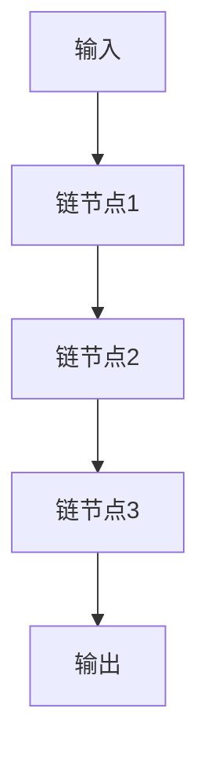

# 【LangChain编程：从入门到实践】链模块

## 1.背景介绍

### 1.1 什么是LangChain?

LangChain是一个用于构建应用程序的框架,这些应用程序可以通过大型语言模型(LLM)进行推理和生成。它旨在成为一个强大且易于使用的工具箱,用于增强和扩展大型语言模型的功能。

LangChain可以帮助您快速构建基于LLM的应用程序,同时为您提供了一套丰富的模块和工具,以便轻松地将LLM集成到您的工作流程中。无论您是想构建一个智能助手、自动化任务还是执行数据分析,LangChain都可以为您提供所需的构建块。

### 1.2 链(Chains)模块简介

在LangChain中,链(Chains)模块是一个关键组件。链是一系列可组合的部分,它们一起构成了一个复杂的工作流程或应用程序。每个链由多个链节点(ChainNode)组成,这些节点可以是LLM、数据处理函数、其他链或任何其他可执行的对象。

链模块提供了一种简单而强大的方式来组合和编排这些不同的组件,使它们能够协同工作并执行复杂的任务。您可以轻松地创建自定义链,将现有的链组合在一起,或者使用LangChain提供的预构建链。

## 2.核心概念与联系

### 2.1 链节点(ChainNode)

链节点(ChainNode)是链的基本构建块。它可以是LLM、数据处理函数、其他链或任何其他可执行的对象。链节点接收输入,执行某些操作,并生成输出,该输出可以传递给链中的下一个节点。

### 2.2 链(Chain)

链(Chain)是由一系列链节点组成的序列。每个链节点的输出将作为下一个链节点的输入。链可以是线性的,也可以是分支的或并行的,具体取决于您的需求。

### 2.3 链组合(ChainCombiner)

链组合(ChainCombiner)是一种特殊的链节点,它将多个链节点的输出组合在一起。这允许您创建更复杂的工作流程,其中多个链可以并行运行,然后将它们的输出合并。

### 2.4 链式思维(Chain of Thought)

链式思维(Chain of Thought)是一种技术,它允许LLM在生成最终输出之前展示其推理过程。这有助于提高LLM的透明度和可解释性,同时也可以提高输出的质量和准确性。



上图展示了一个简单的线性链,其中输入经过一系列链节点的处理,最终生成输出。

## 3.核心算法原理具体操作步骤

LangChain中的链模块是基于一些核心算法和原理构建的。以下是链模块的核心算法原理和具体操作步骤:

### 3.1 链节点执行算法

1. 获取输入数据
2. 检查链节点的类型(LLM、函数、其他链等)
3. 根据链节点类型执行相应的操作
   - 如果是LLM,则将输入数据传递给LLM,并获取LLM的输出
   - 如果是函数,则执行该函数并获取输出
   - 如果是其他链,则递归执行该链并获取输出
4. 将输出传递给下一个链节点或返回最终结果

### 3.2 链执行算法

1. 获取输入数据
2. 初始化一个空列表来存储中间结果
3. 遍历链中的每个链节点:
   - 执行链节点执行算法
   - 将链节点的输出添加到中间结果列表中
4. 如果存在链组合器(ChainCombiner),则执行链组合器并获取最终输出
5. 否则,将中间结果列表作为最终输出

### 3.3 链式思维算法

1. 获取输入数据
2. 初始化一个空列表来存储推理步骤
3. 执行链执行算法,但在每个链节点执行之前:
   - 提示LLM解释其即将执行的操作
   - 将LLM的解释添加到推理步骤列表中
4. 将推理步骤列表与最终输出一起返回

以上算法展示了链模块的核心工作原理。通过将不同的链节点组合在一起,并按顺序执行,我们可以构建复杂的工作流程和应用程序。

## 4.数学模型和公式详细讲解举例说明

虽然链模块本身并不直接涉及复杂的数学模型或公式,但它可以与其他模块(如代理模块)结合使用,以实现基于数学模型的功能。在这种情况下,数学模型和公式将在相关模块中进行处理和计算。

然而,为了说明链模块如何与数学模型和公式协同工作,我们可以考虑一个简单的示例。假设我们有一个链,它包含两个链节点:一个LLM和一个数学函数。

1. LLM链节点接收一个自然语言问题作为输入,例如"计算 $2x^2 + 3x - 5$ 在 $x = 2$ 时的值"。
2. LLM将自然语言问题转换为数学表达式,例如 $2x^2 + 3x - 5$,并将其作为输出传递给下一个链节点。
3. 数学函数链节点接收数学表达式 $2x^2 + 3x - 5$ 作为输入,并在 $x = 2$ 时计算其值。
4. 数学函数链节点将计算结果(例如 $9$)作为输出返回。

在这个示例中,链模块允许我们将LLM的自然语言处理能力与数学函数的计算能力相结合,从而实现了一个简单的数学问题解决器。

虽然这只是一个简单的示例,但它说明了链模块如何与其他模块和功能协同工作,以构建更复杂和强大的应用程序。通过将不同的链节点组合在一起,我们可以利用各种数学模型、算法和公式,并将它们集成到我们的应用程序中。

## 5.项目实践:代码实例和详细解释说明

在本节中,我们将通过一个实际项目来演示如何使用LangChain的链模块。我们将构建一个简单的问答系统,它可以回答有关某个主题的问题。

### 5.1 项目设置

首先,我们需要安装LangChain库:

```bash
pip install langchain
```

接下来,我们将导入所需的模块和类:

```python
from langchain.chains import ConversationalRetrievalChain
from langchain.llms import OpenAI
from langchain.document_loaders import TextLoader
from langchain.indexes import VectorstoreIndexCreator
from langchain.vectorstores import Chroma
```

我们将使用OpenAI的语言模型作为LLM,并使用Chroma向量存储来存储和检索文档数据。

### 5.2 加载数据

在这个示例中,我们将使用一个简单的文本文件作为数据源。您可以使用任何其他文档格式,只需使用相应的`DocumentLoader`。

```python
loader = TextLoader('data.txt')
documents = loader.load()
```

### 5.3 创建向量存储索引

我们将使用`VectorstoreIndexCreator`来创建一个向量存储索引,以便快速检索相关文档。

```python
index = VectorstoreIndexCreator().from_loaders([loader])
```

### 5.4 创建问答链

现在,我们将创建一个`ConversationalRetrievalChain`,它将处理用户的查询,检索相关文档,并使用LLM生成答案。

```python
llm = OpenAI(temperature=0)
qa_chain = ConversationalRetrievalChain.from_llm(llm, index.vectorstore)
```

### 5.5 运行问答系统

最后,我们可以与问答系统进行交互,提出问题并获取答案。

```python
query = "什么是LangChain?"
result = qa_chain({"question": query})
print(result['answer'])
```

这将输出LLM根据检索到的相关文档生成的答案。

### 5.6 代码解释

让我们详细解释一下这个示例中的关键步骤:

1. **加载数据**: 我们使用`TextLoader`从文本文件中加载数据。您可以使用其他`DocumentLoader`从不同的数据源(如PDF、网页等)加载数据。

2. **创建向量存储索引**: 我们使用`VectorstoreIndexCreator`从加载的文档创建一个向量存储索引。这个索引将允许我们快速检索与查询相关的文档。

3. **创建问答链**: 我们创建一个`ConversationalRetrievalChain`,它将处理用户的查询。这个链由两个主要组件组成:
   - **LLM**: 用于生成答案的语言模型。
   - **VectorStore**: 用于检索与查询相关的文档的向量存储。

4. **运行问答系统**: 我们提供一个查询,链将检索相关文档,将它们传递给LLM,并生成答案。

通过这个示例,您可以看到如何使用LangChain的链模块构建一个功能强大的应用程序。您可以根据需要自定义和扩展这个示例,以满足您的特定需求。

## 6.实际应用场景

链模块在许多实际应用场景中都可以发挥作用,例如:

1. **智能助手**: 通过将不同的链节点组合在一起,您可以构建智能助手系统,该系统可以回答问题、执行任务和提供建议。

2. **自动化工作流**: 链模块可用于自动化各种工作流程,例如数据处理、文档生成和任务调度。

3. **决策支持系统**: 通过集成各种数据源、模型和算法,您可以构建决策支持系统,帮助做出明智的决策。

4. **自然语言处理管道**: 将不同的NLP任务(如实体识别、情感分析等)链接在一起,构建强大的自然语言处理管道。

5. **知识库构建**: 使用链模块从各种数据源中提取和组织知识,构建知识库或知识图谱。

6. **教育和培训**: 创建交互式学习体验,将知识传递与实践练习相结合,提高学习效率。

7. **科研和发现**: 将不同的模型、算法和数据源链接在一起,促进科学发现和创新。

总的来说,链模块为构建各种基于LLM的应用程序提供了强大而灵活的工具。通过组合不同的链节点,您可以解决复杂的问题,并创建出色的用户体验。

## 7.工具和资源推荐

在使用LangChain的链模块时,以下工具和资源可能会对您有所帮助:

1. **LangChain文档**: LangChain官方文档(https://python.langchain.com/en/latest/index.html)提供了详细的API参考、教程和示例,是学习和使用LangChain的重要资源。

2. **LangChain示例库**: LangChain提供了一个示例库(https://github.com/hwchase17/langchain-examples),其中包含了许多实际应用场景的示例代码,可以帮助您快速入门。

3. **LangChain社区**: LangChain拥有一个活跃的社区,您可以在GitHub上提出问题、分享想法或贡献代码(https://github.com/hwchase17/langchain)。

4. **OpenAI Playground**: OpenAI Playground(https://platform.openai.com/playground)是一个在线工具,可以让您尝试和探索OpenAI的语言模型,对于理解和调试LLM非常有用。

5. **Jupyter Notebook**: Jupyter Notebook是一个强大的交互式开发环境,非常适合于探索性编程和数据分析。您可以使用它来实验和调试您的LangChain应用程序。

6. **Streamlit**: Streamlit(https://streamlit.io/)是一个开源的Python库,可以轻松构建数据科学和机器学习应用程序的交互式Web界面。它可以与LangChain结合使用,为您的应用程序提供漂亮的用户界面。

7. **Weights & Biases**: Weights & Biases(https://wandb.ai/)是一个机器学习平台,可以帮助您跟踪实验、可视化结果和管理模型。在使用LangChain进行模型开发和实验时,它可以提供有价值的见解和洞察力。

利用这些工具和资源,您可以更高效地使用LangChain的链模块,加速您的开发过程,并构建出更