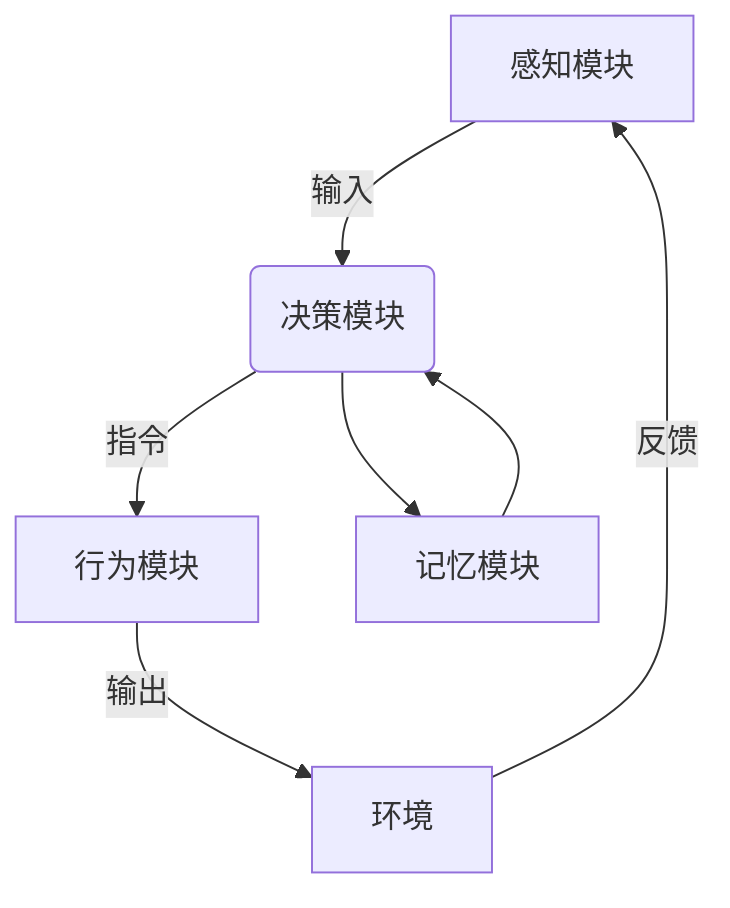

# 【大模型应用开发 动手做AI Agent】Agent的四大要素

## 1.背景介绍

### 1.1 人工智能时代的到来

随着计算能力的不断提升和算法的持续创新,人工智能(AI)技术正在迅速发展。大型语言模型、计算机视觉、自然语言处理等AI技术已经渗透到了我们生活和工作的方方面面,为我们带来了巨大的便利。在这个人工智能时代,AI Agent的概念应运而生。

### 1.2 AI Agent的崛起

AI Agent是一种具备自主性、交互性和智能性的软件实体。它可以感知环境,做出决策并采取行动,以完成特定的任务。AI Agent的出现标志着人工智能系统从被动响应转向主动交互,从单一功能走向通用智能。

### 1.3 大模型驱动AI Agent发展 

近年来,大型语言模型(如GPT-3)和多模态模型(如DALL-E)的出现,极大推动了AI Agent技术的发展。这些大模型具备强大的理解和生成能力,可以支持AI Agent进行自然语言交互、图像理解和内容生成等复杂任务。

## 2.核心概念与联系

### 2.1 AI Agent的核心要素

一个完整的AI Agent通常由四个核心要素组成:

1. **感知模块(Perception)**: 感知并理解环境信息,包括自然语言、图像、视频等多模态输入。
2. **决策模块(Decision Making)**: 基于感知信息和内部知识库,做出合理的决策和规划。
3. **行为模块(Action)**: 根据决策结果,采取相应的行动,如自然语言回复、图像生成等。
4. **记忆模块(Memory)**: 存储历史交互信息和领域知识,为决策和行为提供支持。

这四个要素相互依赖、环环相扣,共同构建了一个完整的AI Agent系统。

### 2.2 大模型在AI Agent中的作用

大模型在AI Agent的四个核心要素中都发挥着关键作用:

- **感知模块**: 利用大模型的自然语言理解和计算机视觉能力,实现对多模态输入的理解和表示。
- **决策模块**: 基于大模型的推理和规划能力,做出合理的决策。
- **行为模块**: 借助大模型的自然语言生成和图像生成能力,产生自然的语言和图像输出。
- **记忆模块**: 利用大模型的记忆和知识存储能力,构建长期记忆和知识库。

## 3.核心算法原理具体操作步骤  

### 3.1 感知模块

感知模块的核心算法包括自然语言理解(NLU)和计算机视觉(CV)两个方面。

#### 3.1.1 自然语言理解

自然语言理解旨在将自然语言输入映射为结构化的语义表示,以便后续的决策和行为模块使用。主要步骤包括:

1. **词法分析**: 将自然语言文本分割为词元序列。
2. **句法分析**: 识别词元之间的句法关系,构建句法树。
3. **语义分析**: 从句法结构中提取语义信息,构建语义表示。
4. **知识库映射**: 将语义表示映射到背景知识库中的概念和实体。

自然语言理解通常采用基于规则或基于统计的方法,近年来也开始应用深度学习模型(如Transformer)进行端到端的语义理解。

#### 3.1.2 计算机视觉

计算机视觉旨在从图像、视频等视觉输入中提取有用的信息。主要步骤包括:

1. **预处理**: 对输入图像进行调整,如裁剪、旋转、增强等。
2. **特征提取**: 使用卷积神经网络(CNN)等模型提取图像的特征表示。
3. **目标检测**: 在图像中定位并识别感兴趣的目标物体。
4. **语义分割**: 将图像像素级别地分割为不同的语义类别。

计算机视觉算法通常采用深度学习模型,如VGG、ResNet、Mask R-CNN等,并结合大型预训练模型进行迁移学习。

### 3.2 决策模块

决策模块的核心是规划算法,根据当前状态和目标,生成一系列合理的行动序列。主要步骤包括:

1. **状态表示**: 将感知模块的输出和记忆模块的信息编码为状态表示。
2. **目标设定**: 根据任务需求设定具体的目标状态。
3. **路径搜索**: 使用启发式搜索、强化学习等算法,在状态空间中搜索从当前状态到目标状态的最优路径。
4. **行动序列生成**: 将搜索得到的路径转化为一系列具体的行动指令。

常用的规划算法包括A*搜索、实时重新规划(RRT)、蒙特卡洛树搜索(MCTS)等,近年来也开始应用深度强化学习进行端到端的决策规划。

### 3.3 行为模块

行为模块的核心是自然语言生成(NLG)和计算机图形学两个方面。

#### 3.3.1 自然语言生成

自然语言生成旨在根据语义表示生成自然、流畅的语言输出。主要步骤包括:

1. **文本规划**: 根据语义表示和交互上下文,规划生成文本的大致结构和内容安排。
2. **句子实现**: 将文本规划的内容转化为具体的句子序列。
3. **实现修正**: 对生成的句子进行语法、语义、风格等方面的修正和优化。

自然语言生成常用的模型包括基于模板的方法、基于规则的方法,以及近年来兴起的基于序列到序列(Seq2Seq)模型的神经网络方法。

#### 3.3.2 计算机图形学

计算机图形学旨在根据语义表示生成相应的图像或视频输出。主要步骤包括:

1. **三维建模**: 根据语义表示构建三维场景模型。
2. **布局和动画**: 确定三维模型的位置、姿态和运动轨迹。
3. **渲染和合成**: 将三维场景渲染为二维图像或视频,并进行后期合成和特效处理。

计算机图形学通常采用基于物理的渲染(PBR)技术,结合光线追踪、光子映射等算法实现高质量的图像合成。近年来也开始应用生成对抗网络(GAN)等深度学习模型进行端到端的图像生成。

### 3.4 记忆模块

记忆模块负责存储和管理AI Agent的历史交互信息和背景知识。主要步骤包括:

1. **知识表示**: 将结构化和非结构化的知识以统一的形式表示和存储,如知识图谱、向量嵌入等。
2. **知识更新**: 根据新的输入信息,增量式地更新知识库。
3. **知识检索**: 根据决策模块的需求,高效地从知识库中检索相关信息。
4. **知识推理**: 基于存储的知识,进行逻辑推理和关联挖掘,产生新的知识。

记忆模块常用的数据结构包括关系数据库、键值存储、图数据库等。近年来,基于大模型的记忆增强技术(如MemoryAugmented Transformer)也成为研究热点。

## 4.数学模型和公式详细讲解举例说明

在AI Agent的各个模块中,都涉及了一些核心的数学模型和公式,下面将对其进行详细讲解和举例说明。

### 4.1 自然语言处理模型

自然语言处理模型通常采用基于序列的方法,将输入序列(如文本)映射为输出序列(如语义表示)。常用的模型包括:

#### 4.1.1 N-gram语言模型

N-gram语言模型是基于统计的经典模型,它根据前面的 $N-1$ 个词来预测第 $N$ 个词的概率:

$$P(w_n|w_1,w_2,...,w_{n-1}) \approx P(w_n|w_{n-N+1},...,w_{n-1})$$

其中 $w_i$ 表示第 $i$ 个词。该模型简单高效,但是存在数据稀疏和上下文有限的问题。

#### 4.1.2 神经网络语言模型

神经网络语言模型通过神经网络来建模序列的条件概率分布,常用的模型包括:

- **前馈神经网络语言模型**:
$$y = \text{softmax}(W_o h + b_o)$$
$$h = \phi(W_h x + b_h)$$

其中 $x$ 为输入向量, $y$ 为输出概率分布, $W$ 和 $b$ 为模型参数, $\phi$ 为非线性激活函数。

- **循环神经网络语言模型**:
$$h_t = \phi(W_h x_t + U_h h_{t-1} + b_h)$$
$$y_t = \text{softmax}(W_o h_t + b_o)$$

其中 $h_t$ 为时刻 $t$ 的隐状态向量,通过循环结构捕获长期依赖。

- **Transformer语言模型**:

$$\text{Attention}(Q, K, V) = \text{softmax}(\frac{QK^T}{\sqrt{d_k}})V$$

$$\text{MultiHead}(Q, K, V) = \text{Concat}({\text{head}_1, ..., \text{head}_h})W^O$$

$$\text{head}_i = \text{Attention}(QW_i^Q, KW_i^K, VW_i^V)$$

Transformer采用Self-Attention机制直接建模长期依赖,是目前最先进的语言模型。

通过对上述模型的训练,可以学习到词向量、句向量等语义表示,为后续的任务提供支持。

### 4.2 计算机视觉模型

计算机视觉模型通常采用基于卷积神经网络(CNN)的编码器-解码器结构,将像素级输入编码为特征表示,再解码为所需的输出(如目标检测、语义分割等)。

#### 4.2.1 卷积神经网络

卷积神经网络由卷积层、池化层和全连接层组成,用于从图像中提取多尺度的特征表示。卷积层的核心运算为:

$$\text{Conv}(X, W) = \sum_{i=1}^{C_\text{in}} \sum_{m=1}^{M} \sum_{n=1}^{N} W_{i,m,n} \cdot X_{i,m+r,n+s}$$

其中 $X$ 为输入特征图, $W$ 为卷积核, $C_\text{in}$ 为输入通道数, $M, N$ 为卷积核大小, $r, s$ 为卷积步长。

池化层通过下采样操作实现了平移不变性,常用的操作包括最大池化和平均池化。

#### 4.2.2 目标检测模型

目标检测模型将图像映射为一系列边界框及其类别,常用的模型有:

- **RCNN系列**:
  1. 选择性搜索生成候选区域
  2. CNN提取每个区域的特征
  3. 分类器判断每个区域的类别
  4. 边界框回归器调整每个区域的位置

- **YOLO系列**:
  1. 将图像划分为 $S \times S$ 个网格
  2. 每个网格预测 $B$ 个边界框及其置信度
  3. 直接从特征图上回归边界框的位置和类别

- **Transformer目标检测器**:
  1. CNN backbone提取特征图
  2. Transformer encoder捕获全局信息
  3. Transformer decoder逐个预测目标

目标检测模型通过端到端的训练,学习图像到边界框及类别的映射关系。

#### 4.2.3 语义分割模型

语义分割模型将图像像素级别地映射为语义类别,常用的模型包括:

- **FCN(全卷积网络)**: 直接对CNN特征图进行上采样和分类,实现像素级预测。

- **U-Net**: 编码器-解码器结构,使用跳跃连接融合不同尺度的特征。

- **Mask R-CNN**: 在目标检测的基础上,增加一个分支预测目标的像素级掩码。

- **Transformer语义分割器**: 使用Transformer编码器-解码器架构,直接