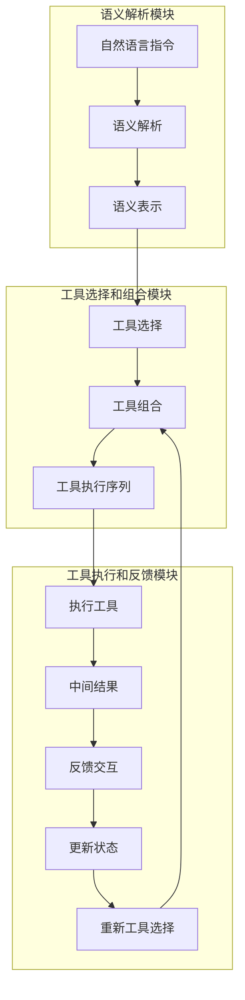

# 【大模型应用开发 动手做AI Agent】Agent的核心技能：调用工具

## 1.背景介绍

### 1.1 人工智能助理的兴起

近年来,随着大型语言模型(LLM)和人工智能(AI)技术的飞速发展,智能助理(AI Agent)已经逐渐走入我们的生活和工作场景。这些智能助理不仅能够进行自然语言交互,还可以执行各种任务,如信息查询、内容创作、问题解答等。它们的出现极大地提高了人类的工作效率和生活质量。

### 1.2 AI Agent的核心技能

要构建一个优秀的AI Agent,除了拥有强大的自然语言理解和生成能力外,还需要具备调用外部工具和服务的能力。这种调用工具的能力被称为"工具使用"(Tool Use),是AI Agent不可或缺的核心技能之一。通过调用工具,AI Agent可以获取更多信息、执行更复杂的任务,从而大大扩展其功能边界。

### 1.3 工具调用的重要性

在实际应用中,工具调用技能使AI Agent能够完成诸如Web搜索、数据分析、文件操作、API调用等多种任务,为用户提供更加智能和个性化的服务体验。同时,工具调用也是AI Agent向真正的"通用人工智能"(AGI)迈进的关键一步,使其能够与外部世界进行更紧密的交互和协作。

## 2.核心概念与联系

### 2.1 语义解析(Semantic Parsing)

要实现工具调用,首先需要对用户的自然语言指令进行语义解析,将其转化为可执行的形式化表示。这一过程通常涉及自然语言理解(NLU)、意图识别(Intent Recognition)和实体提取(Entity Extraction)等技术。

### 2.2 工具库(Tool Library)

AI Agent需要维护一个工具库,其中包含了可供调用的各种工具的元数据信息,如工具名称、输入输出格式、功能描述等。工具库的设计直接影响了AI Agent的功能覆盖面。

### 2.3 工具选择(Tool Selection)

根据用户的指令和可用工具库,AI Agent需要选择最合适的工具来执行任务。这个过程被称为工具选择,需要考虑工具的功能匹配度、使用成本等多个因素。

### 2.4 工具组合(Tool Chaining)

复杂任务通常需要多个工具协同完成,AI Agent需要能够对多个工具进行有序组合(工具链),以实现更高级的功能。工具链的生成是一个规划和搜索的过程。

### 2.5 反馈机制(Feedback Loop)

为了提高工具调用的准确性和鲁棒性,AI Agent需要具备反馈机制,根据工具执行的中间结果与用户进行交互,获取反馈并进行调整,直至完成任务。

## 3.核心算法原理具体操作步骤 

实现AI Agent的工具调用功能,需要涉及多个核心算法模块,下面将分步骤介绍其工作原理和具体实现方法。

### 3.1 语义解析模块

语义解析模块的目标是将自然语言指令转换为形式化的语义表示,以便后续模块进行理解和执行。常用的语义解析方法包括:

1. **基于规则的方法**: 使用手工设计的模式和规则来匹配和解析输入语句。这种方法对特定领域较为有效,但缺乏通用性和可扩展性。

2. **基于统计机器学习的方法**: 利用大量标注数据训练序列标注模型(如条件随机场CRF)或语法分析模型,自动学习语义解析规则。这种方法具有一定通用性,但需要大量标注数据。

3. **基于神经网络的方法**: 使用序列到序列(Seq2Seq)模型或者结构化神经网络直接将自然语言转换为形式化的语义表示,如Lambda逻辑形式或者语义解析树。这种方法具有很强的通用性和可扩展性,是目前主流的语义解析方法。

无论采用何种具体方法,语义解析的输出通常包括以下几个核心成分:

- 意图(Intent): 指令的核心目的,如"查询"、"操作"等。
- 参数(Arguments): 执行指令所需的参数实体,如"城市名称"、"文件路径"等。
- 约束条件(Constraints): 对结果的限制条件,如"天气温度大于25度"等。

以"查询北京今天的天气"为例,其语义解析结果可表示为:

```
Intent: 查询天气
Arguments: 
    地点: 北京
    时间: 今天
```

### 3.2 工具库管理

工具库管理模块负责维护AI Agent可调用的工具集合,并为工具选择和组合模块提供工具元数据支持。一个典型的工具库条目包括:

- 工具名称(Tool Name)
- 工具描述(Description): 对工具功能的文字描述
- 输入格式(Input Format): 工具接受的输入数据格式
- 输出格式(Output Format): 工具产生的输出数据格式
- 调用方式(Invocation): API接口、命令行参数等
- 使用成本(Cost): 计算、时间、财务等资源开销

例如,一个Web搜索工具的条目可能是:

```yaml
名称: Web搜索
描述: 使用搜索引擎查询并返回网页摘要
输入格式: 
  - 查询关键词 (字符串)
输出格式:
  - 网页标题和摘要列表
调用方式: 
  HTTP GET https://search.example.com/query?q={查询关键词}
成本: 0.001 (按请求计费)
```

工具库可以是静态的,也可以是动态更新的。动态工具库的优点是可以不断扩展功能,缺点是工具元数据维护的开销较大。

### 3.3 工具选择模块

工具选择模块的任务是根据语义解析的结果,从工具库中选择最合适的工具来执行指令。这是一个核心的决策问题,需要同时考虑工具的功能匹配度和使用成本等多个因素。

常见的工具选择策略包括:

1. **基于规则的匹配**: 根据手工设计的规则,如果语义解析结果满足某些模式,则选择对应的工具。这种方法简单但缺乏通用性。

2. **基于相似度的查询检索**: 将语义解析结果和工具描述向量化,计算相似度分数,选择最匹配的工具。这需要一个良好的向量化模型。

3. **基于监督学习的多分类**: 将工具选择问题建模为多分类问题,使用标注数据训练分类模型(如逻辑回归)进行工具预测。

4. **基于强化学习的决策**: 将工具选择看作马尔可夫决策过程,使用强化学习算法(如Q-Learning)学习最优的选择策略。

5. **基于神经网络的序列模型**: 使用Seq2Seq或者指针网络模型,直接将语义解析结果编码并生成工具序列作为输出。

除了功能匹配度,工具选择还需要考虑使用成本、隐私和安全性、结果质量等多个因素,这使得该问题较为复杂。在实际应用中,常采用多策略融合的方式来提高选择的准确性。

### 3.4 工具组合模块  

对于复杂的指令,可能需要多个工具协同完成。工具组合模块的任务是根据语义解析结果,规划出一个最优的工具执行序列(工具链)。

工具组合可以看作是一个经典的AI规划问题,需要在工具空间中搜索一个行为序列,使得执行该序列后可以达成最终目标。这个问题可以使用各种启发式搜索算法(如A*算法)或者自动规划算法(如计划域定义语言PDDL)来解决。

为了提高搜索效率,可以对工具空间进行剪枝,如:

1. **前向剪枝**: 基于工具的前置条件,剪掉不满足条件的工具
2. **目标剪枝**: 基于语义目标,剪掉无法达成目标的工具序列
3. **层剪枝**: 限制工具链的最大长度

除了经典的AI规划方法,近年来基于神经网络的序列生成模型(如Transformer)也被尝试应用于工具组合问题,将其看作是一个序列到序列的生成任务。这种方法无需显式的规划和搜索,但需要大量的监督数据,且解释性较差。

### 3.5 反馈交互模块

由于语义理解的困难和工具执行的不确定性,AI Agent在调用工具时难免会出现错误。为此,需要一个反馈交互模块,在工具执行的中间环节与用户进行交互,根据反馈信息对工具调用进行动态调整,直至成功完成任务。

反馈交互的核心是对话状态跟踪(Dialogue State Tracking),需要跟踪对话的历史上下文、已执行的工具及其中间结果、当前的对话意图等多种状态信息。基于这些状态信息,AI Agent可以向用户发起针对性的询问,获取反馈并更新对话状态,从而决定后续的工具调用策略。

对话状态表示和更新可以使用一阶逻辑规则、概率图模型(如POMDP、贝叶斯网络)或者基于注意力的神经网络序列模型等多种方法。此外,还需要设计高效的对话策略(Dialogue Policy),在探索(获取反馈)和利用(执行工具)之间权衡,以达到最优的交互效果。

### 3.6 系统集成

实现一个完整的AI Agent工具调用系统,需要将上述各个模块进行无缝集成,并设计合理的执行流程。一个典型的工作流程如下所示:



在上述流程中,关键是语义解析、工具选择和组合、工具执行以及反馈交互这几个核心环节。同时,为了提高系统的鲁棒性和可解释性,还需要设计错误处理和解释生成机制。

## 4.数学模型和公式详细讲解举例说明

在工具调用系统的多个模块中,都涉及到了一些数学模型和公式,下面将对其中的关键部分进行详细讲解和举例说明。

### 4.1 语义解析中的序列标注模型

在基于统计机器学习的语义解析方法中,常使用条件随机场(CRF)等序列标注模型对输入语句进行标注,从而获取语义成分。设输入语句为 $X = (x_1, x_2, ..., x_n)$,其对应的语义标注序列为 $Y = (y_1, y_2, ..., y_n)$,CRF模型的目标是学习条件概率 $P(Y|X)$,使其最大化。

对数线性模型的条件概率可以写为:

$$P(Y|X) = \frac{1}{Z(X)}\exp\left(\sum_{i=1}^{n}\sum_{k}\lambda_kt_k(y_{i-1},y_i,X,i)\right)$$

其中:
- $Z(X)$是归一化因子
- $t_k$是特征函数,描述了标记序列与观测序列之间的某些特征
- $\lambda_k$是对应的特征权重

通过对训练数据的最大似然估计,可以学习得到特征权重$\lambda$。在预测时,可以使用维特比算法或者beam search等方法高效地解码得到最优标注序列。

例如,对于句子"查询北京今天的天气",其标注结果可能是:

```
查询/Intent 北京/Location 今天/Time 的/的 天气/Weather
```

### 4.2 工具选择中的相似度计算

在基于相似度的工具选择策略中,需要计算语义表示与工具描述之间的相似度分数。假设语义表示和工具描述分别用向量$u$和$v$表示,则两者的相似度可