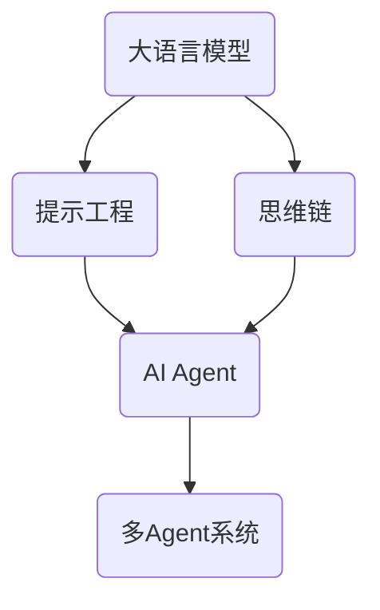

# 【大模型应用开发 动手做AI Agent】CAMEL实战

## 1.背景介绍

近年来,大语言模型(Large Language Models,LLMs)的快速发展和广泛应用,正在深刻改变人工智能领域的格局。LLMs通过在海量文本数据上进行预训练,可以学习到丰富的语言知识和常识,具备强大的自然语言理解和生成能力。然而,如何将LLMs应用于实际的AI系统开发中,构建具有开放域对话、任务规划执行等复杂能力的AI Agent,仍然面临诸多挑战。

CAMEL(Communicative Agents for "Mind" Exploration of Large Scale Language Model Society)是一个创新的研究项目,旨在探索利用LLMs构建高级AI Agent的方法。它利用提示工程、思维链等技术,赋予AI以类人的交互和任务执行能力。本文将深入剖析CAMEL的核心理念、关键技术、实践案例,并展望其未来发展方向,为大模型应用开发提供有益参考。

## 2.核心概念与联系

### 2.1 大语言模型(LLMs)

大语言模型是CAMEL的基石。LLMs通过自监督学习,在海量无标注文本数据上进行预训练,掌握了语法、语义、常识等广泛知识。当前主流的LLMs包括GPT系列、BERT系列、PaLM等。它们可以作为通用语言模型,为下游任务提供语言理解和生成能力。

### 2.2 提示工程(Prompt Engineering) 

提示工程是一种利用自然语言指令激发LLMs已有知识和能力的技术。通过精心设计的提示模板,我们可以引导LLMs执行特定的语言任务,如问答、对话、写作等。优质的提示不仅可以改善LLMs的输出质量,还能赋予其新的能力。CAMEL大量采用提示工程技术,构建AI Agent的多轮交互能力。

### 2.3 思维链(Chain-of-Thought,CoT)

思维链是一种增强LLMs推理能力的新范式。传统的提示工程只让LLMs直接给出答案,而CoT则鼓励LLMs输出中间推理步骤。通过引导LLMs"思考"问题,逐步推理,可以大幅提升其在复杂推理任务上的表现。CAMEL利用CoT改善AI Agent的逻辑推理和任务规划能力。

### 2.4 AI Agent

AI Agent是能够感知环境、进行推理决策、执行任务的智能体。传统的AI Agent通常基于规则或强化学习,难以处理开放域的任务。CAMEL的创新在于利用LLMs构建AI Agent,使其具备语言交互、常识推理、任务规划等高级能力。通过提示工程等技术,LLMs被赋予了Agent所需的技能。同时,多个Agent还可以互相对话,形成多Agent系统。

下图展示了CAMEL的核心概念及其关联:



## 3.核心算法原理和具体操作步骤

CAMEL的核心算法主要包括:提示工程算法和思维链推理算法。下面详细介绍其原理和操作步骤。

### 3.1 提示工程算法

提示工程算法的目标是设计高质量的提示,激发LLMs的语言能力,引导其完成特定任务。其主要步骤如下:

1. 任务分析:明确待执行的语言任务,如问答、对话、写作等。
2. 提示模板设计:根据任务特点,设计提示的整体结构和格式。常见的模板包括:
   - 问答:`Q:问题描述 A:`
   - 对话:`Human:人类输入 Assistant:`
   - 写作:`请以"标题"为题,写一篇关于主题的文章:`
3. 示例选择:从高质量的语料中选取与任务相关的示例,作为Few-shot的上下文。
4. 提示优化:通过调整提示的措辞、示例选择等,不断迭代优化,提升LLMs的输出质量。
5. 多轮交互:将单轮提示扩展为多轮,实现与LLMs的连续对话,构建Agent的交互能力。

通过精心设计提示和不断优化迭代,提示工程可以有效引导LLMs完成复杂语言任务,提升AI Agent的交互体验。

### 3.2 思维链推理算法

思维链推理算法旨在增强LLMs的逻辑推理能力,改善其在需要多步推理的任务上的表现。其核心思想是让LLMs输出推理过程,而不是直接给出最终答案。具体步骤如下:

1. 问题分析:将复杂问题拆解为若干个子问题或推理步骤。
2. 推理链生成:引导LLMs逐步进行推理,在每一步骤中分别给出:
   - 子问题
   - 利用已知信息进行推理
   - 得出当前步骤的结论
   - 过渡到下一步
3. 迭代优化:根据推理链的逻辑性和结论的正确性,对推理步骤进行优化,如调整步骤顺序、修正错误结论等。
4. 结果综合:将各个推理步骤的结论综合,得出最终答案。

通过引入推理链,LLMs可以学会对复杂问题进行系统的分解和推理,而不是简单的模式匹配。这大大提升了AI Agent处理逻辑推理任务的能力。

## 4.数学模型和公式详细讲解举例说明

CAMEL中的提示工程和思维链推理可以用数学语言进行形式化描述。下面以GPT模型为例,对其数学原理进行说明。

GPT模型的核心是基于Transformer结构的语言模型。其目标是最大化给定上文$x$下的下一个词$y$的条件概率:

$$P(y|x) = \frac{\exp(e(y)^T h)}{\sum_{y' \in V} \exp(e(y')^T h)}$$

其中,$e(y)$是词$y$的嵌入向量,$h$是Transformer编码器的顶层隐状态,$V$是词表。

在提示工程中,我们将提示模板$p$和示例$d$作为上文,引导GPT生成任务相关的文本$y$。形式化地,优化目标是:

$$\arg\max_{\theta} \sum_{(p,d,y) \in D} \log P(y|p,d;\theta)$$

其中,$\theta$是GPT的参数,$D$是提示-示例-文本三元组的数据集。通过优化上述目标,GPT可以学习根据提示和示例生成高质量的任务相关文本。

在思维链推理中,我们将复杂问题$q$拆解为一系列子问题和推理步骤$s_1,\dots,s_n$。GPT的目标是逐步生成推理链,并得出最终答案$a$:

$$P(a|q) = \sum_{s_1,\dots,s_n} P(s_1|q) P(s_2|q,s_1) \cdots P(a|q,s_1,\dots,s_n)$$

通过引入推理链,GPT可以学会对复杂问题进行逐步推理,提升了其在需要多步推理任务上的表现。

以上就是CAMEL中提示工程和思维链推理的核心数学原理。通过巧妙地将任务形式化为语言模型的优化目标,我们可以有效地利用LLMs构建高级AI Agent。

## 5.项目实践：代码实例和详细解释说明

下面以一个具体的项目实践为例,展示如何利用CAMEL构建一个基于GPT-3的AI对话Agent。我们将使用Python语言和OpenAI API。

### 5.1 环境准备

首先,安装必要的Python库,并配置OpenAI API Key:

```python
!pip install openai
import openai
openai.api_key = "your_api_key"
```

### 5.2 提示模板设计

设计一个通用的对话提示模板,引导GPT-3扮演AI助手的角色:

```python
prompt_template = '''
Human: {human_input}
Assistant: '''
```

### 5.3 多轮对话实现

实现一个多轮对话的函数,使Agent能够与用户进行连续的交互:

```python
def chat_with_agent(history):
    human_input = input("Human: ")
    history.append("Human: " + human_input)
    
    prompt = prompt_template.format(human_input="\n".join(history))
    response = openai.Completion.create(
        engine="text-davinci-002",
        prompt=prompt,
        max_tokens=150,
        n=1,
        stop=None,
        temperature=0.7,
    )
    
    ai_response = response.choices[0].text.strip()
    history.append("Assistant: " + ai_response)
    print("Assistant: " + ai_response)
    
    return history
```

### 5.4 测试Agent

启动Agent,与其进行多轮对话:

```python
history = []
while True:
    history = chat_with_agent(history)
```

运行上述代码,即可与AI助手进行多轮对话。Agent将根据对话历史,给出连贯的回复。

以上就是利用CAMEL构建AI对话Agent的简单示例。通过提示工程,我们可以引导LLMs扮演不同角色,实现多种功能。同时,还可以进一步引入思维链推理、多Agent交互等技术,构建更加智能的AI系统。

## 6.实际应用场景

CAMEL为LLMs在实际应用中的落地提供了一套行之有效的方法。基于CAMEL构建的AI Agent可以应用于多个场景,例如:

1. 智能客服:通过提示工程,引导LLMs扮演客服角色,为用户提供咨询、问题解答等服务。
2. 虚拟助手:构建个性化的AI助手,协助用户完成日程管理、信息查询、文本撰写等任务。
3. 教育辅导:利用LLMs的知识和语言能力,为学生提供学科辅导、写作指导等智能教育服务。
4. 金融分析:引导LLMs进行金融数据分析、投资决策等,辅助金融从业者进行专业判断。
5. 医疗诊断:利用LLMs的语言理解能力,分析患者病情描述,辅助医生进行初步诊断。

通过在不同领域应用CAMEL构建的AI Agent,我们可以将LLMs的语言智能赋能到更多实际任务中,提升生产力和服务质量。

## 7.工具和资源推荐

为了方便开发者学习和实践CAMEL,这里推荐一些常用的工具和资源:

1. OpenAI API:提供了易用的接口,方便调用GPT-3等强大的语言模型。
2. Hugging Face Transformers:一个流行的NLP库,提供了多种预训练语言模型和实用工具。
3. LangChain:一个专门为LLMs应用开发设计的框架,提供了提示工程、思维链等常用功能。
4. CAMEL论文和代码:CAMEL项目的原始论文和官方代码实现,可以作为学习和参考的资料。
5. AI Agent开发社区:一些专注于AI Agent开发的在线社区,如LessWrong、EleutherAI等,可以与其他开发者交流学习。

利用这些工具和资源,开发者可以更高效地学习和实践CAMEL,构建出功能丰富、性能出色的AI Agent应用。

## 8.总结：未来发展趋势与挑战

CAMEL代表了利用LLMs构建高级AI Agent的重要探索方向。通过提示工程、思维链推理等创新方法,CAMEL赋予了AI以类人的交互和任务执行能力。展望未来,CAMEL还有几个值得关注的发展趋势和挑战:

1. 提示工程的自动化:如何自动优化提示、选择示例,减少人工设计的工作量,是一个重要的研究方向。
2. 推理能力的进一步增强:如何在思维链的基础上,进一步提升AI Agent的逻辑推理、常识判断能力,仍然是一个挑战。
3. 安全与伦理:如何确保AI Agent的输出安全、无害、符合伦理规范,需要在技术和制度层面进行规范。
4. 多模态交互:将语言、视觉、语音等多种模态融合,构建更自然、丰富的人机交互方式,是未来的一个重要方向。
5. 个性化与适应性:如何让AI Agent根据不同用户的特点和需求,提供个性化、适应性的服务,也是一个值得探索的问题。

总之,CAMEL为利用LLMs构建高