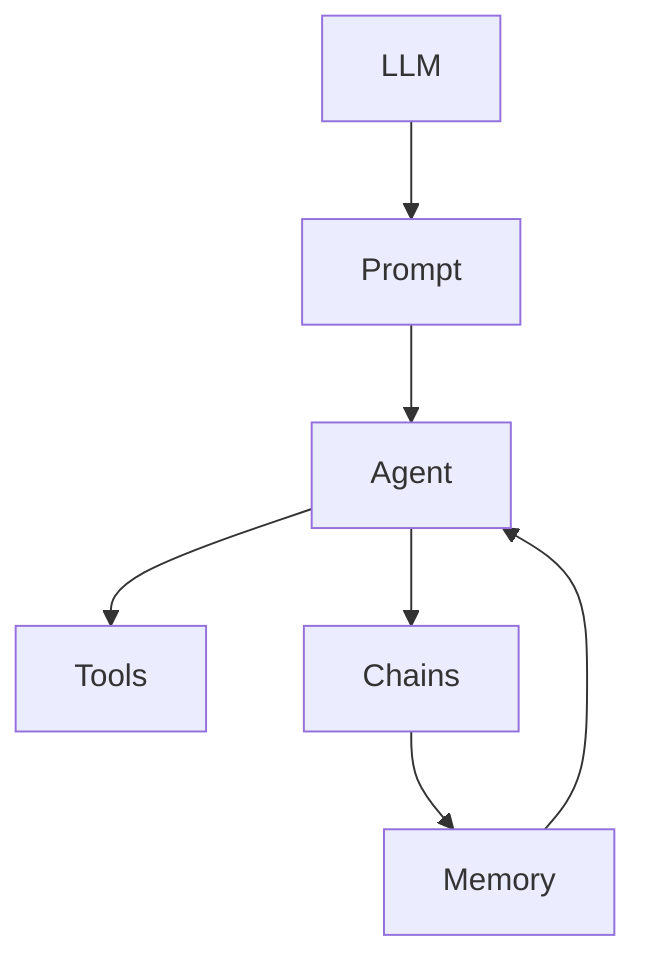

# 【大模型应用开发 动手做AI Agent】LangChain中的工具和工具包

## 1.背景介绍

### 1.1 大模型时代的到来

近年来,大型语言模型(Large Language Models, LLMs)在自然语言处理领域取得了突破性进展。模型如GPT-3、PaLM、ChatGPT等凭借其强大的语言理解和生成能力,为各种应用程序开辟了新的可能性。这些大模型不仅能够执行传统的NLP任务,如文本分类、机器翻译等,更重要的是,它们展现出了通用的语言理解和推理能力,可以回答开放性问题、进行多轮对话、甚至尝试编写代码和创作文本。

### 1.2 LangChain:构建大模型应用的Python库

为了充分发挥大模型的潜力,需要一个灵活、可扩展的框架来集成和编排各种组件。这就是LangChain的用武之地。LangChain是一个用于构建大模型应用程序的Python库,它提供了一系列模块和工具,使开发人员能够轻松地将大语言模型与其他系统(如知识库、API等)集成,从而创建智能代理、问答系统、自动化工作流等应用。

### 1.3 LangChain的优势

LangChain的主要优势在于:

1. **模块化设计**: LangChain将不同的功能封装成独立的模块,如Agents、Chains、Memories、Utilities等,用户可以根据需求灵活组合和扩展。

2. **支持多种LLM**: LangChain支持多种流行的大型语言模型,包括OpenAI的GPT模型、Anthropic的Claude、Cohere等,并提供了统一的接口。

3. **集成第三方数据源**: LangChain允许将大模型与各种数据源(如文件、网页、API等)集成,实现对结构化和非结构化数据的访问和处理。

4. **可扩展性强**: LangChain的模块化设计使得开发人员可以方便地扩展和定制功能,满足特定应用场景的需求。

## 2.核心概念与联系

在深入探讨LangChain的工具和工具包之前,我们需要了解一些核心概念及其之间的关系。

### 2.1 LLM(Large Language Model)

LLM是LangChain的核心组件,它指的是大型语言模型,如GPT-3、PaLM等。LangChain通过提供统一的接口,使得开发人员可以轻松地集成和切换不同的LLM。

### 2.2 Prompt

Prompt是与LLM进行交互的关键。它是一段自然语言文本,用于向LLM描述任务,并获取相应的输出。Prompt的设计直接影响LLM的表现,因此撰写高质量的Prompt是构建有效LLM应用的关键。

### 2.3 Agents

Agents是LangChain中的一个重要概念,它代表了一个具有特定目标和能力的智能代理。Agent可以与LLM和其他组件(如工具、数据源等)交互,以完成复杂的任务。Agent的行为由其内部的控制循环(Control Loop)驱动,该循环决定了Agent如何规划、执行和评估行动。

### 2.4 Tools

Tools是Agent可以利用的外部资源或功能,例如搜索引擎、计算器、文件系统等。Agent可以根据任务需求调用合适的Tool,并将Tool的输出结合LLM的输出,形成最终的响应或行动。

### 2.5 Chains

Chains是LangChain中的另一个核心概念,它代表了一系列相互连接的组件(如LLM、Agents、Tools等),用于完成特定的任务流程。Chains可以是简单的序列,也可以是具有条件逻辑和循环的复杂流程。

### 2.6 Memory

Memory是LangChain中用于存储和检索信息的组件。它允许Agent或其他组件在执行过程中记住和访问之前的状态、输入和输出,从而支持状态管理和上下文理解。

### 2.7 核心概念关系图

以下是LangChain核心概念之间的关系图:



上图展示了LangChain中核心概念之间的交互关系。LLM通过Prompt与Agent进行交互,Agent可以调用Tools和Chains来完成任务,并利用Memory来管理状态和上下文。这种模块化的设计使得LangChain具有很强的灵活性和可扩展性。

## 3.核心算法原理具体操作步骤

在本节中,我们将探讨LangChain中一些核心算法的原理和具体操作步骤。

### 3.1 LLM调用

LangChain提供了统一的接口来调用不同的LLM。以GPT-3为例,调用步骤如下:

1. 导入必要的模块:

```python
from langchain.llms import OpenAI
```

2. 初始化LLM对象,提供API密钥:

```python
llm = OpenAI(model_name="text-davinci-003", openai_api_key="YOUR_API_KEY")
```

3. 调用LLM的`generate`方法,传入Prompt:

```python
prompt = "Write a short story about a curious robot."
response = llm.generate([prompt])
print(response.generations[0][0].text)
```

对于其他LLM(如Claude、Cohere等),只需导入相应的模块并初始化对应的对象即可。

### 3.2 Prompt工程

撰写高质量的Prompt是获得良好LLM输出的关键。LangChain提供了多种Prompt模板和技术,如:

1. **PromptTemplate**: 定义Prompt模板,支持插入变量:

```python
from langchain.prompts import PromptTemplate

prompt = PromptTemplate(
    input_variables=["product"],
    template="Write a product review for {product}.",
)
```

2. **Few-Shot Learning**: 在Prompt中提供一些示例输入和输出,帮助LLM学习任务模式:

```python
examples = [
    {"input": "I want to buy a new laptop for work. What should I look for?", "output": "For a work laptop, you should prioritize performance, battery life, and portability..."},
    {"input": "Can you recommend a good camera for travel photography?", "output": "For travel photography, you'll want a camera that is lightweight, has good image quality, and is versatile..."}
]

prompt = PromptTemplate(
    input_variables=["input"],
    template="Input: {input}\nOutput:",
    examples=examples,
)
```

3. **Constitutional AI**: 在Prompt中加入约束条件,引导LLM输出符合特定要求。

通过合理设计Prompt,可以显著提高LLM的输出质量和一致性。

### 3.3 Agent控制循环

Agent的核心是控制循环(Control Loop),它决定了Agent如何规划、执行和评估行动。控制循环的一般步骤如下:

1. **观察当前状态**: Agent观察当前的任务、上下文和可用资源。

2. **制定计划**: 基于观察到的状态,Agent利用LLM生成一个行动计划。

3. **执行行动**: Agent执行计划中的行动,可能涉及调用Tools、Chains或其他组件。

4. **观察结果**: Agent观察行动的结果,并将结果存储在Memory中。

5. **评估结果**: Agent评估结果是否满足任务目标,如果不满足,则返回第2步继续循环。

6. **返回最终输出**: 如果任务目标已经达成,Agent返回最终输出。

以下是一个简单的Agent控制循环示例:

```python
from langchain.agents import initialize_agent, AgentType
from langchain.llms import OpenAI

llm = OpenAI(temperature=0)
tools = []  # 可以在此处添加Tools

agent = initialize_agent(tools, llm, agent=AgentType.ZERO_SHOT_REACT_DESCRIPTION, verbose=True)

agent.run("What is the capital of France?")
```

在这个例子中,我们初始化了一个基于LLM的Agent,并运行了一个简单的查询任务。Agent会根据任务自动规划和执行行动,直到获得最终结果。

### 3.4 Chains组装

Chains是LangChain中用于组装和管理复杂任务流程的核心概念。LangChain提供了多种预定义的Chain,如SequentialChain、ConstitutionalChain等,也支持自定义Chain。

以下是一个使用SequentialChain的示例:

```python
from langchain.llms import OpenAI
from langchain.chains import SequentialChain
from langchain.prompts import PromptTemplate

llm = OpenAI(temperature=0.9)

prompt_1 = PromptTemplate(
    input_variables=["product"],
    template="Write a brief description for {product}.",
)

prompt_2 = PromptTemplate(
    input_variables=["description"],
    template="Based on the description: {description}, write a short review for the product.",
)

chain = SequentialChain(chains=[prompt_1, prompt_2], input_variables=["product"], verbose=True)

output = chain.run("Apple iPhone 14 Pro")
print(output)
```

在这个例子中,我们定义了两个Prompt模板,并使用SequentialChain将它们组合成一个流程。该流程首先根据产品名称生成一个简短描述,然后基于该描述生成一个产品评论。

通过灵活组合不同的LLM、Prompts、Agents和Tools,我们可以构建出复杂的任务流程,满足各种应用场景的需求。

## 4.数学模型和公式详细讲解举例说明

在某些场景下,我们可能需要将数学模型和公式集成到LangChain应用中。LangChain提供了多种方式来实现这一点。

### 4.1 LaTeX公式渲染

LangChain支持在Prompt和输出中使用LaTeX公式。以下是一个示例:

```python
from langchain.llms import OpenAI
from langchain.prompts import PromptTemplate

llm = OpenAI(temperature=0)

prompt = PromptTemplate(
    input_variables=["x"],
    template="What is the derivative of the function $f(x) = x^2 + 3x + 2$ with respect to $x$?",
)

response = llm.generate([prompt.format(x="x")])
print(response.generations[0][0].text)
```

在这个例子中,我们在Prompt中使用LaTeX公式 $f(x) = x^2 + 3x + 2$ 来表示一个函数,并要求LLM计算该函数关于 $x$ 的导数。LLM的输出也可以包含LaTeX公式。

### 4.2 符号计算

对于一些数学计算任务,我们可以利用符号计算库(如SymPy)与LangChain集成。以下是一个示例:

```python
from langchain.llms import OpenAI
from langchain.agents import initialize_agent, AgentType
from langchain.tools import SymbolicMathTool

llm = OpenAI(temperature=0)
tool = SymbolicMathTool()

agent = initialize_agent(tools=[tool], llm=llm, agent=AgentType.ZERO_SHOT_REACT_DESCRIPTION, verbose=True)

agent.run("Solve the equation x^2 + 2x - 3 = 0 for x.")
```

在这个例子中,我们初始化了一个包含SymbolicMathTool的Agent。当Agent接收到求解方程的任务时,它会自动调用SymbolicMathTool来执行符号计算,并将结果返回给用户。

通过集成数学库,我们可以扩展LangChain的功能,处理更加复杂的数学和科学计算任务。

## 5.项目实践:代码实例和详细解释说明

在本节中,我们将通过一个实际项目来演示如何使用LangChain构建一个智能代理。

### 5.1 项目概述

我们将构建一个智能代理,它可以回答与Python编程相关的问题。该代理将利用以下组件:

- **LLM**: 我们将使用OpenAI的text-davinci-003模型作为LLM。
- **Tools**:
  - `PythonREPLTool`: 一个可以执行Python代码并返回结果的工具。
  - `Wikipedia`: 用于搜索和检索Wikipedia上的信息。
- **Memory**: 我们将使用`ConversationBufferMemory`来存储代理与用户的对话历史。

### 5.2 项目代码

```python
from langchain.llms import OpenAI
from langchain.agents import initialize_agent, AgentType
from langchain.agents.agent_toolkits import PythonREPLToolkit, WikipediaToolkit
from langchain.memory import ConversationBufferMemory

# 初始化LLM
llm = OpenAI(temperature=0)

# 初始化Tools
python_repl_toolkit = PythonREPLToolkit()
wikipedia_toolkit = WikipediaToolkit()
tools = python_repl_toolkit.get_tools() + wikipedia_toolkit.get_tools()

# 初始化Memory
memory = ConversationBufferMemory(memory_key="chat_history")

# 初始化Agent
agent = initialize_agent(tools, llm, agent=AgentType.CONVERSATIONAL_REACT_DESCRIPTION, verbose=True, memory=memory)

# 与Agent交互
agent.run("How can I