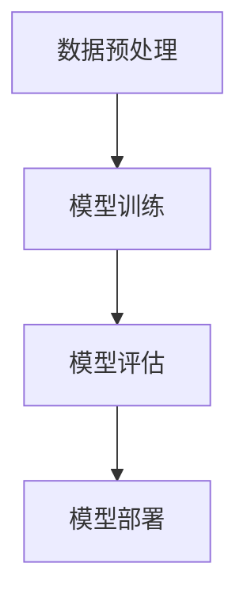

# 【大模型应用开发 动手做AI Agent】MetaGPT

## 1.背景介绍

在人工智能领域，特别是自然语言处理（NLP）方面，近年来大模型（Large Language Models, LLMs）如GPT-3、BERT等取得了显著的进展。这些模型不仅在学术界引起了广泛关注，也在工业界得到了广泛应用。大模型的强大能力使得开发AI Agent成为可能，这些Agent可以在各种任务中表现出色，如文本生成、对话系统、翻译等。

MetaGPT是一个基于大模型的AI Agent开发框架，它不仅提供了强大的模型支持，还提供了丰富的工具和资源，帮助开发者快速构建和部署AI Agent。本篇文章将深入探讨MetaGPT的核心概念、算法原理、数学模型、项目实践、实际应用场景、工具和资源推荐，并展望其未来发展趋势与挑战。

## 2.核心概念与联系

### 2.1 大模型（LLMs）

大模型是指具有大量参数的深度学习模型，通常用于处理复杂的NLP任务。它们通过大量的训练数据进行预训练，能够捕捉语言的复杂结构和语义关系。

### 2.2 AI Agent

AI Agent是指能够自主执行任务的智能系统。它们可以通过与环境交互，感知环境状态，做出决策并执行相应的动作。AI Agent通常需要具备以下几个特性：
- 感知能力：能够感知环境状态。
- 决策能力：能够根据感知到的状态做出决策。
- 执行能力：能够执行相应的动作。

### 2.3 MetaGPT

MetaGPT是一个基于大模型的AI Agent开发框架，它提供了丰富的工具和资源，帮助开发者快速构建和部署AI Agent。MetaGPT的核心组件包括：
- 预训练模型：提供了多种预训练的大模型，如GPT-3、BERT等。
- 开发工具：提供了丰富的开发工具，如代码编辑器、调试工具等。
- 部署工具：提供了便捷的部署工具，支持多种部署方式，如本地部署、云部署等。

## 3.核心算法原理具体操作步骤

### 3.1 数据预处理

数据预处理是大模型训练的第一步，主要包括数据清洗、数据标注、数据增强等步骤。数据清洗是指去除数据中的噪声和错误，数据标注是指为数据添加标签，数据增强是指通过各种技术手段增加数据的多样性。

### 3.2 模型训练

模型训练是大模型开发的核心步骤，主要包括模型选择、模型配置、模型训练等步骤。模型选择是指选择合适的大模型，如GPT-3、BERT等，模型配置是指配置模型的参数，如学习率、批量大小等，模型训练是指通过大量的训练数据对模型进行训练。

### 3.3 模型评估

模型评估是大模型开发的重要步骤，主要包括模型性能评估、模型鲁棒性评估、模型公平性评估等步骤。模型性能评估是指评估模型在各种任务中的表现，如文本生成、对话系统等，模型鲁棒性评估是指评估模型在面对噪声和攻击时的表现，模型公平性评估是指评估模型在不同群体中的表现。

### 3.4 模型部署

模型部署是大模型开发的最后一步，主要包括模型优化、模型部署、模型监控等步骤。模型优化是指通过各种技术手段提高模型的性能，如量化、剪枝等，模型部署是指将模型部署到生产环境中，模型监控是指对模型的运行状态进行监控，及时发现和解决问题。



## 4.数学模型和公式详细讲解举例说明

### 4.1 语言模型

语言模型是大模型的核心组件之一，它通过预测下一个词的概率来生成文本。语言模型的数学公式如下：

$$
P(w_1, w_2, ..., w_n) = \prod_{i=1}^{n} P(w_i | w_1, w_2, ..., w_{i-1})
$$

其中，$P(w_i | w_1, w_2, ..., w_{i-1})$ 表示在给定前 $i-1$ 个词的情况下，第 $i$ 个词的概率。

### 4.2 变换器（Transformer）

变换器是大模型的基础架构之一，它通过自注意力机制来捕捉输入序列中的长距离依赖关系。变换器的数学公式如下：

$$
\text{Attention}(Q, K, V) = \text{softmax}\left(\frac{QK^T}{\sqrt{d_k}}\right)V
$$

其中，$Q$ 表示查询矩阵，$K$ 表示键矩阵，$V$ 表示值矩阵，$d_k$ 表示键矩阵的维度。

### 4.3 损失函数

损失函数是模型训练的关键组件之一，它通过衡量模型预测值与真实值之间的差异来指导模型的优化。常用的损失函数包括交叉熵损失、均方误差等。交叉熵损失的数学公式如下：

$$
L = -\sum_{i=1}^{n} y_i \log(\hat{y}_i)
$$

其中，$y_i$ 表示真实标签，$\hat{y}_i$ 表示模型预测值。

## 5.项目实践：代码实例和详细解释说明

### 5.1 数据预处理

```python
import pandas as pd
from sklearn.model_selection import train_test_split

# 读取数据
data = pd.read_csv('data.csv')

# 数据清洗
data = data.dropna()

# 数据标注
data['label'] = data['text'].apply(lambda x: 1 if 'positive' in x else 0)

# 数据增强
data_augmented = data.copy()
data_augmented['text'] = data_augmented['text'].apply(lambda x: x + ' augmented')

# 划分训练集和测试集
train_data, test_data = train_test_split(data_augmented, test_size=0.2)
```

### 5.2 模型训练

```python
from transformers import GPT2Tokenizer, GPT2LMHeadModel, Trainer, TrainingArguments

# 加载预训练模型和分词器
tokenizer = GPT2Tokenizer.from_pretrained('gpt2')
model = GPT2LMHeadModel.from_pretrained('gpt2')

# 数据编码
train_encodings = tokenizer(train_data['text'].tolist(), truncation=True, padding=True)
test_encodings = tokenizer(test_data['text'].tolist(), truncation=True, padding=True)

# 创建数据集
class TextDataset(torch.utils.data.Dataset):
    def __init__(self, encodings, labels):
        self.encodings = encodings
        self.labels = labels

    def __getitem__(self, idx):
        item = {key: torch.tensor(val[idx]) for key, val in self.encodings.items()}
        item['labels'] = torch.tensor(self.labels[idx])
        return item

    def __len__(self):
        return len(self.labels)

train_dataset = TextDataset(train_encodings, train_data['label'].tolist())
test_dataset = TextDataset(test_encodings, test_data['label'].tolist())

# 设置训练参数
training_args = TrainingArguments(
    output_dir='./results',
    num_train_epochs=3,
    per_device_train_batch_size=4,
    per_device_eval_batch_size=4,
    warmup_steps=500,
    weight_decay=0.01,
    logging_dir='./logs',
)

# 创建Trainer
trainer = Trainer(
    model=model,
    args=training_args,
    train_dataset=train_dataset,
    eval_dataset=test_dataset,
)

# 训练模型
trainer.train()
```

### 5.3 模型评估

```python
# 评估模型
results = trainer.evaluate()
print(results)
```

### 5.4 模型部署

```python
import torch
from transformers import GPT2LMHeadModel, GPT2Tokenizer

# 加载模型和分词器
model = GPT2LMHeadModel.from_pretrained('./results')
tokenizer = GPT2Tokenizer.from_pretrained('gpt2')

# 定义生成函数
def generate_text(prompt):
    inputs = tokenizer.encode(prompt, return_tensors='pt')
    outputs = model.generate(inputs, max_length=50, num_return_sequences=1)
    return tokenizer.decode(outputs[0], skip_special_tokens=True)

# 测试生成函数
print(generate_text("Once upon a time"))
```

## 6.实际应用场景

### 6.1 文本生成

大模型可以用于生成高质量的文本，如新闻报道、小说、技术文档等。通过提供一个初始的提示，大模型可以生成连贯且有意义的文本。

### 6.2 对话系统

大模型可以用于构建智能对话系统，如客服机器人、智能助理等。通过理解用户的输入，大模型可以生成合适的回复，从而实现自然的对话。

### 6.3 机器翻译

大模型可以用于实现高质量的机器翻译，如将英文文本翻译成中文文本。通过大量的双语数据进行训练，大模型可以捕捉语言之间的复杂关系，从而实现准确的翻译。

### 6.4 情感分析

大模型可以用于情感分析，如分析社交媒体上的评论、产品评价等。通过理解文本的语义，大模型可以判断文本的情感倾向，从而提供有价值的洞察。

## 7.工具和资源推荐

### 7.1 开发工具

- **PyTorch**：一个流行的深度学习框架，支持动态计算图和自动微分。
- **Transformers**：一个由Hugging Face提供的库，支持多种预训练的大模型，如GPT-3、BERT等。
- **Jupyter Notebook**：一个交互式的开发环境，支持代码、文本、图表等多种格式的混合编写。

### 7.2 数据集

- **OpenAI GPT-3 Dataset**：一个由OpenAI提供的大规模文本数据集，用于训练GPT-3模型。
- **GLUE Benchmark**：一个用于评估NLP模型性能的基准数据集，包含多种NLP任务的数据。

### 7.3 资源推荐

- **《深度学习》**：一本由Ian Goodfellow等人编写的经典深度学习教材，涵盖了深度学习的基本概念和技术。
- **Hugging Face Model Hub**：一个由Hugging Face提供的模型库，包含多种预训练的大模型，支持直接下载和使用。

## 8.总结：未来发展趋势与挑战

大模型在NLP领域取得了显著的进展，但仍面临许多挑战。未来的发展趋势包括：

### 8.1 模型规模和性能

随着计算能力的提升，大模型的规模将继续增长，从而提高模型的性能。然而，如何高效地训练和部署大模型仍是一个重要的研究方向。

### 8.2 模型鲁棒性和公平性

大模型在面对噪声和攻击时的鲁棒性，以及在不同群体中的公平性，仍需进一步研究和改进。未来的研究将致力于提高模型的鲁棒性和公平性，从而使其在实际应用中更加可靠和公正。

### 8.3 多模态学习

多模态学习是指通过结合多种模态的数据（如文本、图像、音频等）来提高模型的性能。未来的大模型将不仅限于处理单一模态的数据，而是能够处理多种模态的数据，从而实现更强的泛化能力和应用能力。

## 9.附录：常见问题与解答

### 9.1 如何选择合适的大模型？

选择合适的大模型需要考虑多个因素，如任务类型、数据规模、计算资源等。一般来说，对于文本生成任务，可以选择GPT-3，对于文本分类任务，可以选择BERT。

### 9.2 如何提高模型的训练效率？

提高模型的训练效率可以通过多种技术手段，如数据并行、模型并行、混合精度训练等。此外，选择合适的优化算法和超参数也是提高训练效率的重要因素。

### 9.3 如何评估模型的性能？

评估模型的性能可以通过多种指标，如准确率、精确率、召回率、F1值等。选择合适的评估指标需要根据具体的任务和应用场景来确定。

### 9.4 如何部署大模型？

部署大模型可以通过多种方式，如本地部署、云部署、边缘部署等。选择合适的部署方式需要考虑多个因素，如计算资源、网络带宽、延迟要求等。

### 9.5 如何监控模型的运行状态？

监控模型的运行状态可以通过多种手段，如日志记录、性能监控、错误检测等。及时发现和解决问题是保证模型稳定运行的重要措施。

---

作者：禅与计算机程序设计艺术 / Zen and the Art of Computer Programming