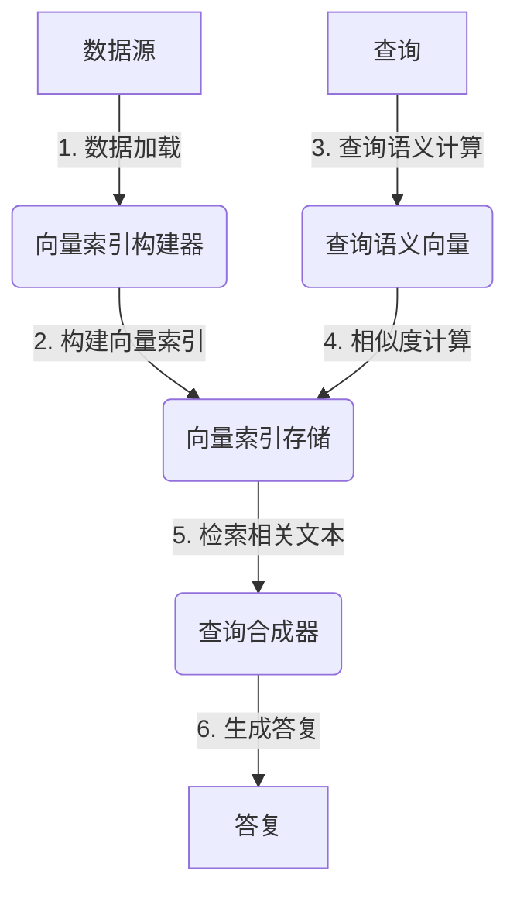

# 【大模型应用开发 动手做AI Agent】何谓LlamaIndex

## 1.背景介绍

### 1.1 大模型时代的到来

随着人工智能技术的不断发展,大型语言模型(Large Language Models, LLMs)已经成为当前人工智能领域的核心驱动力。这些模型通过在海量文本数据上进行预训练,学习了丰富的自然语言知识和能力,可以用于各种自然语言处理任务,如问答、总结、翻译等。

代表性的大型语言模型包括 GPT-3、BERT、XLNet、RoBERTa、ALBERT等。其中,OpenAI 推出的 GPT-3 模型凭借其惊人的语言生成能力,引发了全球范围内的关注和讨论。GPT-3 拥有 1750 亿个参数,是当前最大的语言模型。

### 1.2 大模型应用的挑战

尽管大型语言模型展现出了强大的语言能力,但将它们应用于实际场景仍然面临着诸多挑战:

1. **知识孤岛**:大模型虽然拥有广博的知识,但无法很好地将知识与现实世界相结合。它们缺乏对上下文和领域知识的理解能力。

2. **记忆力有限**:大模型在处理长文本时,往往会遗忘之前的上下文信息,导致生成的内容缺乏连贯性。

3. **可解释性差**:大模型的内部机理是一个黑盒,很难解释它们为什么会产生某种输出。

4. **安全性和可控性**:大模型可能会生成有害或不当的内容,缺乏有效的控制机制。

为了更好地利用大型语言模型的能力,并解决上述挑战,研究人员提出了各种应用框架和工具。其中,LlamaIndex 就是一个非常有前景的解决方案。

### 1.3 LlamaIndex 介绍

LlamaIndex 是一个用于构建基于大型语言模型的应用程序的开源 Python 库。它旨在解决大模型应用中的知识孤岛和记忆力有限等问题,使开发人员能够更好地利用大模型的能力。

LlamaIndex 的核心思想是将非结构化数据(如文本、PDF、网页等)转换为结构化的向量索引,并与大型语言模型相结合,实现高效的问答、总结等功能。它提供了多种索引构建和查询策略,支持增量更新和持久化存储,可以很好地应对大规模数据集。

LlamaIndex 项目由 Anthropic 公司发起,目前已在 GitHub 上开源。它得到了众多研究人员和开发者的关注和支持,正在快速发展和完善中。

## 2.核心概念与联系

### 2.1 向量索引

向量索引(Vector Index)是 LlamaIndex 的核心概念。它是一种将非结构化数据(如文本)转换为结构化向量表示的数据结构。

在向量索引中,每个文档或文本段落都被表示为一个向量,这个向量捕获了文本的语义信息。相似的文本会有相近的向量表示。通过计算向量之间的相似度,我们可以快速找到与查询相关的文本片段。

LlamaIndex 支持多种向量索引构建策略,包括:

- **平面向量索引(Flat Vector Index)**: 将整个文档作为一个向量进行索引。
- **树形向量索引(Tree Vector Index)**: 将文档分割为多个节点,每个节点对应一个向量,形成一个树状结构。
- **列表向量索引(List Vector Index)**: 将文档分割为多个段落,每个段落对应一个向量。

不同的索引策略适用于不同的场景,开发者可以根据数据特点和需求进行选择。

### 2.2 查询语义

在 LlamaIndex 中,查询语义(Query Semantic)是指用户提出的查询在向量空间中的表示。LlamaIndex 利用大型语言模型将自然语言查询转换为向量表示,然后在向量索引中搜索相似的向量(即相关文本片段)。

查询语义的计算过程如下:

1. 使用大型语言模型对查询进行编码,获取查询的隐藏状态向量。
2. 对隐藏状态向量进行处理(如平均、最大池化等),得到查询的最终向量表示。

通过计算查询向量与索引中各个文本向量的相似度,LlamaIndex 可以快速检索出与查询相关的文本片段。

### 2.3 查询合成

查询合成(Query Synthesis)是 LlamaIndex 的另一个核心功能。它的目的是根据检索到的相关文本片段,合成出对查询的最终答复。

查询合成的过程如下:

1. 将查询和相关文本片段拼接成一个提示(Prompt),输入给大型语言模型。
2. 大型语言模型根据提示生成答复。
3. 对生成的答复进行后处理(如去重、摘要等),得到最终结果。

在查询合成过程中,LlamaIndex 还提供了一些高级功能,如对话历史记录、反馈训练等,以提高答复的质量和相关性。

### 2.4 LlamaIndex 架构

LlamaIndex 的整体架构如下所示:

1. 首先加载原始数据源(如文本文件、PDF、网页等)。
2. 使用向量索引构建器将原始数据转换为向量索引,并存储在向量索引存储中。
3. 当用户提出查询时,计算查询的语义向量表示。
4. 在向量索引中搜索与查询语义最相似的向量(即相关文本片段)。
5. 将检索到的相关文本片段输入查询合成器。
6. 查询合成器利用大型语言模型生成对查询的最终答复。

LlamaIndex 的模块化设计使得开发者可以灵活地选择和组合不同的索引构建策略、查询语义计算方法和查询合成策略,以满足不同应用场景的需求。

## 3.核心算法原理具体操作步骤

### 3.1 向量索引构建

向量索引构建是 LlamaIndex 的核心步骤之一。它将原始非结构化数据转换为结构化的向量表示,以便于后续的查询和检索。

LlamaIndex 提供了多种向量索引构建策略,包括平面向量索引(Flat Vector Index)、树形向量索引(Tree Vector Index)和列表向量索引(List Vector Index)等。不同的策略适用于不同的数据特点和应用场景。

以平面向量索引为例,构建步骤如下:

1. **数据预处理**:对原始数据进行清洗和规范化,如去除HTML标签、转换为纯文本等。

2. **文本分割**:将原始文本按照一定的规则(如最大长度、语义边界等)分割成多个文本块。

3. **向量编码**:使用大型语言模型对每个文本块进行编码,获取其向量表示。常用的编码方法包括平均池化、最大池化等。

4. **索引构建**:将文本块及其对应的向量表示组合成平面向量索引,并可选择进行持久化存储。

构建完成后,我们就可以在向量索引中快速检索与查询相关的文本片段。

### 3.2 查询语义计算

查询语义计算是将用户的自然语言查询转换为向量表示的过程。它是进行相似度计算和文本检索的基础。

查询语义计算的步骤如下:

1. **查询预处理**:对用户输入的查询进行规范化和清洗,如去除标点符号、转换为小写等。

2. **向量编码**:使用与构建向量索引时相同的大型语言模型和编码方法,对查询进行编码,获取其向量表示。

3. **查询向量后处理**:对查询向量进行进一步的处理,如规范化、降维等,以提高查询效率和精度。

得到查询向量后,我们就可以在向量索引中搜索与之最相似的文本片段。

### 3.3 相似度计算与文本检索

相似度计算是指计算查询向量与索引中每个文本向量之间的相似程度。相似度越高,说明该文本片段与查询越相关。

LlamaIndex 支持多种相似度计算方法,如余弦相似度、欧几里得距离等。开发者可以根据具体需求选择合适的方法。

相似度计算的步骤如下:

1. **遍历索引**:依次取出索引中的每个文本向量。

2. **计算相似度**:使用选定的相似度计算方法,计算查询向量与当前文本向量之间的相似度分数。

3. **排序和过滤**:根据相似度分数对文本片段进行排序,并可选择设置相似度阈值,过滤掉不相关的文本片段。

4. **返回结果**:返回排序后的相关文本片段列表,供后续的查询合成使用。

在实际应用中,为了提高检索效率,LlamaIndex 还支持多种优化策略,如approximate nearest neighbor search、分块检索等。

### 3.4 查询合成

查询合成是将检索到的相关文本片段综合起来,生成对查询的最终答复的过程。它利用大型语言模型的生成能力,产生连贯、准确的自然语言回复。

查询合成的步骤如下:

1. **构建提示(Prompt)**:将查询和相关文本片段拼接成一个提示,作为大型语言模型的输入。提示的构建方式会影响生成结果的质量。

2. **语言模型生成**:使用大型语言模型(如 GPT-3)对提示进行解码,生成自然语言形式的答复。

3. **结果后处理**:对生成的答复进行进一步的处理,如去重、摘要、过滤不当内容等,以提高答复的质量和可读性。

4. **返回最终答复**:将处理后的答复作为对查询的最终回复返回给用户。

在查询合成过程中,LlamaIndex 还提供了一些高级功能,如对话历史记录、反馈训练等,以提高答复的相关性和连贯性。

## 4.数学模型和公式详细讲解举例说明

在 LlamaIndex 中,相似度计算是一个非常重要的环节。它决定了检索到的文本片段与查询的相关程度。常用的相似度计算方法包括余弦相似度和欧几里得距离等。

### 4.1 余弦相似度

余弦相似度是计算两个向量之间夹角余弦值的方法,常用于计算文本向量之间的相似度。它的计算公式如下:

$$sim(u, v) = \frac{u \cdot v}{||u|| \times ||v||}$$

其中,$ u $和$ v $分别表示两个向量,$ \cdot $表示向量点乘,$ ||u|| $和$ ||v|| $分别表示向量的L2范数(即向量的模长)。

余弦相似度的取值范围是 [-1, 1]。当两个向量完全相同时,余弦相似度为 1;当两个向量夹角为 90 度时,余弦相似度为 0;当两个向量方向完全相反时,余弦相似度为 -1。

在 LlamaIndex 中,我们通常使用余弦相似度来衡量查询向量与文本向量之间的相似程度。相似度越高,说明该文本片段与查询越相关。

### 4.2 欧几里得距离

欧几里得距离是计算两个向量之间直线距离的方法,也可以用于计算文本向量之间的相似度。它的计算公式如下:

$$d(u, v) = \sqrt{\sum_{i=1}^{n}(u_i - v_i)^2}$$

其中,$ u $和$ v $分别表示两个 n 维向量,$ u_i $和$ v_i $分别表示向量的第 i 个分量。

欧几里得距离的取值范围是 [0, +∞)。当两个向量完全相同时,欧几里得距离为 0;当两个向量差异越大时,欧几里得距离越大。

在使用欧几里得距离计算相似度时,我们