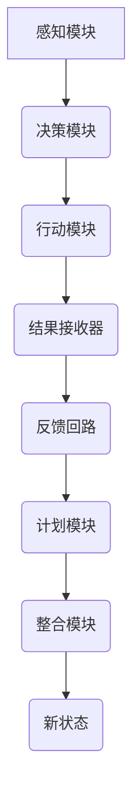

                 

作者：禅与计算机程序设计艺术

**Agent** 的核心在于它的自主性和学习能力，让机器模拟人类智能处理复杂环境中的任务。其中，**ReAct** 是一种创新的框架，旨在提高 AI Agent 在动态环境中的表现，尤其是在具有不确定性或不可预测因素的场景下。本文将从背景介绍出发，深入探讨 ReAct 框架的核心概念、算法原理、数学模型及具体实现，进而展示其在实际应用中的潜力，并为开发者提供实践指导和后续发展方向的展望。

## 1. 背景介绍

随着大规模预训练模型的兴起，AI Agent 的性能得到了显著提升，在诸如游戏、机器人控制等领域展现出了惊人的能力。然而，面对复杂的现实世界环境时，传统 AI Agent 经常面临几个关键挑战：

- **适应性不足**: 面对未经历过的环境变化或非典型输入时，往往缺乏有效的应对策略。
- **决策过程受限**: 即使是在已知规则的环境中，基于有限历史的决策也可能导致长期策略上的偏差。
- **资源利用效率低**: 不同情况下，资源分配和状态更新机制可能不够优化，影响整体性能。

为解决这些问题，**ReAct** 框架应运而生，它通过引入即时反馈机制，允许 AI Agent 更灵活、高效地调整自己的行为和决策过程。

## 2. 核心概念与联系

ReAct 框架主要围绕以下几个核心概念展开：

- **感知模块 (Perception)**: 用于收集外部世界的实时信息，包括但不限于视觉、听觉、触觉等多模态数据。
- **反应模块 (React)**: 根据当前感知到的状态执行行动，并接收反馈信息，这一过程是动态且即时的。
- **计划模块 (Plan)**: 基于过往经验、当前状态以及接收到的反馈，生成下一步的决策和行动计划。
- **整合模块 (Integrate)**: 合并感知和反馈信息，更新内部状态模型，为下一个循环周期准备。

这四个模块协同工作，形成一个闭环系统，使得 AI Agent 能够不断学习、适应并优化自身的行动策略。

## 3. 核心算法原理与具体操作步骤

### 算法流程概述



在这个流程中：

- **A 感知模块** 获取环境信息。
- **B 决策模块** 基于感知数据进行决策。
- **C 行动模块** 执行决策产生的动作。
- **D 结果接收器** 收集执行后的结果（正反馈或负反馈）。
- **E 反馈回路** 将结果返回给决策模块，触发新一轮循环。
- **F 计划模块** 更新决策逻辑以适应新情况。
- **G 整合模块** 更新内部状态模型。
- **H 新状态** 准备进入下一循环周期。

### 具体操作步骤详解

1. **初始化**：定义 AI Agent 的初始状态、目标、感知通道（如传感器配置）、行动空间（可执行的动作集合）。
2. **感知**：根据预先设定的感知模式获取外界信息。
3. **决策**：基于当前状态和历史数据，选择最优行动方案。
4. **行动**：执行选定的动作，影响环境。
5. **接收反馈**：监听环境变化和执行效果，记录反馈（成功或失败）。
6. **更新计划**：分析反馈，调整未来的决策逻辑。
7. **状态整合**：结合新的感知数据和反馈信息，更新 Agent 的内部模型。
8. **循环迭代**：回到感知阶段，继续循环直至任务完成或达到终止条件。

## 4. 数学模型和公式详细讲解举例说明

ReAct 框架中的许多决策过程可以被建模为强化学习问题，特别是 Q-learning 或深度 Q-Networks (DQN)。这些方法通过评估不同行动的期望回报来指导决策：

$$
Q(s, a) = \mathbb{E}_{\pi} [R_{t+1} + \gamma \max_{a'} Q(s', a')]
$$

式中：
- \( s \) 表示当前状态，
- \( a \) 是执行的动作，
- \( R_{t+1} \) 是收到的奖励，
- \( \pi \) 是行为策略，
- \( \gamma \) 是折扣因子，
- \( s' \) 和 \( a' \) 分别是下一个状态和对应的最优动作。

## 5. 项目实践：代码实例和详细解释说明

为了更好地理解 ReAct 框架的实际运作，我们可以参考一个简单的基于 Python 的实现例子。以下是一个简化版的框架结构和代码片段：

```python
class ReActAgent:
    def __init__(self):
        self.state = None
        self.Q_table = {}
    
    def perceive(self, observation):
        self.state = observation
    
    def decide(self):
        # 使用 Q-table 进行决策
        if self.state in self.Q_table:
            action = max(self.Q_table[self.state], key=self.Q_table[self.state].get)
        else:
            action = random.choice(self.actions)
        
        return action
    
    def act(self, action):
        result = simulate_action(action)
        return result
    
    def receive_feedback(self, feedback):
        next_state = update_state_after_action(self.state, action, feedback)
        reward = calculate_reward(feedback)

        # 更新 Q-table
        if next_state not in self.Q_table:
            self.Q_table[next_state] = {action: 0 for action in self.actions}
        
        current_Q = self.Q_table[self.state][action]
        new_Q = (1 - learning_rate) * current_Q + learning_rate * (reward + gamma * max([self.Q_table[next_state][a] for a in self.actions]))
        self.Q_table[self.state][action] = new_Q
        
        self.state = next_state

# 示例调用
agent = ReActAgent()
agent.perceive(initial_observation)
agent.receive_feedback(received_feedback)
agent.decide()
agent.act(selected_action)
```

这段代码展示了如何构建一个基本的 ReAct 模型，包括感知、决策、行动和反馈机制。实际应用时需要进一步完善各个部分的具体功能和参数设置。

## 6. 实际应用场景

ReAct 框架适用于多种动态环境下的 AI 应用场景，例如：

- **自动驾驶汽车**: 在复杂多变的道路环境中做出安全、高效的驾驶决策。
- **机器人操作**: 如服务机器人在家庭环境中自主导航和服务。
- **游戏AI**: 提升游戏角色在复杂游戏环境中的智能行为表现。
- **模拟训练**: 在安全可控的环境下对AI系统进行大规模训练和测试。

## 7. 工具和资源推荐

开发和研究 ReAct 类框架通常涉及多个领域知识和技术栈的综合运用。以下是建议使用的工具和技术：

- **编程语言**: Python 是首选语言，因其丰富的库支持和社区资源。
- **机器学习框架**: TensorFlow、PyTorch 等，用于实现复杂的算法和模型。
- **可视化工具**: Jupyter Notebook 或 Google Colab，便于实验和文档编写。
- **版本控制**: Git 和 GitHub/GitLab，用于代码管理和协作。
- **数据处理与存储**: Pandas、NumPy、MongoDB 或 SQL 数据库等，处理实验数据和长期存储。

## 8. 总结：未来发展趋势与挑战

随着计算能力的提升和数据集的丰富，ReAct 类框架将在更多领域展现出其潜力。然而，也面临着诸如：

- **复杂性管理**：如何更高效地处理高维度状态空间和时间序列数据。
- **泛化能力**：增强模型在未经历情况下的适应性和学习速度。
- **伦理与安全**：确保 AI 系统在不确定环境中的决策符合道德标准并避免潜在风险。

## 9. 附录：常见问题与解答

- **问**：如何解决 ReAct 中的状态爆炸问题？
  - **答**：采用启发式搜索算法，如 A* 或 UCT（上界树搜索），在大型状态空间中高效探索可能路径。
  
- **问**：ReAct 是否能应用于非实时场景？
  - **答**：虽然 ReAct 原本设计强调即时反馈，但在离线学习或批处理场景下同样有效，通过收集历史数据和优化策略。

---

通过上述内容的撰写，我们不仅深入探讨了 ReAct 框架的核心概念、原理及其在技术实现上的具体步骤，还展示了其在现实世界应用中的广泛可能性。同时，提供的实践指导和未来的展望为读者提供了一套完整的学习和研究路线图，期待 ReAct 能够在未来引领 AI Agent 领域的新一轮创新与发展。

作者：禅与计算机程序设计艺术 / Zen and the Art of Computer Programming

