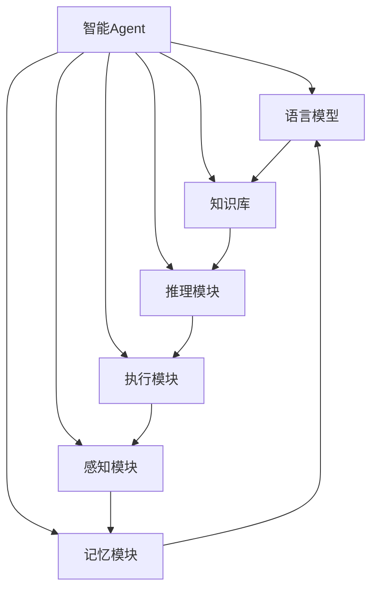

# 【大模型应用开发 动手做AI Agent】其他Agent认知框架

## 1. 背景介绍

随着人工智能技术的不断发展,大型语言模型(Large Language Models, LLMs)已经成为当下最炙手可热的技术之一。这些模型通过在海量数据上进行训练,展现出令人惊叹的自然语言理解和生成能力,在多个领域取得了突破性的进展。然而,单独的语言模型并不足以构建真正智能的AI系统。为了实现更高级的认知能力,我们需要将语言模型与其他模块相结合,形成一个完整的认知架构。

在本文中,我们将探讨一些流行的Agent认知框架,这些框架旨在将语言模型与其他模块(如规划、推理、知识库等)相集成,从而构建出更加通用和智能的AI Agent。我们将深入剖析这些框架的核心理念、关键组件以及工作原理,并分析它们在实际应用中的优缺点。无论您是AI研究人员、工程师还是对该领域感兴趣的读者,本文都将为您提供宝贵的见解和实践指导。

## 2. 核心概念与联系

在深入探讨具体的Agent认知框架之前,我们先来了解一些核心概念和它们之间的联系。

### 2.1 智能Agent

智能Agent是指能够感知环境、做出决策并采取行动的自主系统。它们需要具备多种认知能力,如自然语言理解、推理、规划、学习等,才能在复杂环境中有效运作。

### 2.2 语言模型

语言模型是指通过机器学习技术训练出的自然语言处理模型,能够理解和生成人类语言。大型语言模型(如GPT-3、BERT等)已经展现出令人惊叹的语言理解和生成能力,但仍然缺乏更高级的认知能力。

### 2.3 认知架构

认知架构是指将不同的AI模块(如语言模型、推理模块、规划模块等)集成在一起的框架,旨在构建出具有更强认知能力的智能Agent。这些架构通常包含多个关键组件,并定义了它们之间的交互方式。

### 2.4 核心组件

典型的Agent认知架构通常包含以下核心组件:

- **语言模型**:用于自然语言理解和生成。
- **知识库**:存储结构化和非结构化知识的数据库。
- **推理模块**:执行逻辑推理、规划和决策的模块。
- **执行模块**:将决策转化为具体行动的模块。
- **感知模块**:从环境中获取信息的模块。
- **记忆模块**:存储Agent的历史状态和经验的模块。

这些组件通过有机结合,赋予Agent更强的认知能力。



## 3. 核心算法原理具体操作步骤

虽然不同的Agent认知框架在具体实现上有所差异,但它们通常遵循一些共同的原理和操作步骤。下面我们将介绍一种典型的工作流程:

1. **观察环境**:Agent通过感知模块获取当前环境的状态信息。

2. **理解指令**:Agent使用语言模型来理解接收到的自然语言指令。

3. **检索相关知识**:Agent从知识库中检索与当前任务相关的知识。

4. **构建内部表示**:Agent将语言理解、知识检索和记忆等信息融合,构建出当前状态的内部表示。

5. **推理决策**:Agent使用推理模块对当前状态进行分析和规划,做出相应的决策。

6. **执行行动**:Agent通过执行模块将决策转化为具体的行动,并将行动的结果反馈到环境中。

7. **更新记忆**:Agent将当前状态和行动结果存储到记忆模块中,用于未来的决策和学习。

8. **迭代循环**:Agent重复上述步骤,持续与环境进行交互,不断优化自身的认知能力。

这种通用的工作流程为Agent提供了一种系统化的方式来处理复杂的任务和环境。不同的框架在具体实现上可能会有所调整,但核心思路是相似的。

## 4. 数学模型和公式详细讲解举例说明

在Agent认知框架中,数学模型和公式扮演着重要的角色,为系统的各个组件提供了理论基础和计算支持。下面我们将介绍一些常见的数学模型和公式,并通过实例加以说明。

### 4.1 马尔可夫决策过程 (Markov Decision Process, MDP)

马尔可夫决策过程是一种广泛应用于强化学习和规划领域的数学框架。它将Agent与环境的交互过程建模为一个元组 $\langle S, A, P, R, \gamma \rangle$,其中:

- $S$ 是状态集合
- $A$ 是动作集合
- $P(s'|s,a)$ 是状态转移概率,表示在状态 $s$ 下执行动作 $a$ 后转移到状态 $s'$ 的概率
- $R(s,a)$ 是奖励函数,表示在状态 $s$ 下执行动作 $a$ 所获得的即时奖励
- $\gamma \in [0,1)$ 是折现因子,用于权衡即时奖励和长期回报

Agent的目标是找到一个策略 $\pi: S \rightarrow A$,使得期望的累积折现回报最大化:

$$
\max_\pi \mathbb{E}_\pi \left[ \sum_{t=0}^\infty \gamma^t R(s_t, a_t) \right]
$$

其中 $s_t$ 和 $a_t$ 分别表示第 $t$ 个时间步的状态和动作。

例如,在一个机器人导航任务中,我们可以将环境建模为一个二维网格,机器人的位置作为状态,移动方向作为动作。状态转移概率则由机器人的运动模型决定,而奖励函数可以根据目标位置和障碍物分布来设计。通过求解这个MDP问题,我们可以获得一个最优策略,指导机器人从起点导航到目标位置。

### 4.2 部分可观测马尔可夫决策过程 (Partially Observable Markov Decision Process, POMDP)

在现实世界中,Agent通常无法完全观察到环境的真实状态,只能获取部分观测信息。这种情况可以用部分可观测马尔可夫决策过程 (POMDP) 来建模,它扩展了MDP,增加了观测模型的概念。

一个POMDP可以表示为一个元组 $\langle S, A, P, R, \Omega, O, \gamma \rangle$,其中:

- $S, A, P, R, \gamma$ 与MDP中的定义相同
- $\Omega$ 是观测集合
- $O(o|s',a)$ 是观测模型,表示在执行动作 $a$ 并转移到状态 $s'$ 时,获得观测 $o$ 的概率

由于无法直接观察到真实状态,Agent需要维护一个belief state $b(s)$,表示对当前状态的概率分布估计。在每个时间步,Agent根据当前的belief state、执行的动作和新的观测,使用贝叶斯更新规则来更新belief state:

$$
b'(s') = \eta O(o|s',a) \sum_{s \in S} P(s'|s,a) b(s)
$$

其中 $\eta$ 是一个归一化常数。Agent的目标是找到一个策略 $\pi: B \rightarrow A$,将belief state映射到最优动作,以最大化期望的累积折现回报。

例如,在一个机器人搬运任务中,机器人无法直接观察到货物的确切位置,只能通过传感器获取部分观测信息。我们可以将这个问题建模为一个POMDP,其中状态包括机器人和货物的位置,观测则由传感器读数构成。通过求解这个POMDP,我们可以获得一个最优策略,指导机器人根据当前的belief state做出最佳的搬运决策。

### 4.3 参数化策略 (Parameterized Policy)

在实际应用中,由于状态空间和动作空间的巨大规模,求解MDP或POMDP往往是一个计算密集型的任务。因此,我们通常会使用参数化策略 (Parameterized Policy) 的方法来近似最优策略。

参数化策略是一个由参数向量 $\theta$ 参数化的函数 $\pi_\theta(a|s)$,它将状态 $s$ 映射到动作 $a$ 的概率分布。我们可以使用监督学习、强化学习或其他优化算法来学习最优的参数 $\theta^*$,使得相应的策略 $\pi_{\theta^*}$ 能够最大化期望的累积折现回报。

常见的参数化策略形式包括:

- 线性策略: $\pi_\theta(a|s) = \text{softmax}(\theta^T \phi(s,a))$
- 神经网络策略: $\pi_\theta(a|s) = \text{网络输出}(s; \theta)$

其中 $\phi(s,a)$ 是一个特征函数,将状态-动作对映射到特征空间。

例如,在一个对话系统中,我们可以使用一个基于transformer的语言模型来参数化对话策略,其中参数 $\theta$ 包括transformer的权重。通过在大量对话数据上进行训练,我们可以学习到一个能够生成自然且恰当响应的最优策略。

## 5. 项目实践: 代码实例和详细解释说明

为了更好地理解Agent认知框架的实现细节,我们将通过一个简单的网格世界示例来演示如何使用Python构建一个基本的Agent系统。

### 5.1 环境设置

我们首先定义一个简单的网格世界环境,其中包含一个Agent、一个目标位置和一些障碍物。Agent的目标是从起点导航到目标位置,同时避开障碍物。

```python
import numpy as np

class GridWorld:
    def __init__(self, grid):
        self.grid = grid
        self.agent_pos = self.find_element(grid, 'A')
        self.goal_pos = self.find_element(grid, 'G')
        self.obstacles = self.find_elements(grid, 'X')

    def find_element(self, grid, element):
        for i in range(len(grid)):
            for j in range(len(grid[0])):
                if grid[i][j] == element:
                    return (i, j)

    def find_elements(self, grid, element):
        elements = []
        for i in range(len(grid)):
            for j in range(len(grid[0])):
                if grid[i][j] == element:
                    elements.append((i, j))
        return elements

    def is_valid_move(self, pos):
        i, j = pos
        return 0 <= i < len(self.grid) and 0 <= j < len(self.grid[0]) and self.grid[i][j] != 'X'

    def get_neighbors(self, pos):
        neighbors = []
        i, j = pos
        for di, dj in [(0, 1), (0, -1), (1, 0), (-1, 0)]:
            new_pos = (i + di, j + dj)
            if self.is_valid_move(new_pos):
                neighbors.append(new_pos)
        return neighbors

    def move_agent(self, action):
        di, dj = action
        new_pos = (self.agent_pos[0] + di, self.agent_pos[1] + dj)
        if self.is_valid_move(new_pos):
            self.agent_pos = new_pos
            return True
        else:
            return False

    def is_goal_reached(self):
        return self.agent_pos == self.goal_pos
```

在这个示例中,我们使用一个二维列表来表示网格世界,其中 'A' 表示Agent的起始位置,  'G' 表示目标位置,  'X' 表示障碍物。我们定义了一些辅助函数来查找元素位置、获取相邻位置以及移动Agent等。

### 5.2 Agent实现

接下来,我们实现一个简单的Agent,它使用广度优先搜索 (BFS) 算法来规划路径,并执行相应的移动动作。

```python
from collections import deque

class Agent:
    def __init__(self, env):
        self.env = env

    def plan_path(self):
        start = self.env.agent_pos
        goal = self.env.goal_pos
        queue = deque([(start, [])])
        visited = set()

        while queue:
            pos, path = queue.popleft()
            if pos == goal:
                