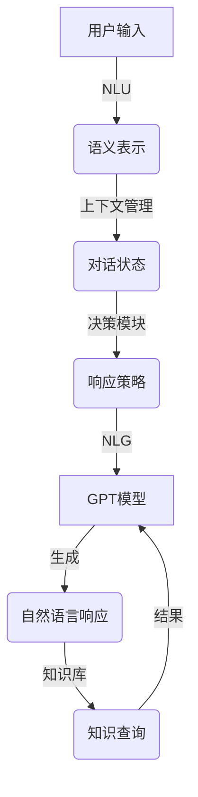

# 【大模型应用开发 动手做AI Agent】创建OpenAI助手

## 1. 背景介绍

随着人工智能技术的快速发展,大型语言模型(Large Language Models, LLMs)已经成为当前最热门的AI技术之一。OpenAI的GPT(Generative Pre-trained Transformer)系列模型,以及其他公司的类似模型,展现出了惊人的自然语言理解和生成能力,在各种自然语言处理任务中取得了卓越的表现。

在这些大模型的基础上,我们可以开发出各种应用,如对话助手、问答系统、文本摘要、内容创作等。其中,创建一个智能对话助手是大模型应用开发的一个非常典型和重要的场景。本文将重点介绍如何基于OpenAI的GPT模型,开发一个智能对话助手(AI Agent),并分享相关的开发技巧和实践经验。

### 1.1 什么是大模型

大模型(Large Language Model)是指使用大量文本数据(通常是数十亿甚至上百亿个词)预训练的巨大神经网络模型。这些模型能够捕捉到人类语言中丰富的语义和上下文信息,从而在自然语言理解和生成任务中表现出色。

大模型的核心思想是"预训练-微调"(Pre-training and Fine-tuning)范式。在预训练阶段,模型会在海量无标注数据上进行自监督学习,捕捉语言的一般模式。在微调阶段,预训练模型会在特定任务的标注数据上进行进一步的监督学习,从而获得针对该任务的特殊能力。

### 1.2 GPT模型家族

OpenAI公司开发的GPT(Generative Pre-trained Transformer)模型系列,是当前最知名和最成功的大模型之一。主要包括:

- **GPT**: 2018年推出的第一代GPT模型,使用了Transformer解码器结构,在书面语言建模任务上表现优异。
- **GPT-2**: 2019年推出,比GPT大了10倍,在各种语言生成任务上展现出惊人的能力。
- **GPT-3**: 2020年推出,参数量高达1750亿,是当时最大的语言模型。GPT-3展现出了强大的few-shot学习能力,只需少量示例即可完成新任务。
- **InstructGPT**: 基于GPT-3训练的指令遵从模型,能够更好地理解和执行人类的自然语言指令。
- **GPT-4**:2023年3月推出,是GPT系列的最新版本,在多个基准测试上超过了人类表现。

这些大模型不断突破自身极限,为各种自然语言处理应用提供了强大的基础。下面我们将基于GPT模型开发一个智能对话助手。

## 2. 核心概念与联系

### 2.1 对话系统概述

对话系统(Dialogue System)是一种能够与人类进行自然语言交互的智能系统。它可以理解人类的自然语言输入,并根据上下文信息生成相应的自然语言响应。

一个典型的基于大模型的对话系统通常包括以下几个核心组件:

1. **自然语言理解(NLU)**: 将人类的自然语言输入转换为对话系统可以理解的语义表示。
2. **对话管理(DM)**: 根据当前对话状态和上下文信息,决策系统应该执行何种操作或生成何种响应。
3. **自然语言生成(NLG)**: 将对话系统的决策或语义表示转换为自然语言输出。
4. **知识库**: 存储对话系统所需的各种知识,如领域知识、对话历史、用户个人资料等。

此外,对话系统还需要一些辅助组件,如语音识别、语音合成等,以支持多模态交互。

### 2.2 大模型在对话系统中的应用

传统的对话系统通常由多个专门设计的模块组成,每个模块完成特定的任务。而基于大模型的对话系统则试图使用一个统一的大型语言模型来完成上述所有任务。

大模型凭借其强大的语言理解和生成能力,可以直接从人类的自然语言输入生成自然语言响应,而无需显式地执行语义解析、对话状态跟踪、响应生成等中间步骤。这种端到端的方式大大简化了对话系统的架构,降低了系统复杂性。

不过,直接使用大模型也存在一些问题,如缺乏持久的记忆能力、缺乏一致性和可控性等。因此,我们通常需要在大模型的基础上进行一些定制化开发,以满足特定应用场景的需求。

### 2.3 GPT模型在对话系统中的应用

OpenAI的GPT模型家族由于其出色的自然语言生成能力,非常适合应用于对话系统。我们可以将GPT模型视为一个"语言大脑",它可以根据之前的对话历史和上下文信息,生成人性化、上下文相关的自然语言响应。

不过,直接将GPT模型应用于对话系统也存在一些挑战:

1. **缺乏持久记忆**: GPT模型无法像人类一样记住长期的对话历史和背景知识。
2. **缺乏一致性**: GPT生成的响应可能会出现自相矛盾或不连贯的情况。
3. **缺乏可控性**: 很难控制GPT生成响应的属性,如语气、风格、话题等。
4. **缺乏常识推理**: GPT有时会生成一些违背常识的响应。

因此,在实际应用中,我们需要对GPT模型进行一些定制化开发,以提高其在对话系统中的性能和可用性。我们将在后面介绍一些常见的技术方案。

## 3. 核心算法原理具体操作步骤

### 3.1 GPT模型原理

GPT(Generative Pre-trained Transformer)模型是一种基于Transformer架构的自回归(Auto-Regressive)语言模型。它的核心思想是通过预训练学习大量无标注文本数据,捕捉语言的一般模式,然后在特定任务上进行微调,从而获得针对该任务的特殊能力。

GPT模型的训练过程分为两个阶段:预训练(Pre-training)和微调(Fine-tuning)。

#### 3.1.1 预训练阶段

在预训练阶段,GPT模型会在大量无标注文本数据上进行自监督学习,目标是最大化下一个词的条件概率:

$$P(x_t|x_1, x_2, ..., x_{t-1})$$

其中$x_t$表示第$t$个词,$x_1, x_2, ..., x_{t-1}$表示前面的词序列。

为了学习这个条件概率分布,GPT模型采用了自回归(Auto-Regressive)的方式,即每次只预测下一个词,然后将预测的词作为输入,继续预测后面的词。这种方式可以很好地捕捉语言的顺序性和上下文信息。

在预训练过程中,GPT模型会通过反向传播算法不断调整参数,使得模型在训练数据上的条件概率最大化。经过大规模的预训练,GPT模型可以捕捉到人类语言中丰富的语义和上下文信息。

#### 3.1.2 微调阶段

预训练只是GPT模型训练的第一阶段。为了让模型具备特定任务的能力,我们需要在预训练模型的基础上,进行进一步的监督微调(Fine-tuning)。

在微调阶段,我们会使用特定任务的标注数据集,对预训练模型进行额外的训练。通过这种方式,模型可以学习到该任务的特殊模式和知识,从而提高在该任务上的表现。

以对话系统为例,我们可以使用大量的问答对话数据对GPT模型进行微调,使其学习如何根据对话历史生成恰当的响应。微调过程中,我们会最小化模型在训练数据上的交叉熵损失,迫使模型生成与标注响应尽可能相近的输出。

通过预训练-微调范式,GPT模型可以在保留其通用语言理解能力的同时,获得特定任务所需的专门能力。这种"学会再学习"的方式大大提高了模型的泛化性能和数据效率。

### 3.2 基于GPT的对话系统架构

虽然GPT模型本身就具有生成对话响应的能力,但直接将其应用于对话系统仍然存在一些挑战,如缺乏持久记忆、缺乏一致性和可控性等。因此,我们需要在GPT模型的基础上,进行一些定制化开发和优化。

一种常见的基于GPT的对话系统架构如下所示:



该架构包括以下几个关键组件:

1. **自然语言理解(NLU)**: 将用户的自然语言输入转换为对话系统可以理解的语义表示,如意图(Intent)、实体(Entity)等。这一步可以使用基于规则或机器学习的方法实现。

2. **上下文管理**: 维护当前对话的状态和上下文信息,如对话历史、用户个人资料、任务进度等。这些信息对于生成恰当的响应至关重要。

3. **决策模块**: 根据当前对话状态和上下文信息,决定系统应该执行何种操作或生成何种响应。这可以通过规则引擎或策略学习等方法实现。

4. **自然语言生成(NLG)**: 将决策模块的输出转换为自然语言响应。这一步使用了GPT模型,它可以根据上下文信息生成人性化的自然语言响应。

5. **知识库**: 存储对话系统所需的各种知识,如领域知识库、对话历史、用户个人资料等。GPT模型可以根据需要查询知识库,以生成更准确、更富内容的响应。

通过这种架构,我们可以很好地利用GPT模型的语言生成能力,同时解决其在对话系统中的一些缺陷,如缺乏持久记忆、缺乏一致性等。下面我们将介绍一些常见的优化技术。

### 3.3 持久记忆和上下文管理

由于GPT模型是一种基于Transformer的自回归语言模型,它无法像人类一样记住长期的对话历史和背景知识。为了解决这个问题,我们需要在对话系统中引入持久记忆和上下文管理机制。

#### 3.3.1 记忆增强

一种常见的方法是将对话历史和相关背景知识作为额外的输入,连同用户的新输入一起送入GPT模型。这种方式被称为"记忆增强"(Memory Augmentation)。

具体来说,我们可以将对话历史和背景知识编码为一个特殊的前缀(Prompt),与用户的新输入拼接在一起,作为GPT模型的输入。例如:

```
<History>
用户: 你好,我想预订一张从北京到上海的机票。
助手: 好的,请问您需要什么时候的机票?单程还是往返?
用户: 我需要单程机票,下周一从北京飞往上海。
</History>

<Background>
- 北京和上海是中国的两个主要城市,距离约1000公里
- 北京是中国的首都,上海是国际大都市
- 北京和上海之间有多个航空公司提供航班
</Background>

<Input>请帮我查询一下下周一从北京飞往上海的机票价格和航班时间。</Input>
```

通过这种方式,GPT模型可以充分利用对话历史和背景知识,生成更加准确和上下文相关的响应。

不过,这种方法也存在一些限制,如输入长度受到模型限制、背景知识的选择和表示方式等。因此,我们还需要一些其他的优化策略。

#### 3.3.2 外部记忆库

另一种方法是将对话历史和背景知识存储在外部的记忆库(Memory Bank)中,GPT模型可以根据需要查询这个记忆库。

这种架构通常包括以下几个组件:

1. **记忆库**: 用于存储对话历史、背景知识等信息的外部数据库或知识库。
2. **记