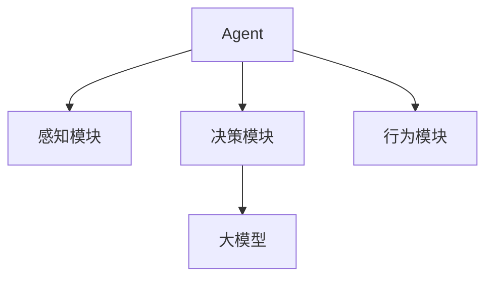

# 【大模型应用开发 动手做AI Agent】大模型就是Agent的大脑

## 1. 背景介绍

### 1.1 人工智能的崛起

人工智能(AI)技术在过去几年里取得了长足的进步,尤其是在自然语言处理(NLP)和计算机视觉(CV)等领域。大型神经网络模型,通常被称为"大模型",已经成为推动这一进步的核心动力。这些模型通过在海量数据上进行训练,学习到了丰富的知识表示,展现出了惊人的泛化能力。

### 1.2 大模型的能力

大模型不仅能够执行传统的机器学习任务,如分类、回归等,还能够生成逼真的文本、图像和音频。它们可以回答复杂的问题、进行多轮对话、总结长文本等。这些能力使得大模型成为构建通用人工智能(AGI)系统的有力候选者。

### 1.3 Agent:人工智能系统的新范式

Agent是一种新兴的人工智能系统范式,旨在创建能够感知环境、作出决策并采取行动的智能体。Agent与传统的机器学习系统不同,它们不仅能够学习,还能够与环境进行交互,完成复杂的任务。

大模型作为Agent的"大脑",为其提供了强大的认知和推理能力。通过将大模型与其他模块(如计算机视觉、规划、控制等)相结合,我们可以构建出功能全面的智能Agent。

## 2. 核心概念与联系

### 2.1 大模型

大模型是一种具有数十亿甚至上万亿参数的大型神经网络模型。它们通常采用Transformer等注意力机制架构,在海量数据上进行预训练,获得通用的表示能力。常见的大模型包括GPT、BERT、DALL-E等。

### 2.2 Agent

Agent是一种能够感知环境、作出决策并采取行动的智能体。它由多个模块组成,包括感知模块(如视觉、语音)、决策模块(大模型)、行为模块(如机器人控制)等。Agent需要具备学习、推理、规划和交互等多种能力。

### 2.3 大模型与Agent的关系

大模型作为Agent的决策模块,为其提供了强大的认知和推理能力。它能够理解Agent从环境中获取的信息,并根据这些信息作出合理的决策,指导Agent采取相应的行动。

大模型与Agent其他模块的紧密集成,使得Agent能够完成复杂的任务,如对话交互、问题解答、规划和控制等。因此,大模型是构建通用人工智能系统的关键组成部分。

## 3. 核心算法原理具体操作步骤

### 3.1 Transformer架构

大多数大模型都采用了Transformer的架构,该架构引入了自注意力(Self-Attention)机制,能够有效地捕捉输入序列中元素之间的长程依赖关系。

Transformer的核心思想是将序列建模问题转化为序列到序列(Sequence-to-Sequence)的映射问题。它包括两个主要部分:编码器(Encoder)和解码器(Decoder)。

#### 3.1.1 编码器(Encoder)

编码器的作用是将输入序列映射到一个连续的表示空间中,捕捉输入序列中元素之间的依赖关系。

1. 首先,输入序列被映射为一系列的嵌入向量。
2. 然后,这些嵌入向量被输入到一系列的编码器层中。每一层都包含一个多头自注意力子层和一个前馈神经网络子层。
3. 在自注意力子层中,每个位置的表示都会关注整个输入序列的所有位置,捕捉元素之间的长程依赖关系。
4. 前馈神经网络子层对每个位置的表示进行further非线性映射,提供更强的表示能力。
5. 经过多层编码器的处理,输出的是一系列编码后的向量表示,捕捉了输入序列中元素之间的依赖关系。

#### 3.1.2 解码器(Decoder)

解码器的作用是根据编码器的输出,生成目标序列。它的架构与编码器类似,也包含多头自注意力子层和前馈神经网络子层。

1. 解码器会首先对目标序列进行位置编码,生成对应的嵌入向量表示。
2. 在每一层中,首先进行掩码多头自注意力,只允许每个位置关注之前的位置,以保持自回归属性。
3. 然后进行编码器-解码器注意力,让目标序列的表示关注编码器输出的表示,融合输入序列的信息。
4. 最后经过前馈神经网络子层,输出解码后的向量表示。
5. 解码器的输出通过线性层和softmax层,生成下一个token的概率分布。
6. 解码器逐位置生成token,直至生成完整的目标序列。

### 3.2 预训练策略

大模型通常采用自监督的预训练策略,在大量无标注数据上进行预训练,获得通用的表示能力。常见的预训练策略包括:

#### 3.2.1 蒙版语言模型(Masked Language Modeling)

在输入序列中随机掩蔽部分token,要求模型基于上下文预测被掩蔽的token。这种策略能够让模型学习到双向的语义表示。

#### 3.2.2 下一句预测(Next Sentence Prediction)

给定两个句子,要求模型预测它们是否为连续的句子。这种策略能够让模型捕捉句子之间的关系和语境信息。

#### 3.2.3 序列到序列预训练(Sequence-to-Sequence Pretraining)

在输入序列和目标序列之间引入一些噪声(如删除、插入、置换等),要求模型将噪声输入序列重构为原始的目标序列。这种策略能够增强模型的生成能力。

#### 3.2.4 对比学习(Contrastive Learning)

通过最大化正例对之间的相似性,最小化正例与负例之间的相似性,学习到更加区分的表示。这种策略能够提高模型的泛化能力。

### 3.3 微调(Fine-tuning)

虽然大模型在预训练阶段已经学习到了通用的表示能力,但为了在特定任务上取得更好的性能,我们还需要进行微调。微调的过程如下:

1. 将预训练好的大模型作为初始化权重。
2. 在特定任务的标注数据上继续训练模型,允许所有参数进行微调。
3. 对于生成类任务,可以使用teacher forcing或者自回归的方式进行训练。
4. 对于理解类任务,可以使用监督的分类或回归目标进行训练。
5. 微调过程中,可以使用较小的学习率和更多的正则化,以防止过拟合。

通过微调,大模型可以将通用的知识与特定任务的知识相结合,取得更好的性能表现。

## 4. 数学模型和公式详细讲解举例说明

### 4.1 自注意力机制(Self-Attention)

自注意力机制是Transformer架构的核心,它能够有效地捕捉输入序列中元素之间的长程依赖关系。给定一个输入序列 $X = (x_1, x_2, \dots, x_n)$,其中 $x_i \in \mathbb{R}^{d_x}$ 表示第 $i$ 个元素的 $d_x$ 维嵌入向量,自注意力的计算过程如下:

1. 计算查询(Query)、键(Key)和值(Value)向量:

$$
\begin{aligned}
Q &= XW^Q \\
K &= XW^K \\
V &= XW^V
\end{aligned}
$$

其中 $W^Q \in \mathbb{R}^{d_x \times d_q}$、$W^K \in \mathbb{R}^{d_x \times d_k}$、$W^V \in \mathbb{R}^{d_x \times d_v}$ 分别是查询、键和值的线性投影矩阵。

2. 计算注意力分数:

$$
\text{Attention}(Q, K, V) = \text{softmax}\left(\frac{QK^\top}{\sqrt{d_k}}\right)V
$$

其中 $\frac{QK^\top}{\sqrt{d_k}}$ 表示查询与所有键的缩放点积,除以 $\sqrt{d_k}$ 是为了防止点积值过大导致softmax函数梯度较小。softmax函数将注意力分数归一化为概率分布。

3. 多头注意力机制(Multi-Head Attention)通过并行计算多个注意力头,能够从不同的子空间捕捉不同的依赖关系:

$$
\text{MultiHead}(Q, K, V) = \text{Concat}(head_1, \dots, head_h)W^O
$$

其中 $head_i = \text{Attention}(QW_i^Q, KW_i^K, VW_i^V)$,并且 $W_i^Q \in \mathbb{R}^{d_q \times d_q}$、$W_i^K \in \mathbb{R}^{d_k \times d_k}$、$W_i^V \in \mathbb{R}^{d_v \times d_v}$ 和 $W^O \in \mathbb{R}^{hd_v \times d_x}$ 是可学习的线性投影参数。

自注意力机制能够让每个位置的表示关注整个输入序列的所有位置,从而捕捉长程依赖关系,这是Transformer架构的核心创新。

### 4.2 交叉熵损失函数(Cross-Entropy Loss)

对于生成类任务,大模型通常采用最大化序列的条件概率(或最小化交叉熵损失)作为训练目标。给定一个目标序列 $Y = (y_1, y_2, \dots, y_m)$,其中 $y_i \in \mathcal{V}$ 是词汇表 $\mathcal{V}$ 中的一个token,交叉熵损失函数定义如下:

$$
\mathcal{L}(Y|X) = -\sum_{i=1}^m \log P(y_i|y_{<i}, X; \theta)
$$

其中 $P(y_i|y_{<i}, X; \theta)$ 表示给定输入序列 $X$ 和之前的token $y_{<i}$,生成当前token $y_i$ 的条件概率,由模型参数 $\theta$ 确定。目标是最小化该损失函数,使得模型能够生成与目标序列 $Y$ 越接近的输出。

在自回归的生成过程中,给定输入序列 $X$,模型逐步生成token:

$$
\begin{aligned}
P(Y|X; \theta) &= \prod_{i=1}^m P(y_i|y_{<i}, X; \theta) \\
&= P(y_1|X; \theta)P(y_2|y_1, X; \theta) \cdots P(y_m|y_{<m}, X; \theta)
\end{aligned}
$$

每生成一个token,就将其输入到模型中,预测下一个token的概率分布。通过最小化交叉熵损失函数,模型可以学习到生成目标序列的最优参数。

### 4.3 示例:机器翻译任务

以机器翻译任务为例,说明如何将大模型应用于序列到序列的生成问题。假设我们有一个英文句子 $X = (x_1, x_2, \dots, x_n)$,需要将其翻译为中文句子 $Y = (y_1, y_2, \dots, y_m)$。

1. 将英文句子 $X$ 输入到Transformer的编码器中,获得其编码表示 $Z = (z_1, z_2, \dots, z_n)$。
2. 将编码表示 $Z$ 和中文句子的起始token `<bos>` 输入到解码器中,解码器自回归地生成第一个中文token $y_1$的概率分布 $P(y_1|Z, \text{<bos>}; \theta)$。
3. 将 $y_1$ 作为输入,与 $Z$ 和 `<bos>` 一起输入到解码器中,生成第二个中文token $y_2$的概率分布 $P(y_2|Z, \text{<bos>}, y_1; \theta)$。
4. 重复上述步骤,直到生成终止token `<eos>`或达到最大长度,得到完整的中文译文 $Y$。
5. 在训练阶段,使用交叉熵损失函数 $\mathcal{L}(Y|X)$ 作为优化目标,对模