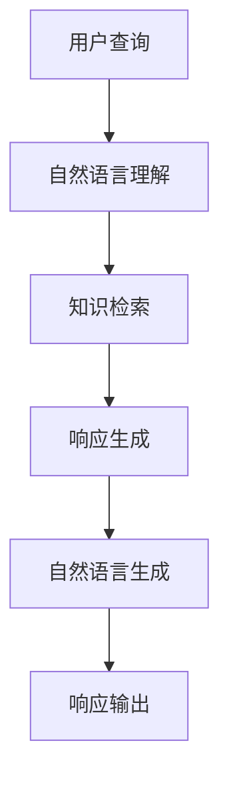
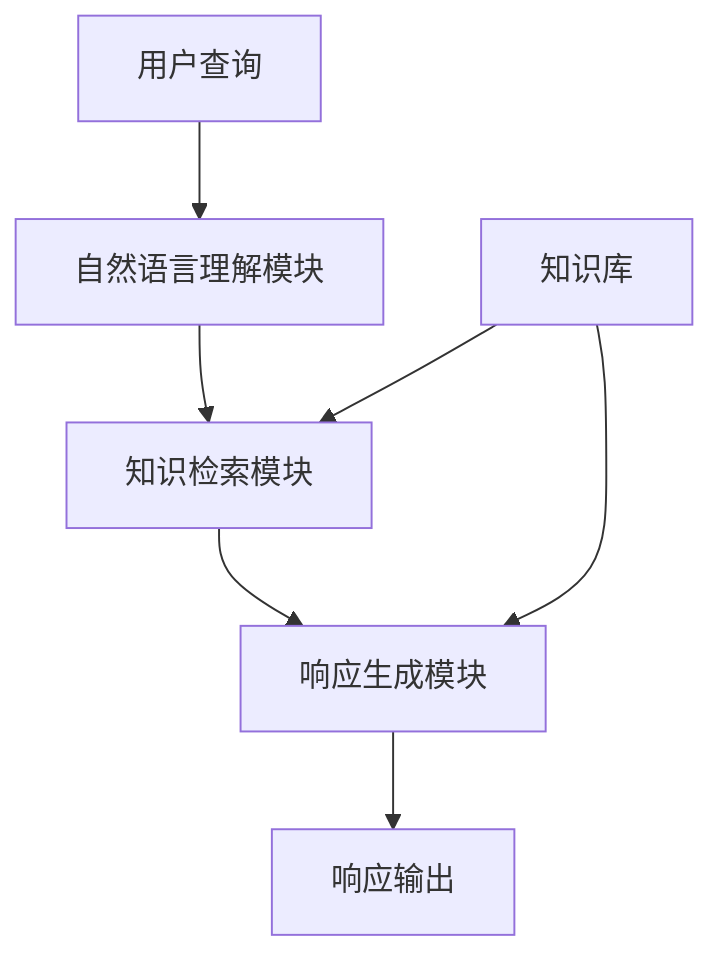

# 【大模型应用开发 动手做AI Agent】客户服务革命

## 1.背景介绍

### 1.1 客户服务的重要性

在当今竞争激烈的商业环境中,优质的客户服务是企业获得竞争优势和保持客户忠诚度的关键因素。良好的客户服务不仅能够提高客户满意度,还可以增强品牌形象,促进业务增长。然而,传统的客户服务模式面临着诸多挑战,例如人力资源有限、服务质量参差不齐、成本高昂等。

### 1.2 人工智能在客户服务中的应用

随着人工智能技术的不断发展,特别是大模型的兴起,为客户服务带来了全新的机遇。大模型指的是拥有数十亿甚至上万亿参数的庞大神经网络模型,能够通过自监督学习获取广博的知识。利用大模型,我们可以开发出智能客户服务代理(AI Agent),为用户提供7x24小时的智能化服务支持。

### 1.3 智能客户服务代理的优势

相比传统的客户服务方式,智能客户服务代理具有以下优势:

- 高效响应:能够快速回复客户查询,缩短响应时间
- 一致性服务:确保服务质量的一致性,消除人为差异
- 无休无止:7x24小时不间断服务,提高可用性
- 节省成本:减少人力投入,降低运营成本
- 持续学习:通过互动不断积累知识,服务质量逐步提高

## 2.核心概念与联系

### 2.1 大模型

大模型是指具有数十亿甚至上万亿参数的庞大神经网络模型。这些模型通过自监督学习在大规模语料库上进行预训练,获取广博的知识。常见的大模型包括GPT-3、PaLM、ChatGPT等。

### 2.2 自然语言处理(NLP)

自然语言处理是人工智能的一个分支,旨在使计算机能够理解、处理和生成人类语言。NLP技术是智能客户服务代理的核心,用于理解用户查询、检索相关知识并生成自然语言回复。

### 2.3 对话系统

对话系统是一种能够与人类进行自然语言交互的计算机系统。智能客户服务代理实际上是一种特殊的任务型对话系统,专注于解决客户服务相关的问题。

### 2.4 知识库

知识库是存储结构化知识的数据库,为智能客户服务代理提供所需的信息来源。知识库可以来自企业内部数据(如产品手册、FAQ等),也可以来自外部公开数据源。

### 2.5 核心流程

智能客户服务代理的核心流程如下所示:

1. 用户通过文本、语音等方式提出查询
2. 系统使用NLP技术对查询进行自然语言理解,提取关键信息
3. 在知识库中检索与查询相关的知识
4. 根据检索结果,生成查询的响应内容
5. 将响应内容转化为自然语言形式输出给用户

## 3.核心算法原理具体操作步骤  

### 3.1 自然语言理解

自然语言理解的目标是从用户的自然语言输入中提取出有意义的语义表示,为后续的知识检索和响应生成奠定基础。主要包括以下步骤:

1. **文本预处理**: 对原始文本进行标准化处理,如分词、去除停用词、词形还原等。
2. **命名实体识别(NER)**: 识别出文本中的命名实体,如人名、地名、组织机构名等。
3. **词性标注(POS Tagging)**: 为每个单词赋予相应的词性标记,如名词、动词、形容词等。
4. **依存句法分析**: 分析句子的句法结构,确定词与词之间的依存关系。
5. **语义角色标注(SRL)**: 识别出句子中的语义角色,如行为主体、受事物、时间、地点等。
6. **意图分类**: 根据上下文,确定用户查询的意图类别,如询问产品信息、投诉处理等。
7. **命名实体链接**: 将识别出的命名实体与知识库中的实体进行链接和disambiguate。

通过以上步骤,系统能够较为准确地理解用户查询的语义,为后续的知识检索和响应生成奠定基础。

### 3.2 知识检索

知识检索的目标是从知识库中检索出与用户查询相关的信息片段。主要包括以下步骤:

1. **查询重写**: 根据自然语言理解的结果,对原始查询进行改写,生成更加精准的查询语句。
2. **检索策略选择**: 根据查询的类型和知识库的结构,选择合适的检索策略,如关键词匹配、语义匹配、图数据库查询等。
3. **初步检索**: 在知识库中进行初步检索,获取与查询相关的信息片段。
4. **上下文扩展**: 根据检索到的信息片段,在知识库中扩展上下文,获取更多相关信息。
5. **结果排序**: 对检索结果进行排序,将最相关的信息置于顶部。
6. **结果过滤**: 根据一定的过滤策略,去除不相关或低质量的信息片段。

通过以上步骤,系统能够从海量的知识库中精准检索出与用户查询相关的信息,为响应生成提供所需的知识来源。

### 3.3 响应生成

响应生成的目标是根据检索到的知识,生成自然、连贯、信息丰富的回复。主要包括以下步骤:

1. **内容规划**: 根据查询意图和检索结果,规划响应的整体结构和内容安排。
2. **信息抽取**: 从检索结果中抽取出关键信息片段,作为响应内容的组成部分。
3. **语言生成**: 利用大模型的生成能力,将规划好的内容自然地转化为自然语言形式。
4. **一致性检查**: 检查生成的响应是否与查询意图和上下文信息保持一致。
5. **语言优化**: 对生成的响应进行优化,使其更加通顺、流畅,同时注意避免冗余和矛盾之处。
6. **多模态融合**: 如果需要,可以将生成的文本响应与其他模态(如图像、视频等)进行融合,形成多模态响应。

通过以上步骤,系统能够生成高质量的自然语言响应,有效地回答用户的查询,提供优质的客户服务体验。

## 4.数学模型和公式详细讲解举例说明

在自然语言处理和大模型等领域,数学模型和公式扮演着重要的角色。以下是一些常见的数学模型和公式,以及它们在智能客户服务代理中的应用。

### 4.1 词嵌入(Word Embedding)

词嵌入是将词汇映射到连续的向量空间中的技术,使得语义相似的词在向量空间中也相近。常见的词嵌入模型包括Word2Vec、GloVe等。

在智能客户服务代理中,词嵌入可用于:

- 命名实体识别: 通过词嵌入捕捉词与实体类型之间的关系
- 语义匹配: 利用词嵌入计算查询与知识库条目之间的语义相似度

Word2Vec 的连续袋模型(CBOW)可表示为:

$$J_\text{CBOW} = \frac{1}{T}\sum_{t=1}^{T}\log P(w_t|w_{t-m},\dots,w_{t-1},w_{t+1},\dots,w_{t+m})$$

其中 $w_t$ 为目标词, $w_{t-m},\dots,w_{t-1},w_{t+1},\dots,w_{t+m}$ 为上下文词, $T$ 为语料库中的词数。模型的目标是最大化上下文词预测目标词的概率。

### 4.2 注意力机制(Attention Mechanism)

注意力机制是一种可以自动学习对输入数据的不同部分赋予不同权重的技术,常用于序列数据建模。

在智能客户服务代理中,注意力机制可用于:

- 语义角色标注: 通过注意力权重捕捉词与语义角色之间的关系
- 响应生成: 生成响应时,注意力机制可以自动关注输入序列的不同部分

加性注意力(Additive Attention)可表示为:

$$\alpha_{i,j} = \text{softmax}(e_{i,j}) \\
e_{i,j} = \mathbf{v}^\top \tanh(\mathbf{W}_1 \mathbf{h}_i + \mathbf{W}_2 \mathbf{s}_j)$$

其中 $\alpha_{i,j}$ 为注意力权重, $\mathbf{h}_i$ 和 $\mathbf{s}_j$ 分别为查询和键, $\mathbf{W}_1$、$\mathbf{W}_2$ 和 $\mathbf{v}$ 为可学习参数。

### 4.3 transformer 模型

Transformer 是一种全注意力的序列到序列模型,在机器翻译、对话系统等任务中表现出色。它不依赖序列顺序或者距离,能够有效捕捉长距离依赖关系。

在智能客户服务代理中,Transformer 模型可用于:

- 自然语言理解: 利用 Transformer 编码器捕捉输入序列的语义表示
- 响应生成: 利用 Transformer 解码器生成自然语言响应

Transformer 的缩放点积注意力(Scaled Dot-Product Attention)可表示为:

$$\text{Attention}(Q, K, V) = \text{softmax}(\frac{QK^\top}{\sqrt{d_k}})V$$

其中 $Q$、$K$、$V$ 分别为查询(Query)、键(Key)和值(Value)矩阵, $d_k$ 为缩放因子。

### 4.4 预训练语言模型

预训练语言模型(Pre-trained Language Model, PLM)是在大规模语料库上预先训练得到的模型,能够捕捉丰富的语言知识。常见的 PLM 包括 BERT、GPT、T5 等。

在智能客户服务代理中,PLM 可用于:

- 自然语言理解: 利用 PLM 的编码器获取查询的语义表示
- 响应生成: 利用 PLM 的解码器生成自然语言响应

以 BERT 为例,它的预训练目标包括:

1. 掩码语言模型(Masked Language Model, MLM):

$$\mathcal{L}_\text{MLM} = -\log P(x_\text{masked}|x_\text{unmasked})$$

2. 下一句预测(Next Sentence Prediction, NSP):

$$\mathcal{L}_\text{NSP} = -\log P(y|x_1, x_2)$$

通过这两个预训练任务,BERT 能够学习到丰富的语义和上下文知识。

以上是一些常见的数学模型和公式,在智能客户服务代理的各个环节都发挥着重要作用。随着技术的不断进步,相信未来还会有更多创新的模型和算法被应用到这一领域。

## 5.项目实践:代码实例和详细解释说明

为了更好地理解智能客户服务代理的开发过程,我们将通过一个实际项目案例来进行说明。这个项目旨在为某电子产品制造商开发一个智能客户服务代理,能够自动回答客户关于产品使用、故障排查等方面的查询。

### 5.1 项目架构

该项目主要包括以下几个模块:

1. **自然语言理解模块**: 负责对用户查询进行自然语言理解,提取关键信息。
2. **知识检索模块**: 根据自然语言理解的结果,在知识库中检索相关信息。
3. **响应生成模块**: 利用检索到的知识,生成自然语言响应。
4. **知识库**: 存储公司产品手册、FAQ 等相关知识。

### 5.2 自然语言理解模块

我们使用 