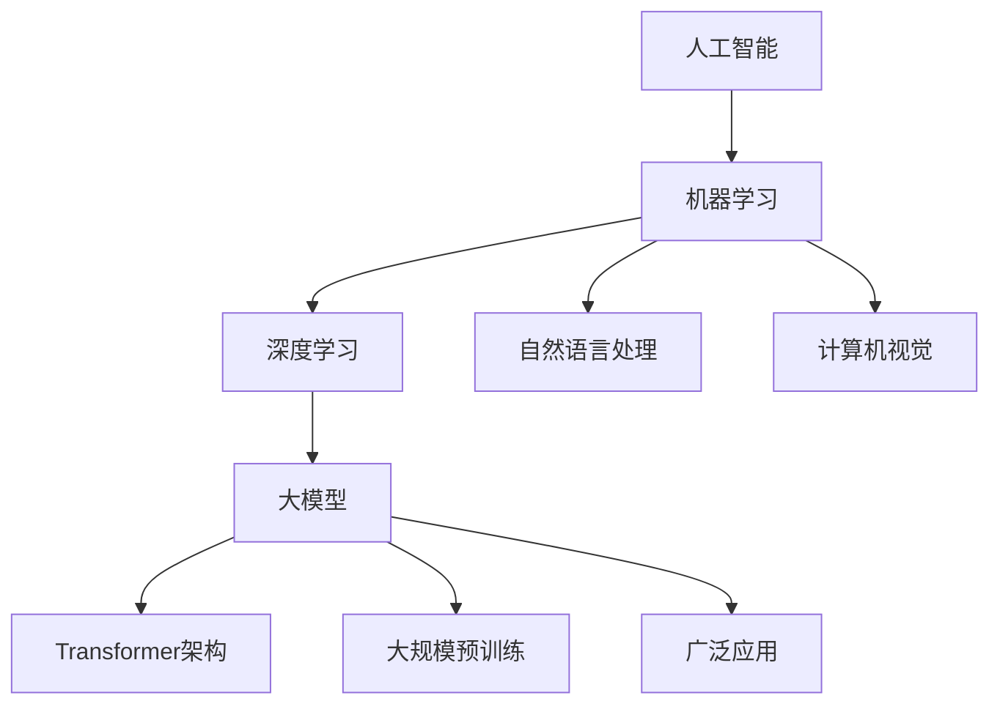
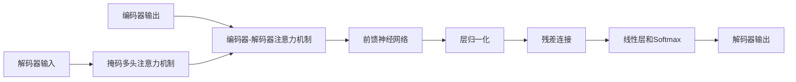

# 【大模型应用开发 动手做AI Agent】思维树

## 1.背景介绍

### 1.1 人工智能的发展历程

人工智能(Artificial Intelligence, AI)是一个跨学科的研究领域,旨在开发能够模仿人类智能行为的理论、方法、技术及应用系统。自20世纪50年代问世以来,人工智能经历了起起落落,在近年来迎来了全新的发展机遇。

### 1.2 大模型的兴起

随着算力的不断提升和海量数据的积累,大规模的人工神经网络模型(Large Neural Networks)展现出了强大的表现力。自2018年以来,大模型在自然语言处理、计算机视觉等领域取得了突破性进展,推动了人工智能的快速发展。

### 1.3 大模型应用的机遇与挑战

大模型凝聚了人工智能领域的最新理论和技术成果,在提升人机交互、智能决策等方面具有广阔的应用前景。但同时,大模型也面临着算力需求巨大、数据质量要求高、可解释性和可控性差等挑战,需要通过持续创新来加以解决。

## 2.核心概念与联系

### 2.1 人工智能核心概念

人工智能的核心概念包括:

- 机器学习(Machine Learning): 使计算机具备学习和改进自身性能的能力。
- 深度学习(Deep Learning): 基于多层神经网络的机器学习方法。
- 自然语言处理(Natural Language Processing, NLP): 使计算机能够理解和生成人类语言。
- 计算机视觉(Computer Vision): 使计算机能够获取、处理和理解数字图像或视频。

### 2.2 大模型的核心特征

大模型具有以下核心特征:

- 巨大的参数量: 大模型往往拥有数十亿甚至上千亿个参数。
- 海量训练数据: 大模型需要利用互联网上海量的文本、图像等数据进行训练。
- 自监督学习: 大模型通常采用自监督学习方式,无需人工标注的数据。
- 通用能力: 大模型展现出跨领域的通用能力,可用于多种任务。

### 2.3 大模型与传统模型的关系

大模型并非完全取代传统的机器学习模型,而是在其基础上通过扩大模型规模和改进训练方法,实现性能的飞跃。大模型与传统模型相辅相成,共同推进人工智能的发展。



## 3.核心算法原理具体操作步骤

### 3.1 Transformer架构

Transformer是大模型中广泛采用的一种序列到序列(Sequence-to-Sequence)的神经网络架构,主要由编码器(Encoder)和解码器(Decoder)两个部分组成。

#### 3.1.1 Transformer编码器

Transformer编码器的主要操作步骤如下:

1. 输入嵌入(Input Embedding): 将输入序列转换为嵌入向量表示。
2. 位置编码(Positional Encoding): 为每个位置添加位置信息。
3. 多头注意力机制(Multi-Head Attention): 计算序列中每个位置与其他位置的注意力权重。
4. 前馈神经网络(Feed-Forward Network): 对注意力输出进行非线性变换。
5. 层归一化(Layer Normalization)和残差连接(Residual Connection): 保持梯度稳定。


#### 3.1.2 Transformer解码器

Transformer解码器在编码器的基础上增加了掩码多头注意力机制(Masked Multi-Head Attention),用于预测下一个token。具体操作步骤如下:

1. 掩码多头注意力机制: 计算当前位置与之前位置的注意力权重。
2. 编码器-解码器注意力机制: 计算当前位置与编码器输出的注意力权重。
3. 前馈神经网络、层归一化和残差连接: 与编码器类似。
4. 线性层和softmax: 输出下一个token的概率分布。



### 3.2 大模型预训练

大模型通常采用自监督学习的方式进行预训练,利用海量的未标注数据学习通用的表示能力。常见的预训练任务包括:

- 蒙版语言模型(Masked Language Modeling, MLM): 随机掩蔽部分token,预测被掩蔽的token。
- 下一句预测(Next Sentence Prediction, NSP): 判断两个句子是否相邻。
- 自回归语言模型(Autoregressive Language Modeling): 基于前面的token预测下一个token。

预训练完成后,可以在下游任务上通过微调(Fine-tuning)的方式进行迁移学习,获得良好的泛化性能。

## 4.数学模型和公式详细讲解举例说明

### 4.1 注意力机制(Attention Mechanism)

注意力机制是Transformer架构的核心,它允许模型在编码序列时关注不同位置的信息。给定查询向量$\boldsymbol{q}$、键向量$\boldsymbol{K}$和值向量$\boldsymbol{V}$,注意力机制的计算过程如下:

$$\begin{aligned}
\text{Attention}(\boldsymbol{q}, \boldsymbol{K}, \boldsymbol{V}) &= \text{softmax}\left(\frac{\boldsymbol{q}\boldsymbol{K}^\top}{\sqrt{d_k}}\right)\boldsymbol{V} \\
&= \sum_{i=1}^{n} \alpha_i \boldsymbol{v}_i
\end{aligned}$$

其中$d_k$是键向量的维度,用于缩放点积的值;$\alpha_i$是注意力权重,表示查询向量对第$i$个值向量的关注程度。

在多头注意力机制中,将查询、键和值分别线性投影到不同的子空间,然后并行计算注意力,最后将结果拼接:

$$\text{MultiHead}(\boldsymbol{q}, \boldsymbol{K}, \boldsymbol{V}) = \text{Concat}(\text{head}_1, \dots, \text{head}_h)\boldsymbol{W}^O$$
$$\text{head}_i = \text{Attention}(\boldsymbol{q}\boldsymbol{W}_i^Q, \boldsymbol{K}\boldsymbol{W}_i^K, \boldsymbol{V}\boldsymbol{W}_i^V)$$

其中$\boldsymbol{W}_i^Q$、$\boldsymbol{W}_i^K$、$\boldsymbol{W}_i^V$和$\boldsymbol{W}^O$是可学习的线性投影参数。

### 4.2 掩码语言模型(Masked Language Modeling)

掩码语言模型是BERT等大模型预训练的核心任务之一。给定一个序列$\boldsymbol{x} = (x_1, x_2, \dots, x_n)$,我们随机掩蔽部分token,得到掩码序列$\boldsymbol{\hat{x}}$。模型的目标是最大化掩码token的条件概率:

$$\mathcal{L}_{\text{MLM}} = -\mathbb{E}_{\boldsymbol{x}, \boldsymbol{\hat{x}}} \left[\sum_{i \in \text{Mask}} \log P(x_i | \boldsymbol{\hat{x}})\right]$$

其中$\text{Mask}$是被掩蔽token的位置集合。通过最小化该损失函数,模型可以学习到上下文的语义信息,从而更好地预测被掩蔽的token。

## 5.项目实践:代码实例和详细解释说明

以下是一个使用PyTorch实现Transformer编码器的简单示例:

```python
import torch
import torch.nn as nn

class TransformerEncoder(nn.Module):
    def __init__(self, input_dim, hid_dim, n_heads, n_layers, dropout):
        super().__init__()
        
        self.tok_embedding = nn.Embedding(input_dim, hid_dim)
        self.pos_embedding = nn.Embedding(1000, hid_dim)
        
        self.layers = nn.ModuleList([EncoderLayer(hid_dim, n_heads, hid_dim*4, dropout) 
                                     for _ in range(n_layers)])
        
        self.dropout = nn.Dropout(dropout)
        
    def forward(self, src, src_mask):
        
        #src = [batch_size, src_len]
        
        batch_size = src.shape[0]
        src_len = src.shape[1]
        
        #create position tensor
        pos = torch.arange(0, src_len).unsqueeze(0).repeat(batch_size, 1).to(src.device)
        
        #embed tokens and positions
        tok_embedded = self.tok_embedding(src)
        pos_embedded = self.pos_embedding(pos)
        
        #combine embeddings
        embedded = self.dropout(tok_embedded + pos_embedded)
        
        #compute attention
        for layer in self.layers:
            embedded = layer(embedded, src_mask)
            
        return embedded

class EncoderLayer(nn.Module):
    def __init__(self, hid_dim, n_heads, pf_dim, dropout):
        super().__init__()
        
        self.self_attn_layer = MultiHeadAttentionLayer(hid_dim, n_heads, dropout)
        self.positionwise_feedforward = PositionwiseFeedforwardLayer(hid_dim, pf_dim, dropout)
        self.dropout_1 = nn.Dropout(dropout)
        self.dropout_2 = nn.Dropout(dropout)
        
        self.layer_norm_1 = nn.LayerNorm(hid_dim)
        self.layer_norm_2 = nn.LayerNorm(hid_dim)
        
    def forward(self, src, src_mask):
        
        #self attention
        _src, _ = self.self_attn_layer(src, src, src, src_mask)
        
        #dropout, residual connection and layer norm
        src = self.layer_norm_1(src + self.dropout_1(_src))
        
        #positionwise feedforward
        _src = self.positionwise_feedforward(src)
        
        #dropout, residual and layer norm
        src = self.layer_norm_2(src + self.dropout_2(_src))
        
        return src
```

在上述代码中,我们首先定义了`TransformerEncoder`模块,它包含了token嵌入层、位置嵌入层和一系列编码器层。`EncoderLayer`模块实现了编码器层的具体计算过程,包括多头注意力机制、前馈神经网络、层归一化和残差连接。

`MultiHeadAttentionLayer`和`PositionwiseFeedforwardLayer`分别实现了多头注意力机制和前馈神经网络,这里不再赘述。在实际使用时,我们可以根据具体任务对模型进行微调,并在下游任务上进行评估和应用。

## 6.实际应用场景

大模型在自然语言处理、计算机视觉等多个领域展现出了卓越的性能,可应用于以下场景:

- 机器翻译: 利用大模型实现高质量的多语种文本翻译。
- 文本生成: 基于大模型生成富有创意的文学作品、新闻报道等内容。
- 问答系统: 让大模型具备回答复杂问题的能力,提供智能客服等服务。
- 内容理解: 使用大模型深入理解文本、图像等多模态内容的语义信息。
- 决策支持: 将大模型应用于金融投资、医疗诊断等领域,提供智能决策支持。

## 7.工具和资源推荐

### 7.1 开源框架

- PyTorch: 具有优秀的并行计算能力和动态计算图,适合大模型的训练和部署。
- TensorFlow: 功能全面的深度学