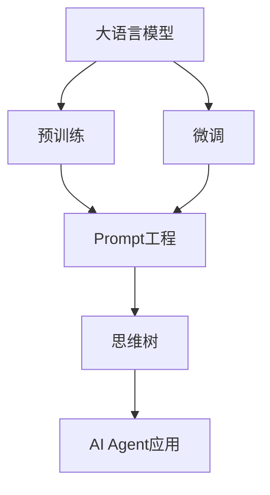

# 【大模型应用开发 动手做AI Agent】思维树

## 1. 背景介绍

### 1.1 人工智能的发展历程
#### 1.1.1 早期的人工智能研究
#### 1.1.2 机器学习的兴起 
#### 1.1.3 深度学习的突破

### 1.2 大语言模型的出现
#### 1.2.1 Transformer架构的提出
#### 1.2.2 GPT系列模型的发展
#### 1.2.3 BERT等预训练模型的应用

### 1.3 AI Agent的概念与应用前景
#### 1.3.1 AI Agent的定义
#### 1.3.2 AI Agent在各领域的应用潜力
#### 1.3.3 AI Agent开发面临的挑战

## 2. 核心概念与联系

### 2.1 大语言模型
#### 2.1.1 语言模型的基本原理
#### 2.1.2 大语言模型的特点与优势
#### 2.1.3 常见的大语言模型架构

### 2.2 预训练与微调
#### 2.2.1 预训练的概念与方法
#### 2.2.2 微调的概念与方法 
#### 2.2.3 预训练与微调的关系

### 2.3 Prompt工程
#### 2.3.1 Prompt的概念
#### 2.3.2 Prompt设计的原则与技巧
#### 2.3.3 Prompt工程在AI Agent开发中的应用

### 2.4 思维树 
#### 2.4.1 思维树的概念
#### 2.4.2 思维树在AI Agent设计中的作用
#### 2.4.3 构建AI Agent思维树的方法



## 3. 核心算法原理具体操作步骤

### 3.1 Transformer架构
#### 3.1.1 自注意力机制
#### 3.1.2 多头注意力
#### 3.1.3 前馈神经网络

### 3.2 预训练算法
#### 3.2.1 语言模型预训练
#### 3.2.2 掩码语言模型预训练
#### 3.2.3 对比学习预训练

### 3.3 微调算法
#### 3.3.1 分类任务微调
#### 3.3.2 序列标注任务微调
#### 3.3.3 生成任务微调

### 3.4 Prompt设计算法
#### 3.4.1 基于模板的Prompt设计
#### 3.4.2 基于示例的Prompt设计
#### 3.4.3 基于梯度的Prompt优化

## 4. 数学模型和公式详细讲解举例说明

### 4.1 Transformer的数学表示
#### 4.1.1 自注意力机制的数学公式
$Attention(Q,K,V) = softmax(\frac{QK^T}{\sqrt{d_k}})V$
#### 4.1.2 多头注意力的数学公式
$MultiHead(Q,K,V) = Concat(head_1, ..., head_h)W^O$
其中，$head_i = Attention(QW_i^Q, KW_i^K, VW_i^V)$
#### 4.1.3 前馈神经网络的数学公式
$FFN(x) = max(0, xW_1 + b_1)W_2 + b_2$

### 4.2 语言模型的数学表示
#### 4.2.1 语言模型的概率公式
$P(w_1, w_2, ..., w_n) = \prod_{i=1}^n P(w_i | w_1, w_2, ..., w_{i-1})$
#### 4.2.2 交叉熵损失函数
$L = -\frac{1}{N}\sum_{i=1}^N \log P(w_i | w_1, w_2, ..., w_{i-1})$

### 4.3 微调的数学表示
#### 4.3.1 分类任务的交叉熵损失函数
$L = -\frac{1}{N}\sum_{i=1}^N \sum_{j=1}^C y_{ij} \log \hat{y}_{ij}$
#### 4.3.2 序列标注任务的条件随机场损失函数
$L = -\frac{1}{N}\sum_{i=1}^N \log P(y_i | x_i)$

### 4.4 Prompt优化的数学表示
#### 4.4.1 基于梯度的Prompt优化目标函数
$\min_{\theta} L(f_{\theta}(x), y)$
其中，$\theta$表示Prompt的参数，$f_{\theta}$表示基于Prompt的模型输出，$L$表示损失函数。

## 5. 项目实践：代码实例和详细解释说明

### 5.1 使用Hugging Face Transformers库进行预训练和微调
#### 5.1.1 加载预训练模型
```python
from transformers import AutoModelForCausalLM, AutoTokenizer

model_name = "gpt2"
model = AutoModelForCausalLM.from_pretrained(model_name)
tokenizer = AutoTokenizer.from_pretrained(model_name)
```
#### 5.1.2 微调模型
```python
from transformers import Trainer, TrainingArguments

training_args = TrainingArguments(
    output_dir="./results",
    num_train_epochs=3,
    per_device_train_batch_size=4,
    per_device_eval_batch_size=4,
    warmup_steps=500,
    weight_decay=0.01,
    logging_dir="./logs",
)

trainer = Trainer(
    model=model,
    args=training_args,
    train_dataset=train_dataset,
    eval_dataset=val_dataset,
)

trainer.train()
```

### 5.2 使用OpenAI API进行Prompt设计和应用
#### 5.2.1 设置OpenAI API密钥
```python
import openai

openai.api_key = "YOUR_API_KEY"
```
#### 5.2.2 设计Prompt并生成结果
```python
prompt = "请用一句话总结以下文本的主要内容：\n" + text

response = openai.Completion.create(
    engine="text-davinci-002",
    prompt=prompt,
    max_tokens=50,
    n=1,
    stop=None,
    temperature=0.7,
)

summary = response.choices[0].text.strip()
print(summary)
```

### 5.3 构建AI Agent的思维树
#### 5.3.1 定义思维树节点
```python
class ThoughtNode:
    def __init__(self, thought, child_nodes=None):
        self.thought = thought
        self.child_nodes = child_nodes if child_nodes else []
    
    def add_child(self, child_node):
        self.child_nodes.append(child_node)
```
#### 5.3.2 构建AI Agent的思维树
```python
root = ThoughtNode("AI Agent的主要目标")

goal1 = ThoughtNode("完成用户指定的任务")
goal2 = ThoughtNode("提供个性化的交互体验")

root.add_child(goal1)
root.add_child(goal2)

task1 = ThoughtNode("理解用户意图")
task2 = ThoughtNode("生成合适的回复")

goal1.add_child(task1)
goal1.add_child(task2)
```

## 6. 实际应用场景

### 6.1 智能客服
#### 6.1.1 客户意图识别
#### 6.1.2 个性化回复生成
#### 6.1.3 多轮对话管理

### 6.2 智能写作助手
#### 6.2.1 文章主题生成
#### 6.2.2 文章结构规划
#### 6.2.3 文章内容生成与优化

### 6.3 智能教育助手
#### 6.3.1 学习资料推荐
#### 6.3.2 知识点解释与举例
#### 6.3.3 作业批改与反馈

### 6.4 智能医疗助手
#### 6.4.1 医疗知识问答
#### 6.4.2 病情初步判断
#### 6.4.3 就医指导与建议

## 7. 工具和资源推荐

### 7.1 开源框架与库
#### 7.1.1 Hugging Face Transformers
#### 7.1.2 OpenAI API
#### 7.1.3 TensorFlow与PyTorch

### 7.2 预训练模型资源
#### 7.2.1 GPT系列模型
#### 7.2.2 BERT系列模型
#### 7.2.3 T5系列模型

### 7.3 数据集资源
#### 7.3.1 自然语言处理数据集
#### 7.3.2 对话系统数据集
#### 7.3.3 知识图谱数据集

### 7.4 学习资源
#### 7.4.1 在线课程
#### 7.4.2 教程与博客
#### 7.4.3 学术论文与会议

## 8. 总结：未来发展趋势与挑战

### 8.1 AI Agent的发展趋势
#### 8.1.1 多模态交互
#### 8.1.2 个性化与情感化
#### 8.1.3 知识增强与推理

### 8.2 AI Agent面临的挑战
#### 8.2.1 数据隐私与安全
#### 8.2.2 伦理与道德考量
#### 8.2.3 可解释性与可控性

### 8.3 AI Agent的未来展望
#### 8.3.1 与人类智能的协同
#### 8.3.2 行业应用的深入拓展
#### 8.3.3 技术创新与突破

## 9. 附录：常见问题与解答

### 9.1 如何选择合适的预训练模型？
### 9.2 如何设计有效的Prompt？
### 9.3 如何评估AI Agent的性能？
### 9.4 如何处理AI Agent生成的不恰当内容？
### 9.5 如何平衡AI Agent的创新性与安全性？

作者：禅与计算机程序设计艺术 / Zen and the Art of Computer Programming