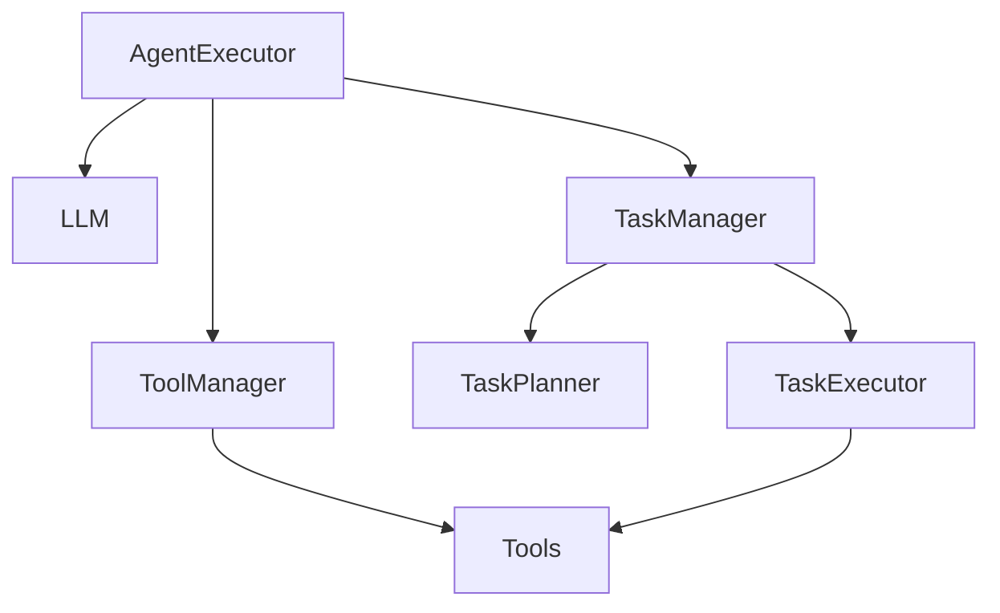
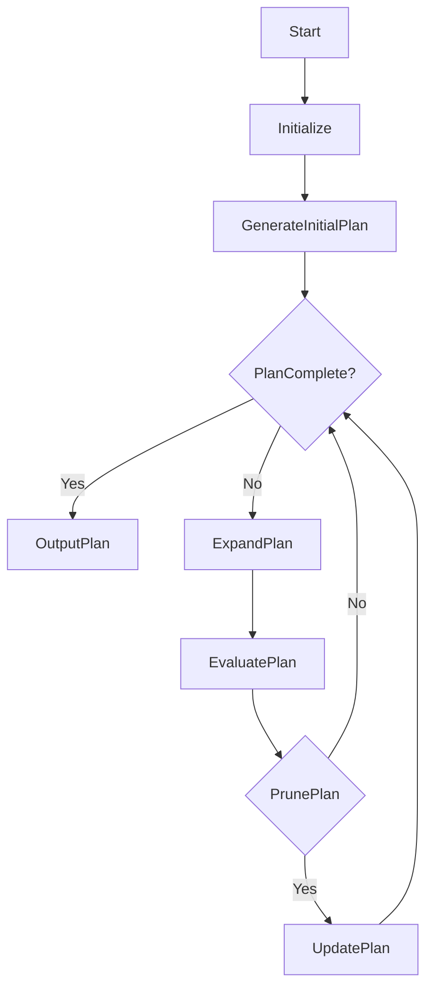

# 【大模型应用开发 动手做AI Agent】深挖AgentExecutor的运行机制

## 1.背景介绍

### 1.1 人工智能时代的到来

随着人工智能技术的不断发展和创新,大型语言模型(Large Language Models,LLMs)的崛起正在推动着人工智能的新浪潮。这些模型通过消化海量的文本数据,展现出惊人的自然语言理解和生成能力,为各种复杂的人工智能应用奠定了基础。

### 1.2 AgentExecutor:助力构建人工智能Agent

在这一背景下,AgentExecutor应运而生。它是一个强大的框架,旨在利用大型语言模型的能力,构建智能代理(Agent),赋予它们自主思考、规划和执行任务的能力。AgentExecutor为开发人工智能Agent提供了一个统一的平台和工具集,使得开发者能够更高效地开发和部署各种智能Agent应用。

## 2.核心概念与联系

### 2.1 什么是Agent?

在人工智能领域,Agent被定义为一个能够感知环境、作出决策并采取行动以完成特定目标的自主实体。Agent需要具备一定的智能,能够根据环境变化做出合理的决策和行为响应。

### 2.2 AgentExecutor架构概览

AgentExecutor的核心架构由以下几个主要组件构成:



1. **LLM(大型语言模型)**: AgentExecutor利用大型语言模型作为Agent的"大脑",用于自然语言理解、任务规划和决策等智能功能。
2. **TaskManager**: 负责管理和分解任务,协调TaskPlanner和TaskExecutor的工作。
3. **ToolManager**: 管理和提供各种工具(Tools),供Agent在执行任务时调用。
4. **TaskPlanner**: 根据任务需求和可用工具,规划出完成任务所需的步骤序列。
5. **TaskExecutor**: 执行TaskPlanner生成的任务步骤,调用相应的工具完成具体的子任务。
6. **Tools**: 一系列可供Agent调用的工具,用于执行特定的任务,如网络搜索、数据处理、文件操作等。

### 2.3 Agent的生命周期

AgentExecutor中,Agent的生命周期包括以下几个主要阶段:

1. **任务接收**: Agent接收到需要完成的任务描述。
2. **任务理解**: Agent利用LLM对任务进行自然语言理解,获取任务的目标、约束条件等关键信息。
3. **任务规划**: TaskPlanner根据任务需求和可用工具,生成一系列步骤来完成任务。
4. **任务执行**: TaskExecutor按照规划的步骤,调用相应的工具执行子任务。
5. **结果输出**: Agent根据执行结果,输出最终的任务完成结果。

## 3.核心算法原理具体操作步骤

### 3.1 任务理解算法

任务理解是Agent能够正确完成任务的关键前提。AgentExecutor采用基于LLM的自然语言理解算法,从任务描述中提取出任务目标、约束条件、上下文信息等关键要素。算法流程如下:

1. 将任务描述输入LLM,生成语义嵌入向量。
2. 利用预训练的语义模板,对语义嵌入向量进行模式匹配,识别出任务目标、约束条件等关键信息。
3. 结合上下文信息,构建出任务的语义表示。

### 3.2 任务规划算法

TaskPlanner的核心是一种基于启发式搜索的任务规划算法,旨在找到一个最优的工具调用序列来完成任务。算法流程如下:



1. **Initialize**: 初始化搜索空间和启发式函数。
2. **GenerateInitialPlan**: 基于任务描述和可用工具,生成一个初始的任务计划。
3. **PlanComplete?**: 检查当前计划是否已经满足任务需求。
4. **OutputPlan**: 如果计划完整,则输出该计划。
5. **ExpandPlan**: 基于当前计划,生成新的候选计划。
6. **EvaluatePlan**: 评估候选计划的质量,根据启发式函数打分。
7. **PrunePlan**: 根据评分,筛选出高质量的候选计划。
8. **UpdatePlan**: 将筛选出的高质量计划纳入搜索空间,继续迭代搜索。

在搜索过程中,算法会利用LLM对中间状态进行评估,并将评估结果作为启发式函数的一部分,以指导搜索方向。

### 3.3 任务执行算法

TaskExecutor负责按照TaskPlanner生成的计划,调用相应的工具执行子任务。其核心算法如下:

1. 解析计划中的每个步骤,识别出需要调用的工具及其参数。
2. 从ToolManager中获取对应的工具实例。
3. 调用工具的执行方法,传入必要的参数和上下文信息。
4. 获取工具执行的结果,更新任务的当前状态。
5. 重复执行步骤1-4,直到完成整个计划。

在执行过程中,TaskExecutor会持续与LLM交互,根据LLM的反馈动态调整执行策略,以确保任务的正确性和鲁棒性。

## 4.数学模型和公式详细讲解举例说明

在AgentExecutor的任务规划算法中,启发式函数扮演着至关重要的角色。它用于评估候选计划的质量,并指导搜索方向。AgentExecutor采用了一种基于多目标优化的启发式函数,旨在平衡计划的多个目标,包括完成度、效率和可解释性等。

### 4.1 多目标优化问题建模

我们将任务规划问题建模为一个多目标优化问题,目标函数向量为:

$$\vec{f}(\vec{x}) = (f_1(\vec{x}), f_2(\vec{x}), \dots, f_n(\vec{x}))$$

其中,$ \vec{x} $表示候选计划,$ f_i(\vec{x}) $表示第i个优化目标对应的评估函数。

在AgentExecutor中,我们考虑了以下几个主要目标:

1. **完成度目标** $f_1(\vec{x})$: 评估计划 $\vec{x}$ 完成任务的程度。
2. **效率目标** $f_2(\vec{x})$: 评估计划 $\vec{x}$ 的执行效率,包括计算资源消耗、时间开销等。
3. **可解释性目标** $f_3(\vec{x})$: 评估计划 $\vec{x}$ 的可解释性,即计划的逻辑连贯性和可理解性。

### 4.2 目标函数构建

对于每个目标函数 $f_i(\vec{x})$,我们利用LLM对计划进行评估,并将评估结果映射到一个标量分数。具体来说:

$$f_i(\vec{x}) = g_i(LLM(\vec{x}, c_i))$$

其中,$ g_i $是一个映射函数,将LLM对计划 $\vec{x}$ 在上下文 $c_i$ 下的评估结果映射到一个标量分数。$ c_i $表示与目标 $f_i$ 相关的上下文信息,如任务描述、约束条件等。

例如,对于完成度目标 $f_1(\vec{x})$,我们可以让LLM评估计划 $\vec{x}$ 在多大程度上满足了任务需求,然后将评估结果映射到一个0到1之间的分数。

### 4.3 多目标优化求解

有了目标函数向量 $\vec{f}(\vec{x})$,我们可以将多目标优化问题表示为:

$$\max_{\vec{x}} \vec{f}(\vec{x})$$

由于目标函数之间可能存在冲突,因此我们需要寻找一组能够平衡各个目标的 Pareto 最优解。

AgentExecutor采用了一种基于权重求和的方法,将多个目标函数合并为一个单目标函数:

$$F(\vec{x}) = \sum_{i=1}^n w_i f_i(\vec{x})$$

其中,$ w_i $是第i个目标的权重系数,满足$ \sum_{i=1}^n w_i = 1 $。通过调整权重系数,我们可以控制各个目标在优化过程中的相对重要性。

最终,我们将原始的多目标优化问题转化为单目标优化问题:

$$\max_{\vec{x}} F(\vec{x})$$

该问题可以通过AgentExecutor的启发式搜索算法求解,得到一个在各个目标之间达到平衡的最优计划。

## 5.项目实践:代码实例和详细解释说明

为了更好地理解AgentExecutor的工作原理,我们来看一个简单的示例项目。在这个项目中,我们将构建一个简单的Agent,它的任务是根据给定的城市名称,查找该城市的天气信息并生成一份天气报告。

### 5.1 定义任务和工具

首先,我们需要定义任务描述和可用的工具:

```python
# 任务描述
task_description = "根据给定的城市名称,查找该城市的天气信息,并生成一份天气报告。报告应包括城市名称、日期、天气状况、温度等信息。"

# 可用工具
tools = [
    Tool(
        name="搜索引擎",
        description="使用搜索引擎查找特定城市的天气信息",
        func=search_weather_info
    ),
    Tool(
        name="天气API",
        description="调用天气API获取特定城市的天气数据",
        func=fetch_weather_data
    ),
    Tool(
        name="报告生成器",
        description="根据天气信息生成格式化的天气报告",
        func=generate_weather_report
    )
]
```

在这个例子中,我们定义了三个工具:搜索引擎、天气API和报告生成器。每个工具都有一个名称、描述和对应的函数实现。

### 5.2 初始化AgentExecutor

接下来,我们需要初始化AgentExecutor,并提供必要的组件:

```python
# 初始化LLM
llm = GPT3LLM(model_name="text-davinci-003", max_tokens=2048)

# 初始化ToolManager
tool_manager = ToolManager(tools)

# 初始化TaskManager
task_manager = TaskManager(llm, task_description, tool_manager)

# 初始化AgentExecutor
agent_executor = AgentExecutor(task_manager)
```

我们首先初始化一个GPT-3语言模型作为LLM。然后,我们创建一个ToolManager实例,并将前面定义的工具传递给它。接着,我们初始化TaskManager,提供LLM、任务描述和ToolManager。最后,我们使用TaskManager实例化一个AgentExecutor。

### 5.3 执行任务

现在,我们可以让Agent执行任务了:

```python
# 执行任务
city_name = "纽约"
result = agent_executor.run(city_name)

# 输出结果
print(result)
```

在这个例子中,我们将"纽约"作为输入,传递给AgentExecutor的`run`方法。AgentExecutor将根据任务描述和可用工具,自动规划和执行一系列步骤来完成任务。最终,它将输出一份格式化的天气报告。

### 5.4 代码解释

让我们来看一下关键代码的实现细节:

```python
class AgentExecutor:
    def __init__(self, task_manager):
        self.task_manager = task_manager

    def run(self, input_data):
        # 任务理解
        task_understanding = self.task_manager.understand_task(input_data)

        # 任务规划
        plan = self.task_manager.plan_task(task_understanding)

        # 任务执行
        result = self.task_manager.execute_plan(plan)

        return result

class TaskManager:
    def __init__(self, llm, task_description, tool_manager):
        self.llm = llm
        self.task_description = task_description
        self.tool_manager = tool_manager

    def understand_task(self, input_data):
        # 利用LLM对任务进行理解
        task_understanding = self.llm.understand_task(input_data, self.task_description)
        return task_understanding

    def plan_task(self, task_understanding):