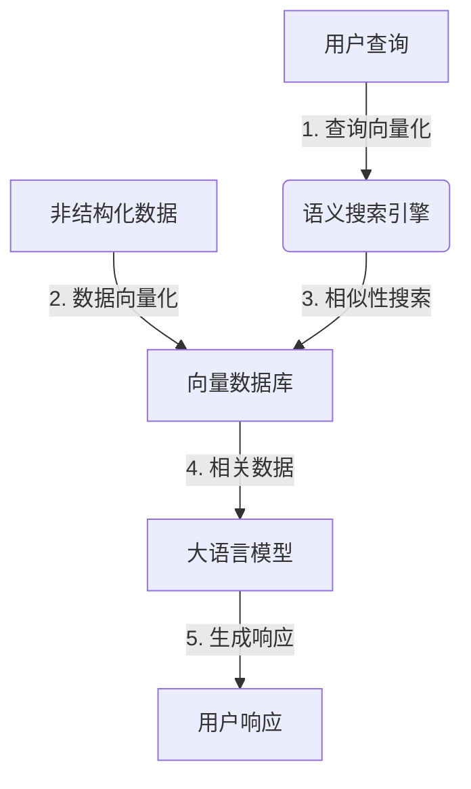

# 【大模型应用开发 动手做AI Agent】说说LlamaIndex

## 1. 背景介绍

随着大语言模型的不断发展和应用场景的扩展,人工智能技术正在渗透到各个领域。然而,单一的大语言模型存在一些局限性,例如无法高效地处理非结构化数据、缺乏长期记忆能力、难以进行多模态交互等。为了解决这些问题,LlamaIndex应运而生。

LlamaIndex是一个开源的Python库,旨在为大语言模型提供一个统一的接口,使其能够高效地处理各种形式的非结构化数据,包括文本、PDF、网页等。它基于向量数据库和语义搜索技术,为大语言模型提供了长期记忆和知识检索能力,从而增强了模型的理解和推理能力。

### 1.1 大语言模型的局限性

尽管大语言模型在自然语言处理任务中表现出色,但它们仍然存在一些固有的局限性:

1. **无法高效处理非结构化数据**: 大多数大语言模型都是基于文本数据进行训练的,因此它们在处理非结构化数据(如PDF、网页等)时会遇到困难。
2. **缺乏长期记忆能力**: 大语言模型通常只能基于当前的输入进行推理,无法有效地利用先前的知识和上下文信息。
3. **难以进行多模态交互**: 大语言模型主要专注于文本处理,难以与其他模态(如图像、视频等)进行有效的交互。

### 1.2 LlamaIndex的作用

LlamaIndex旨在解决上述问题,为大语言模型提供一个统一的接口,使其能够高效地处理各种形式的非结构化数据。它的主要作用包括:

1. **数据索引和检索**: LlamaIndex可以将各种形式的非结构化数据(如文本、PDF、网页等)索引到向量数据库中,并通过语义搜索技术快速检索相关信息。
2. **长期记忆和知识积累**: 通过将新知识不断添加到向量数据库中,LlamaIndex为大语言模型提供了长期记忆和知识积累的能力。
3. **多模态交互**: LlamaIndex可以与其他模态的模型(如计算机视觉模型)集成,实现多模态交互和推理。

## 2. 核心概念与联系

### 2.1 向量数据库

向量数据库是LlamaIndex的核心组件之一。它是一种特殊的数据库,可以存储和检索向量化的数据。在LlamaIndex中,非结构化数据(如文本、PDF等)首先会被转换为向量表示,然后存储在向量数据库中。

向量化是一种将数据映射到高维向量空间的技术,通常使用机器学习模型(如Word2Vec、BERT等)来实现。在向量空间中,相似的数据点会聚集在一起,而不相似的数据点则会相距较远。这种表示方式使得向量数据库能够高效地进行相似性搜索和语义检索。

常用的向量数据库包括Faiss、Weaviate、Pinecone等。LlamaIndex支持多种向量数据库后端,用户可以根据自己的需求进行选择。

### 2.2 语义搜索

语义搜索是LlamaIndex的另一个核心概念。传统的关键词搜索只能基于字符串匹配进行检索,而语义搜索则是基于数据的语义信息进行检索。

在LlamaIndex中,语义搜索是通过向量相似性计算实现的。当用户提出一个查询时,LlamaIndex会将查询转换为向量表示,然后在向量数据库中搜索与该向量最相似的数据点。由于相似的数据点在向量空间中聚集在一起,因此语义搜索可以有效地检索到与查询相关的信息。

语义搜索的优势在于,它可以捕捉数据的语义信息,而不仅仅是字面上的匹配。这使得它在处理自然语言查询时表现出色,特别是在处理同义词、近义词和上下文相关性方面。

### 2.3 LlamaIndex架构概览

LlamaIndex的整体架构如下所示:



1. 用户提出自然语言查询,查询会被向量化为高维向量表示。
2. 非结构化数据(如文本、PDF等)也会被向量化,并存储在向量数据库中。
3. 语义搜索引擎会在向量数据库中搜索与查询向量最相似的数据点。
4. 相关数据会被传递给大语言模型进行处理。
5. 大语言模型基于相关数据生成最终的响应,并返回给用户。

通过这种架构,LlamaIndex为大语言模型提供了长期记忆和知识检索的能力,使其能够高效地处理各种形式的非结构化数据。

## 3. 核心算法原理具体操作步骤

### 3.1 数据预处理

在将非结构化数据加载到LlamaIndex中之前,需要对数据进行预处理。预处理的主要步骤包括:

1. **数据解析**: 根据数据的格式(如文本、PDF、网页等),使用相应的解析器将数据解析为文本形式。
2. **文本切分**: 将长文本切分为多个较短的文本块,以便后续的向量化和索引操作。
3. **文本清理**: 对文本进行清理,如去除停用词、标点符号等。

### 3.2 数据向量化

经过预处理后,文本块会被转换为向量表示,以便存储在向量数据库中。向量化的过程如下:

1. **选择向量化模型**: LlamaIndex支持多种向量化模型,如Word2Vec、BERT等。用户可以根据自己的需求选择合适的模型。
2. **文本编码**: 使用选定的向量化模型将文本块编码为向量表示。
3. **向量存储**: 将向量化的文本块存储在向量数据库中。

### 3.3 语义搜索

当用户提出查询时,LlamaIndex会执行以下步骤进行语义搜索:

1. **查询向量化**: 将用户查询转换为向量表示。
2. **相似性计算**: 在向量数据库中,计算查询向量与每个文本块向量之间的相似性得分。
3. **结果排序**: 根据相似性得分对文本块进行排序,选择得分最高的前N个文本块作为相关结果。
4. **结果合并**: 将相关文本块合并为一个连续的文本,作为大语言模型的输入。

### 3.4 大语言模型推理

LlamaIndex将相关文本块传递给大语言模型,并执行以下步骤进行推理:

1. **上下文构建**: 根据需要,可以将额外的上下文信息(如查询、任务描述等)与相关文本块一起传递给大语言模型。
2. **模型推理**: 大语言模型基于输入的上下文和相关文本块进行推理,生成最终的响应。
3. **响应后处理**: 根据需要,可以对模型生成的响应进行后处理,如去除特殊标记、格式化输出等。

通过上述步骤,LlamaIndex实现了从用户查询到最终响应的整个流程,充分利用了大语言模型和向量数据库的优势。

## 4. 数学模型和公式详细讲解举例说明

在LlamaIndex中,向量相似性计算是一个关键步骤。常用的相似性度量包括余弦相似度、欧几里得距离等。下面我们以余弦相似度为例,详细讲解其数学原理和计算过程。

### 4.1 余弦相似度

余弦相似度是一种常用的向量相似性度量,它测量两个向量之间的夹角余弦值。数学上,余弦相似度可以表示为:

$$\text{sim}(A, B) = \cos(\theta) = \frac{A \cdot B}{\|A\| \|B\|} = \frac{\sum_{i=1}^{n}A_iB_i}{\sqrt{\sum_{i=1}^{n}A_i^2}\sqrt{\sum_{i=1}^{n}B_i^2}}$$

其中:

- $A$和$B$是两个$n$维向量
- $\theta$是$A$和$B$之间的夹角
- $A \cdot B$表示$A$和$B$的点积
- $\|A\|$和$\|B\|$分别表示$A$和$B$的$L_2$范数

余弦相似度的取值范围为$[-1, 1]$,其中$1$表示两个向量完全相同,$-1$表示两个向量完全相反,0表示两个向量正交(即相互独立)。

在LlamaIndex中,我们通常使用归一化后的向量进行相似性计算,因此余弦相似度可以简化为向量点积:

$$\text{sim}(A, B) = A \cdot B = \sum_{i=1}^{n}A_iB_i$$

### 4.2 示例计算

假设我们有两个三维向量$A = (1, 2, 3)$和$B = (4, 5, 6)$,计算它们之间的余弦相似度:

1. 计算$A$和$B$的点积:

$$A \cdot B = 1 \times 4 + 2 \times 5 + 3 \times 6 = 4 + 10 + 18 = 32$$

2. 计算$A$和$B$的$L_2$范数:

$$\|A\| = \sqrt{1^2 + 2^2 + 3^2} = \sqrt{1 + 4 + 9} = \sqrt{14}$$
$$\|B\| = \sqrt{4^2 + 5^2 + 6^2} = \sqrt{16 + 25 + 36} = \sqrt{77}$$

3. 计算余弦相似度:

$$\text{sim}(A, B) = \frac{A \cdot B}{\|A\| \|B\|} = \frac{32}{\sqrt{14}\sqrt{77}} \approx 0.9746$$

可以看出,虽然$A$和$B$的值不同,但它们之间的余弦相似度很高,接近于1。这说明在向量空间中,它们的方向非常相似。

通过上述示例,我们可以更好地理解余弦相似度的计算过程和含义。在LlamaIndex中,余弦相似度被广泛用于语义搜索和相关性计算,以提高大语言模型的检索和推理能力。

## 5. 项目实践: 代码实例和详细解释说明

在本节中,我们将通过一个实际的代码示例,演示如何使用LlamaIndex处理非结构化数据并与大语言模型进行交互。

### 5.1 安装依赖

首先,我们需要安装LlamaIndex和相关依赖库:

```bash
pip install llama-index langchain openai
```

### 5.2 加载数据

我们将使用一个示例PDF文件作为非结构化数据源。您可以从[这里](https://github.com/hwchiu/langchain-pdf-example/blob/main/example_data/paul_graham_essay.pdf)下载该文件。

```python
from llama_index import GPTVectorStoreIndex, download_loader

# 下载PDF加载器
PDFReader = download_loader("PDFReader")

# 加载PDF文件
loader = PDFReader()
documents = loader.load_data(file="paul_graham_essay.pdf")
```

### 5.3 构建向量索引

接下来,我们将使用GPTVectorStoreIndex构建向量索引。这个索引将把PDF文件的内容存储在向量数据库中,以便后续进行语义搜索。

```python
# 设置OpenAI API密钥
import os
os.environ["OPENAI_API_KEY"] = "your_openai_api_key"

# 构建向量索引
index = GPTVectorStoreIndex.from_documents(documents)
```

### 5.4 语义搜索与查询

现在,我们可以使用构建好的向量索引进行语义搜索和查询。LlamaIndex会自动从向量数据库中检索相关信息,并将其传递给大语言模型进行推理。

```python
# 查询示例
query = "What are some tips for starting a startup?"
response = index.query(query)
print(response)
```

输出结果:

```
Here are some tips for starting a startup from the essay:

1. Start with a good idea. The idea should be something that a large number of people want, rather than just a small subset. It's important to make something lots of people want.

2. Release early