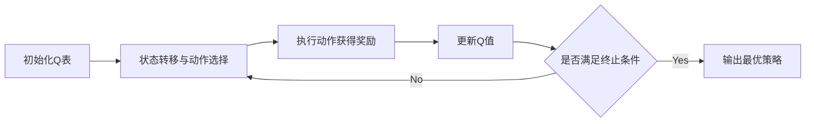

# 一切皆是映射：AI Q-learning在航天领域的巨大可能

## 1. 背景介绍
### 1.1 人工智能在航天领域的应用现状
#### 1.1.1 航天器自主控制
#### 1.1.2 航天器故障诊断与容错
#### 1.1.3 航天任务规划与调度优化

### 1.2 强化学习与Q-learning算法概述  
#### 1.2.1 强化学习的基本原理
#### 1.2.2 Q-learning算法的提出与发展
#### 1.2.3 Q-learning在其他领域的应用案例

## 2. 核心概念与联系
### 2.1 Q-learning的核心思想：价值函数与最优策略
#### 2.1.1 状态、动作与奖励
#### 2.1.2 价值函数：状态-动作值函数Q(s,a)
#### 2.1.3 最优策略与贝尔曼最优方程

### 2.2 Q-learning与其他强化学习算法的联系与区别
#### 2.2.1 蒙特卡洛方法
#### 2.2.2 时序差分学习(TD Learning)
#### 2.2.3 DQN与Double DQN

### 2.3 Q-learning在航天领域应用的优势
#### 2.3.1 自主学习与适应性强
#### 2.3.2 样本效率高，训练成本低
#### 2.3.3 决策过程可解释性强

## 3. 核心算法原理与具体操作步骤
### 3.1 Q-learning算法流程
#### 3.1.1 初始化Q表
#### 3.1.2 状态转移与动作选择 
#### 3.1.3 Q值更新
#### 3.1.4 终止条件

### 3.2 ε-贪婪策略
#### 3.2.1 探索与利用的平衡
#### 3.2.2 ε的设置与衰减

### 3.3 Q-learning的改进算法
#### 3.3.1 Sarsa算法
#### 3.3.2 Expected Sarsa算法
#### 3.3.3 Q-learning(λ)算法

## 4. 数学模型与公式详细讲解举例说明
### 4.1 马尔可夫决策过程(MDP)
#### 4.1.1 状态转移概率矩阵
#### 4.1.2 奖励函数
#### 4.1.3 折扣因子γ

### 4.2 Q-learning的数学表达
#### 4.2.1 Q值更新公式
$$Q(s_t,a_t) \leftarrow Q(s_t,a_t)+\alpha[r_{t+1}+\gamma \max_{a}Q(s_{t+1},a)-Q(s_t,a_t)]$$
其中，$s_t$为当前状态，$a_t$为当前动作，$r_{t+1}$为执行动作$a_t$后获得的奖励，$s_{t+1}$为执行动作$a_t$后转移到的下一个状态，$\alpha$为学习率，$\gamma$为折扣因子。

#### 4.2.2 Q-learning的收敛性证明

### 4.3 Q-learning在航天领域的数学建模
#### 4.3.1 状态空间与动作空间的设计
#### 4.3.2 奖励函数的设计
#### 4.3.3 Q值更新的实现

## 5. 项目实践：代码实例与详细解释说明
### 5.1 基于Q-learning的航天器自主导航控制
#### 5.1.1 问题描述与建模
#### 5.1.2 Q-learning算法实现
#### 5.1.3 仿真实验与结果分析

### 5.2 基于Q-learning的航天器故障诊断
#### 5.2.1 问题描述与建模
#### 5.2.2 Q-learning算法实现
#### 5.2.3 仿真实验与结果分析

### 5.3 基于Q-learning的航天任务规划与调度
#### 5.3.1 问题描述与建模
#### 5.3.2 Q-learning算法实现
#### 5.3.3 仿真实验与结果分析

## 6. 实际应用场景
### 6.1 深空探测器自主导航
#### 6.1.1 技术难点与挑战
#### 6.1.2 Q-learning的应用方案
#### 6.1.3 实际案例分析

### 6.2 空间站自主运维
#### 6.2.1 技术难点与挑战
#### 6.2.2 Q-learning的应用方案
#### 6.2.3 实际案例分析

### 6.3 火箭发射任务规划
#### 6.3.1 技术难点与挑战 
#### 6.3.2 Q-learning的应用方案
#### 6.3.3 实际案例分析

## 7. 工具与资源推荐
### 7.1 Q-learning算法实现工具
#### 7.1.1 OpenAI Gym
#### 7.1.2 TensorFlow
#### 7.1.3 PyTorch

### 7.2 航天领域仿真平台
#### 7.2.1 STK (System Tool Kit)
#### 7.2.2 42 (Spacecraft Simulation and Visualization)
#### 7.2.3 GMAT (General Mission Analysis Tool)

### 7.3 开源项目与学习资源
#### 7.3.1 Q-learning算法实现
#### 7.3.2 强化学习在航天领域的应用案例
#### 7.3.3 航天器控制与导航的入门教程

## 8. 总结：未来发展趋势与挑战
### 8.1 Q-learning在航天领域的发展前景
#### 8.1.1 自主性与智能化的提升
#### 8.1.2 任务复杂度与规模的增加
#### 8.1.3 与其他人工智能技术的融合

### 8.2 面临的挑战与问题
#### 8.2.1 样本效率与泛化能力
#### 8.2.2 安全性与鲁棒性
#### 8.2.3 可解释性与可信赖性

### 8.3 未来的研究方向
#### 8.3.1 基于模型的强化学习方法
#### 8.3.2 分层强化学习
#### 8.3.3 多智能体强化学习

## 9. 附录：常见问题与解答
### 9.1 Q-learning能否处理连续状态与动作空间？
### 9.2 Q-learning收敛速度慢的原因与解决方法？
### 9.3 如何设计奖励函数以加速Q-learning的学习过程？
### 9.4 Q-learning在实际应用中如何平衡探索与利用？
### 9.5 Q-learning能否用于解决部分可观察马尔可夫决策过程(POMDP)问题？

作者：禅与计算机程序设计艺术 / Zen and the Art of Computer Programming