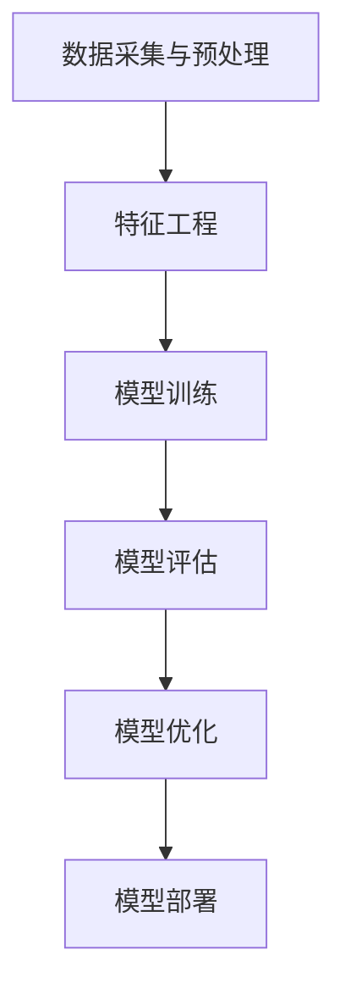
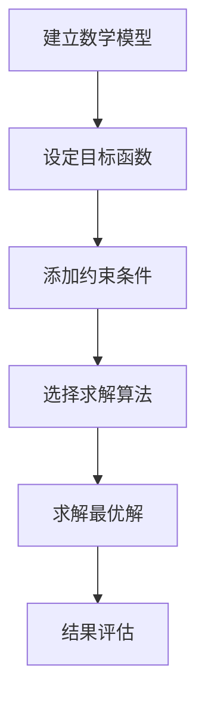
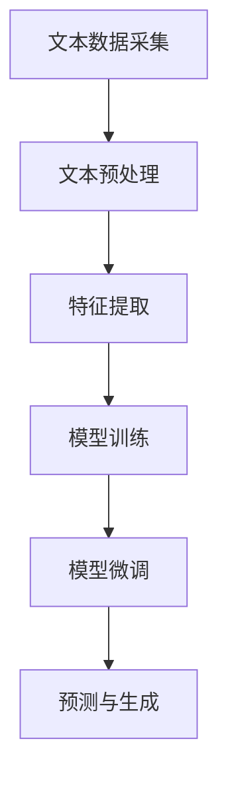

# 一切皆是映射：AI在可持续发展目标中的应用

## 1. 背景介绍

### 1.1 可持续发展目标的重要性

可持续发展目标(Sustainable Development Goals, SDGs)是由联合国于2015年通过的一项宏伟蓝图,旨在消除贫困、保护地球并确保所有人享有和平与繁荣。这17项目标涵盖了广泛的经济、社会和环境领域,为全球可持续发展确立了共同愿景和行动框架。

实现可持续发展目标对于确保人类社会的长期发展至关重要。这些目标旨在应对诸如气候变化、环境恶化、社会不平等等全球性挑战,为当代和后代创造一个更加公正、包容、繁荣的世界。

### 1.2 人工智能(AI)在可持续发展中的作用

人工智能技术正在以前所未有的方式推动社会进步。AI系统具有处理大量数据、发现模式、优化决策的独特能力,因此可为实现可持续发展目标做出重大贡献。

AI可应用于多个可持续发展领域,如农业、医疗保健、教育、能源、减贫等。通过数据驱动的见解和智能自动化,AI有望提高资源利用效率、增强决策制定、促进社会公平以及加速创新。

本文将探讨AI在实现可持续发展目标中的应用,阐述其核心概念、算法原理、实际案例,并展望未来发展趋势与挑战。

## 2. 核心概念与联系

### 2.1 AI与可持续发展目标的映射关系

AI与可持续发展目标之间存在着内在的映射关系。每一个可持续发展目标都可以被视为一个复杂的优化问题,而AI则擅长通过数据和算法来寻找最优解。

例如,消除贫困(SDG 1)可被视为如何最大限度地提高人们的生活水平;确保健康(SDG 3)可被视为如何优化医疗资源分配;应对气候变化(SDG 13)可被视为如何减少碳排放并提高能源利用效率。

AI技术如机器学习、优化算法、自然语言处理等,都可以为这些问题提供有力的解决方案。通过建模、模式识别和决策优化,AI可以帮助实现可持续发展目标。

### 2.2 AI在可持续发展中的核心能力

AI在可持续发展领域发挥着以下核心能力:

1. **数据处理与模式识别**: AI擅长从海量数据中提取有价值的信息和模式,为决策提供依据。
2. **优化与自动化**: AI可以优化复杂系统的运行,提高效率,实现智能自动化。
3. **预测与规划**: 基于历史数据,AI能够预测未来趋势,为长期规划提供支持。
4. **个性化与定制**: AI可根据用户需求提供个性化的解决方案和服务。
5. **视觉与语音识别**: AI在计算机视觉和自然语言处理领域的突破,有助于人机交互和数据采集。

这些核心能力使AI成为实现可持续发展目标的重要推动力量。

## 3. 核心算法原理具体操作步骤

AI在可持续发展领域的应用通常涉及以下几个核心算法:

### 3.1 机器学习算法

机器学习算法能够从数据中自动建模并做出预测,是AI的核心驱动力。在可持续发展领域,常用的机器学习算法包括:

1. **监督学习算法**
    - 回归算法(如线性回归、决策树回归等)用于数值预测问题。
    - 分类算法(如逻辑回归、支持向量机等)用于模式识别和分类问题。
2. **无监督学习算法**
    - 聚类算法(如K-Means、DBSCAN等)用于数据分组和模式发现。
    - 降维算法(如PCA、t-SNE等)用于高维数据可视化。
3. **强化学习算法**
    - Q-Learning、策略梯度等算法用于序列决策优化问题。

这些算法的操作步骤通常包括:



### 3.2 优化算法

优化算法旨在找到满足约束条件的最优解,在资源分配、规划调度等可持续发展问题中有重要应用。常用的优化算法包括:

1. **线性规划**
    - 单纯形算法、内点法等用于求解线性优化问题。
2. **非线性规划**
    - 梯度下降法、牛顿法等用于求解非线性优化问题。
3. **整数规划**
    - 分支定界法、列生成法等用于求解离散优化问题。
4. **启发式算法**
    - 遗传算法、蚁群算法等用于求解NP难问题的近似解。

优化算法的操作步骤通常包括:



### 3.3 自然语言处理算法

自然语言处理算法能够赋予AI理解和生成人类语言的能力,在人机交互、信息提取等应用中发挥重要作用。常用的算法包括:

1. **词向量表示**
    - Word2Vec、GloVe等用于将词语表示为密集向量。
2. **序列建模**
    - RNN、LSTM等用于对序列数据(如文本)建模。
3. **注意力机制**
    - 自注意力等用于捕捉长距离依赖关系。
4. **预训练语言模型**
    - BERT、GPT等用于获取通用语言表示。

自然语言处理算法的操作步骤通常包括:



通过将这些核心算法与可持续发展目标相结合,AI可以为解决实际问题提供强大的分析和决策支持。

## 4. 数学模型和公式详细讲解举例说明 

AI算法通常基于数学模型,使用公式对问题进行形式化描述和求解。以下是一些常见的数学模型和公式:

### 4.1 线性回归模型

线性回归是监督学习中的基础模型,用于预测连续目标变量。其数学表达式为:

$$y = \theta_0 + \theta_1x_1 + \theta_2x_2 + ... + \theta_nx_n$$

其中$y$为目标变量,$x_i$为特征变量,$\theta_i$为模型参数。模型训练的目标是找到最小化均方误差的参数值:

$$\min_\theta \sum_{i=1}^m (y_i - \hat{y}_i)^2$$

线性回归可用于农业预测、能源需求预测等可持续发展应用。

### 4.2 逻辑回归模型

逻辑回归是分类问题中的基础模型,预测目标变量属于某个类别的概率。其数学形式为:

$$P(y=1|x) = \sigma(\theta^Tx) = \frac{1}{1+e^{-\theta^Tx}}$$

其中$\sigma$为Sigmoid函数,将线性函数的输出映射到(0,1)范围,作为概率值。模型训练目标是最大化似然函数:

$$\max_\theta \prod_{i=1}^m P(y_i|x_i;\theta)$$

逻辑回归可用于疾病诊断、贷款审批等二分类问题。

### 4.3 聚类算法:K-Means

K-Means是一种常用的无监督聚类算法,通过最小化样本到聚类中心的距离来划分数据。其目标函数为:

$$J = \sum_{i=1}^k\sum_{x\in C_i}||x-\mu_i||^2$$

其中$k$为聚类数量,$C_i$为第$i$个聚类,$\mu_i$为第$i$个聚类中心。算法迭代优化聚类中心,直到收敛。

K-Means可用于人群分类、能源用户聚类等应用,为个性化服务提供支持。

### 4.4 线性规划模型

线性规划是一种常见的优化模型,用于在线性约束条件下寻找最优解。其数学形式为:

$$\begin{align*}
&\max\ c^Tx\\
&\text{s.t.}\ Ax\leq b\\
&x\geq 0
\end{align*}$$

其中$c$为目标函数系数向量,$A$为约束矩阵,$b$为约束向量。线性规划可用于资源分配、运输路线优化等可持续发展应用。

通过将现实问题转化为数学模型,AI算法可以有效求解,为可持续发展提供数据驱动的决策支持。

## 5. 项目实践:代码实例和详细解释说明

为了更好地理解AI在可持续发展中的应用,我们将通过一个实际案例来演示。这个案例是基于Python和相关库(如Scikit-Learn、Pandas等)实现的。

### 5.1 案例背景:农业智能决策系统

农业是实现可持续发展目标的关键领域之一。本案例旨在开发一个智能决策系统,帮助农民优化农业生产,提高收益和可持续性。

系统将利用历史数据(如气象、土壤、作物等)训练机器学习模型,预测未来作物产量,并为农民提供种植建议(如何选择作物品种、施肥时间等)。

### 5.2 数据预处理

```python
import pandas as pd

# 加载数据
data = pd.read_csv('farm_data.csv')

# 处理缺失值
data = data.dropna()

# 对类别特征进行编码
from sklearn.preprocessing import LabelEncoder
le = LabelEncoder()
data['crop'] = le.fit_transform(data['crop'])

# 拆分特征和目标变量
X = data.drop('yield', axis=1)
y = data['yield']
```

上述代码加载了农场数据,处理了缺失值,对作物类别进行了编码,并拆分了特征和目标变量(产量)。

### 5.3 模型训练与预测

```python
from sklearn.model_selection import train_test_split
from sklearn.ensemble import RandomForestRegressor

# 拆分训练集和测试集
X_train, X_test, y_train, y_test = train_test_split(X, y, test_size=0.2)

# 训练随机森林回归模型
rf = RandomForestRegressor()
rf.fit(X_train, y_train)

# 在测试集上评估模型
score = rf.score(X_test, y_test)
print(f'Model accuracy: {score}')

# 进行预测
new_data = [[30, 80, 25, 'wheat']]
new_data[0][3] = le.transform([new_data[0][3]])[0]
prediction = rf.predict(new_data)
print(f'Predicted yield: {prediction[0]}')
```

这段代码使用了随机森林回归算法对作物产量进行预测。首先,它将数据拆分为训练集和测试集。然后,它在训练集上训练模型,并在测试集上评估模型性能。最后,它对新的输入数据进行预测。

### 5.4 优化建议

```python
import numpy as np
from sklearn.model_selection import GridSearchCV

# 定义参数网格
params = {'max_depth': [3, 5, 8],
          'n_estimators': [100, 300, 500]}

# 网格搜索寻找最优参数
grid = GridSearchCV(rf, params, cv=5, scoring='r2')
grid.fit(X_train, y_train)

# 输出最优参数和相应的模型分数
print(f'Best params: {grid.best_params_}')
print(f'Best score: {grid.best_score_}')

# 使用最优参数重新训练模型
rf = RandomForestRegressor(**grid.best_params_)
rf.fit(X_train, y_train)
```

为了进一步优化模型性能,我们使用网格搜索来寻找最优的模型参数。代码定义了一个参数网格,包括树的最大深度和estimator的数量。然后,它使用交叉验证的方式在训练集上评估不同参数组合的性能,找到最优参数。最后,使用最优参数重新训练模型。

通过这个案例,我们展示了如何使用Python和机器学习算法构建智能农业决