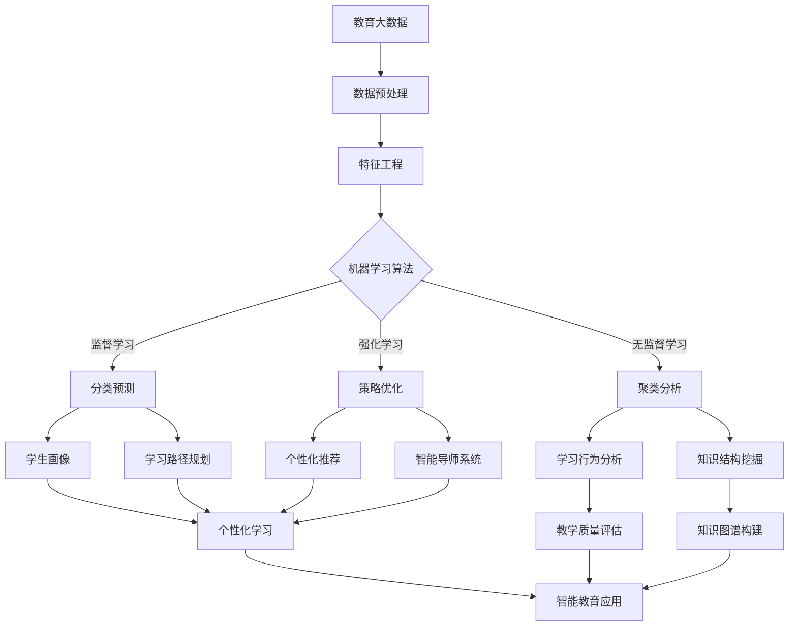

# 一切皆是映射：AI在教育领域的变革作用

## 1. 背景介绍
### 1.1 人工智能的发展历程
#### 1.1.1 人工智能的起源与定义
#### 1.1.2 人工智能的发展阶段
#### 1.1.3 人工智能的现状与趋势

### 1.2 教育领域的现状与挑战  
#### 1.2.1 传统教育模式的局限性
#### 1.2.2 教育公平与资源分配问题
#### 1.2.3 个性化教育的需求与困境

### 1.3 人工智能与教育的结合
#### 1.3.1 人工智能在教育领域的应用现状
#### 1.3.2 人工智能赋能教育的潜力与机遇
#### 1.3.3 人工智能教育应用面临的挑战

## 2. 核心概念与联系
### 2.1 映射的概念与原理
#### 2.1.1 映射的数学定义
#### 2.1.2 映射在人工智能中的应用
#### 2.1.3 映射思想在教育领域的启示

### 2.2 知识表示与映射
#### 2.2.1 知识表示的概念与方法
#### 2.2.2 知识图谱与语义网络
#### 2.2.3 知识映射与知识推理

### 2.3 学习过程与映射
#### 2.3.1 学习的本质与过程
#### 2.3.2 学习迁移与知识映射
#### 2.3.3 元学习与自适应学习

## 3. 核心算法原理具体操作步骤
### 3.1 知识表示算法
#### 3.1.1 本体构建与知识抽取
#### 3.1.2 知识融合与知识推理
#### 3.1.3 知识图谱嵌入与表示学习

### 3.2 个性化推荐算法
#### 3.2.1 协同过滤推荐
#### 3.2.2 基于内容的推荐
#### 3.2.3 组合推荐与混合推荐

### 3.3 自适应学习算法
#### 3.3.1 知识追踪与掌握度估计
#### 3.3.2 学习路径优化与课程推荐
#### 3.3.3 智能导师系统与反馈优化

## 4. 数学模型和公式详细讲解举例说明
### 4.1 知识表示模型
#### 4.1.1 本体与描述逻辑
#### 4.1.2 概率图模型与马尔可夫逻辑网络
#### 4.1.3 知识图谱嵌入模型

### 4.2 推荐系统模型 
#### 4.2.1 矩阵分解模型
#### 4.2.2 深度学习推荐模型
#### 4.2.3 强化学习推荐模型

### 4.3 自适应学习模型
#### 4.3.1 贝叶斯知识追踪模型
#### 4.3.2 深度知识追踪模型
#### 4.3.3 强化学习课程规划模型

## 5. 项目实践：代码实例和详细解释说明
### 5.1 知识图谱构建项目
#### 5.1.1 数据采集与预处理
#### 5.1.2 本体构建与知识抽取
#### 5.1.3 知识存储与查询

### 5.2 个性化推荐系统项目
#### 5.2.1 用户画像与物品表示
#### 5.2.2 推荐模型训练与评估
#### 5.2.3 推荐结果解释与可视化

### 5.3 自适应学习平台项目
#### 5.3.1 知识点分析与课程结构化
#### 5.3.2 学习路径优化与课程推荐
#### 5.3.3 学情分析与反馈优化

## 6. 实际应用场景
### 6.1 智能教育平台
#### 6.1.1 个性化学习路径规划
#### 6.1.2 智能作业与测评系统
#### 6.1.3 学情分析与教学决策支持

### 6.2 智能教辅工具
#### 6.2.1 智能问答与知识检索
#### 6.2.2 智能作文批改与反馈
#### 6.2.3 智能语言学习助手

### 6.3 教育大数据分析
#### 6.3.1 学生画像与学习行为分析
#### 6.3.2 教学质量评估与改进
#### 6.3.3 教育政策制定与资源配置优化

## 7. 工具和资源推荐
### 7.1 知识图谱构建工具
#### 7.1.1 Protégé本体编辑器
#### 7.1.2 OpenKE知识图谱嵌入工具包
#### 7.1.3 Neo4j图数据库

### 7.2 推荐系统开源框架
#### 7.2.1 Surprise推荐系统库
#### 7.2.2 DeepCTR深度学习推荐框架
#### 7.2.3 TensorFlow Recommenders

### 7.3 自适应学习平台与资源
#### 7.3.1 智适应学习开源平台ALOSI
#### 7.3.2 Coursera个性化学习平台
#### 7.3.3 Khan Academy智能学习资源

## 8. 总结：未来发展趋势与挑战
### 8.1 人工智能教育的未来趋势
#### 8.1.1 多模态智能教育系统
#### 8.1.2 终身学习与智能学习助手
#### 8.1.3 教育元宇宙与沉浸式学习

### 8.2 人工智能教育面临的挑战
#### 8.2.1 数据隐私与安全问题
#### 8.2.2 算法公平性与偏见风险
#### 8.2.3 人机协作与教师角色转变

### 8.3 人工智能教育的发展建议
#### 8.3.1 加强跨学科交叉与协同创新
#### 8.3.2 重视教育伦理与人文关怀
#### 8.3.3 促进产学研用深度融合

## 9. 附录：常见问题与解答
### 9.1 人工智能会取代教师吗？
### 9.2 如何保障学生数据隐私安全？
### 9.3 人工智能教育是否会加剧教育不公平？
### 9.4 如何评估人工智能教育系统的有效性？
### 9.5 教师如何适应人工智能时代的角色转变？

人工智能正在深刻影响和重塑教育领域，为教与学带来全新的变革。本文从"映射"这一核心概念出发，探讨了人工智能技术在教育领域的应用与影响。

映射是人工智能的核心思想之一，它揭示了如何将现实世界中的对象、关系和规律转化为计算机可以理解和处理的形式。在教育领域，知识表示可以看作是一种映射，将教育知识转化为结构化、可计算的形式；学习过程也可以看作是一种映射，将学习者的认知状态映射到知识空间中，实现知识的内化与迁移。

基于映射思想，人工智能在教育领域的应用主要体现在三个方面：知识表示、个性化推荐和自适应学习。知识表示技术，如知识图谱和本体，可以帮助构建教育知识的结构化表示，支持知识推理和问答；个性化推荐技术，如协同过滤和深度学习，可以根据学生的学习行为和偏好，提供个性化的学习资源和路径规划；自适应学习技术，如贝叶斯知识追踪和强化学习，可以实时跟踪学生的学习状态，动态调整学习内容和难度，提供个性化的学习反馈和指导。

文章重点介绍了知识表示、推荐系统和自适应学习三个领域的核心算法原理和数学模型，并通过代码实例和详细解释，展示了如何将这些技术应用于实际的教育项目中，如知识图谱构建、个性化推荐系统和自适应学习平台等。同时，文章还讨论了人工智能教育的实际应用场景，包括智能教育平台、智能教辅工具和教育大数据分析等，展示了人工智能赋能教育的广阔前景。

展望未来，人工智能教育将向着多模态、终身化和沉浸式的方向发展，形成人机协同的智能教育新生态。同时，我们也要审慎对待人工智能教育所带来的挑战，如数据隐私、算法偏见和教师角色转变等问题，需要在技术进步的同时，加强教育伦理的思考和人文关怀的践行。

总之，人工智能与教育的深度融合，为教育变革提供了新的路径和可能性。"一切皆是映射"的理念，让我们以数学和计算的视角，重新审视教育的本质，探索智能时代教育的新范式。相信通过跨学科交叉与协同创新，我们一定能够推动人工智能教育的健康发展，为每一个学习者提供更加公平、更加优质、更加个性化的教育，让教育成为人工智能时代的最大增量和最强驱动力。

作者：禅与计算机程序设计艺术 / Zen and the Art of Computer Programming