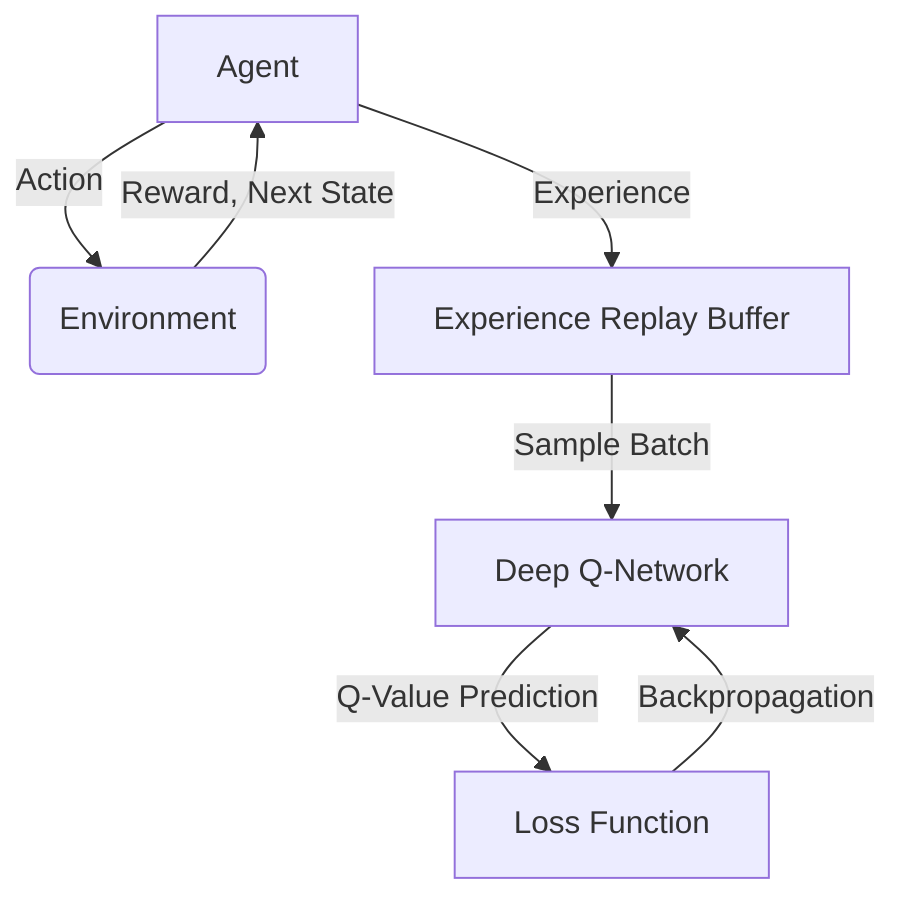
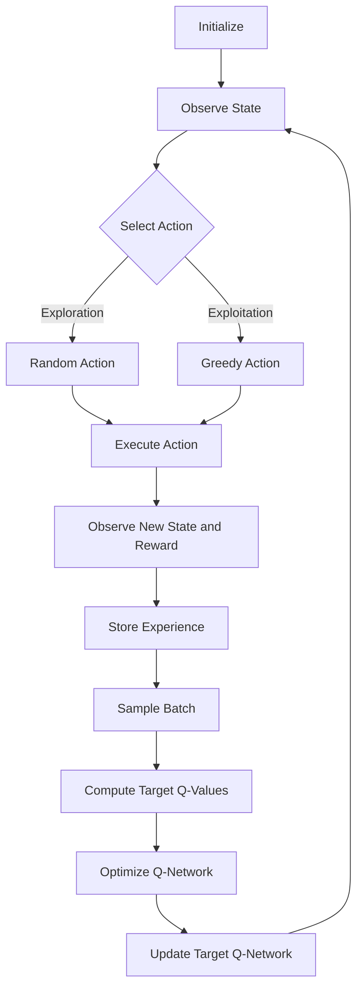

# 一切皆是映射：DQN在机器人领域的实践：挑战与策略

## 1.背景介绍

### 1.1 机器人技术的重要性

在当今科技飞速发展的时代，机器人技术已经渗透到我们生活的方方面面。从工业自动化到家庭服务机器人，从医疗手术到航空航天探索，机器人正在为人类创造前所未有的机遇。然而，赋予机器人智能化决策能力并非一蹴而就的任务。传统的基于规则的控制系统在面对复杂动态环境时往往力不从心。因此，研究人员将目光投向了人工智能(AI)领域,尤其是强化学习(Reinforcement Learning)技术。

### 1.2 强化学习在机器人领域的应用

强化学习是一种基于试错的学习范式,旨在通过与环境的交互来获取最优策略。代理(Agent)在环境中执行动作,并根据获得的奖励信号来调整其策略。这种学习方式非常适合于机器人控制任务,因为机器人需要根据传感器数据作出决策,并通过与环境的互动来学习最佳行为模式。

### 1.3 DQN算法的崛起

2015年,Google DeepMind团队提出了深度Q网络(Deep Q-Network, DQN)算法,将深度神经网络与Q学习相结合,取得了在Atari游戏中超越人类水平的成就。DQN算法的出现标志着强化学习进入了一个新的里程碑,为解决高维连续控制问题提供了新的思路。

## 2.核心概念与联系

### 2.1 马尔可夫决策过程(MDP)

马尔可夫决策过程(Markov Decision Process, MDP)是强化学习的基础理论框架。MDP由一组状态(S)、一组动作(A)、状态转移概率(P)、奖励函数(R)和折扣因子(γ)组成。在每个时间步,代理根据当前状态选择一个动作,然后环境转移到下一个状态并返回相应的奖励。目标是找到一个策略π,使得累积奖励的期望值最大化。

### 2.2 Q学习

Q学习是一种基于价值函数的强化学习算法。它通过估计每个状态-动作对的Q值(即在该状态下执行该动作,然后遵循最优策略所能获得的累积奖励)来学习最优策略。Q值可以通过贝尔曼方程进行迭代更新。

### 2.3 深度神经网络

深度神经网络(Deep Neural Network, DNN)是一种强大的机器学习模型,能够从原始输入数据中自动提取高级特征。DNN通过多层非线性变换来近似任意复杂的函数,从而实现对复杂模式的建模和预测。

### 2.4 DQN算法

DQN算法将Q学习与深度神经网络相结合,使用神经网络来近似Q值函数。代理通过与环境交互收集经验,并将这些经验存储在经验回放池(Experience Replay Buffer)中。在训练过程中,从经验回放池中随机采样批次数据,并使用梯度下降算法来优化神经网络的参数,使得预测的Q值与实际Q值之间的误差最小化。



## 3.核心算法原理具体操作步骤

DQN算法的核心步骤如下:

1. **初始化**:初始化深度Q网络,经验回放池和相关参数。

2. **观测环境**:代理观测当前环境状态。

3. **选择动作**:根据当前状态,使用ε-贪婪策略从Q网络输出的Q值中选择动作。在训练早期,以较大的概率选择随机动作(exploration);训练后期,以较大的概率选择Q值最大的动作(exploitation)。

4. **执行动作**:代理在环境中执行选择的动作。

5. **观测新状态和奖励**:观测执行动作后的新状态,并获得相应的奖励。

6. **存储经验**:将(当前状态,动作,奖励,新状态)的四元组存储到经验回放池中。

7. **采样批次数据**:从经验回放池中随机采样一个批次的经验。

8. **计算目标Q值**:使用贝尔曼方程计算每个经验的目标Q值。

9. **优化Q网络**:使用梯度下降算法,将Q网络预测的Q值向目标Q值逼近,从而优化网络参数。

10. **更新目标Q网络**:每隔一定步骤,将优化后的Q网络参数复制到目标Q网络中,以提高训练稳定性。

11. **重复步骤2-10**:重复上述步骤,直到代理达到预期的性能水平。



## 4.数学模型和公式详细讲解举例说明

### 4.1 马尔可夫决策过程(MDP)

马尔可夫决策过程可以用一个五元组(S, A, P, R, γ)来表示:

- S是状态集合
- A是动作集合
- P是状态转移概率函数,P(s'|s,a)表示在状态s下执行动作a后,转移到状态s'的概率
- R是奖励函数,R(s,a,s')表示在状态s下执行动作a后,转移到状态s'所获得的奖励
- γ是折扣因子,用于平衡当前奖励和未来奖励的权重

目标是找到一个策略π,使得在遵循该策略时,累积奖励的期望值最大化:

$$J(\pi) = \mathbb{E}_\pi \left[ \sum_{t=0}^\infty \gamma^t R(s_t, a_t, s_{t+1}) \right]$$

其中,t表示时间步,s_t和a_t分别表示第t步的状态和动作。

### 4.2 Q学习

Q学习旨在学习一个Q函数Q(s,a),表示在状态s下执行动作a,然后遵循最优策略所能获得的累积奖励。Q函数可以通过贝尔曼方程进行迭代更新:

$$Q(s_t, a_t) \leftarrow Q(s_t, a_t) + \alpha \left[ R(s_t, a_t, s_{t+1}) + \gamma \max_{a'} Q(s_{t+1}, a') - Q(s_t, a_t) \right]$$

其中,α是学习率,γ是折扣因子。右侧括号内的项表示目标Q值,左侧的Q(s_t,a_t)表示当前Q网络预测的Q值。通过不断缩小两者之间的差距,Q网络可以逐步学习到最优的Q函数。

### 4.3 深度Q网络(DQN)

DQN算法使用一个深度神经网络来近似Q函数,网络的输入是当前状态,输出是所有可能动作对应的Q值。网络参数θ通过最小化均方误差损失函数进行优化:

$$L(\theta) = \mathbb{E}_{(s, a, r, s')\sim D} \left[ \left( r + \gamma \max_{a'} Q(s', a'; \theta^-) - Q(s, a; \theta) \right)^2 \right]$$

其中,D是经验回放池,θ^-表示目标Q网络的参数(用于计算目标Q值),θ表示当前Q网络的参数。通过梯度下降算法,不断调整θ以最小化损失函数,从而使Q网络预测的Q值逼近目标Q值。

### 4.4 经验回放(Experience Replay)

经验回放是DQN算法的一个关键技术。代理与环境交互时,会将经验(s,a,r,s')存储到经验回放池中。在训练过程中,从经验回放池中随机采样一个批次的经验,用于计算目标Q值和优化Q网络。这种技术可以打破经验之间的相关性,提高数据的利用效率,并增强算法的稳定性。

### 4.5 目标Q网络(Target Q-Network)

为了提高训练稳定性,DQN算法引入了目标Q网络。目标Q网络的参数θ^-是当前Q网络参数θ的复制,但只在一定步骤后才会更新。这种分离目标Q值计算和Q值预测的做法,可以避免不稳定的目标值,从而提高算法的收敛性。

## 5.项目实践：代码实例和详细解释说明

以下是一个使用PyTorch实现DQN算法的简单示例,用于控制一个机器人在二维网格世界中导航。

### 5.1 环境设置

```python
import numpy as np

class GridWorld:
    def __init__(self, size=5):
        self.size = size
        self.reset()

    def reset(self):
        self.agent_pos = (0, 0)
        self.goal_pos = (self.size - 1, self.size - 1)
        return self.get_state()

    def step(self, action):
        # 0: up, 1: right, 2: down, 3: left
        dx = [0, 1, 0, -1]
        dy = [-1, 0, 1, 0]
        new_x = self.agent_pos[0] + dx[action]
        new_y = self.agent_pos[1] + dy[action]

        if 0 <= new_x < self.size and 0 <= new_y < self.size:
            self.agent_pos = (new_x, new_y)

        reward = 1 if self.agent_pos == self.goal_pos else 0
        done = True if self.agent_pos == self.goal_pos else False
        state = self.get_state()

        return state, reward, done

    def get_state(self):
        state = np.zeros((self.size, self.size))
        state[self.agent_pos[0], self.agent_pos[1]] = 1
        state[self.goal_pos[0], self.goal_pos[1]] = 2
        return state
```

在这个简单的网格世界中,机器人代理的目标是从起点(0,0)导航到终点(size-1,size-1)。每一步,代理可以选择上下左右四个动作。如果到达终点,代理会获得奖励1,否则奖励为0。环境的状态是一个二维矩阵,代理位置用1表示,终点位置用2表示。

### 5.2 DQN代理实现

```python
import torch
import torch.nn as nn
import torch.optim as optim
import random

class DQN(nn.Module):
    def __init__(self, state_dim, action_dim):
        super(DQN, self).__init__()
        self.fc1 = nn.Linear(state_dim, 64)
        self.fc2 = nn.Linear(64, action_dim)

    def forward(self, x):
        x = torch.relu(self.fc1(x))
        q_values = self.fc2(x)
        return q_values

class DQNAgent:
    def __init__(self, state_dim, action_dim, gamma=0.99, epsilon=1.0, epsilon_min=0.01, epsilon_decay=0.995, batch_size=64, buffer_size=10000):
        self.state_dim = state_dim
        self.action_dim = action_dim
        self.gamma = gamma
        self.epsilon = epsilon
        self.epsilon_min = epsilon_min
        self.epsilon_decay = epsilon_decay
        self.batch_size = batch_size
        self.buffer_size = buffer_size

        self.q_network = DQN(state_dim, action_dim)
        self.target_network = DQN(state_dim, action_dim)
        self.target_network.load_state_dict(self.q_network.state_dict())
        self.optimizer = optim.Adam(self.q_network.parameters())
        self.replay_buffer = []

    def get_action(self, state):
        if random.random() < self.epsilon:
            action = random.randint(0, self.action_dim - 1)
        else:
            state = torch.from_numpy(state).float().unsqueeze(0)
            q_values = self.q_network(state)
            action = torch.argmax(q_values).item()
        return action

    def update_replay_buffer(self, experience):
        self.replay_buffer.append(experience)
        if len(self.replay_buffer) > self.buffer_size:
            self.replay_buffer.pop(0)

    def sample_batch(self):
        batch = random.sample(self.replay_buffer, self.batch_size)
        states, actions, rewards, next_states, dones = zip(*batch)
        return (
            torch.from_numpy(np.array(states)).float(),