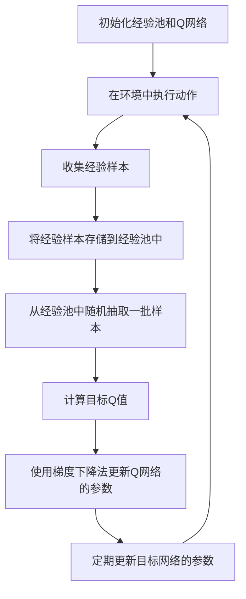

# 一切皆是映射：DQN在能源管理系统中的应用与价值

## 1.背景介绍

在现代社会，能源管理系统（EMS）在电力、石油、天然气等领域中扮演着至关重要的角色。随着能源需求的不断增长和可再生能源的普及，如何高效地管理和分配能源资源成为了一个亟待解决的问题。传统的能源管理方法往往依赖于经验和规则，难以应对复杂多变的能源环境。近年来，深度强化学习（Deep Reinforcement Learning, DRL）作为一种新兴的人工智能技术，展示了其在解决复杂决策问题中的巨大潜力。本文将探讨深度Q网络（Deep Q-Network, DQN）在能源管理系统中的应用与价值。

## 2.核心概念与联系

### 2.1 深度强化学习

深度强化学习结合了深度学习和强化学习的优势，通过神经网络来近似值函数，从而在高维状态空间中进行决策。其核心思想是通过与环境的交互，学习一个策略，使得在给定状态下采取的行动能够最大化累积奖励。

### 2.2 Q学习

Q学习是一种无模型的强化学习算法，通过学习状态-动作值函数（Q函数）来指导决策。Q函数表示在给定状态下采取某一动作所能获得的期望累积奖励。Q学习的更新公式为：

$$
Q(s, a) \leftarrow Q(s, a) + \alpha [r + \gamma \max_{a'} Q(s', a') - Q(s, a)]
$$

其中，$s$ 和 $a$ 分别表示状态和动作，$r$ 是即时奖励，$\alpha$ 是学习率，$\gamma$ 是折扣因子。

### 2.3 深度Q网络（DQN）

DQN通过神经网络来近似Q函数，解决了传统Q学习在高维状态空间中的计算难题。DQN的核心思想是使用经验回放和目标网络来稳定训练过程。经验回放通过存储过去的经验样本，打破样本之间的相关性，目标网络则通过固定一段时间内的目标值，减少训练过程中的振荡。

### 2.4 能源管理系统（EMS）

能源管理系统是用于监控、控制和优化能源生产、传输和消费的系统。EMS的目标是提高能源利用效率，降低能源成本，减少环境影响。EMS通常包括数据采集、状态估计、负荷预测、优化调度等功能模块。

## 3.核心算法原理具体操作步骤

### 3.1 环境建模

在应用DQN于EMS之前，首先需要对能源管理环境进行建模。环境包括状态空间、动作空间和奖励函数。状态空间可以包括能源生产、传输和消费的实时数据，动作空间可以包括能源分配和调度的决策，奖励函数则反映了能源利用效率和成本等目标。

### 3.2 神经网络设计

DQN使用神经网络来近似Q函数。神经网络的输入是当前状态，输出是每个动作的Q值。网络结构可以根据具体应用场景进行设计，常见的结构包括全连接网络、卷积神经网络（CNN）和循环神经网络（RNN）等。

### 3.3 经验回放

经验回放通过存储过去的经验样本，打破样本之间的相关性，从而提高训练的稳定性。经验样本包括状态、动作、奖励和下一个状态。每次训练时，从经验池中随机抽取一批样本进行训练。

### 3.4 目标网络

目标网络通过固定一段时间内的目标值，减少训练过程中的振荡。目标网络的参数每隔一定步数从主网络复制一次。

### 3.5 训练过程

DQN的训练过程包括以下步骤：

1. 初始化经验池和Q网络。
2. 在环境中执行动作，收集经验样本。
3. 将经验样本存储到经验池中。
4. 从经验池中随机抽取一批样本，计算目标Q值。
5. 使用梯度下降法更新Q网络的参数。
6. 定期更新目标网络的参数。

以下是DQN训练过程的Mermaid流程图：



## 4.数学模型和公式详细讲解举例说明

### 4.1 状态空间

状态空间是指系统在某一时刻的所有可能状态的集合。在EMS中，状态空间可以包括能源生产、传输和消费的实时数据。例如，状态可以表示为一个向量：

$$
s_t = [P_t, L_t, S_t]
$$

其中，$P_t$ 表示能源生产数据，$L_t$ 表示负荷数据，$S_t$ 表示储能数据。

### 4.2 动作空间

动作空间是指系统在某一时刻可以采取的所有可能动作的集合。在EMS中，动作空间可以包括能源分配和调度的决策。例如，动作可以表示为一个向量：

$$
a_t = [D_t, C_t]
$$

其中，$D_t$ 表示能源分配决策，$C_t$ 表示调度决策。

### 4.3 奖励函数

奖励函数是指系统在某一时刻采取某一动作后所获得的即时奖励。在EMS中，奖励函数可以反映能源利用效率和成本等目标。例如，奖励函数可以表示为：

$$
r_t = - (C_{energy} + C_{env})
$$

其中，$C_{energy}$ 表示能源成本，$C_{env}$ 表示环境成本。

### 4.4 Q函数

Q函数表示在给定状态下采取某一动作所能获得的期望累积奖励。Q函数的更新公式为：

$$
Q(s_t, a_t) \leftarrow Q(s_t, a_t) + \alpha [r_t + \gamma \max_{a'} Q(s_{t+1}, a') - Q(s_t, a_t)]
$$

其中，$s_t$ 和 $a_t$ 分别表示状态和动作，$r_t$ 是即时奖励，$\alpha$ 是学习率，$\gamma$ 是折扣因子。

### 4.5 目标Q值

目标Q值用于稳定训练过程，计算公式为：

$$
y_t = r_t + \gamma \max_{a'} Q'(s_{t+1}, a')
$$

其中，$Q'$ 表示目标网络的Q函数。

## 5.项目实践：代码实例和详细解释说明

### 5.1 环境建模

首先，我们需要定义能源管理环境。以下是一个简单的环境建模示例：

```python
import numpy as np

class EnergyManagementEnv:
    def __init__(self):
        self.state = self.reset()

    def reset(self):
        self.state = np.random.rand(3)  # 随机初始化状态
        return self.state

    def step(self, action):
        next_state = self.state + action  # 简单的状态转移
        reward = -np.sum(action**2)  # 奖励函数
        done = False  # 是否结束
        return next_state, reward, done
```

### 5.2 神经网络设计

接下来，我们设计一个简单的Q网络：

```python
import torch
import torch.nn as nn
import torch.optim as optim

class QNetwork(nn.Module):
    def __init__(self, state_size, action_size):
        super(QNetwork, self).__init__()
        self.fc1 = nn.Linear(state_size, 64)
        self.fc2 = nn.Linear(64, 64)
        self.fc3 = nn.Linear(64, action_size)

    def forward(self, state):
        x = torch.relu(self.fc1(state))
        x = torch.relu(self.fc2(x))
        return self.fc3(x)
```

### 5.3 经验回放

我们使用一个简单的经验回放池：

```python
from collections import deque
import random

class ReplayBuffer:
    def __init__(self, buffer_size):
        self.buffer = deque(maxlen=buffer_size)

    def add(self, experience):
        self.buffer.append(experience)

    def sample(self, batch_size):
        return random.sample(self.buffer, batch_size)

    def __len__(self):
        return len(self.buffer)
```

### 5.4 训练过程

最后，我们实现DQN的训练过程：

```python
env = EnergyManagementEnv()
state_size = 3
action_size = 2
q_network = QNetwork(state_size, action_size)
target_network = QNetwork(state_size, action_size)
target_network.load_state_dict(q_network.state_dict())
optimizer = optim.Adam(q_network.parameters())
replay_buffer = ReplayBuffer(buffer_size=10000)
batch_size = 64
gamma = 0.99
tau = 0.001

for episode in range(1000):
    state = env.reset()
    for t in range(200):
        action = q_network(torch.FloatTensor(state)).detach().numpy()
        next_state, reward, done = env.step(action)
        replay_buffer.add((state, action, reward, next_state, done))
        state = next_state

        if len(replay_buffer) > batch_size:
            batch = replay_buffer.sample(batch_size)
            states, actions, rewards, next_states, dones = zip(*batch)
            states = torch.FloatTensor(states)
            actions = torch.FloatTensor(actions)
            rewards = torch.FloatTensor(rewards)
            next_states = torch.FloatTensor(next_states)

            q_values = q_network(states).gather(1, actions.long().unsqueeze(1)).squeeze(1)
            next_q_values = target_network(next_states).max(1)[0]
            target_q_values = rewards + gamma * next_q_values * (1 - torch.FloatTensor(dones))

            loss = nn.MSELoss()(q_values, target_q_values.detach())
            optimizer.zero_grad()
            loss.backward()
            optimizer.step()

            for target_param, param in zip(target_network.parameters(), q_network.parameters()):
                target_param.data.copy_(tau * param.data + (1 - tau) * target_param.data)
```

## 6.实际应用场景

### 6.1 电力系统

在电力系统中，DQN可以用于优化电力调度和负荷管理。通过实时监控电力生产和消费数据，DQN可以动态调整电力分配策略，提高电力利用效率，降低电力成本。

### 6.2 可再生能源

在可再生能源系统中，DQN可以用于优化风能、太阳能等可再生能源的利用。通过预测天气和负荷变化，DQN可以动态调整能源生产和储存策略，提高可再生能源的利用率，减少对传统能源的依赖。

### 6.3 智能电网

在智能电网中，DQN可以用于优化电网的运行和维护。通过实时监控电网状态和负荷数据，DQN可以动态调整电网的运行策略，提高电网的稳定性和可靠性，减少电力损耗。

## 7.工具和资源推荐

### 7.1 开源框架

- **TensorFlow**：一个广泛使用的深度学习框架，支持DQN的实现和训练。
- **PyTorch**：另一个流行的深度学习框架，具有灵活的动态计算图，适合DQN的实现和调试。
- **OpenAI Gym**：一个用于开发和比较强化学习算法的工具包，提供了丰富的环境和接口。

### 7.2 学习资源

- **《深度强化学习》**：一本系统介绍深度强化学习理论和实践的书籍，适合初学者和进阶者。
- **Coursera上的强化学习课程**：由知名教授讲授的在线课程，涵盖了强化学习的基本概念和算法。
- **GitHub上的DQN实现**：许多开源项目提供了DQN的实现代码，可以作为学习和参考的资源。

## 8.总结：未来发展趋势与挑战

### 8.1 未来发展趋势

随着深度学习和强化学习技术的不断发展，DQN在能源管理系统中的应用前景广阔。未来，DQN有望在以下几个方面取得突破：

- **多智能体系统**：在复杂的能源管理系统中，多个智能体之间的协作和竞争将成为研究热点。
- **自适应学习**：DQN将更加注重自适应学习，能够在动态变化的环境中快速调整策略。
- **大规模应用**：DQN将在更大规模的能源管理系统中得到应用，提高系统的整体效率和稳定性。

### 8.2 挑战

尽管DQN在能源管理系统中展示了巨大的潜力，但仍面临一些挑战：

- **计算资源**：DQN的训练过程需要大量的计算资源，如何高效利用计算资源是一个重要问题。
- **数据质量**：DQN的性能依赖于高质量的数据，如何获取和处理高质量的数据是一个关键问题。
- **安全性和可靠性**：在实际应用中，DQN的决策可能会影响系统的安全性和可靠性，如何保证DQN的安全性和可靠性是一个重要挑战。

## 9.附录：常见问题与解答

### 9.1 DQN与传统Q学习的区别是什么？

DQN通过神经网络来近似Q函数，解决了传统Q学习在高维状态空间中的计算难题。DQN还引入了经验回放和目标网络，稳定了训练过程。

### 9.2 如何选择DQN的超参数？

DQN的超参数包括学习率、折扣因子、经验池大小、批量大小等。可以通过交叉验证和网格搜索等方法来选择合适的超参数。

### 9.3 DQN在能源管理系统中的应用效果如何？

DQN在能源管理系统中的应用效果取决于具体的应用场景和数据质量。在一些实际应用中，DQN已经展示了其在提高能源利用效率和降低能源成本方面的潜力。

### 9.4 如何处理DQN训练过程中的过拟合问题？

可以通过增加训练数据、使用正则化技术、调整网络结构等方法来处理DQN训练过程中的过拟合问题。

### 9.5 DQN在多智能体系统中的应用前景如何？

DQN在多智能体系统中的应用前景广阔。通过多个智能体之间的协作和竞争，可以实现更高效的能源管理和调度。

---

作者：禅与计算机程序设计艺术 / Zen and the Art of Computer Programming