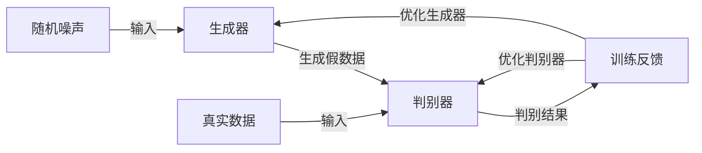

# 一切皆是映射：GANs生成对抗网络的原理和应用

## 1. 背景介绍
生成对抗网络（GANs）自2014年由Ian Goodfellow提出以来，已经成为深度学习领域的一颗耀眼新星。GANs的核心思想是通过对抗过程训练两个神经网络，一个生成网络（Generator）和一个判别网络（Discriminator），它们相互竞争，相互促进，最终生成网络能够产生高质量的数据。

## 2. 核心概念与联系
GANs的核心概念包括生成器、判别器以及对抗的训练机制。生成器的目标是产生尽可能接近真实数据的假数据，而判别器的目标是区分真实数据和生成器产生的假数据。这一过程可以类比于伪造者和警察的博弈。



## 3. 核心算法原理具体操作步骤
GANs的训练过程可以分为以下几个步骤：
1. 从先验噪声分布中采样得到噪声数据。
2. 将噪声数据输入生成器，生成器输出假数据。
3. 将真实数据和假数据一同输入判别器。
4. 判别器输出对真实数据和假数据的判别结果。
5. 根据判别结果，通过反向传播算法更新生成器和判别器的参数。

## 4. 数学模型和公式详细讲解举例说明
GANs的数学模型基于博弈论中的零和游戏。其目标函数可以表示为：

$$
\min_G \max_D V(D, G) = \mathbb{E}_{x\sim p_{data}(x)}[\log D(x)] + \mathbb{E}_{z\sim p_z(z)}[\log(1 - D(G(z)))]
$$

其中，$G$ 表示生成器，$D$ 表示判别器，$p_{data}$ 是真实数据的分布，$p_z$ 是噪声的分布。生成器的目标是最小化这个函数，而判别器的目标是最大化它。

## 5. 项目实践：代码实例和详细解释说明
以TensorFlow为例，以下是一个简单的GANs模型的代码实现：

```python
import tensorflow as tf

# 定义生成器和判别器的网络结构
generator = ...
discriminator = ...

# 定义损失函数和优化器
gen_loss = ...
disc_loss = ...
gen_optimizer = ...
disc_optimizer = ...

# 训练循环
for epoch in range(epochs):
    for step, real_images in enumerate(dataset):
        noise = tf.random.normal([batch_size, noise_dim])
        with tf.GradientTape() as gen_tape, tf.GradientTape() as disc_tape:
            generated_images = generator(noise, training=True)
            real_output = discriminator(real_images, training=True)
            fake_output = discriminator(generated_images, training=True)
            
            gen_loss = ...
            disc_loss = ...
        
        gradients_of_generator = gen_tape.gradient(gen_loss, generator.trainable_variables)
        gradients_of_discriminator = disc_tape.gradient(disc_loss, discriminator.trainable_variables)
        
        gen_optimizer.apply_gradients(zip(gradients_of_generator, generator.trainable_variables))
        disc_optimizer.apply_gradients(zip(gradients_of_discriminator, discriminator.trainable_variables))
```

## 6. 实际应用场景
GANs在多个领域都有广泛的应用，包括但不限于图像合成、风格迁移、图像超分辨率、数据增强、药物发现等。

## 7. 工具和资源推荐
- TensorFlow
- PyTorch
- Keras
- NVIDIA's StyleGAN
- OpenAI's DALL-E

## 8. 总结：未来发展趋势与挑战
GANs的未来发展趋势包括提高生成数据的质量和多样性、降低训练难度、提升模型的稳定性等。挑战则包括模式崩溃、训练不稳定等问题。

## 9. 附录：常见问题与解答
Q1: GANs的训练为什么这么困难？
A1: GANs的训练涉及到一个动态的平衡过程，生成器和判别器的能力需要保持在一定的水平上，这使得训练过程非常微妙。

Q2: 如何判断GANs训练的好坏？
A2: 可以通过观察生成数据的质量、判别器的准确率以及损失函数的变化来判断。

作者：禅与计算机程序设计艺术 / Zen and the Art of Computer Programming