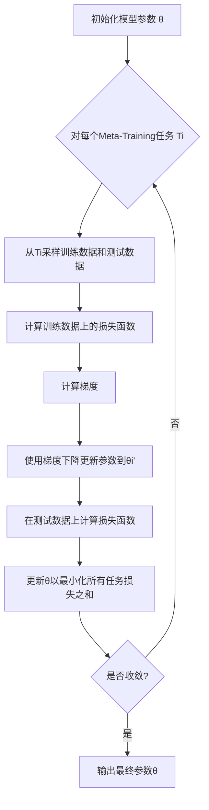

# 一切皆是映射：Meta-Reinforcement Learning的实战教程

## 1.背景介绍

### 1.1 强化学习的挑战

强化学习(Reinforcement Learning, RL)是机器学习中一个非常有前景和重要的领域,它旨在让智能体(Agent)通过与环境交互来学习如何采取最优策略,以最大化长期累积奖励。然而,传统的强化学习算法面临一些挑战:

1. **样本效率低下**: 在复杂环境中,智能体需要大量的试错来探索和学习,这种过程通常是低效和昂贵的。
2. **泛化性差**: 当智能体面临新的环境时,它很难将之前学到的知识直接迁移和应用。
3. **reward sparse**: 在许多实际问题中,环境的奖励反馈是稀疏和延迟的,这使得学习变得更加困难。

### 1.2 Meta-Reinforcement Learning的兴起

为了解决上述挑战,Meta-Reinforcement Learning(Meta-RL)应运而生。它的核心思想是在多个相关但不同的任务上进行训练,使智能体能够从这些任务中提取出通用的知识,并快速适应新的相似任务。Meta-RL将强化学习与元学习(Meta-Learning)相结合,旨在提高样本效率、增强泛化能力和加快学习速度。

## 2.核心概念与联系

### 2.1 元学习(Meta-Learning)

元学习是一种在机器学习领域中的范式,它关注如何设计学习算法,使其能够从过去的经验中获得知识,并将这些知识应用于新的学习任务。元学习的目标是提高学习效率,加快新任务的学习速度。

在元学习中,我们将整个学习过程分为两个阶段:

1. **Meta-Training阶段**: 在这个阶段,学习算法在一系列不同但相关的任务上进行训练,目的是学习一种通用的学习策略。
2. **Meta-Testing阶段**: 在这个阶段,学习算法面临一个全新的任务,它需要利用从Meta-Training阶段获得的知识来快速适应并解决这个新任务。

### 2.2 Meta-Reinforcement Learning

Meta-Reinforcement Learning将元学习的思想应用到强化学习领域。在Meta-RL中,我们将整个学习过程分为两个阶段:

1. **Meta-Training阶段**: 在这个阶段,智能体在一系列不同但相关的强化学习任务上进行训练,目的是学习一种通用的策略,使其能够快速适应新的相似任务。
2. **Meta-Testing阶段**: 在这个阶段,智能体面临一个全新的强化学习任务,它需要利用从Meta-Training阶段获得的知识来快速适应并解决这个新任务。

Meta-RL的核心思想是将强化学习任务视为一个映射(mapping)问题。在Meta-Training阶段,智能体学习一种通用的映射函数,将任务相关的信息(如环境状态、奖励等)映射到最优策略。在Meta-Testing阶段,智能体利用这个映射函数来快速适应新的任务,从而提高样本效率和泛化能力。

## 3.核心算法原理具体操作步骤

Meta-RL算法的核心思想是在Meta-Training阶段学习一个通用的映射函数,将任务相关的信息映射到最优策略。下面我们将介绍一种流行的Meta-RL算法:Model-Agnostic Meta-Learning (MAML)算法的原理和具体操作步骤。

### 3.1 MAML算法概述

MAML算法由Chelsea Finn等人在2017年提出,它是一种基于梯度的元学习算法。MAML的核心思想是在Meta-Training阶段,通过跨任务训练来学习一个好的初始化参数,使得在Meta-Testing阶段,只需要少量的梯度更新步骤就能快速适应新任务。

MAML算法的操作步骤如下:

1. 初始化模型参数 $\theta$
2. 对于每个Meta-Training任务 $\mathcal{T}_i$:
   a) 从任务 $\mathcal{T}_i$ 采样一批训练数据 $\mathcal{D}_i^{tr}$ 和测试数据 $\mathcal{D}_i^{ts}$
   b) 计算在训练数据上的损失函数 $\mathcal{L}_{\mathcal{T}_i}(\theta)$
   c) 计算梯度 $\nabla_\theta \mathcal{L}_{\mathcal{T}_i}(\theta)$
   d) 使用梯度下降法更新参数 $\theta_i' = \theta - \alpha \nabla_\theta \mathcal{L}_{\mathcal{T}_i}(\theta)$
   e) 在测试数据 $\mathcal{D}_i^{ts}$ 上计算损失函数 $\mathcal{L}_{\mathcal{T}_i}(\theta_i')$
3. 更新参数 $\theta$ 以最小化所有任务的损失函数之和: $\theta \leftarrow \theta - \beta \sum_i \nabla_\theta \mathcal{L}_{\mathcal{T}_i}(\theta_i')$
4. 重复步骤2和3,直到收敛

在Meta-Testing阶段,对于一个新任务 $\mathcal{T}_{new}$,我们从MAML算法学习到的初始化参数 $\theta$ 开始,只需要少量的梯度更新步骤就能快速适应这个新任务。

### 3.2 MAML算法流程图



## 4.数学模型和公式详细讲解举例说明

在MAML算法中,我们需要最小化所有Meta-Training任务的损失函数之和。具体来说,我们希望找到一个好的初始化参数 $\theta$,使得在每个任务 $\mathcal{T}_i$ 上,经过少量的梯度更新步骤后,模型在该任务的测试数据上的损失函数 $\mathcal{L}_{\mathcal{T}_i}(\theta_i')$ 最小。

我们定义Meta-Training的目标函数为:

$$\min_\theta \sum_{\mathcal{T}_i \sim p(\mathcal{T})} \mathcal{L}_{\mathcal{T}_i}(\theta_i')$$

其中, $\theta_i' = \theta - \alpha \nabla_\theta \mathcal{L}_{\mathcal{T}_i}(\theta)$ 表示在任务 $\mathcal{T}_i$ 上,使用梯度下降法从初始参数 $\theta$ 更新了一步得到的新参数。

我们可以使用随机梯度下降法来优化上述目标函数。在每一步迭代中,我们从任务分布 $p(\mathcal{T})$ 中采样一批任务 $\{\mathcal{T}_i\}$,然后计算目标函数关于 $\theta$ 的梯度:

$$\nabla_\theta \sum_{\mathcal{T}_i \sim p(\mathcal{T})} \mathcal{L}_{\mathcal{T}_i}(\theta_i') = \sum_{\mathcal{T}_i \sim p(\mathcal{T})} \nabla_\theta \mathcal{L}_{\mathcal{T}_i}(\theta_i')$$

根据链式法则,我们可以将上式展开为:

$$\nabla_\theta \mathcal{L}_{\mathcal{T}_i}(\theta_i') = \nabla_{\theta_i'} \mathcal{L}_{\mathcal{T}_i}(\theta_i') \cdot \nabla_\theta \theta_i'$$

由于 $\theta_i' = \theta - \alpha \nabla_\theta \mathcal{L}_{\mathcal{T}_i}(\theta)$,我们有:

$$\nabla_\theta \theta_i' = I - \alpha \nabla_\theta^2 \mathcal{L}_{\mathcal{T}_i}(\theta)$$

将上式代入,我们得到:

$$\nabla_\theta \mathcal{L}_{\mathcal{T}_i}(\theta_i') = \nabla_{\theta_i'} \mathcal{L}_{\mathcal{T}_i}(\theta_i') \cdot (I - \alpha \nabla_\theta^2 \mathcal{L}_{\mathcal{T}_i}(\theta))$$

在实际计算中,我们通常忽略二阶导数项 $\nabla_\theta^2 \mathcal{L}_{\mathcal{T}_i}(\theta)$,从而得到一个简化的近似梯度:

$$\nabla_\theta \mathcal{L}_{\mathcal{T}_i}(\theta_i') \approx \nabla_{\theta_i'} \mathcal{L}_{\mathcal{T}_i}(\theta_i')$$

使用这个近似梯度,我们可以通过随机梯度下降法来优化目标函数,从而得到一个好的初始化参数 $\theta$。

让我们用一个具体的例子来说明MAML算法的工作原理。假设我们有一个简单的回归问题,目标是学习一个函数 $f(x) = ax + b$,其中 $a$ 和 $b$ 是待学习的参数。我们将这个问题视为一个Meta-Learning问题,每个任务 $\mathcal{T}_i$ 对应着不同的 $(a_i, b_i)$ 值。

在Meta-Training阶段,我们从任务分布 $p(\mathcal{T})$ 中采样一批任务 $\{\mathcal{T}_i\}$,对于每个任务 $\mathcal{T}_i$,我们有一个训练数据集 $\mathcal{D}_i^{tr} = \{(x_j, y_j)\}$ 和测试数据集 $\mathcal{D}_i^{ts} = \{(x_j', y_j')\}$,其中 $y_j = a_i x_j + b_i$ 和 $y_j' = a_i x_j' + b_i$。

我们初始化模型参数 $\theta = (a, b)$,然后对于每个任务 $\mathcal{T}_i$,我们计算训练数据上的损失函数 $\mathcal{L}_{\mathcal{T}_i}(\theta) = \sum_{(x_j, y_j) \in \mathcal{D}_i^{tr}} (y_j - (ax_j + b))^2$,并使用梯度下降法更新参数到 $\theta_i' = (a_i', b_i')$。接下来,我们在测试数据 $\mathcal{D}_i^{ts}$ 上计算损失函数 $\mathcal{L}_{\mathcal{T}_i}(\theta_i') = \sum_{(x_j', y_j') \in \mathcal{D}_i^{ts}} (y_j' - (a_i' x_j' + b_i'))^2$。

最后,我们更新初始参数 $\theta$,使得所有任务的测试损失之和最小化:

$$\theta \leftarrow \theta - \beta \sum_i \nabla_\theta \mathcal{L}_{\mathcal{T}_i}(\theta_i')$$

其中,梯度 $\nabla_\theta \mathcal{L}_{\mathcal{T}_i}(\theta_i')$ 可以近似为:

$$\nabla_\theta \mathcal{L}_{\mathcal{T}_i}(\theta_i') \approx \sum_{(x_j', y_j') \in \mathcal{D}_i^{ts}} -2(y_j' - (a_i' x_j' + b_i')) \begin{bmatrix} x_j' \\ 1 \end{bmatrix}$$

通过重复上述过程,我们最终可以得到一个好的初始化参数 $\theta$,使得在Meta-Testing阶段,对于一个新的任务 $\mathcal{T}_{new}$,只需要少量的梯度更新步骤就能快速适应该任务。

## 5.项目实践：代码实例和详细解释说明

在这一部分,我们将提供一个基于PyTorch实现的MAML算法代码示例,并对关键部分进行详细解释。

### 5.1 环境设置

首先,我们需要导入必要的库和定义一些辅助函数。

```python
import torch
import torch.nn as nn
import torch.optim as optim
import numpy as np

def get_batch(x, y, batch_size):
    indices = np.random.choice(len(x), batch_size, replace=False)
    x_batch = x[indices]
    y_batch = y[indices]
    return x_batch, y_batch

def accuracy(y_pred, y_true):
    return np.mean(np.argmax(y_pred, axis=1) == y_true)
```

### 5.2 定义模型

接下来,我们