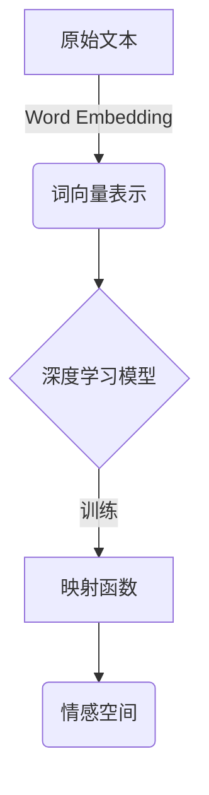

# 一切皆是映射：使用深度学习进行情感分析

## 1.背景介绍

在当今时代,信息的海量汹涌已成为一种常态。无论是在社交媒体平台、新闻网站还是企业内部系统,大量的文本数据每天都在不断产生和积累。然而,这些原始的文本数据对于机器来说并没有太多意义,因为它们无法理解文本背后所蕴含的情感和观点。因此,情感分析(Sentiment Analysis)应运而生,旨在自动识别、提取、量化和研究主观信息,如观点、情绪、态度等。

情感分析在许多领域都有广泛的应用前景,例如:

- 社交媒体监测:跟踪公众对品牌、产品或服务的反应
- 客户服务优化:及时发现并解决客户的不满情绪
- 政治舆情分析:预测选民的政治倾向和投票意向
- 金融市场监控:分析投资者对市场的情绪变化
- 智能助理:为聊天机器人提供情感化响应能力

## 2.核心概念与联系

情感分析的核心思想是将文本映射到情感空间中的一个点。这种映射可以是离散的(如正面、负面、中性等类别),也可以是连续的(如[-1,1]的实数范围)。

传统的方法通常依赖于情感词典和一系列手工制定的规则,但这种方法存在一些缺陷:

1. 词典覆盖有限,难以涵盖所有领域
2. 规则制定困难,需要大量的人工努力
3. 无法很好地处理上下文和语义信息

相比之下,深度学习模型能够自动从大量数据中学习文本到情感空间的映射规律,克服了传统方法的不足。常用的深度学习模型包括:

- **循环神经网络(RNN)**:适合处理序列数据,能捕捉上下文信息
- **卷积神经网络(CNN)**: 擅长提取局部特征,常用于文本分类任务
- **注意力机制(Attention)**: 赋予模型"注意力",关注输入数据中更重要的部分
- **transformer**: 全新的序列到序列模型,在各种NLP任务中表现出色
- **迁移学习**: 利用在大型语料上预训练的模型,将知识迁移到下游任务

这些模型通过端到端的训练,能够自动学习文本到情感空间的映射函数,从而完成情感分析任务。



## 3.核心算法原理具体操作步骤

深度学习在情感分析任务中的应用,可以概括为以下几个核心步骤:

1. **文本预处理**:对原始文本进行分词、去除停用词、词形还原等预处理,以符合模型的输入格式要求。

2. **词向量化**:将文本中的词语映射为稠密的实数向量表示,如Word2Vec、GloVe、FastText等方法。这种分布式表示能够很好地捕捉词语之间的语义关系。

3. **模型构建**:根据任务需求选择合适的深度学习模型结构,如RNN、CNN、Attention等。一些常见的模型包括LSTM、BiLSTM、TextCNN、Transformer等。

4. **模型训练**:使用标注好的情感数据集对模型进行有监督训练,学习文本到情感空间的映射函数。训练过程中需要选择合适的损失函数、优化器和超参数。

5. **模型评估**:在保留的测试集上评估模型的泛化性能,常用指标包括准确率、F1分数、AUC等。

6. **模型微调**:根据评估结果对模型进行微调,如特征工程、模型结构调整、超参数调优等,以提升模型性能。

7. **模型部署**:将训练好的模型集成到实际的应用系统中,对新的文本数据进行在线情感预测和分析。

需要注意的是,以上步骤并非一次性的,而是一个迭代优化的循环过程。数据质量、模型结构、训练策略等都会影响最终的情感分析效果。

## 4.数学模型和公式详细讲解举例说明

在情感分析任务中,常用的损失函数有**交叉熵损失**和**均方误差损失**。

### 4.1 交叉熵损失

交叉熵损失常用于分类问题,它衡量了模型预测的概率分布与真实标签之间的差异。对于二分类问题,交叉熵损失的公式如下:

$$J(\theta) = -\frac{1}{m}\sum_{i=1}^m[y^{(i)}\log(p^{(i)})+(1-y^{(i)})\log(1-p^{(i)})]$$

其中:
- $\theta$ 表示模型参数
- $m$ 为训练样本数量
- $y^{(i)}$ 为第 $i$ 个样本的真实标签,取值为0或1
- $p^{(i)}=P(y=1|x^{(i)};\theta)$ 为模型对第 $i$ 个样本预测为正例的概率

对于多分类问题,交叉熵损失的公式为:

$$J(\theta)=-\frac{1}{m}\sum_{i=1}^m\sum_{j=1}^k\mathbb{1}\{y^{(i)}=j\}\log(p_j^{(i)})$$

其中:
- $k$ 为类别数量
- $\mathbb{1}\{\cdot\}$ 为指示函数,当条件为真时取值1,否则为0
- $p_j^{(i)}=P(y=j|x^{(i)};\theta)$ 为模型对第 $i$ 个样本预测为第 $j$ 类的概率

在训练过程中,我们需要最小化损失函数,即找到最优参数 $\theta^*$:

$$\theta^*=\arg\min_\theta J(\theta)$$

这可以通过梯度下降等优化算法来实现。

### 4.2 均方误差损失

均方误差损失常用于回归问题,它衡量了模型预测值与真实值之间的平方差。对于情感分析任务,如果将情感分数看作连续值进行建模,可以使用均方误差损失。公式如下:

$$J(\theta)=\frac{1}{2m}\sum_{i=1}^m(y^{(i)}-\hat{y}^{(i)})^2$$

其中:
- $y^{(i)}$ 为第 $i$ 个样本的真实情感分数
- $\hat{y}^{(i)}=f(x^{(i)};\theta)$ 为模型对第 $i$ 个样本的情感分数预测值
- $f(\cdot;\theta)$ 表示模型的映射函数,由参数 $\theta$ 确定

同样,我们需要最小化损失函数以获得最优参数 $\theta^*$:

$$\theta^*=\arg\min_\theta J(\theta)$$

### 4.3 举例说明

假设我们有一个二分类情感分析任务,需要将电影评论分为正面和负面两类。我们使用一个双向LSTM模型,其输出为长度为2的向量,对应正负面的概率。

假设一条评论的真实标签为正面,模型的预测概率为 $[0.8, 0.2]$,则该样本的交叉熵损失为:

$$\begin{aligned}
J&=-\log(0.8)\\
&=-\log(0.8)\\
&=0.223
\end{aligned}$$

如果模型的预测概率为 $[0.6, 0.4]$,则损失为:

$$\begin{aligned}
J&=-\log(0.6)\\
&=0.511
\end{aligned}$$

可以看出,当模型预测的概率值偏离真实标签时,损失会变大。在训练过程中,我们需要通过优化算法不断调整模型参数,使损失函数最小化,从而获得更准确的情感分类模型。

## 5.项目实践:代码实例和详细解释说明

为了更好地理解如何使用深度学习进行情感分析,我们将基于PyTorch框架,以IMDB电影评论数据集为例,构建一个简单的文本分类模型。

### 5.1 数据预处理

首先,我们需要导入相关的库并加载数据集:

```python
import torch
from torchtext.legacy import data
from torchtext.legacy import datasets

# 设置种子以确保可重复性
SEED = 1234
torch.manual_seed(SEED)
torch.backends.cudnn.deterministic = True

# 加载IMDB数据集
TEXT = data.Field(tokenize='spacy', tokenizer_language='en_core_web_sm')
LABEL = data.LabelField(dtype=torch.float)

train_data, test_data = datasets.IMDB.splits(TEXT, LABEL)

# 构建词典
TEXT.build_vocab(train_data, max_size=25000, vectors="glove.6B.100d")
LABEL.build_vocab(train_data)

# 创建迭代器
BATCH_SIZE = 64
train_iterator, test_iterator = data.BucketIterator.splits(
    (train_data, test_data), 
    batch_size=BATCH_SIZE,
    sort_within_batch=True,
    device=device)
```

这里我们使用了PyTorch的torchtext库来加载和预处理数据。首先定义了两个Field对象,分别用于存储文本和标签数据。然后使用IMDB.splits函数加载了IMDB数据集,并构建了词典。最后,我们创建了训练集和测试集的迭代器,方便后续的批量训练和评估。

### 5.2 模型构建

接下来,我们定义一个基于LSTM的文本分类模型:

```python
import torch.nn as nn

class SentimentLSTM(nn.Module):
    def __init__(self, vocab_size, embedding_dim, hidden_dim, output_dim, n_layers, 
                 bidirectional, dropout, pad_idx):
        
        super().__init__()
        
        self.embedding = nn.Embedding(vocab_size, embedding_dim, padding_idx=pad_idx)
        self.lstm = nn.LSTM(embedding_dim, 
                            hidden_dim, 
                            num_layers=n_layers, 
                            bidirectional=bidirectional, 
                            dropout=dropout if n_layers > 1 else 0)
        self.fc = nn.Linear(hidden_dim * 2 if bidirectional else hidden_dim, output_dim)
        self.dropout = nn.Dropout(dropout)
        
    def forward(self, text):

        embedded = self.dropout(self.embedding(text))
        output, (hidden, cell) = self.lstm(embedded)
        hidden = self.dropout(torch.cat((hidden[-2,:,:], hidden[-1,:,:]), dim=1))
        return self.fc(hidden.squeeze(0))
```

这个模型包含以下几个主要组件:

- **Embedding层**: 将文本中的每个单词映射为一个稠密向量表示
- **LSTM层**: 一个或多个LSTM层,用于捕捉序列数据中的上下文信息
- **全连接层**: 将LSTM的输出映射到情感分数或类别概率
- **Dropout层**: 用于防止过拟合

在forward函数中,我们首先将输入文本通过Embedding层获得词向量表示,然后送入LSTM层进行序列建模。最后,我们将最后一个时间步的隐藏状态(如果是双向LSTM,则将正反向的隐藏状态拼接)输入到全连接层,得到情感分类的结果。

### 5.3 模型训练

定义好模型后,我们可以进行训练了:

```python
import torch.optim as optim

model = SentimentLSTM(len(TEXT.vocab), 100, 256, 1, 2, True, 0.5, TEXT.vocab.stoi[TEXT.pad_token])
optimizer = optim.Adam(model.parameters())
criterion = nn.BCEWithLogitsLoss()

model = model.to(device)
criterion = criterion.to(device)

def binary_accuracy(preds, y):
    rounded_preds = torch.round(torch.sigmoid(preds))
    correct = (rounded_preds == y).float() 
    acc = correct.sum() / len(correct)
    return acc

def train(model, iterator, optimizer, criterion):
    
    epoch_loss = 0
    epoch_acc = 0
    
    model.train()
    
    for batch in iterator:
        
        optimizer.zero_grad()
        
        text, label = batch.text.to(device), batch.label.to(device)
        
        predictions = model(text).squeeze(1)
        
        loss = criterion(predictions, label)
        
        acc = binary_accuracy(predictions, label)
        
        loss.backward()
        
        optimizer.step()
        
        epoch_loss += loss.item()
        epoch_acc += acc.item()
        
    return epoch_loss / len(iterator), epoch_acc / len(iterator)
```

这里我们定义了一个二元交叉熵损失函数,以及一个用于计算二分类准确率的函数。在train函数中,我们遍历训练集的每一个批次,前向传播获得预测结果