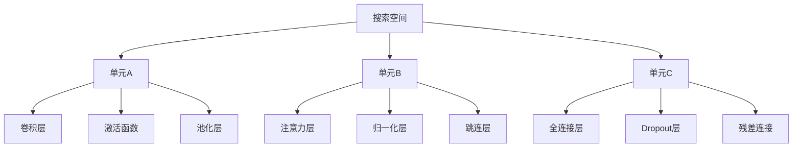
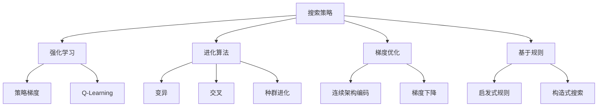
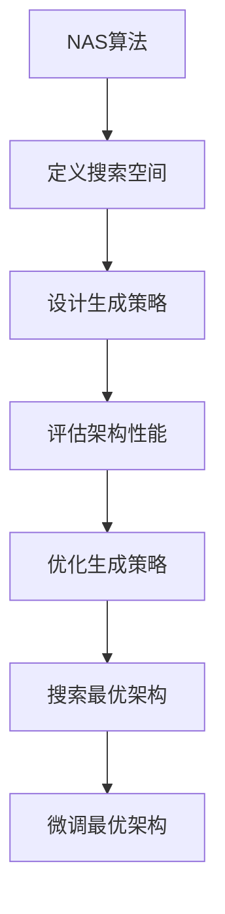

# 一切皆是映射：元学习中的神经架构搜索（NAS）

## 1. 背景介绍

### 1.1 人工智能的发展历程

人工智能(Artificial Intelligence, AI)是当代科技发展的重要领域,其目标是创造出能够模拟人类智能行为的智能系统。自20世纪50年代诞生以来,人工智能经历了几个重要的发展阶段。

早期的人工智能系统主要基于符号主义和逻辑推理,如专家系统和规则引擎等。20世纪80年代,机器学习和神经网络的兴起,使得人工智能系统能够从数据中自动学习模式和规律,这推动了人工智能的快速发展。

### 1.2 深度学习的兴起

21世纪初,benefiting 于大数据、强大计算能力和新算法的支持,深度学习(Deep Learning)作为一种强大的机器学习方法崭露头角。深度神经网络能够自动从原始数据中学习多层次的抽象特征表示,在计算机视觉、自然语言处理、语音识别等领域取得了突破性的进展。

### 1.3 神经网络架构设计的挑战

尽管深度学习取得了巨大成功,但神经网络架构的设计仍然是一个巨大的挑战。传统上,神经网络架构需要由人工智能专家手动设计,这是一个费时且需要大量经验的过程。不同的任务往往需要不同的网络架构,而找到最优架构通常需要进行大量的试验和调优。

### 1.4 神经架构搜索(NAS)的兴起

为了解决神经网络架构设计的挑战,神经架构搜索(Neural Architecture Search, NAS)应运而生。NAS旨在自动搜索出针对特定任务的最优神经网络架构,从而减轻人工设计的负担。NAS被视为元学习(Meta Learning)的一个重要分支,它将神经网络架构搜索问题转化为一个优化问题,通过搜索算法在一定的搜索空间内找到性能最优的架构。

## 2. 核心概念与联系

### 2.1 元学习(Meta Learning)

元学习是机器学习中的一个重要概念,它指的是学习如何更好地学习。传统的机器学习算法通常在固定的任务和数据集上进行训练,而元学习则旨在从多个相关任务中学习一种通用的学习策略,从而更好地适应新的任务和环境。

元学习可以分为以下几种范式:

- **学习优化过程(Learning to Optimize)**: 学习一种通用的优化策略,使得在新的任务上可以快速收敛。
- **学习模型(Learning Models)**: 直接学习一个可以快速适应新任务的模型。
- **学习更新规则(Learning Update Rules)**: 学习一种通用的模型更新规则,以便在新任务上快速调整模型参数。

神经架构搜索(NAS)属于元学习中的"学习模型"范式,它旨在学习一种通用的神经网络架构生成策略,从而在新的任务上快速找到合适的架构。

### 2.2 NAS 中的搜索空间

在 NAS 中,需要首先定义一个搜索空间,即所有可能的神经网络架构集合。搜索空间的设计直接影响到 NAS 的性能和效率。一个常见的做法是使用基于单元的搜索空间,将神经网络架构表示为一系列可重复使用的单元(如卷积单元、注意力单元等)的组合。

每个单元内部的结构通常是预定义的,而 NAS 需要搜索的是这些单元之间的连接方式和组合顺序。这种表示方式可以大大缩小搜索空间的规模,同时保留了足够的灵活性来表示各种复杂的架构。

### 2.3 NAS 中的搜索策略

在定义了搜索空间后,NAS 需要采用一种有效的搜索策略来在这个空间中找到最优的神经网络架构。常见的搜索策略包括:

- **强化学习(Reinforcement Learning)**: 将架构生成过程建模为马尔可夫决策过程,通过强化学习算法(如策略梯度)来优化生成策略。
- **进化算法(Evolutionary Algorithms)**: 将神经网络架构编码为基因,通过模拟生物进化过程(如变异、交叉等)来进行架构搜索。
- **梯度优化(Gradient-based Optimization)**: 将架构表示为一个连续的向量,并通过梯度下降等优化算法直接优化这个向量。
- **基于规则的搜索(Rule-based Search)**: 根据一些预定义的规则和启发式方法来生成和评估架构。

不同的搜索策略各有优缺点,需要根据具体问题和计算资源进行权衡选择。

## 3. 核心算法原理具体操作步骤

虽然不同的 NAS 算法在具体实现上有所不同,但它们的基本工作流程是类似的。下面我们将介绍一种基于强化学习的 NAS 算法的具体操作步骤。

### 3.1 定义搜索空间

首先,我们需要定义神经网络架构的搜索空间。一种常见的做法是使用基于单元的搜索空间,将神经网络架构表示为一系列可重复使用的单元(如卷积单元、注意力单元等)的组合。

每个单元内部的结构通常是预定义的,而 NAS 需要搜索的是这些单元之间的连接方式和组合顺序。这种表示方式可以大大缩小搜索空间的规模,同时保留了足够的灵活性来表示各种复杂的架构。

### 3.2 设计生成策略

接下来,我们需要设计一个生成策略(Generator)来生成候选的神经网络架构。在强化学习的框架下,生成策略通常被建模为一个策略网络(Policy Network),它接受当前的状态作为输入,输出下一步的动作(即选择哪个单元或连接方式)的概率分布。

生成策略的目标是最大化生成的架构在验证集上的性能,因此它需要通过强化学习算法(如策略梯度)来进行优化。

### 3.3 评估架构性能

对于每一个生成的候选架构,我们需要在验证集上评估它的性能。这通常需要先在训练集上训练该架构,然后在验证集上测试它的准确率或其他指标。

由于训练神经网络是一个计算密集型的过程,因此评估架构性能往往是 NAS 算法中最耗时的部分。为了提高效率,一些 NAS 算法采用了一些加速技术,如低保真度(Low-fidelity)估计、提前终止(Early Stopping)等。

### 3.4 优化生成策略

根据每个候选架构在验证集上的性能,我们可以计算出相应的奖励信号(Reward Signal)。在强化学习框架下,这个奖励信号被用于更新生成策略的参数,以提高未来生成更优架构的概率。

常见的优化算法包括策略梯度(Policy Gradient)、近端策略优化(Proximal Policy Optimization, PPO)等。优化过程通常需要多次迭代,直到生成策略收敛或达到预定的性能目标。

### 3.5 搜索最优架构

经过多次迭代优化后,生成策略应该能够生成性能较好的神经网络架构。我们可以使用这个生成策略多次采样,并选择在验证集上性能最优的架构作为最终的输出。

有些 NAS 算法还会对最优架构进行进一步的微调(Fine-tuning),以提高它在测试集上的性能。

## 4. 数学模型和公式详细讲解举例说明

在介绍 NAS 的数学模型之前,我们先回顾一下强化学习(Reinforcement Learning)的基本概念。

### 4.1 强化学习基础

强化学习是一种基于奖惩机制的机器学习范式,其目标是让智能体(Agent)通过与环境(Environment)的交互,学习一种策略(Policy)来最大化未来的累积奖励(Cumulative Reward)。

强化学习问题通常被建模为一个马尔可夫决策过程(Markov Decision Process, MDP),它可以用一个元组 $(S, A, P, R, \gamma)$ 来表示:

- $S$ 是状态空间(State Space),表示环境可能的状态集合。
- $A$ 是动作空间(Action Space),表示智能体可以执行的动作集合。
- $P(s' \mid s, a)$ 是状态转移概率(State Transition Probability),表示在状态 $s$ 下执行动作 $a$ 后,转移到状态 $s'$ 的概率。
- $R(s, a)$ 是奖励函数(Reward Function),表示在状态 $s$ 下执行动作 $a$ 后获得的即时奖励。
- $\gamma \in [0, 1)$ 是折现因子(Discount Factor),用于权衡即时奖励和未来奖励的重要性。

智能体的目标是学习一个策略 $\pi(a \mid s)$,即在给定状态 $s$ 下选择动作 $a$ 的概率分布,使得期望的累积奖励 $G_t = \sum_{k=0}^{\infty} \gamma^k R_{t+k+1}$ 最大化。

### 4.2 策略梯度算法

策略梯度(Policy Gradient)是强化学习中一种常用的优化算法,它将策略 $\pi$ 参数化为一个神经网络,并通过梯度上升的方式来优化这个策略网络的参数,使得期望的累积奖励最大化。

具体地,策略梯度算法的目标是最大化目标函数 $J(\theta) = \mathbb{E}_{\pi_\theta}[G_t]$,其中 $\theta$ 是策略网络的参数,$G_t$ 是从时间步 $t$ 开始的累积奖励。根据策略梯度定理,目标函数的梯度可以写为:

$$\nabla_\theta J(\theta) = \mathbb{E}_{\pi_\theta}\left[\sum_{t=0}^{\infty}\nabla_\theta\log\pi_\theta(a_t|s_t)G_t\right]$$

在实践中,我们通常使用一个基线(Baseline) $b_t$ 来减小梯度的方差,得到以下更稳定的梯度估计:

$$\nabla_\theta J(\theta) \approx \sum_{t=0}^{T}\nabla_\theta\log\pi_\theta(a_t|s_t)(G_t - b_t)$$

其中 $T$ 是一个episode的长度,基线 $b_t$ 可以是一个状态值函数(State-Value Function)或其他形式的基线估计。

通过这种方式,我们可以使用梯度上升算法(如随机梯度下降)来迭代更新策略网络的参数 $\theta$,从而不断提高策略的性能。

### 4.3 NAS 中的策略梯度

在 NAS 的背景下,我们可以将神经网络架构的生成过程建模为一个马尔可夫决策过程。具体来说:

- 状态 $s$ 表示当前已经生成的部分架构。
- 动作 $a$ 表示选择下一个单元或连接方式。
- 状态转移概率 $P(s' \mid s, a)$ 是确定性的,即执行动作 $a$