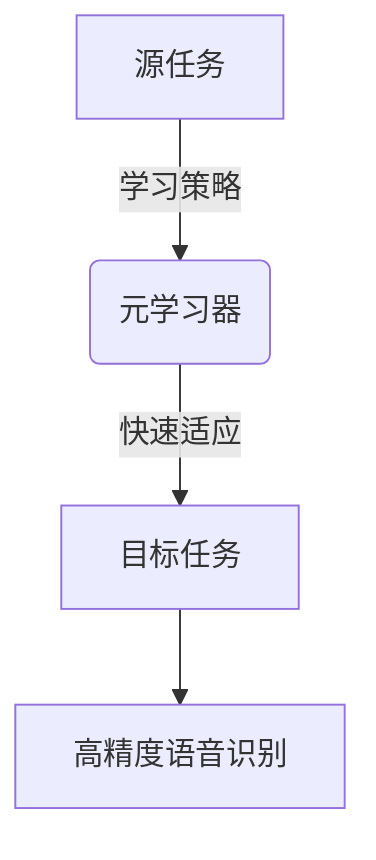

# 一切皆是映射：元学习在语音识别领域的研究进展

## 1.背景介绍

语音识别是人工智能领域的一个重要分支,旨在将人类的语音转换为相应的文本或命令。随着深度学习技术的不断发展,语音识别的准确率有了大幅提升,但传统的深度学习模型需要大量标注数据进行训练,这使得将其应用于新领域或语种时面临巨大挑战。

元学习(Meta-Learning)作为一种新兴的机器学习范式,通过学习"如何学习",使模型能够快速适应新的任务,从而有效缓解数据稀缺问题。近年来,元学习在计算机视觉、自然语言处理等领域取得了卓越的成绩,在语音识别领域也引起了广泛关注。

### 1.1 语音识别的挑战

语音识别面临诸多挑战,例如:

- 说话人的差异(年龄、性别、口音等)
- 环境噪音的影响
- 语音数据的稀缺性
- 新领域或语种的适应性差

传统的深度学习模型需要大量标注数据进行训练,但是为每种新的场景或语种重新收集和标注数据是一项艰巨的任务。因此,如何在有限的数据条件下快速适应新任务,是语音识别领域亟待解决的问题。

### 1.2 元学习的契机

元学习为解决上述问题提供了一种新思路。通过在源任务上学习一种"学习策略",模型可以在目标任务上快速适应,减少对大量标注数据的依赖。这种"学会学习"的能力使得模型具有更强的泛化能力,能够更好地适应新的环境和任务。

## 2.核心概念与联系

### 2.1 元学习的核心思想

元学习的核心思想是"学会学习"。具体来说,模型在源任务上学习一种"学习策略",然后将这种策略迁移到目标任务上,从而快速适应新任务。这种"学习如何学习"的思路极大地提高了模型的泛化能力。

### 2.2 元学习与语音识别的联系

在语音识别领域,我们可以将一种语言或场景视为一个"任务"。通过在源语言(如英语)上学习一种"学习策略",模型可以快速适应目标语言(如中文),从而减少对大量标注数据的依赖。

此外,元学习还可以应用于说话人适应、噪音环境适应等场景,提高模型的鲁棒性和适应性。



## 3.核心算法原理具体操作步骤

元学习算法主要分为三个步骤:

1. **元训练(Meta-Training)**: 在源任务上训练模型,学习一种"学习策略"。
2. **内循环(Inner Loop)**: 在目标任务上快速适应,根据"学习策略"对模型进行微调。
3. **外循环(Outer Loop)**: 根据目标任务的性能,优化"学习策略"。

这三个步骤交替进行,直至模型在目标任务上达到理想的性能。下面将详细介绍其中的关键步骤。

### 3.1 元训练(Meta-Training)

元训练阶段的目标是学习一种通用的"学习策略"。具体来说,我们在一组源任务上训练模型,使其能够快速适应新的任务。

常用的元训练方法包括:

- **MAML(Model-Agnostic Meta-Learning)**: 通过梯度下降的方式优化模型参数,使其能够快速适应新任务。
- **Reptile**: 一种简化的MAML变体,计算量更小,收敛更快。
- **Meta-SGD**: 将"学习率"视为可学习的参数,通过元训练自动调整学习率。

以MAML为例,其训练过程如下:

1. 从源任务集合中采样一批任务
2. 对于每个任务:
    - 计算支持集(Support Set)上的损失
    - 通过梯度下降更新模型参数
    - 计算查询集(Query Set)上的损失
3. 反向传播,优化模型参数,使查询集损失最小化

通过上述过程,模型学习到一种"学习策略",能够快速适应新任务。

### 3.2 内循环(Inner Loop)

在目标任务上,我们根据"学习策略"对模型进行微调,实现快速适应。

以MAML为例,内循环的具体步骤如下:

1. 从目标任务的支持集中采样一批数据
2. 根据MAML的"学习策略",通过梯度下降更新模型参数
3. 在查询集上评估模型性能

通过内循环,模型在目标任务上实现了快速适应,无需大量标注数据。

### 3.3 外循环(Outer Loop)

在外循环中,我们根据目标任务的性能,优化"学习策略"。

以MAML为例,外循环的具体步骤如下:

1. 在目标任务的查询集上计算损失
2. 反向传播,优化MAML的"学习策略"参数,使查询集损失最小化

通过交替进行内外循环,模型逐步优化"学习策略",提高在目标任务上的性能。

## 4.数学模型和公式详细讲解举例说明

### 4.1 MAML算法数学模型

MAML(Model-Agnostic Meta-Learning)是一种广为人知的元学习算法,其数学模型如下:

假设我们有一个模型 $f_{\theta}$,其参数为 $\theta$。在元训练阶段,我们从任务分布 $p(\mathcal{T})$ 中采样一批任务 $\mathcal{T}_i$。对于每个任务 $\mathcal{T}_i$,我们有支持集 $\mathcal{D}_i^{tr}$ 和查询集 $\mathcal{D}_i^{val}$。

我们的目标是找到一个好的初始参数 $\theta$,使得在每个任务上,通过梯度下降更新后的参数 $\theta_i'$ 能够最小化查询集的损失:

$$
\theta' = \arg\min_{\theta} \sum_{\mathcal{T}_i \sim p(\mathcal{T})} \mathcal{L}_{\mathcal{T}_i}(f_{\theta_i'})
$$

其中 $\theta_i'$ 是通过在支持集上进行梯度下降得到的:

$$
\theta_i' = \theta - \alpha \nabla_{\theta} \mathcal{L}_{\mathcal{T}_i}(f_{\theta})
$$

将 $\theta_i'$ 代入上式,我们得到MAML的优化目标:

$$
\min_{\theta} \sum_{\mathcal{T}_i \sim p(\mathcal{T})} \mathcal{L}_{\mathcal{T}_i}(f_{\theta_i'}) \\
\text{s.t. } \theta_i' = \theta - \alpha \nabla_{\theta} \mathcal{L}_{\mathcal{T}_i}(f_{\theta})
$$

通过优化上述目标函数,我们可以得到一个好的初始参数 $\theta$,使得在新任务上只需少量梯度更新,就能获得良好的性能。

### 4.2 Reptile算法

Reptile是一种简化的MAML变体,计算量更小,收敛更快。其核心思想是将每个任务的最优参数平均,作为下一步的初始参数。

具体来说,Reptile算法的步骤如下:

1. 初始化模型参数 $\theta$
2. 重复以下步骤:
    - 从任务分布中采样一批任务 $\{\mathcal{T}_i\}$
    - 对于每个任务 $\mathcal{T}_i$:
        - 计算支持集损失 $\mathcal{L}_{\mathcal{T}_i}(f_{\theta})$
        - 通过梯度下降更新参数: $\theta_i' = \theta - \alpha \nabla_{\theta} \mathcal{L}_{\mathcal{T}_i}(f_{\theta})$
    - 更新模型参数: $\theta \leftarrow \theta + \beta (\frac{1}{N} \sum_i (\theta_i' - \theta))$

其中 $\alpha$ 是内循环的学习率, $\beta$ 是外循环的学习率, $N$ 是任务批次大小。

Reptile算法的优点是计算简单,收敛速度快,但其缺点是无法像MAML那样直接优化内循环的更新步骤。

### 4.3 Meta-SGD算法

Meta-SGD是另一种元学习算法,其核心思想是将"学习率"视为可学习的参数,通过元训练自动调整学习率。

具体来说,Meta-SGD引入了一个新的学习率向量 $\lambda$,用于替换原有的学习率 $\alpha$。在内循环中,参数更新公式变为:

$$
\theta_i' = \theta - \lambda \odot \nabla_{\theta} \mathcal{L}_{\mathcal{T}_i}(f_{\theta})
$$

其中 $\odot$ 表示元素wise乘积。

在外循环中,我们不仅优化模型参数 $\theta$,还优化学习率向量 $\lambda$,使查询集损失最小化:

$$
\min_{\theta, \lambda} \sum_{\mathcal{T}_i \sim p(\mathcal{T})} \mathcal{L}_{\mathcal{T}_i}(f_{\theta_i'}) \\
\text{s.t. } \theta_i' = \theta - \lambda \odot \nabla_{\theta} \mathcal{L}_{\mathcal{T}_i}(f_{\theta})
$$

通过联合优化 $\theta$ 和 $\lambda$,Meta-SGD能够自动调整每个参数的学习率,提高模型的适应能力。

## 5.项目实践:代码实例和详细解释说明

为了更好地理解元学习在语音识别中的应用,我们将通过一个基于Reptile算法的示例项目进行说明。

### 5.1 问题描述

假设我们有一个语音识别任务,需要将语音转录为文本。我们有一个源语言(如英语)的数据集,以及多个目标语言(如中文、西班牙语等)的少量数据。我们的目标是利用元学习,在源语言上学习一种"学习策略",然后将其迁移到目标语言,实现快速适应。

### 5.2 数据准备

我们使用 `torchaudio` 库加载语音数据,并将其转换为梅尔频谱图(Mel Spectrogram)作为模型输入。

```python
import torchaudio

def load_data(path):
    waveform, sample_rate = torchaudio.load(path)
    mel_specgram = torchaudio.transforms.MelSpectrogram(sample_rate)(waveform)
    return mel_specgram
```

### 5.3 模型定义

我们使用一个基于CNN的简单模型,将梅尔频谱图映射到文本序列。

```python
import torch.nn as nn

class SpeechModel(nn.Module):
    def __init__(self):
        super().__init__()
        self.cnn = nn.Sequential(
            nn.Conv2d(1, 32, kernel_size=3, padding=1),
            nn.ReLU(),
            nn.MaxPool2d(2),
            nn.Conv2d(32, 64, kernel_size=3, padding=1),
            nn.ReLU(),
            nn.MaxPool2d(2)
        )
        self.rnn = nn.GRU(64 * 8 * 4, 256, bidirectional=True, batch_first=True)
        self.fc = nn.Linear(512, 28)

    def forward(self, x):
        x = self.cnn(x)
        x = x.permute(0, 2, 3, 1).contiguous().view(x.size(0), -1, 64 * 8 * 4)
        x, _ = self.rnn(x)
        x = self.fc(x)
        return x
```

### 5.4 Reptile算法实现

我们使用 `higher` 库实现Reptile算法,该库提供了高阶导数的计算功能,方便实现元学习算法。

```python
import higher

def reptile_train(model, optimizer, tasks, meta_batch_size=4, inner_steps=5, outer_steps=100):
    meta_optimizer = higher.get_flat_higher_optim(optimizer, model)

    for outer_step in range(outer_steps):
        meta_batch = random.sample(tasks, meta_batch_size)
        model.train()

        grads = []
        for task in meta_batch:
            support_x, support_y, query_x, query_y = task
            with higher.innerloop_ctx(model, optimizer, copy_initial_weights=False) as (
                fmodel,
                diffopt,
            ):
                for inner_step in range(inner_steps):
                    preds = fmodel(support_x)
                    loss = F.cross_entropy(p