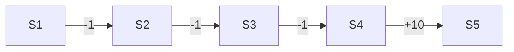

# 一切皆是映射：强化学习在金融市场预测中的应用：挑战与机遇

## 1. 背景介绍

### 1.1 强化学习概述

强化学习(Reinforcement Learning, RL)是机器学习的一个重要分支,它研究如何基于环境而行动,以取得最大化的预期利益。与监督学习和非监督学习不同,强化学习更加注重如何基于环境而行动,并不断地通过试错来学习。

### 1.2 强化学习在金融领域的应用现状

近年来,随着人工智能技术的飞速发展,强化学习开始被广泛应用于金融领域,尤其是在金融市场预测和交易策略优化方面取得了显著的研究成果。许多研究者和金融机构开始探索利用强化学习来解决金融市场预测和交易中的实际问题。

### 1.3 强化学习在金融市场预测中面临的机遇与挑战

尽管强化学习在金融市场预测中展现出了巨大的潜力,但同时也面临着诸多挑战。金融市场是一个高度复杂、动态多变、噪声较大的环境,对强化学习算法提出了更高的要求。如何设计出高效、稳健、可解释的强化学习模型,是当前亟需解决的关键问题。

## 2. 核心概念与联系

### 2.1 马尔可夫决策过程

马尔可夫决策过程(Markov Decision Process, MDP)是强化学习的理论基础。MDP由状态集合S、动作集合A、状态转移概率P和奖励函数R构成。在每个时间步,智能体根据当前状态采取一个动作,环境根据当前状态和动作转移到下一个状态,并给予智能体一定的奖励。智能体的目标就是找到一个最优策略π,使得累积奖励最大化。

### 2.2 值函数与策略函数 

值函数和策略函数是强化学习的两个核心概念。值函数刻画了在某一状态下采取动作能带来的长期累积奖励,常见的值函数有状态值函数V(s)和动作值函数Q(s,a)。策略函数则定义了智能体在每一个状态下应该采取的动作,分为确定性策略和随机性策略。强化学习的主要任务就是学习最优的值函数或策略函数。

### 2.3 探索与利用

探索(Exploration)和利用(Exploitation)是强化学习中的一对矛盾。探索是指智能体尝试一些新的动作,以发现可能存在的更优策略;利用则是指智能体基于已有的经验,选择已知的最优动作。如何在探索和利用之间权衡,是强化学习需要解决的关键问题之一。常见的探索策略有ε-贪心探索和Boltzmann探索等。

### 2.4 深度强化学习

深度强化学习(Deep Reinforcement Learning, DRL)将深度学习与强化学习结合,利用深度神经网络来逼近值函数或策略函数,从而增强了强化学习处理高维状态空间的能力。典型的DRL算法包括DQN、DDPG、A3C等。近年来,DRL在很多领域取得了突破性进展,展现出了广阔的应用前景。

### 2.5 强化学习与监督学习、无监督学习的区别

与监督学习和无监督学习相比,强化学习更加注重智能体与环境的交互,通过不断试错来学习最优策略。监督学习需要大量的标注数据,无监督学习则主要用于数据降维和聚类,而强化学习更像是一种试错式、自我学习的范式。此外,强化学习往往需要更长的训练时间,对样本效率和稳定性要求也更高。

## 3. 核心算法原理具体操作步骤

### 3.1 Q-Learning算法

Q-Learning是一种经典的无模型、异策略的强化学习算法,核心思想是通过不断更新动作值函数Q来逼近最优策略。其主要步骤如下:

1. 初始化Q(s,a),对所有s∈S,a∈A,任意初始化Q(s,a)
2. 重复(对每一个episode):
   1. 初始化状态s
   2. 重复(对每一步):
      1. 根据ε-贪心策略,选择动作a
      2. 执行动作a,观察奖励r和下一状态s'
      3. 更新Q(s,a)←Q(s,a)+α[r+γmaxQ(s',a')-Q(s,a)]
      4. s←s'
   3. 直到s为终止状态

其中,α是学习率,γ是折扣因子。Q-Learning的收敛性可以得到理论保证,但面对高维状态空间时,需要引入函数逼近的思想。

### 3.2 DQN算法

DQN(Deep Q-Network)算法是将深度学习与Q-Learning相结合的典型算法,通过深度神经网络来逼近动作值函数Q。相比原始的Q-Learning,DQN引入了两个重要的改进:

1. 经验回放(Experience Replay):建立一个经验回放池,存储智能体与环境交互的转移样本(s,a,r,s'),在训练时从中随机抽取小批量样本,打破了样本之间的相关性,提高了样本利用效率。

2. 目标网络(Target Network):每隔一定步数将当前值网络的参数复制给目标网络,在计算TD误差时使用目标网络的Q值,提高了训练的稳定性。

DQN的主要训练步骤如下:

1. 初始化当前值网络Q和目标网络Q^,参数相同
2. 初始化经验回放池D
3. 重复(对每一个episode):
   1. 初始化状态s
   2. 重复(对每一步):
      1. 根据ε-贪心策略,选择动作a
      2. 执行动作a,观察奖励r和下一状态s'
      3. 将转移样本(s,a,r,s')存入D
      4. 从D中随机抽取小批量转移样本(s_i,a_i,r_i,s'_i)
      5. 计算TD目标y_i=r_i+γmaxQ^(s'_i,a')
      6. 最小化损失L(θ)=Σ(y_i-Q(s_i,a_i;θ))^2
      7. 每隔C步,将Q的参数复制给Q^
      8. s←s'
   3. 直到s为终止状态

DQN极大地提升了Q-Learning处理高维状态空间的能力,为强化学习的发展注入了新的活力。此后,研究者又提出了Double DQN、Dueling DQN、Priority Replay等改进算法。

### 3.3 DDPG算法

DDPG(Deep Deterministic Policy Gradient)是一种基于行动者-评论家(Actor-Critic)框架的深度强化学习算法,常用于连续动作空间的控制任务。DDPG的核心思想是使用一个行动者网络μ(s)来显式地逼近确定性策略,同时使用一个评论家网络Q(s,a)来逼近动作值函数。

DDPG的主要训练步骤如下:

1. 随机初始化行动者网络μ(s)和评论家网络Q(s,a)的参数θ^μ和θ^Q
2. 复制参数到目标网络μ'和Q',θ^μ'←θ^μ,θ^Q'←θ^Q
3. 初始化经验回放池R
4. 重复(对每一个episode):
   1. 初始化初始状态s_1
   2. 重复(对每一步):
      1. 根据当前策略和探索噪声选择动作a_t=μ(s_t|θ^μ)+N_t
      2. 执行动作a_t,观察奖励r_t和下一状态s_{t+1} 
      3. 将转移样本(s_t,a_t,r_t,s_{t+1})存入R
      4. 从R中随机抽取小批量样本(s_i,a_i,r_i,s'_i)
      5. 计算TD目标y_i=r_i+γQ'(s'_i,μ'(s'_i|θ^μ')|θ^Q')
      6. 最小化评论家损失L=1/N Σ(y_i-Q(s_i,a_i|θ^Q))^2
      7. 根据评论家的梯度更新行动者策略∇_θ^μ J=1/N Σ∇_aQ(s,a|θ^Q)|_{s=s_i,a=μ(s_i)} ∇_θ^μ μ(s|θ^μ)|_{s_i}
      8. 软更新目标网络参数θ^μ'←τθ^μ+(1-τ)θ^μ',θ^Q'←τθ^Q+(1-τ)θ^Q'
   3. 直到s_{t+1}为终止状态

其中,μ'和Q'分别为行动者和评论家的目标网络,τ为软更新系数。DDPG在连续控制任务上取得了不错的表现,但其探索机制主要依赖于随机噪声,样本效率较低,且对超参数较为敏感。

## 4. 数学模型和公式详细讲解举例说明

本节我们以Q-Learning算法为例,详细讲解其背后的数学模型和公式。

Q-Learning算法的核心是动作值函数Q(s,a),表示在状态s下采取动作a能带来的长期累积奖励。Q函数满足如下的贝尔曼最优方程:

$$Q^*(s,a)=\mathbb{E}[R_{t+1}+\gamma \max_{a'}Q^*(S_{t+1},a')|S_t=s,A_t=a]$$

其中,Q^*为最优动作值函数,$R_{t+1}$为采取动作$a$后获得的即时奖励,$S_{t+1}$为下一个状态,γ为折扣因子。

Q-Learning算法的目标就是通过不断的试错来逼近最优动作值函数Q^*。其采用的是时间差分(Temporal-Difference)学习的思想,即利用TD误差来更新当前的Q值估计:

$$Q(S_t,A_t) \leftarrow Q(S_t,A_t)+\alpha[R_{t+1}+\gamma \max_a Q(S_{t+1},a)-Q(S_t,A_t)]$$

其中,α为学习率,[R_{t+1}+\gamma \max_a Q(S_{t+1},a)]为TD目标。可以证明,在适当的条件下,Q-Learning算法最终会收敛到最优动作值函数Q^*。

下面我们举一个简单的例子来说明Q-Learning算法的执行过程。考虑一个格子世界环境,如下图所示:



智能体的目标是从S1出发,尽快到达终点S5。每一步的即时奖励如图中所示,折扣因子γ=0.9,学习率α=0.1。

假设初始化Q(s,a)=0,令ε=0.1,即90%的概率选择Q值最大的动作,10%的概率随机探索。

在第一个episode中,假设智能体执行了如下的动作序列:S1→S2→S3→S4→S5,则Q值的更新过程如下:

- Q(S4,S5)←0+0.1×[10+0.9×0-0]=1
- Q(S3,S4)←0+0.1×[-1+0.9×1-0]=0.09 
- Q(S2,S3)←0+0.1×[-1+0.9×0.09-0]=0.081
- Q(S1,S2)←0+0.1×[-1+0.9×0.081-0]=0.0729

可以看到,每一步Q值的更新都利用了下一状态的Q值估计,体现了自举(Bootstrap)学习的思想。随着episode数的增加,Q值会不断向最优值收敛。

当然,实际的强化学习任务往往要复杂得多。状态和动作空间可能是连续的,环境的转移概率和奖励函数可能是未知的,与环境的交互也可能是异步的。这就需要我们引入更高级的机制,如函数逼近、经验回放、异步更新等,从而提升强化学习算法的性能和稳健性。

## 5. 项目实践：代码实例和详细解释说明

下面我们通过一个简单的代码实例,来演示如何使用PyTorch实现DQN算法,并应用于经典的CartPole问题。

首先,我们定义一个QNet类,表示Q网络:

```python
class QNet(nn.Module):
    def __init__(