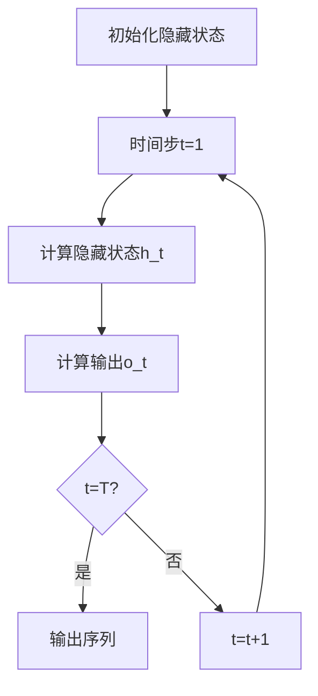

# 一切皆是映射：循环神经网络(RNN)与序列预测

## 1.背景介绍

### 1.1 序列数据的重要性

在当今的数据密集型世界中,我们无时无刻不与序列数据打交道。从自然语言处理中的句子和文本,到时间序列分析中的传感器读数和金融数据,再到生物信息学中的蛋白质序列和基因组数据,序列数据无处不在。能够高效处理这些数据并从中提取有价值的见解,对于广泛的应用领域来说都是至关重要的。

### 1.2 传统方法的局限性

然而,传统的机器学习算法如隐马尔可夫模型(HMM)和n-gram模型在处理序列数据时存在一些固有的局限性。它们要求序列长度固定,并且难以捕捉长程依赖关系。这使得它们在处理像自然语言这样的长序列数据时表现不佳。

### 1.3 循环神经网络(RNN)的出现

循环神经网络(Recurrent Neural Networks, RNNs)应运而生,旨在克服传统方法的缺陷。作为一种深度学习架构,RNN擅长处理序列数据,能够捕捉序列中的长程依赖关系,并且可以处理可变长度的输入。这使得RNN在自然语言处理、语音识别、时间序列预测等领域大放异彩。

## 2.核心概念与联系

### 2.1 RNN的核心思想

RNN的核心思想是将序列数据的每个时间步的输入与网络的隐藏状态相结合,并将更新后的隐藏状态传递到下一个时间步,从而捕捉序列数据中的动态行为。这种反馈循环使RNN能够建模序列数据中的长程依赖关系。


### 2.2 RNN单元的工作原理

在每个时间步t,RNN单元接收当前输入$x_t$和前一时间步的隐藏状态$h_{t-1}$,并计算当前时间步的隐藏状态$h_t$和输出$o_t$。这个过程可以用以下公式表示:

$$h_t = f(W_{hx}x_t + W_{hh}h_{t-1} + b_h)$$
$$o_t = g(W_{oh}h_t + b_o)$$

其中$f$和$g$是非线性激活函数,如tanh或ReLU;$W$是权重矩阵;$b$是偏置向量。

通过训练,RNN可以学习到合适的权重参数,从而捕捉序列数据中的模式和规律。

### 2.3 常见的RNN变体

虽然标准的RNN具有建模序列数据的能力,但它也存在梯度消失/爆炸的问题,这限制了它捕捉长程依赖关系的能力。为了解决这个问题,研究人员提出了多种RNN变体,包括:

- 长短期记忆网络(LSTM)
- 门控循环单元(GRU)
- 双向RNN(BiRNN)
- 深层RNN

这些变体在不同程度上缓解了梯度问题,并提高了RNN在处理长序列数据时的性能。

## 3.核心算法原理具体操作步骤 

### 3.1 RNN的前向传播

RNN的前向传播过程包括以下步骤:

1. 初始化隐藏状态$h_0$,通常将其设置为全0向量。
2. 对于每个时间步t:
    - 计算当前时间步的隐藏状态$h_t$,根据前一时间步的隐藏状态$h_{t-1}$和当前输入$x_t$。
    - 计算当前时间步的输出$o_t$,根据当前隐藏状态$h_t$。
3. 重复步骤2,直到处理完整个输入序列。



### 3.2 RNN的反向传播

在训练过程中,RNN使用反向传播算法来更新权重参数。反向传播的步骤如下:

1. 初始化输出层的误差梯度。
2. 对于每个时间步t(从最后一步开始,逆序进行):
    - 计算隐藏层在当前时间步的梯度。
    - 计算权重矩阵的梯度。
    - 反向传播误差梯度到前一时间步。
3. 更新权重参数。

由于RNN在时间步之间存在循环连接,因此反向传播过程需要通过时间展开的方式进行计算,这使得计算复杂度随着序列长度的增加而线性增长。

### 3.3 梯度消失/爆炸问题

在训练过程中,RNN可能会遇到梯度消失或梯度爆炸的问题。这是由于反向传播过程中,梯度值在时间步之间的递归相乘导致的。

- 梯度消失:如果权重矩阵的特征值小于1,梯度将在时间步之间快速衰减,使得RNN难以捕捉长程依赖关系。
- 梯度爆炸:如果权重矩阵的特征值大于1,梯度将在时间步之间快速增长,导致数值不稳定。

为了缓解这个问题,研究人员提出了多种策略,如梯度截断、初始化技巧和RNN变体(如LSTM和GRU)。

## 4.数学模型和公式详细讲解举例说明

### 4.1 RNN的数学表示

我们可以使用以下公式来表示RNN在时间步t的计算过程:

$$h_t = f(W_{hx}x_t + W_{hh}h_{t-1} + b_h)$$
$$o_t = g(W_{oh}h_t + b_o)$$

其中:

- $x_t$是时间步t的输入向量
- $h_t$是时间步t的隐藏状态向量
- $o_t$是时间步t的输出向量
- $W_{hx}$是输入到隐藏层的权重矩阵
- $W_{hh}$是隐藏层到隐藏层的权重矩阵
- $W_{oh}$是隐藏层到输出层的权重矩阵
- $b_h$和$b_o$是隐藏层和输出层的偏置向量
- $f$和$g$是非线性激活函数,如tanh或ReLU

在训练过程中,我们需要通过反向传播算法来更新这些权重参数,使得RNN能够最小化损失函数(如交叉熵损失)。

### 4.2 LSTM单元

为了解决RNN的梯度消失/爆炸问题,研究人员提出了长短期记忆网络(LSTM)。LSTM单元的核心思想是引入门控机制,使网络能够学习何时保留、更新或忘记隐藏状态中的信息。

LSTM单元包含以下门和状态向量:

- 遗忘门 ($f_t$): 控制从前一时间步传递过来的信息中保留多少。
- 输入门 ($i_t$): 控制当前输入和新计算的隐藏状态中保留多少信息。
- 输出门 ($o_t$): 控制当前隐藏状态中有多少信息将被输出。
- 细胞状态 ($c_t$): 类似于传统RNN中的隐藏状态,但细胞状态被设计为更容易保留长期信息。

LSTM单元的计算过程可以用以下公式表示:

$$f_t = \sigma(W_f[h_{t-1}, x_t] + b_f)$$
$$i_t = \sigma(W_i[h_{t-1}, x_t] + b_i)$$
$$\tilde{c}_t = \tanh(W_c[h_{t-1}, x_t] + b_c)$$
$$c_t = f_t \odot c_{t-1} + i_t \odot \tilde{c}_t$$
$$o_t = \sigma(W_o[h_{t-1}, x_t] + b_o)$$
$$h_t = o_t \odot \tanh(c_t)$$

其中$\sigma$是sigmoid函数,用于计算门的激活值;$\odot$表示元素wise乘积。

通过精心设计的门控机制,LSTM能够更好地捕捉长程依赖关系,从而在处理长序列数据时表现出色。

### 4.3 梯度消失/爆炸的数学分析

为了更好地理解梯度消失/爆炸问题,我们可以分析RNN反向传播过程中梯度的传播方式。

假设我们要计算损失函数$L$关于时间步$t$的隐藏状态$h_t$的梯度$\frac{\partial L}{\partial h_t}$。根据链式法则,我们有:

$$\frac{\partial L}{\partial h_t} = \frac{\partial L}{\partial h_{t+1}} \frac{\partial h_{t+1}}{\partial h_t}$$

其中$\frac{\partial h_{t+1}}{\partial h_t}$是一个雅可比矩阵,它捕捉了隐藏状态在相邻时间步之间的依赖关系。

通过递归展开,我们可以得到:

$$\frac{\partial L}{\partial h_t} = \frac{\partial L}{\partial h_T} \prod_{k=t}^{T-1} \frac{\partial h_{k+1}}{\partial h_k}$$

如果雅可比矩阵的特征值小于1,则梯度将在时间步之间快速衰减,导致梯度消失。相反,如果特征值大于1,梯度将快速增长,导致梯度爆炸。

通过数学分析,我们可以更好地理解梯度消失/爆炸问题的根源,并设计合适的策略来缓解这个问题。

## 5.项目实践:代码实例和详细解释说明

为了更好地理解RNN的工作原理,我们将使用Python和PyTorch库构建一个简单的字符级语言模型。该模型将学习从给定的文本语料库中预测下一个字符。

### 5.1 数据准备

我们将使用一小段文本作为语料库。为了简化问题,我们将只考虑小写字母和空格字符。

```python
import string
import torch

# 定义字符集
all_characters = string.ascii_letters + " .,!?"
n_characters = len(all_characters)

# 将字符映射到整数索引
char_to_index = {char: i for i, char in enumerate(all_characters)}
index_to_char = {i: char for i, char in enumerate(all_characters)}

# 读取语料库
text = "hello, this is some sample text to test the language model."

# 将文本编码为整数序列
encoded_text = [char_to_index[char] for char in text]
```

### 5.2 构建RNN模型

我们将构建一个简单的RNN模型,它由一个embedding层、一个RNN层和一个线性层组成。

```python
import torch.nn as nn

class RNNModel(nn.Module):
    def __init__(self, input_size, hidden_size, output_size, num_layers=1):
        super(RNNModel, self).__init__()
        self.input_size = input_size
        self.hidden_size = hidden_size
        self.output_size = output_size
        self.num_layers = num_layers

        self.embedding = nn.Embedding(input_size, hidden_size)
        self.rnn = nn.RNN(hidden_size, hidden_size, num_layers, batch_first=True)
        self.fc = nn.Linear(hidden_size, output_size)

    def forward(self, x, hidden):
        # 嵌入输入
        embedded = self.embedding(x)

        # 传递RNN层
        output, hidden = self.rnn(embedded, hidden)

        # 通过全连接层获得预测
        output = self.fc(output)

        return output, hidden

    def init_hidden(self, batch_size):
        return torch.zeros(self.num_layers, batch_size, self.hidden_size)
```

### 5.3 训练模型

我们将定义一个训练函数来训练我们的RNN模型。

```python
import torch.optim as optim

# 超参数
batch_size = 32
hidden_size = 128
num_layers = 2
num_epochs = 100
learning_rate = 0.001

# 创建模型实例
model = RNNModel(n_characters, hidden_size, n_characters, num_layers)
criterion = nn.CrossEntropyLoss()
optimizer = optim.Adam(model.parameters(), lr=learning_rate)

# 训练函数
def train(model, encoded_text, criterion, optimizer):
    model.train()
    total_loss = 0

    # 初始化隐藏状态
    hidden = model.init_hidden(batch_size)

    # 按批