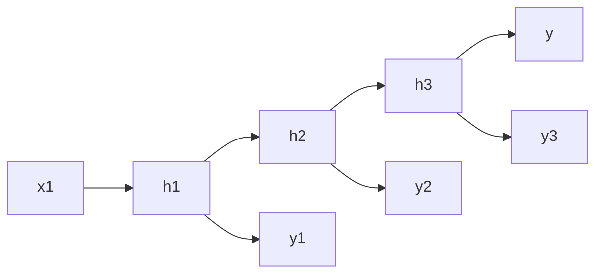

# 一切皆是映射：循环神经网络(RNN)与序列预测

## 1. 背景介绍
### 1.1 序列数据无处不在
在现实世界中,许多数据都具有序列特性,即数据之间存在着时间或空间上的先后顺序关系。比如:
- 自然语言文本:一段文本由一个个单词按照语法顺序组成
- 语音信号:语音是在时间维度上展开的声波信号序列
- 视频:由一帧帧图像按时间顺序构成
- 时间序列:如股票价格、天气变化等,都是按照时间先后排列的数据点序列

传统的前馈神经网络(Feedforward Neural Network)很难有效地建模和学习这些序列数据。这是因为前馈网络缺乏对序列的"记忆"能力,无法捕捉数据之间的时序依赖关系。

### 1.2 RNN的诞生
循环神经网络(Recurrent Neural Network, RNN)应运而生。不同于前馈网络,RNN引入了循环连接,使得网络能够在时间维度上展开,形成一个具有"记忆"的动态系统。通过循环连接,当前时刻的隐藏层不仅接收当前时刻的输入,还接收上一时刻隐藏层的状态信息。这种机制赋予了RNN处理序列数据的能力。

RNN的提出可以追溯到20世纪80年代,由 Hopfield 和 Jordan 等人最早提出。之后经过 Elman、Schmidhuber 等学者的发展和改进,逐步形成了现代RNN的基本形式。近年来,随着深度学习的兴起,RNN及其变体(如LSTM和GRU)在语音识别、机器翻译、情感分析等领域取得了广泛的成功和应用。

## 2. 核心概念与联系
### 2.1 循环连接
RNN最本质的特点在于引入了循环连接。传统的前馈网络是分层的结构,信息只能从输入层经过隐藏层传递到输出层,而RNN打破了这种层次结构,引入了从隐藏层到隐藏层的循环边。

循环连接的引入使得RNN能够在时间维度上共享参数。具体而言,同一层的神经元在不同时刻共享同一组权重参数。这种参数共享的方式大大减少了模型的参数量,提高了模型的泛化能力。

### 2.2 状态传递
RNN中的隐藏层在不同时刻都有一个隐藏状态 $h_t$,它编码了之前时刻的序列信息。当前时刻的隐藏状态 $h_t$ 不仅取决于当前时刻的输入 $x_t$,还取决于上一时刻的隐藏状态 $h_{t-1}$。状态之间的传递可以表示为:

$$h_t = f(Ux_t + Wh_{t-1} + b)$$

其中,$U$和$W$分别是输入到隐藏层和隐藏层到隐藏层的权重矩阵,$b$为偏置项,$f$为激活函数(通常选择tanh或ReLU)。

这种状态传递的方式使得RNN能够建模序列数据中的长距离依赖关系。理论上,RNN可以捕捉任意长度的历史信息。但在实践中,由于梯度消失问题的存在,RNN很难学习到长期依赖。这也是后来LSTM等改进模型出现的原因。

### 2.3 输出映射
RNN的输出方式有两种,一种是每个时刻都有输出,即为序列到序列(Sequence-to-Sequence)的模型;另一种是只在最后时刻有输出,即为序列到向量(Sequence-to-Vector)的模型。

对于第一种方式,每个时刻的隐藏状态 $h_t$ 都要经过一个输出层映射到输出 $y_t$:

$$y_t = g(Vh_t + c)$$

其中,$V$为隐藏层到输出层的权重矩阵,$c$为偏置项,$g$为输出层的激活函数(对于多分类任务通常使用softmax)。

对于第二种方式,只需要将最后一个时刻的隐藏状态 $h_T$ 映射到输出即可:

$$y = g(Vh_T + c)$$

### 2.4 RNN 与 Mermaid 流程图
为了更直观地理解RNN的计算过程,我们可以用 Mermaid 流程图来表示。下图展示了一个简单的RNN结构:

在上图中,每个时刻的输入 $x_t$ 和隐藏状态 $h_t$ 通过循环连接形成了一个时间链。每个隐藏状态还映射到相应的输出 $y_t$。最后一个隐藏状态 $h_3$ 则映射到最终的输出 $y$。

## 3. 核心算法原理具体操作步骤
### 3.1 前向传播
RNN的前向传播分为以下几个步骤:

1. 初始化隐藏状态 $h_0$ 为全零向量。
2. 对于每个时刻 $t=1,2,...,T$:
   1. 根据当前输入 $x_t$ 和上一时刻隐藏状态 $h_{t-1}$ 计算当前隐藏状态:
      $$h_t = f(Ux_t + Wh_{t-1} + b)$$
   2. 将当前隐藏状态 $h_t$ 映射到输出(如果是每个时刻都有输出):  
      $$y_t = g(Vh_t + c)$$
3. 如果是序列到向量模型,则将最后一个隐藏状态 $h_T$ 映射到输出:
   $$y = g(Vh_T + c)$$

### 3.2 反向传播
RNN的训练通常使用反向传播算法(Backpropagation),具体步骤如下:

1. 执行前向传播,计算每个时刻的隐藏状态和输出。
2. 计算最后一个时刻的损失函数(如交叉熵损失)对输出的梯度:
   $$\frac{\partial L}{\partial y_T}$$
3. 反向传播梯度,对于每个时刻 $t=T,T-1,...,1$:
   1. 将损失函数对隐藏状态的梯度传递到上一时刻:
      $$\frac{\partial L}{\partial h_t} = \frac{\partial L}{\partial y_t}\frac{\partial y_t}{\partial h_t} + \frac{\partial L}{\partial h_{t+1}}\frac{\partial h_{t+1}}{\partial h_t}$$
   2. 计算损失函数对权重矩阵 $U,W,V$ 和偏置项 $b,c$ 的梯度:
      $$\frac{\partial L}{\partial U}, \frac{\partial L}{\partial W}, \frac{\partial L}{\partial V}, \frac{\partial L}{\partial b}, \frac{\partial L}{\partial c}$$
4. 使用梯度下降等优化算法更新权重和偏置。

需要注意的是,由于RNN在时间维度上展开,梯度在反向传播时会不断累积。当序列较长时,梯度可能会出现指数级的衰减或爆炸,导致梯度消失或梯度爆炸问题,使得模型难以训练。针对这一问题,研究者提出了梯度裁剪、LSTM等改进方法。

## 4. 数学模型和公式详细讲解举例说明
### 4.1 隐藏状态计算
RNN的核心在于隐藏状态的计算。对于第 $t$ 个时刻,隐藏状态 $h_t$ 的计算公式为:

$$h_t = f(Ux_t + Wh_{t-1} + b)$$

其中,$x_t \in \mathbb{R}^d$ 为 $t$ 时刻的输入向量,$h_t \in \mathbb{R}^h$ 为 $t$ 时刻的隐藏状态向量,$U \in \mathbb{R}^{h \times d}$ 为输入到隐藏层的权重矩阵,$W \in \mathbb{R}^{h \times h}$ 为隐藏层到隐藏层的权重矩阵,$b \in \mathbb{R}^h$ 为隐藏层的偏置项,$f$ 为激活函数(通常选择tanh或ReLU)。

举例说明,假设输入向量维度 $d=4$,隐藏状态维度 $h=3$,则权重矩阵 $U$ 的形状为 $3 \times 4$,权重矩阵 $W$ 的形状为 $3 \times 3$。在 $t=1$ 时刻,给定输入 $x_1 = [0.1, 0.2, 0.3, 0.4]^T$,上一时刻隐藏状态 $h_0 = [0, 0, 0]^T$,偏置项 $b = [0.1, 0.2, 0.3]^T$,权重矩阵为随机初始化的值,激活函数选择tanh,则隐藏状态 $h_1$ 的计算过程如下:

$$h_1 = \tanh(U x_1 + W h_0 + b)$$

$$=\tanh\left(\begin{bmatrix} 
0.1 & 0.2 & 0.3 & 0.4\\ 
0.5 & 0.6 & 0.7 & 0.8\\
0.9 & 1.0 & 1.1 & 1.2
\end{bmatrix} \begin{bmatrix}
0.1\\
0.2\\
0.3\\
0.4
\end{bmatrix} + 
\begin{bmatrix}
0.1 & 0.2 & 0.3\\
0.4 & 0.5 & 0.6\\
0.7 & 0.8 & 0.9
\end{bmatrix}\begin{bmatrix}
0\\
0\\
0
\end{bmatrix} + 
\begin{bmatrix}
0.1\\
0.2\\
0.3
\end{bmatrix}\right)$$

$$=\tanh\left(\begin{bmatrix}
0.3\\
0.86\\
1.42
\end{bmatrix}\right) = \begin{bmatrix}
0.29\\
0.70\\
0.89
\end{bmatrix}$$

可以看到,隐藏状态 $h_1$ 融合了当前时刻输入 $x_1$ 和偏置信息,同时由于 $h_0$ 为全零向量,上一时刻的信息并未对当前隐藏状态产生影响。

### 4.2 输出计算
如果是序列到序列模型,每个时刻的隐藏状态 $h_t$ 都要映射到输出 $y_t$:

$$y_t = g(Vh_t + c)$$

其中,$V \in \mathbb{R}^{k \times h}$ 为隐藏层到输出层的权重矩阵,$c \in \mathbb{R}^k$ 为输出层的偏置项,$g$ 为输出层的激活函数(对于多分类任务通常使用softmax),$k$ 为输出的维度。

举例说明,承接上一小节的例子,假设输出维度 $k=2$,隐藏状态 $h_1 = [0.29, 0.70, 0.89]^T$,权重矩阵 $V$ 和偏置项 $c$ 随机初始化,输出层激活函数选择 softmax,则 $t=1$ 时刻的输出 $y_1$ 计算如下:

$$y_1 = \text{softmax}(Vh_1 + c)$$

$$= \text{softmax}\left(
\begin{bmatrix}
0.1 & 0.2 & 0.3\\
0.4 & 0.5 & 0.6
\end{bmatrix}\begin{bmatrix}
0.29\\
0.70\\
0.89
\end{bmatrix} + \begin{bmatrix}
0.1\\
0.2
\end{bmatrix}
\right)$$

$$= \text{softmax}\left(
\begin{bmatrix}
0.804\\
1.37
\end{bmatrix}
\right) = \begin{bmatrix}
0.31\\
0.69
\end{bmatrix}$$

softmax 函数将输出归一化为概率分布的形式,即 $y_1$ 的两个元素之和为1,表示在 $t=1$ 时刻输入 $x_1$ 下两个类别的概率。

如果是序列到向量模型,只需将最后时刻 $T$ 的隐藏状态映射到输出:

$$y = g(Vh_T + c)$$

计算过程与上述类似,只是只在最后一个时刻进行输出映射。

## 5. 项目实践：代