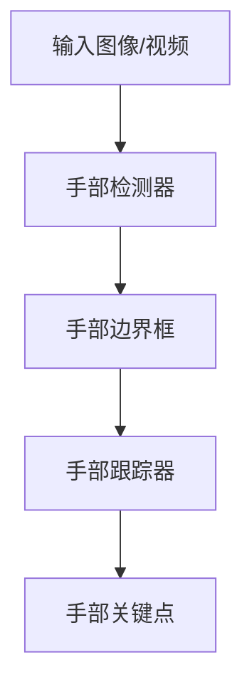
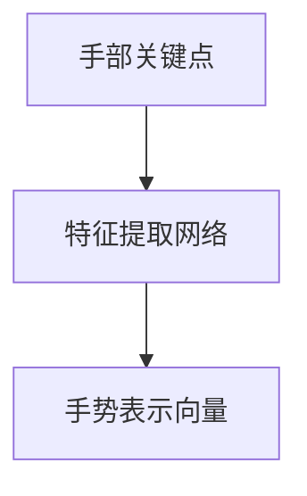
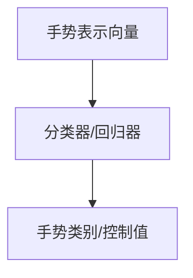

# 一切皆是映射：手势识别技术中的深度学习模型

## 1.背景介绍

在人机交互领域,手势识别技术扮演着越来越重要的角色。随着计算机视觉和深度学习技术的不断发展,手势识别已经渗透到各个领域,如虚拟现实、增强现实、机器人控制、无障碍交互等。手势识别的核心思想是将人体动作映射为机器可识别的指令,从而实现自然、无缝的人机交互体验。

传统的手势识别方法通常依赖于手工设计的特征提取和分类器,但这种方法存在一些局限性,如特征工程的复杂性、泛化能力有限等。而基于深度学习的手势识别模型则能够自动从大量数据中学习特征表示,显著提高了识别的准确性和鲁棍性。

### 1.1 手势识别的应用场景

手势识别技术的应用场景非常广泛,包括但不限于:

- **虚拟现实(VR)和增强现实(AR)**: 手势控制是VR/AR中实现自然交互的关键技术,用户可以通过手势操作虚拟对象、导航虚拟环境等。
- **机器人控制**: 手势可以作为人与机器人之间的自然接口,实现对机器人的直观操控。
- **无障碍交互**: 手势识别为残障人士提供了一种无需物理接触的交互方式,极大提高了他们的生活质量。
- **游戏和娱乐**: 手势控制游戏不仅增加了趣味性,而且为游戏带来了全新的交互体验。
- **车载系统**: 驾驶员可以通过手势操作车载系统,减少分心,提高驾驶安全性。

### 1.2 手势识别的挑战

尽管手势识别技术取得了长足进步,但仍面临一些挑战:

- **视角变化**: 不同视角下手势的表现形式会发生变化,增加了识别的难度。
- **遮挡和背景干扰**: 手部被遮挡或复杂背景的存在会影响手势检测的准确性。
- **实时性要求**: 对于某些应用场景,手势识别需要满足实时性要求,提高系统的响应速度。
- **数据集不足**: 高质量的手势数据集是训练深度学习模型的关键,但目前公开的数据集还较为有限。

## 2.核心概念与联系

在深入探讨手势识别的深度学习模型之前,我们需要先了解一些核心概念及它们之间的联系。

### 2.1 计算机视觉

计算机视觉是指使计算机能够获取、处理、分析和理解数字图像或视频数据的理论和技术。手势识别属于计算机视觉的一个分支,需要借助计算机视觉算法对图像或视频中的手部进行检测和跟踪。

常见的计算机视觉任务包括:

- **目标检测**: 在图像或视频中定位感兴趣的目标物体。
- **语义分割**: 对图像中的每个像素进行语义标注,区分不同的物体。
- **姿态估计**: 估计目标物体在三维空间中的位置和方向。

这些任务都是手势识别的基础,能够为深度学习模型提供有效的输入数据。

### 2.2 深度学习

深度学习是机器学习的一个子领域,其核心思想是通过构建深层神经网络模型,从大量数据中自动学习特征表示。与传统的机器学习方法相比,深度学习模型具有更强的表示能力和泛化性能。

在手势识别任务中,常用的深度学习模型包括:

- **卷积神经网络(CNN)**: 擅长处理图像和视频数据,能够自动学习视觉特征。
- **循环神经网络(RNN)**: 适用于处理序列数据,如视频中的手势动作序列。
- **注意力机制(Attention)**: 通过自适应地分配不同区域的权重,提高模型对关键特征的关注度。

这些模型可以单独使用,也可以组合使用,形成更加强大的手势识别系统。

### 2.3 映射关系

手势识别的本质是将人体动作映射为机器可识别的指令或命令。这种映射关系可以是:

- **手势到类别的映射**: 将特定手势与预定义的类别相关联,如"OK"手势对应"确认"命令。
- **手势到连续值的映射**: 将手势动作映射为连续的控制值,如控制机器人关节的角度。
- **手势到文本的映射**: 将手势序列转录为相应的文本,实现手语转文字的功能。

不同的映射关系对应不同的应用场景,需要设计合适的深度学习模型来实现。

## 3.核心算法原理具体操作步骤

基于深度学习的手势识别系统通常包括以下几个核心步骤:

1. **手部检测与跟踪**
2. **手势表示学习**
3. **手势分类或回归**

我们将逐一探讨每个步骤的算法原理和具体实现方法。

### 3.1 手部检测与跟踪

手部检测与跟踪是手势识别的基础,其目标是从图像或视频中准确定位手部区域,并跟踪手部运动轨迹。常用的方法包括:

1. **基于CNN的目标检测**: 使用如Faster R-CNN、YOLO等目标检测模型,在图像中回归手部的边界框。
2. **基于CNN的语义分割**: 使用全卷积网络(FCN)等模型,对图像进行像素级别的语义分割,从而获取手部的精确轮廓。
3. **基于CNN的关键点检测**: 使用模型如Simple Baseline检测手部关键点(如指尖、手腕等),并根据关键点构建手部姿态。
4. **基于RNN的手部跟踪**: 利用RNN模型的序列建模能力,跟踪手部在视频中的运动轨迹。

这些方法可以单独使用,也可以组合使用,以获得更加准确和鲁棍的手部检测与跟踪结果。

### 3.2 手势表示学习

在获取手部位置信息后,下一步是学习手势的特征表示。常用的方法有:

1. **基于RNN的序列建模**: 将手部关键点序列输入RNN(如LSTM、GRU),学习手势动态的时序特征表示。
2. **基于CNN的图像特征提取**: 将手部区域图像输入CNN,学习手势的空间特征表示。
3. **基于图卷积网络的结构特征提取**: 将手部关键点构建为图结构,使用图卷积网络提取手势的结构特征。
4. **多模态融合**: 将视觉特征(如RGB图像)与其他模态(如深度图像、骨骼数据)融合,学习更加丰富的手势表示。

不同的特征表示方法各有优缺点,可以根据具体任务和数据特点选择合适的方法,或将多种方法组合使用。

### 3.3 手势分类或回归

最后一步是根据学习到的手势表示,使用分类器或回归器预测手势类别或连续控制值。常用的模型包括:

1. **基于全连接层的分类器**: 在手势表示向量的基础上,添加几层全连接层,输出预测的手势类别概率。
2. **基于LSTM的序列分类器**: 将手势表示序列输入LSTM,对整个手势动作序列进行分类。
3. **基于注意力机制的分类器**: 使用注意力机制自适应地关注手势的不同部分,提高分类性能。
4. **基于全连接层的回归器**: 使用全连接层直接回归连续的控制值,如机器人关节角度。

在训练这些模型时,通常使用交叉熵损失函数(对于分类任务)或均方误差损失函数(对于回归任务)。另外,也可以引入其他损失项,如关键点检测损失、姿态一致性损失等,进一步提升模型性能。

## 4.数学模型和公式详细讲解举例说明

在手势识别的深度学习模型中,涉及到许多数学概念和公式。本节将详细讲解其中的几个核心部分。

### 4.1 卷积神经网络

卷积神经网络(CNN)是手势识别中最常用的深度学习模型之一,它能够自动从图像或视频中学习视觉特征。CNN的核心操作是卷积,其数学表达式如下:

$$
S(i, j) = (I * K)(i, j) = \sum_{m}\sum_{n}I(i+m, j+n)K(m, n)
$$

其中,$ I $表示输入图像,$ K $表示卷积核,$ S $表示输出特征图。卷积操作在输入图像上滑动卷积核,对每个位置进行点积操作,从而提取局部特征。

在实际应用中,CNN通常由多个卷积层、池化层和全连接层组成。每个卷积层都会学习不同的特征,从低级的边缘和纹理,到高级的形状和模式。通过层层堆叠,CNN能够逐步提取更加抽象和复杂的视觉特征。

### 4.2 循环神经网络

循环神经网络(RNN)擅长处理序列数据,在手势识别中常用于建模手势动作的时序信息。RNN的核心思想是将当前时刻的隐藏状态与前一时刻的隐藏状态和当前输入相结合,从而捕捉序列的动态特征。

对于给定的输入序列$ \boldsymbol{x} = (x_1, x_2, \ldots, x_T) $,RNN在时刻$ t $的隐藏状态$ \boldsymbol{h}_t $可以表示为:

$$
\boldsymbol{h}_t = f(\boldsymbol{W}_{hh}\boldsymbol{h}_{t-1} + \boldsymbol{W}_{xh}\boldsymbol{x}_t + \boldsymbol{b}_h)
$$

其中,$ f $是非线性激活函数,$ \boldsymbol{W}_{hh} $、$ \boldsymbol{W}_{xh} $和$ \boldsymbol{b}_h $分别是隐藏状态的递归权重矩阵、输入权重矩阵和偏置向量。

在手势识别任务中,RNN可以对手部关键点的时序数据进行建模,学习手势动作的时间特征表示。常用的RNN变体包括LSTM(Long Short-Term Memory)和GRU(Gated Recurrent Unit),它们通过引入门控机制,能够更好地捕捉长期依赖关系。

### 4.3 注意力机制

注意力机制是深度学习中的一种重要技术,它允许模型自适应地分配不同区域的注意力权重,从而关注输入数据的关键部分。在手势识别中,注意力机制可以帮助模型更好地关注手势的关键动作和关键帧。

给定一个查询向量$ \boldsymbol{q} $和一组键值对$ (\boldsymbol{k}_1, \boldsymbol{v}_1), (\boldsymbol{k}_2, \boldsymbol{v}_2), \ldots, (\boldsymbol{k}_N, \boldsymbol{v}_N) $,注意力机制计算每个键值对与查询向量的相关性得分,并根据这些得分计算加权和作为输出:

$$
\begin{aligned}
\alpha_i &= \frac{\exp(\operatorname{score}(\boldsymbol{q}, \boldsymbol{k}_i))}{\sum_{j=1}^N \exp(\operatorname{score}(\boldsymbol{q}, \boldsymbol{k}_j))} \\
\operatorname{Attention}(\boldsymbol{q}, (\boldsymbol{k}_i, \boldsymbol{v}_i)_{i=1}^N) &= \sum_{i=1}^N \alpha_i \boldsymbol{v}_i
\end{aligned}
$$

其中,$ \operatorname{score} $函数可以是点积或其他相似度度量。

在手势识别中,查询向量$ \boldsymbol{q} $可以是手势的全局特征表示,而键