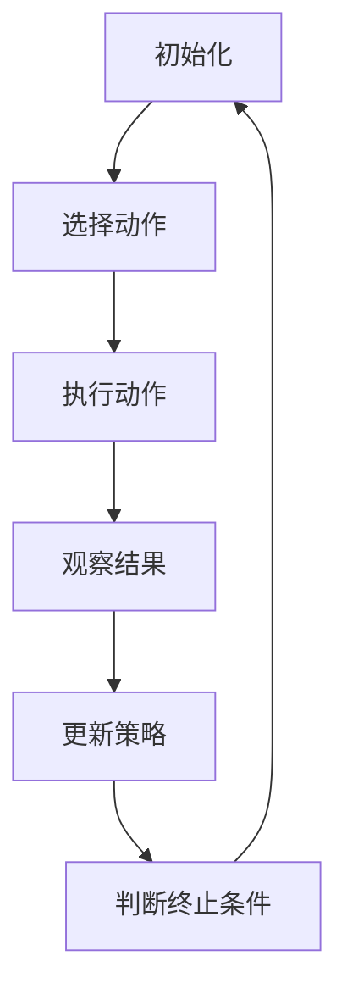

                 

作者：禅与计算机程序设计艺术

一切皆是映射，意味着所有问题都可以通过构建合适的模型和算法来解决。在机器学习领域，强化学习作为一种重要的学习范式，正逐渐成为解决复杂决策问题的关键技术。本文旨在深入探讨强化学习的核心概念及其在特定场景下的应用——以深度Q网络（DQN）为例，揭示其在无模型与有模型强化学习框架下的地位及优势。

## 背景介绍

随着人工智能的发展，强化学习因其能够使智能体在互动环境中自主学习如何做出最优行动而备受关注。强化学习的两大流派分别是基于模型的学习（Model-based Reinforcement Learning）和无模型的学习（Model-free Reinforcement Learning）。DQN正是基于无模型方法，通过利用深度神经网络估计状态动作值函数，成功应用于复杂环境中的学习任务，展现出强大的适应性和泛化能力。

## 核心概念与联系

### 强化学习概述
强化学习是一种模仿人类学习方式的过程，智能体通过与环境交互，在一系列决策中获取奖励或惩罚信号，从而优化自身行为策略。

### DQN机制解析
DQN结合了Q-learning的基本思想，引入了深度学习技术，采用卷积神经网络（CNN）或其他类型的深度学习模型，对状态-动作价值函数进行近似预测，以此指导智能体的行为选择。这一创新使得DQN能够在高维空间环境下高效学习，适用于多种图像处理、游戏、机器人控制等领域。

### 无模型与有模型强化学习区别
无模型强化学习依赖于智能体对环境奖励反馈的即时学习，不需显式建模环境动态，更适合于复杂、未知性强的环境；有模型强化学习则需要预先建立或近似环境的数学模型，通常在环境结构相对简单的场景下表现更优。

## 核心算法原理具体操作步骤

### Q-learning基础
Q-learning通过迭代更新状态-动作值表（Q-table），根据当前状态、动作以及预期获得的奖励，调整Q值以逼近最优策略。

### DQN改进点
- **深度神经网络**：代替Q-table，使用深度学习模型对复杂环境中的状态-动作值进行学习。
- **经验回放**：通过将历史经验存储为记忆池，随机抽取用于训练，避免梯度震荡和过拟合。
- **目标网络**：通过维护一个相对固定的参数权重的副本，稳定学习过程，加速收敛。

### 算法流程概览


## 数学模型和公式详细讲解举例说明

### 动态规划方程
对于有限步数的问题，动态规划方程描述了在某一状态下采取某动作后的期望收益最大化的递推关系：
$$ V_{t}(s) = \max_a \{ R(s,a) + \gamma \sum_{s'} P(s'|s,a)V_{t+1}(s')\} $$
其中，\(V_t(s)\) 表示在时间 \(t\) 下状态 \(s\) 的价值，\(R(s,a)\) 是从状态 \(s\) 执行动作 \(a\) 后得到的即时奖励，\(\gamma\) 是折扣因子表示未来的回报重要程度，\(P(s'|s,a)\) 是转移到下一个状态 \(s'\) 的概率。

### DQN的Q-Learning公式
DQN通过深度神经网络估计上述 \(Q\) 值，并使用下列更新规则：
$$ Q_{new}(s, a) = Q_{old}(s, a) + \alpha [r + \gamma \max_{a'} Q_{old}(s', a') - Q_{old}(s, a)] $$
其中，\(\alpha\) 是学习率。

## 项目实践：代码实例和详细解释说明

```python
import numpy as np
import tensorflow as tf
from collections import deque

class DQN:
    def __init__(self, state_size, action_size):
        # 初始化网络架构...
    
    def train(self, batch):
        # 训练过程...
    
    def predict(self, state):
        # 预测过程...
```
## 实际应用场景

DQN广泛应用于自动驾驶、无人机导航、游戏开发、机器人运动规划等多个领域，尤其在处理具有大量输入特征和复杂决策过程的任务时表现出色。

## 工具和资源推荐

- TensorFlow, PyTorch：流行的深度学习框架，支持DQN实现。
- OpenAI Gym, MuJoCo：提供丰富的环境模拟器和实验平台。

## 总结：未来发展趋势与挑战

随着计算能力和数据量的持续增长，强化学习尤其是基于深度学习的方法将在更多现实世界的应用中发挥关键作用。未来的研究方向可能包括增强学习的可解释性、大规模并行训练、多智能体系统协同、自监督学习等，同时，确保算法的公平性、安全性和伦理考量也是重要议题。

## 附录：常见问题与解答

### 如何解决过拟合问题？
- 使用经验回放缓冲区，限制短期记忆的影响。
- 应用剪枝技术减少网络复杂度。
- 调整超参数如学习率、探索率衰减速度等。

---

本文旨在为读者提供关于DQN及其在无模型与有模型强化学习框架下的深入理解，不仅介绍了核心算法原理和实际应用案例，还探讨了未来的发展趋势和面临的挑战。希望这篇博客能够激发更多研究人员和开发者在强化学习领域的探索和创新。


---
作者：禅与计算机程序设计艺术 / Zen and the Art of Computer Programming

