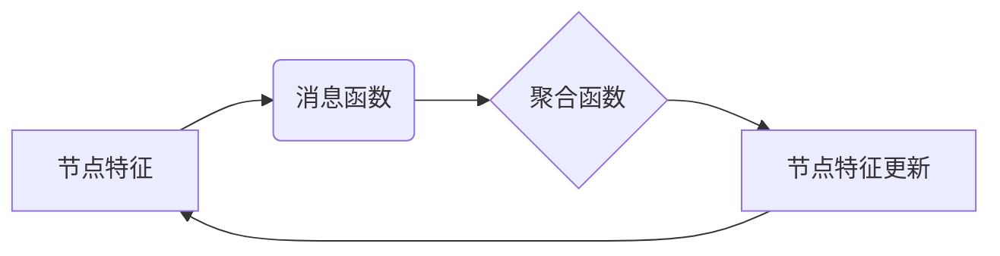

# 一切皆是映射：深入浅出图神经网络(GNN)

## 1. 背景介绍
### 1.1 图神经网络的兴起
图神经网络(Graph Neural Network, GNN)是深度学习领域近年来的一个研究热点。它是将深度学习方法应用于图结构数据的一类模型，能够有效地学习图中节点的特征表示，在图分类、节点分类、链接预测等任务上取得了优异的表现。
### 1.2 图结构数据无处不在
图是一种非常普遍和重要的数据结构，很多现实世界中的数据都可以用图来表示，例如社交网络、知识图谱、分子结构、交通网络等。图能够描述事物之间的复杂关系，挖掘图中蕴含的信息对于理解现实世界具有重要意义。
### 1.3 传统机器学习方法的局限性
传统的机器学习方法主要是针对规则结构的数据，如表格数据，很难直接应用于图结构数据。早期处理图数据的方法主要是人工提取特征，然后再应用机器学习模型，但这种方法依赖于领域知识，而且特征工程的成本很高。因此，亟需一种能够自动学习图数据特征表示的方法。

## 2. 核心概念与联系
### 2.1 图的基本概念
在正式介绍图神经网络之前，我们先回顾一下图的一些基本概念。图$G=(V, E)$由节点集合$V$和边集合$E$组成，每条边$(u,v)∈E$连接两个节点$u,v∈V$。根据边是否有方向，图可以分为无向图和有向图。每个节点可以有自己的特征，用向量$x_v$表示。
### 2.2 图神经网络的核心思想
图神经网络的核心思想是通过聚合节点的邻居信息来更新节点的特征表示，重复多轮聚合和更新的过程，最终得到节点的高阶特征表示。形式化地，每个节点$v$在第$k$轮聚合时的特征表示为:
$$h_v^{(k)}=f\left(h_v^{(k-1)}, \square_{u∈N(v)} g(h_u^{(k-1)}, h_v^{(k-1)})\right)$$
其中$h_v^{(k)}$是节点$v$第$k$轮的特征表示，$N(v)$是节点$v$的邻居节点集合，$f$和$g$是可学习的函数，$\square$是聚合函数，如求和、求平均等。
### 2.3 消息传递和聚合
图神经网络的计算过程可以看作是在图上进行消息传递和聚合。每个节点根据自身的特征和邻居节点传递过来的消息来更新自己的特征。这个过程可以用下面的流程图来表示:



### 2.4 图神经网络与传统神经网络的联系
图神经网络可以看作是传统神经网络在图结构数据上的推广。传统神经网络处理的是规则的、网格状的数据，如图像、文本等，而图神经网络处理的是不规则的、图状的数据。从结构上看，图神经网络的每一层对应着图的一个子图，每个节点的特征更新对应着子图上的一个计算单元。

## 3. 核心算法原理具体操作步骤
### 3.1 图卷积网络(GCN)
图卷积网络(Graph Convolutional Network, GCN)是一种基础的图神经网络模型。GCN的前向传播过程可以写为:
$$H^{(l+1)}=σ(\tilde{D}^{-\frac{1}{2}}\tilde{A}\tilde{D}^{-\frac{1}{2}}H^{(l)}W^{(l)})$$
其中$H^{(l)}$是第$l$层的节点特征矩阵，$\tilde{A}=A+I_N$是加入自环的邻接矩阵，$\tilde{D}$是$\tilde{A}$的度矩阵，$W^{(l)}$是第$l$层的权重矩阵，$σ$是激活函数。
### 3.2 图注意力网络(GAT)
图注意力网络(Graph Attention Network, GAT)是在GCN的基础上引入注意力机制。GAT中每个节点的特征更新公式为:
$$h_i^{(l+1)}=σ\left(\sum_{j∈N(i)}α_{ij}^{(l)}W^{(l)}h_j^{(l)}\right)$$
其中$α_{ij}^{(l)}$是节点$i$和节点$j$之间的注意力权重，通过下式计算:
$$α_{ij}^{(l)}=\frac{exp(LeakyReLU(a^T[W^{(l)}h_i^{(l)}||W^{(l)}h_j^{(l)}]))}{\sum_{k∈N(i)}exp(LeakyReLU(a^T[W^{(l)}h_i^{(l)}||W^{(l)}h_k^{(l)}]))}$$
其中$a$是可学习的注意力向量，$||$表示拼接操作。
### 3.3 图同构网络(GIN)
图同构网络(Graph Isomorphism Network, GIN)是一种能够区分图结构的图神经网络。GIN的聚合函数为:
$$h_v^{(k)}=MLP^{(k)}((1+ϵ^{(k)})·h_v^{(k-1)}+\sum_{u∈N(v)}h_u^{(k-1)})$$
其中$ϵ^{(k)}$是可学习的参数，$MLP$是多层感知机。理论上，GIN能够区分任意的图结构。
### 3.4 图池化
图池化是将一个大的图压缩成一个小的图的过程，可以用于图分类任务。常见的图池化方法有:
- 节点池化：根据节点的重要性对节点进行采样，得到一个子图。
- 边池化：根据边的重要性对边进行采样，得到一个子图。
- 层次池化：先对图进行分层聚类，然后对每个簇进行池化，得到一个层次的图表示。

## 4. 数学模型和公式详细讲解举例说明
### 4.1 谱图卷积
谱图卷积是将卷积操作从欧几里得域推广到图域的一种方法。设$L=I_N-D^{-\frac{1}{2}}AD^{-\frac{1}{2}}$为图的归一化拉普拉斯矩阵，其中$D$为度矩阵，$A$为邻接矩阵，$I_N$为单位矩阵。$L$的特征分解为$L=UΛU^T$，其中$Λ=diag(λ_1,⋯,λ_N)$为特征值构成的对角矩阵，$U=(u_1,⋯,u_N)$为特征向量构成的矩阵。

定义一个函数$f:V→R$在图$G$上的谱卷积为:
$$f*_Gg=Ug(Λ)U^Tf$$
其中$g(Λ)=diag(g(λ_1),⋯,g(λ_N))$，$g$是卷积核函数。

在实践中，直接计算谱卷积的复杂度很高，因此需要做一些近似。常用的近似方法是切比雪夫多项式近似:
$$g_θ*_Gf=\sum_{k=0}^{K-1}θ_kT_k(\tilde{L})f$$
其中$\tilde{L}=\frac{2}{\lambda_{max}}L-I_N$，$λ_{max}$是$L$的最大特征值，$T_k$是切比雪夫多项式，$θ∈R^K$是可学习的参数。

### 4.2 图注意力机制
图注意力机制的目的是为图中的每条边学习一个权重，表示边的重要性。设节点$i$和节点$j$的特征分别为$h_i$和$h_j$，它们之间的注意力权重为:
$$α_{ij}=\frac{exp(a^T[Wh_i||Wh_j])}{\sum_{k∈N(i)}exp(a^T[Wh_i||Wh_k])}$$
其中$a$是可学习的注意力向量，$W$是可学习的权重矩阵，$||$表示拼接操作。

节点$i$的特征更新为:
$$h_i^{'}=σ(\sum_{j∈N(i)}α_{ij}Wh_j)$$
其中$σ$是激活函数。

图注意力机制可以看作是对图卷积的一种改进，它能够自适应地调整边的权重，从而更好地捕捉节点之间的关系。

## 5. 项目实践：代码实例和详细解释说明
下面我们用PyTorch Geometric(PyG)库来实现一个基于GCN的节点分类模型。PyG是一个基于PyTorch的图神经网络库，提供了常用的图神经网络层和数据集。

首先导入需要的库:
```python
import torch
import torch.nn as nn
import torch.nn.functional as F
from torch_geometric.nn import GCNConv
from torch_geometric.datasets import Planetoid
```

然后定义GCN模型:
```python
class GCN(nn.Module):
    def __init__(self, in_dim, hidden_dim, out_dim):
        super(GCN, self).__init__()
        self.conv1 = GCNConv(in_dim, hidden_dim)
        self.conv2 = GCNConv(hidden_dim, out_dim)

    def forward(self, data):
        x, edge_index = data.x, data.edge_index
        x = self.conv1(x, edge_index)
        x = F.relu(x)
        x = F.dropout(x, training=self.training)
        x = self.conv2(x, edge_index)
        return F.log_softmax(x, dim=1)
```
模型包含两层GCN，每层的输出经过ReLU激活和Dropout。最后用log softmax将输出转化为概率分布。

接着加载Cora数据集，并划分训练集、验证集和测试集:
```python
dataset = Planetoid(root='/tmp/Cora', name='Cora')
data = dataset[0]
data.train_mask = data.val_mask = data.test_mask = None
data = train_test_split_edges(data)
```

然后定义训练函数和测试函数:
```python
def train(model, data, optimizer):
    model.train()
    optimizer.zero_grad()
    F.nll_loss(model(data)[data.train_mask], data.y[data.train_mask]).backward()
    optimizer.step()

def test(model, data):
    model.eval()
    logits, accs = model(data), []
    for _, mask in data('train_mask', 'val_mask', 'test_mask'):
        pred = logits[mask].max(1)[1]
        acc = pred.eq(data.y[mask]).sum().item() / mask.sum().item()
        accs.append(acc)
    return accs
```

最后开始训练和测试:
```python
model = GCN(dataset.num_node_features, 16, dataset.num_classes)
optimizer = torch.optim.Adam(model.parameters(), lr=0.01, weight_decay=5e-4)

for epoch in range(200):
    train(model, data, optimizer)
    train_acc, val_acc, test_acc = test(model, data)
    print(f'Epoch: {epoch+1:03d}, Train: {train_acc:.4f}, Val: {val_acc:.4f}, Test: {test_acc:.4f}')
```

在Cora数据集上，这个简单的GCN模型可以达到80%以上的测试准确率。

## 6. 实际应用场景
图神经网络在很多领域都有广泛的应用，下面列举几个典型的应用场景:

### 6.1 社交网络分析
在社交网络中，用户可以看作是图的节点，用户之间的社交关系可以看作是图的边。图神经网络可以用于社交网络的节点分类、链接预测、社区发现等任务。例如，可以用图神经网络预测两个用户是否可能成为朋友。

### 6.2 推荐系统
在推荐系统中，用户和物品可以看作是二部图的两类节点，用户对物品的评分可以看作是边。图神经网络可以学习用户和物品的特征表示，从而给用户推荐感兴趣的物品。例如，Pinterest使用图神经网络来给用户推荐图片。

### 6.3 交通预测
在交通网络中，路口可以看作是节点，道路可以看作是边，车流量可以看作是边的属性。图神经网络可以学习路口的特征表示，从而预测未来的交通流量。例如，Uber使用图神经网络来预测交通流量，优化车辆调度。

### 6.4