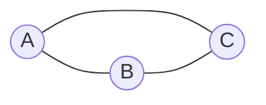

# 一切皆是映射：深入浅出图神经网络(GNN)

## 1. 背景介绍
### 1.1 图数据无处不在
在现实世界中,许多事物之间都存在着千丝万缕的联系,形成了错综复杂的网络。比如社交网络中人与人之间的关系,交通网络中城市与城市之间的连接,生物网络中蛋白质与蛋白质之间的作用,知识图谱中实体与实体之间的关联等。这些网络化的数据被称为图数据。

### 1.2 传统机器学习方法的局限性
传统的机器学习方法如支持向量机、随机森林等,主要是针对表格型数据而设计的。它们擅长处理规整的、独立同分布的数据。但是面对图这种非结构化数据时,这些方法就显得力不从心了。它们无法有效捕捉图数据中的拓扑结构信息和节点间的复杂交互。

### 1.3 深度学习与图数据
深度学习技术的崛起为处理图数据带来了新的契机。深度学习模型具有强大的表示学习能力,能够自动学习数据的层次化特征表示。如果我们能设计出一种神经网络模型,让它能理解图的拓扑结构,汲取节点的属性信息,捕捉节点间的相互影响,那将是一个处理图数据的利器。

### 1.4 图神经网络的诞生
图神经网络(Graph Neural Network, GNN)正是基于上述构想而提出的一类深度学习模型。它将深度学习与图论相结合,专门用于处理图结构数据。自2017年Graph Convolutional Network(GCN)问世以来,GNN迅速成为了图机器学习领域的研究热点,并在节点分类、链路预测、图分类等任务上取得了瞩目的表现。

## 2. 核心概念与联系
### 2.1 图的数学表示
在正式介绍GNN之前,我们先来回顾一下图的数学表示。一个图$G$可以表示为$G=(V,E)$,其中$V$是节点集合,$E$是边集合。每个节点$v_i \in V$可能带有节点属性$x_i$,每条边$e_{ij} \in E$可能带有边属性$w_{ij}$。以无向图为例,节点之间的连接关系可以用邻接矩阵$A$来表示,如果节点$i$和$j$之间有边相连,则$A_{ij}=1$,否则为0。

### 2.2 图神经网络的核心思想
GNN的核心思想是通过迭代的信息传递和聚合,学习出节点的隐藏状态表示。具体来说,在每一轮迭代中,每个节点先聚合其邻居节点的信息,然后更新自身的隐藏状态。经过多轮迭代,节点可以获取到其多跳邻居的信息,从而学习到一个全局的上下文表示。这个过程可以看作是在图上进行的信息传播和特征变换。

### 2.3 消息传递框架
许多GNN模型都可以被统一到一个消息传递框架(Message Passing Framework)下。在第$l$轮迭代中,每个节点$v_i$会执行以下两个步骤:

1. 聚合邻居信息:
$$m_i^{(l)} = \mathop{AGG}\limits_{j \in N(i)} \left( \phi^{(l)} \left( h_i^{(l-1)}, h_j^{(l-1)}, e_{ij} \right) \right)$$

2. 更新节点状态:  
$$h_i^{(l)} = \mathop{UPDATE} \left( h_i^{(l-1)}, m_i^{(l)} \right)$$

其中$h_i^{(l)}$表示节点$v_i$在第$l$轮的隐藏状态,$N(i)$表示节点$v_i$的邻居节点集合,$\phi$是一个消息函数,$AGG$是一个聚合函数,$UPDATE$是一个状态更新函数。不同的GNN模型主要在聚合函数和更新函数的设计上有所不同。

### 2.4 GNN与传统神经网络的联系
GNN可以看作是传统神经网络在图数据上的推广。如果我们将图看作是一个特殊的张量,那么GNN的计算过程就类似于在这个张量上进行卷积或池化操作。此外,许多常见的神经网络结构如RNN、CNN等也能在GNN中找到它们的影子。比如门控循环单元(GRU)就常被用来实现GNN的状态更新函数。

## 3. 核心算法原理具体操作步骤
下面我们以最经典的GCN模型为例,详细讲解GNN的核心算法原理和操作步骤。

### 3.1 图卷积的定义
GCN的核心是图卷积(Graph Convolution)操作。直观地理解,图卷积就是在图的拓扑结构上对节点的特征进行变换。数学上,第$l$层图卷积的定义为:

$$H^{(l+1)} = \sigma \left( \tilde{D}^{-\frac{1}{2}} \tilde{A} \tilde{D}^{-\frac{1}{2}} H^{(l)} W^{(l)} \right)$$

其中$H^{(l)}$是第$l$层的节点特征矩阵,$\tilde{A} = A + I_N$是加入了自环的邻接矩阵,$I_N$是单位矩阵,$\tilde{D}$是$\tilde{A}$的度矩阵,$W^{(l)}$是可学习的权重矩阵,$\sigma$是激活函数。

### 3.2 图卷积的直观解释
图卷积公式看起来有些复杂,但它的物理意义其实很简单。$\tilde{D}^{-\frac{1}{2}} \tilde{A} \tilde{D}^{-\frac{1}{2}}$可以理解为一个归一化的邻接矩阵,它的作用是对邻接矩阵进行归一化,使得每个节点接收到的信息的总和为1。将归一化后的邻接矩阵与节点特征矩阵$H^{(l)}$相乘,就相当于对每个节点聚合了其邻居节点的特征信息。最后右乘一个权重矩阵$W^{(l)}$,就得到了变换后的新的节点特征。

### 3.3 GCN的前向传播过程
有了图卷积操作,我们就可以搭建一个多层的GCN模型。假设我们的GCN有$L$层,每层的前向传播过程可以表示为:

$$H^{(l+1)} = \sigma \left( \tilde{D}^{-\frac{1}{2}} \tilde{A} \tilde{D}^{-\frac{1}{2}} H^{(l)} W^{(l)} \right), l=0,1,...,L-1$$

其中$H^{(0)}$是输入的节点特征矩阵$X$。通过逐层的图卷积,我们可以得到节点的最终表示$H^{(L)}$。这个表示融合了节点自身的特征以及其邻居节点的特征信息,可以用于下游的节点分类、链路预测等任务。

### 3.4 GCN的训练过程
GCN的训练过程与普通的神经网络类似,主要分为以下几个步骤:

1. 正向传播:根据输入的节点特征矩阵$X$和邻接矩阵$A$,逐层进行图卷积操作,得到节点的最终表示$H^{(L)}$。

2. 损失计算:将$H^{(L)}$输入到输出层(如softmax层),计算预测结果与真实标签之间的损失。常用的损失函数有交叉熵损失等。

3. 反向传播:根据损失函数对各层的参数$W^{(l)}$求梯度,并使用优化算法(如Adam)更新参数。 

4. 重复以上步骤,直到模型收敛或达到预设的迭代次数。

## 4. 数学模型和公式详细讲解举例说明
在本节中,我们将详细推导GCN中的关键公式,并给出一些具体的例子帮助理解。

### 4.1 图卷积公式的推导
图卷积公式$H^{(l+1)} = \sigma \left( \tilde{D}^{-\frac{1}{2}} \tilde{A} \tilde{D}^{-\frac{1}{2}} H^{(l)} W^{(l)} \right)$的推导过程如下:

首先,我们定义图的拉普拉斯矩阵$L=D-A$,其中$D$是图的度矩阵。拉普拉斯矩阵是图论中的一个重要概念,它包含了图的拓扑结构信息。

接下来,我们对拉普拉斯矩阵进行归一化,得到对称归一化拉普拉斯矩阵$L_{sym}=D^{-\frac{1}{2}}LD^{-\frac{1}{2}}=I-D^{-\frac{1}{2}}AD^{-\frac{1}{2}}$。

根据谱图理论,归一化拉普拉斯矩阵$L_{sym}$可以被分解为$L_{sym}=U \Lambda U^T$,其中$U$是特征向量矩阵,$\Lambda$是特征值构成的对角矩阵。

基于上述分解,我们可以将图卷积定义为:

$$g_\theta * x = U g_\theta(\Lambda) U^T x$$

其中$x$是节点特征向量,$g_\theta$是卷积核函数。

为了避免计算$U$这个特征向量矩阵,Kipf等人提出了一阶近似的简化:

$$g_\theta(\Lambda) \approx \theta_0 + \theta_1 \Lambda$$

代入上式并化简,得到:

$$g_\theta * x \approx \theta_0 x + \theta_1 (L_{sym} - I) x = \theta_0 x - \theta_1 D^{-\frac{1}{2}}AD^{-\frac{1}{2}}x$$

为了引入节点自环,我们用$\tilde{A} = A + I$替换$A$,并令$\theta = \theta_0 = -\theta_1$,得到:

$$g_\theta * x \approx \theta(\tilde{D}^{-\frac{1}{2}} \tilde{A} \tilde{D}^{-\frac{1}{2}})x$$

将$x$扩展为节点特征矩阵$H^{(l)}$,再引入特征变换矩阵$W^{(l)}$,最后加上激活函数$\sigma$,就得到了我们最初给出的图卷积公式:

$$H^{(l+1)} = \sigma \left( \tilde{D}^{-\frac{1}{2}} \tilde{A} \tilde{D}^{-\frac{1}{2}} H^{(l)} W^{(l)} \right)$$

### 4.2 计算示例
下面我们以一个简单的例子来演示GCN中的计算过程。考虑如下的一个无向图:

假设节点的初始特征为:

$$
X = 
\begin{bmatrix}
1 & 0 \\
0 & 1 \\
1 & 1
\end{bmatrix}
$$

图的邻接矩阵为:

$$
A =
\begin{bmatrix}
0 & 1 & 1 \\
1 & 0 & 1 \\
1 & 1 & 0
\end{bmatrix}
$$

加入自环后的邻接矩阵为:

$$
\tilde{A} =
\begin{bmatrix}
1 & 1 & 1 \\
1 & 1 & 1 \\
1 & 1 & 1
\end{bmatrix}
$$

度矩阵为:

$$
\tilde{D} =
\begin{bmatrix}
3 & 0 & 0 \\
0 & 3 & 0 \\
0 & 0 & 3
\end{bmatrix}
$$

归一化后的邻接矩阵为:

$$
\tilde{D}^{-\frac{1}{2}} \tilde{A} \tilde{D}^{-\frac{1}{2}} =
\begin{bmatrix}
\frac{1}{3} & \frac{1}{3} & \frac{1}{3} \\
\frac{1}{3} & \frac{1}{3} & \frac{1}{3} \\
\frac{1}{3} & \frac{1}{3} & \frac{1}{3}
\end{bmatrix}
$$

假设我们的GCN只有一层,权重矩阵为:

$$
W^{(0)} = 
\begin{bmatrix}
1 & 0 \\
0 & 1
\end{bmatrix}
$$

激活函数取ReLU,则图卷积后的节