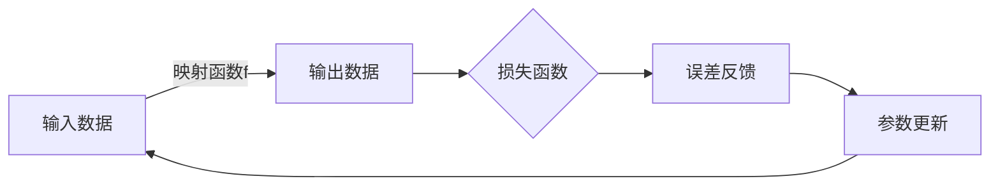

# 一切皆是映射：深度学习在航空航天中的挑战与机会

## 1.背景介绍

### 1.1 航空航天领域的重要性

航空航天是一个对人类社会具有深远影响的战略性高科技领域。它不仅推动了科学技术的发展,也极大地改变了人类的生活方式和认知边界。从20世纪初的航空器问世,到后来的火箭和航天器的诞生,再到现代的航天飞机和探测器,航空航天技术的飞速进步一直引领着人类不断探索未知的热情。

### 1.2 航空航天面临的挑战

然而,航空航天领域也面临着诸多挑战:

- **极端工作环境**:飞行器在极高或极低温度、高压、强辐射等恶劣环境下工作,对材料和结构的要求极为苛刻。
- **高精度要求**:航天器的制导、控制和测量需要极高的精度,微小的偏差都可能导致任务失败。
- **复杂度高**:现代飞行器是由数百万个部件组成的庞大系统,设计、制造和测试的复杂度很高。
- **研发周期长**:从构思到实现,一种新型飞行器通常需要耗时数年甚至数十年的研发过程。

### 1.3 人工智能在航空航天中的作用

传统的基于物理模型和经验公式的方法越来越难以满足航空航天领域日益复杂的需求。而人工智能技术,尤其是近年来兴起的深度学习技术,为解决这些挑战提供了新的思路和途径。深度学习能从海量数据中自动发现内在规律,并对复杂系统进行建模和优化,在结构设计、制造工艺、故障诊断、航线规划等多个环节发挥着重要作用。

## 2.核心概念与联系 

### 2.1 深度学习的本质:映射函数

深度学习的本质是通过训练获得一个高度复杂的映射函数,将输入数据映射到所需的输出。这个映射函数由神经网络模型的参数决定,通过在训练数据上不断迭代优化参数,使模型在训练数据上的预测误差最小化,从而获得期望的映射行为。



### 2.2 深度学习与传统方法的区别

传统的机器学习算法需要人工设计特征,而深度学习能够自动从原始数据中提取有效特征,大大减少了人工参与。另一方面,传统算法往往基于简单的线性模型,而深度学习则使用了多层非线性变换,可以学习到更加复杂的映射函数。

### 2.3 深度学习在航空航天中的应用

深度学习在航空航天领域的应用主要包括:

- **设计优化**: 利用深度学习对复杂系统进行替代建模,优化结构设计和制造工艺参数。
- **系统控制**: 基于深度学习的自适应控制,提高飞行器的稳定性和鲁棒性。
- **故障诊断**: 从传感器数据中自动检测异常模式,实现故障的精准定位和预测。
- **智能决策**: 基于深度强化学习,在复杂动态环境下生成最优的决策序列。
- **图像理解**: 对遥感影像、视频流等多源异构数据进行智能解译和融合。

## 3.核心算法原理具体操作步骤

深度学习算法的核心在于通过反向传播算法对多层神经网络进行有效训练。我们以最基本的全连接前馈网络为例,介绍其训练的具体步骤。

### 3.1 网络初始化

首先需要初始化网络的权重参数,通常采用一些随机初始化策略,如高斯随机初始化、Xavier初始化等。合理的初始化有助于训练的收敛。

### 3.2 前向传播

给定一个输入样本 $\boldsymbol{x}$,通过层层前向传播计算得到输出 $\boldsymbol{\hat{y}}$:

$$\boldsymbol{z}^{(l)} = \boldsymbol{W}^{(l)}\boldsymbol{a}^{(l-1)} + \boldsymbol{b}^{(l)}$$
$$\boldsymbol{a}^{(l)} = \phi(\boldsymbol{z}^{(l)})$$

其中 $\boldsymbol{W}^{(l)}$ 和 $\boldsymbol{b}^{(l)}$ 分别为第 $l$ 层的权重和偏置参数, $\phi(\cdot)$ 为激活函数。

### 3.3 计算损失函数

将输出 $\boldsymbol{\hat{y}}$ 与真实标签 $\boldsymbol{y}$ 对比,计算损失函数 $\mathcal{L}(\boldsymbol{\hat{y}}, \boldsymbol{y})$,如交叉熵损失:

$$\mathcal{L}(\boldsymbol{\hat{y}}, \boldsymbol{y}) = -\sum_i y_i \log \hat{y}_i$$

### 3.4 反向传播

通过链式法则,计算损失函数关于每一层参数的梯度:

$$\frac{\partial \mathcal{L}}{\partial \boldsymbol{W}^{(l)}} = \frac{\partial \mathcal{L}}{\partial \boldsymbol{z}^{(l)}} \frac{\partial \boldsymbol{z}^{(l)}}{\partial \boldsymbol{W}^{(l)}}$$
$$\frac{\partial \mathcal{L}}{\partial \boldsymbol{b}^{(l)}} = \sum_j \frac{\partial \mathcal{L}}{\partial z_j^{(l)}}$$

这个过程从输出层向前逐层计算,即为反向传播。

### 3.5 参数更新

使用优化算法如随机梯度下降,根据计算出的梯度更新网络参数:

$$\boldsymbol{W}^{(l)} \leftarrow \boldsymbol{W}^{(l)} - \eta \frac{\partial \mathcal{L}}{\partial \boldsymbol{W}^{(l)}}$$
$$\boldsymbol{b}^{(l)} \leftarrow \boldsymbol{b}^{(l)} - \eta \frac{\partial \mathcal{L}}{\partial \boldsymbol{b}^{(l)}}$$

其中 $\eta$ 为学习率。

### 3.6 迭代训练

重复上述过程,使用训练数据集中的样本对网络参数进行多轮迭代训练,直至收敛或达到期望的性能要求。

上述算法描述了深度学习模型训练的基本流程,实际应用中还需要考虑诸多细节,如正则化、梯度消失、参数初始化、批归一化等,以确保训练的稳定性和收敛性。

## 4.数学模型和公式详细讲解举例说明

### 4.1 神经网络的数学模型

神经网络实际上是一种高度参数化的函数模型,其输出是输入经过多层非线性变换的结果。我们用 $f(\boldsymbol{x}; \boldsymbol{\theta})$ 表示这个函数,其中 $\boldsymbol{x}$ 为输入, $\boldsymbol{\theta}$ 为模型的所有可训练参数(权重和偏置)的集合。

对于一个 $L$ 层的全连接网络,第 $l$ 层的变换可表示为:

$$\boldsymbol{z}^{(l)} = \boldsymbol{W}^{(l)}\boldsymbol{a}^{(l-1)} + \boldsymbol{b}^{(l)}$$
$$\boldsymbol{a}^{(l)} = \phi(\boldsymbol{z}^{(l)})$$

其中 $\boldsymbol{W}^{(l)}$ 和 $\boldsymbol{b}^{(l)}$ 为该层的权重和偏置参数, $\phi(\cdot)$ 为非线性激活函数,如 ReLU、Sigmoid 等。

则整个网络的输出为:

$$f(\boldsymbol{x}; \boldsymbol{\theta}) = \boldsymbol{a}^{(L)} = \phi(\boldsymbol{W}^{(L)}\phi(\boldsymbol{W}^{(L-1)}\cdots\phi(\boldsymbol{W}^{(1)}\boldsymbol{x} + \boldsymbol{b}^{(1)}) + \cdots) + \boldsymbol{b}^{(L)})$$

可见,神经网络实际上是一种高度灵活的函数拟合器,通过训练调整参数 $\boldsymbol{\theta}$,使其能够很好地拟合输入输出之间的映射关系。

### 4.2 损失函数

为了训练神经网络,我们需要定义一个损失函数(Loss Function)或目标函数,使模型在训练数据上的输出与真实标签之间的差异(或距离)最小。常用的损失函数有:

- 均方误差(MSE): $\mathcal{L}(\boldsymbol{\hat{y}}, \boldsymbol{y}) = \frac{1}{2}\sum_i (\hat{y}_i - y_i)^2$
- 交叉熵(CE): $\mathcal{L}(\boldsymbol{\hat{y}}, \boldsymbol{y}) = -\sum_i y_i \log \hat{y}_i$

其中 $\boldsymbol{\hat{y}}$ 为模型输出, $\boldsymbol{y}$ 为真实标签。均方误差常用于回归问题,而交叉熵则适用于分类问题。

### 4.3 反向传播算法

训练神经网络的关键在于求解参数 $\boldsymbol{\theta}$ 的最优值,使损失函数 $\mathcal{L}(\boldsymbol{\hat{y}}, \boldsymbol{y})$ 最小化。这通常采用基于梯度的优化算法,如随机梯度下降(SGD)等。

为了计算损失函数关于每个参数的梯度,我们需要利用链式法则,从输出层向前逐层计算,这个过程被称为反向传播(Backpropagation)算法。

以全连接网络为例,第 $l$ 层参数的梯度为:

$$\frac{\partial \mathcal{L}}{\partial \boldsymbol{W}^{(l)}} = \frac{\partial \mathcal{L}}{\partial \boldsymbol{z}^{(l)}} \frac{\partial \boldsymbol{z}^{(l)}}{\partial \boldsymbol{W}^{(l)}} = \boldsymbol{\delta}^{(l)} (\boldsymbol{a}^{(l-1)})^\top$$
$$\frac{\partial \mathcal{L}}{\partial \boldsymbol{b}^{(l)}} = \sum_j \frac{\partial \mathcal{L}}{\partial z_j^{(l)}} = \sum_j \delta_j^{(l)}$$

其中 $\boldsymbol{\delta}^{(l)}$ 为第 $l$ 层的误差项,可通过前一层的误差项递推计算:

$$\boldsymbol{\delta}^{(l)} = (\boldsymbol{W}^{(l+1)})^\top \boldsymbol{\delta}^{(l+1)} \odot \phi'(\boldsymbol{z}^{(l)})$$

对于输出层,误差项直接由损失函数的梯度给出。通过这种自动微分的方式,我们可以高效地计算出每一层参数的梯度,并利用优化算法如 SGD 对参数进行迭代更新,从而不断减小损失函数值,提高模型的预测精度。

### 4.4 实例:用神经网络拟合函数

为了直观理解神经网络的工作原理,我们构造一个简单的函数拟合问题。假设我们希望用一个单隐层神经网络来拟合函数 $y = x^2$。

首先生成训练数据:

```python
import numpy as np
import matplotlib.pyplot as plt

X = np.linspace(-5, 5, 200)
y = X**2
plt.scatter(X, y)
plt.show()
```


然后定义网络结构并训练:

```python
import torch
import torch.nn as nn

# 定义网络结构
net = nn.Sequential(
    nn.Linear(1, 10),
    nn.ReLU(),
    nn.Linear(10, 1)
)

# 定义损失函数和优化器
criterion = nn.MSELoss()
optimizer = torch.optim.SGD(net.parameters(), lr=0.01)

# 训练
for epoch in range(5000):
    inputs = torch.from_numpy(X).float().unsqueeze(1)
    targets = torch.from_numpy(y).float()
    
    outputs = net(inputs)
    loss = criterion(outputs, targets)
    
    optimizer.zero_grad()
    loss.backward()
    optimizer.step()
    