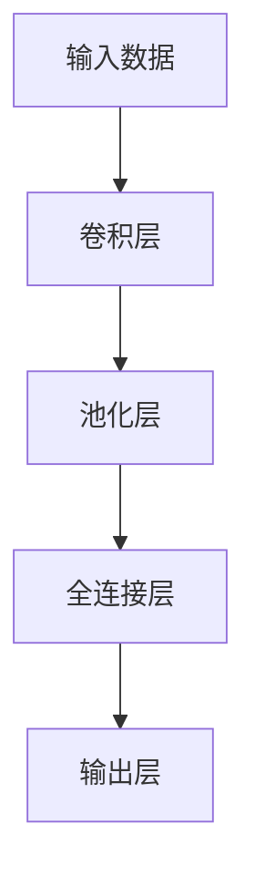

# 一切皆是映射：深度学习在计算机视觉中的应用

## 1.背景介绍

### 1.1 计算机视觉的重要性

在当今科技飞速发展的时代,计算机视觉已经成为人工智能领域中最重要和最活跃的研究方向之一。计算机视觉技术赋予了机器以"视觉"的能力,使其能够从图像或视频中获取有价值的信息,并对所见的内容进行理解和分析。这项技术已广泛应用于多个领域,如自动驾驶、医疗影像诊断、人脸识别、机器人视觉等,极大地提高了工作效率并优化了人类的生活体验。

### 1.2 传统计算机视觉方法的局限性

早期的计算机视觉系统主要依赖于手工设计的特征提取算法和机器学习模型,如SIFT、HOG等经典算法。这些传统方法需要大量的领域知识和人工干预,且难以有效处理复杂的视觉任务。随着数据量的激增和问题复杂度的提高,传统方法在准确性和泛化能力方面遇到了瓶颈。

### 1.3 深度学习的兴起

深度学习作为一种基于数据驱动的端到端学习范式,能够自动从大量数据中提取有价值的特征表示,从而有效解决复杂的视觉任务。近年来,benefiting from大量标注数据的积累、算力的飞速提升以及新型网络架构的不断涌现,深度学习在计算机视觉领域取得了令人瞩目的成就,推动了该领域的飞速发展。

## 2.核心概念与联系

### 2.1 深度神经网络

深度神经网络是深度学习的核心模型,它由多个非线性变换层次组成,能够对输入数据进行逐层特征提取和表示学习。常见的深度网络结构包括卷积神经网络(CNN)、递归神经网络(RNN)、生成对抗网络(GAN)等。



### 2.2 端到端学习

端到端学习是深度学习的核心思想之一,指的是将原始输入数据直接映射到期望的输出,而无需人工设计特征提取算法。这种方式大大简化了传统机器学习流程,同时也避免了人工特征设计所带来的偏差和局限性。

### 2.3 大数据与数据增广

深度学习模型往往需要大量的标注数据进行训练,才能获得良好的泛化能力。数据增广技术通过对现有数据进行变换(如旋转、平移等)来人工扩充数据集,有助于提高模型的鲁棒性和泛化能力。

## 3.核心算法原理具体操作步骤

### 3.1 卷积神经网络(CNN)

卷积神经网络是深度学习在计算机视觉领域的核心算法之一,它具有局部连接、权值共享和空间下采样等特性,能够有效捕捉图像的局部模式和空间信息。CNN通常由卷积层、池化层和全连接层组成。

1. **卷积层**:通过在输入特征图上滑动卷积核,对局部区域进行特征提取,从而获得新的特征图。

$$
x_{j}^{l}=f\left(\sum_{i \in M_{j}} x_{i}^{l-1} * k_{i j}^{l}+b_{j}^{l}\right)
$$

其中 $x_j^l$ 表示第 $l$ 层的第 $j$ 个特征图, $f$ 是激活函数, $M_j$ 是连接到第 $j$ 个特征图的上一层特征图的集合, $k_{ij}^l$ 是卷积核权重, $b_j^l$ 是偏置项。

2. **池化层**:对特征图进行下采样操作,缩小特征图的尺寸,从而提高计算效率并增强模型的平移不变性。常用的池化操作包括最大池化和平均池化。

3. **全连接层**:将前面卷积层和池化层学习到的高级特征进行整合,并输出最终的分类或回归结果。

CNN在图像分类、目标检测、语义分割等计算机视觉任务中表现出色,是深度学习在该领域的核心算法之一。

### 3.2 递归神经网络(RNN)

递归神经网络是一种适用于序列数据(如视频、语音等)的深度学习模型。RNN通过对序列中的每一个时间步进行循环计算,能够很好地捕捉序列数据中的时间依赖关系。

1. **前向传播**:对于时间步 $t$,RNN单元的计算过程为:

$$
h_{t}=\phi\left(W_{h h} h_{t-1}+W_{x h} x_{t}+b_{h}\right)
$$

$$
o_{t}=\phi\left(W_{h o} h_{t}+b_{o}\right)
$$

其中 $h_t$ 是隐藏状态, $x_t$ 是输入, $W$ 是权重矩阵, $b$ 是偏置项, $\phi$ 是非线性激活函数。

2. **反向传播**:通过反向传播算法对网络进行端到端的训练,使输出序列 $o$ 逼近期望的目标序列 $y$。

$$
\nabla_{\theta} J=\sum_{t} \nabla_{\theta} o_{t} \frac{\partial J}{\partial o_{t}}
$$

RNN及其变种(如LSTM、GRU等)广泛应用于视频理解、行为识别、视频描述生成等视频相关任务。

### 3.3 生成对抗网络(GAN)

生成对抗网络是一种用于生成式建模的深度学习架构,它由生成器网络和判别器网络组成,两个网络相互对抗地训练,最终使生成器能够生成逼真的数据样本。

1. **生成器**:输入随机噪声 $z$,生成假数据样本 $G(z)$,目标是使 $G(z)$ 尽可能逼真。
2. **判别器**:输入真实数据 $x$ 和生成数据 $G(z)$,判别它们是真是假,目标是最大化正确分类的能力。

生成器 $G$ 和判别器 $D$ 的对抗损失函数为:

$$
\min _{G} \max _{D} V(D, G)=\mathbb{E}_{x \sim p_{\text {data}}(x)}[\log D(x)]+\mathbb{E}_{z \sim p_{z}(z)}[\log (1-D(G(z)))]
$$

通过交替优化生成器和判别器,最终达到生成器生成的数据无法被判别器区分的状态,即完成了生成式建模的目标。

GAN已被广泛应用于图像生成、图像翻译、超分辨率重建等计算机视觉任务。

## 4.数学模型和公式详细讲解举例说明

### 4.1 卷积运算

卷积运算是CNN中最核心的运算之一,它能够有效捕捉图像的局部模式和空间信息。对于二维图像,卷积运算可以表示为:

$$
(I * K)(i, j)=\sum_{m} \sum_{n} I(i+m, j+n) K(m, n)
$$

其中 $I$ 是输入图像, $K$ 是卷积核, $(i,j)$ 是输出特征图的坐标。卷积核在输入图像上滑动,在每个位置进行元素级乘积和求和操作,从而获得新的特征图。

例如,对于一个 $3 \times 3$ 的卷积核和一个 $5 \times 5$ 的输入图像,卷积运算的过程如下:

```python
import numpy as np

# 输入图像
input_image = np.array([[1, 0, 2, 1, 3],
                        [2, 1, 3, 0, 1],
                        [0, 2, 1, 2, 3],
                        [1, 1, 2, 0, 2],
                        [3, 2, 0, 1, 1]])

# 卷积核
kernel = np.array([[1, 0, 1],
                   [0, 1, 0],
                   [1, 0, 1]])

# 计算卷积结果
output_image = np.zeros((3, 3))
for i in range(3):
    for j in range(3):
        output_image[i, j] = np.sum(input_image[i:i+3, j:j+3] * kernel)

print("输入图像:")
print(input_image)
print("卷积核:")
print(kernel)
print("输出特征图:")
print(output_image)
```

输出结果:

```
输入图像:
[[1 0 2 1 3]
 [2 1 3 0 1]
 [0 2 1 2 3]
 [1 1 2 0 2]
 [3 2 0 1 1]]
卷积核:
[[1 0 1]
 [0 1 0]
 [1 0 1]]
输出特征图:
[[ 6  5  9]
 [ 8 10 12]
 [10  9  6]]
```

通过卷积运算,CNN能够自动学习到输入图像的不同特征模式,从而实现端到端的特征提取和表示学习。

### 4.2 池化运算

池化运算是CNN中另一个重要的操作,它能够对特征图进行下采样,缩小特征图的尺寸,从而减少计算量并增强模型的平移不变性。常见的池化方式包括最大池化和平均池化。

最大池化的数学表达式为:

$$
y_{i j}=\max \left\{x_{i^{\prime} j^{\prime}} \mid\left(i^{\prime}, j^{\prime}\right) \in R_{i j}\right\}
$$

其中 $y_{ij}$ 是池化后的特征图, $x_{i'j'}$ 是输入特征图, $R_{ij}$ 是池化区域。最大池化取池化区域内的最大值作为输出。

平均池化的数学表达式为:

$$
y_{i j}=\frac{1}{|R|} \sum_{\left(i^{\prime}, j^{\prime}\right) \in R_{i j}} x_{i^{\prime} j^{\prime}}
$$

其中 $|R|$ 是池化区域的大小。平均池化取池化区域内的平均值作为输出。

例如,对于一个 $4 \times 4$ 的输入特征图,使用 $2 \times 2$ 的最大池化和平均池化,结果如下:

```python
import numpy as np

# 输入特征图
input_feature_map = np.array([[1, 2, 3, 4],
                               [5, 6, 7, 8],
                               [9, 10, 11, 12],
                               [13, 14, 15, 16]])

# 最大池化
max_pool = np.zeros((2, 2))
max_pool[0, 0] = np.max(input_feature_map[:2, :2])
max_pool[0, 1] = np.max(input_feature_map[:2, 2:])
max_pool[1, 0] = np.max(input_feature_map[2:, :2])
max_pool[1, 1] = np.max(input_feature_map[2:, 2:])

# 平均池化
avg_pool = np.zeros((2, 2))
avg_pool[0, 0] = np.mean(input_feature_map[:2, :2])
avg_pool[0, 1] = np.mean(input_feature_map[:2, 2:])
avg_pool[1, 0] = np.mean(input_feature_map[2:, :2])
avg_pool[1, 1] = np.mean(input_feature_map[2:, 2:])

print("输入特征图:")
print(input_feature_map)
print("最大池化结果:")
print(max_pool)
print("平均池化结果:")
print(avg_pool)
```

输出结果:

```
输入特征图:
[[ 1  2  3  4]
 [ 5  6  7  8]
 [ 9 10 11 12]
 [13 14 15 16]]
最大池化结果:
[[ 6  8]
 [14 16]]
平均池化结果:
[[ 3.5  5.5]
 [11.5 13.5]]
```

通过池化操作,CNN能够有效减少特征图的尺寸,降低计算复杂度,同时增强模型对平移和变形的鲁棒性。

## 5.项目实践:代码实例和详细解释说明

为了更好地理解深度学习在计算机视觉中的应用,我们将通过一个实际的图像分类项目来演示CNN的实现和使用。本例使用Python编程语言和PyTorch深度学习框架。

### 5.1 数据准备

我们将使用经典的CIFAR-10数据集进行图像分类任务。CIFAR-10数