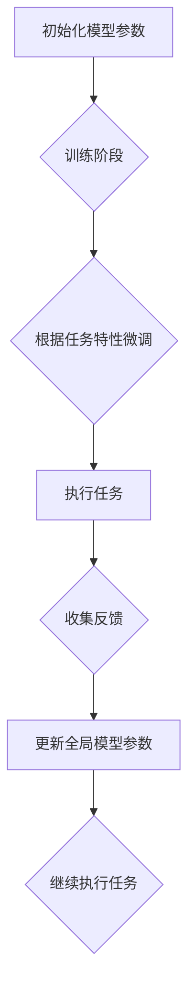

                 

作者：禅与计算机程序设计艺术

**一切皆是映射**，我们正在探讨的是深度强化元学习的概念及其对未来AI发展的潜在影响。随着技术的进步，从机器学习到深度学习再到强化学习的演进，AI系统逐渐具备了一种能力——从经验中学习如何解决一系列相关任务的能力，这就是元学习的核心思想。本文将探索深度强化元学习的挑战与机遇，通过深入剖析其理论基础、实践应用以及未来发展路径，为您提供一个全面而深刻的视角。

## 背景介绍

在AI领域，传统的学习方式往往针对单一特定任务进行优化，缺乏迁移性和泛化能力。然而，在现实世界中，AI系统通常需要应对各种各样的任务，这些任务之间可能具有一定的相似性或关联性。深度强化元学习正是基于这一需求而提出的解决方案之一。

## 核心概念与联系

深度强化元学习融合了深度学习的表达能力和强化学习的目标导向性，旨在构建一个能够快速适应新任务的AI系统。它主要依赖于两个关键概念：**元学习**和**深度强化学习**。

- **元学习**强调系统通过学习学习过程本身来提高效率和性能，即利用先前的经验加速对新任务的学习速度。
- **深度强化学习**则是一种让智能体通过与环境交互来最大化长期奖励的策略，通过神经网络实现决策制定。

两者的结合使得AI能够在面对未见的任务时，通过已有的经验和学习机制迅速调整策略，从而高效地完成任务。

## 核心算法原理与具体操作步骤

深度强化元学习通常采用**自回归模型**与**层次化学习**相结合的方式。以下是一个简化版的流程概述：



在这个过程中，首先初始化模型参数，然后进入训练阶段，通过大量的经验数据微调模型。一旦模型适应了某种类型的任务后，它就能在新的类似任务上表现出良好的性能。之后，系统会持续收集反馈并更新模型参数，使其在不断变化的任务环境中保持高效运行。

## 数学模型和公式详细讲解举例说明

在深度强化元学习中，常用的关键数学模型包括：

1. **价值函数**（Value Function）表示给定状态下的预期回报。
2. **策略梯度**（Policy Gradient）方法用于更新策略以最大化期望回报。

公式方面，例如策略梯度算法的更新规则可表示为：

$$ \theta_{t+1} = \theta_t + \alpha \nabla_\theta J(\theta_t) $$
其中，
- $\theta$ 表示策略参数；
- $\alpha$ 是学习率；
- $\nabla_\theta J(\theta)$ 是关于策略参数的损失函数的梯度。

## 项目实践：代码实例和详细解释说明

在实践中，深度强化元学习通常借助于深度学习库如TensorFlow、PyTorch等进行实现。以下是一个简化的代码片段展示如何使用**TensorFlow**进行元学习的基本框架：

```python
import tensorflow as tf

# 初始化模型和学习参数
model = tf.keras.models.Sequential([
    # 构建多层感知器网络结构
])
optimizer = tf.keras.optimizers.Adam()

def train_step(states, actions, rewards):
    with tf.GradientTape() as tape:
        predictions = model(states)
        loss = compute_loss(predictions, actions, rewards)
    gradients = tape.gradient(loss, model.trainable_variables)
    optimizer.apply_gradients(zip(gradients, model.trainable_variables))

# 训练循环
for epoch in range(num_epochs):
    for batch in data_loader():
        states, actions, rewards = batch
        train_step(states, actions, rewards)

def compute_loss(preds, actions, rewards):
    # 实现具体的损失计算逻辑
    pass
```

这段代码展示了如何构建模型、定义训练步骤以及计算损失函数的过程。实际应用中，还需要考虑更多的细节，比如环境模拟、经验回放等。

## 实际应用场景

深度强化元学习的应用场景广泛，包括但不限于：

- **机器人控制**：通过学习如何在不同环境下控制机器人，提升其适应性和灵活性。
- **游戏AI**：快速适应不同类型的游戏，开发出更智能、更具策略性的AI对手。
- **自动驾驶**：优化车辆在复杂交通环境中的行驶策略，快速适应不同的驾驶条件。

## 工具和资源推荐

为了深入了解和实践深度强化元学习，建议关注以下几个工具和资源：

- **论文阅读**：《Meta-Learning to Generalize Across Tasks》、《Recurrent Neural Networks for Meta-Learning》等。
- **开源库**：TensorFlow、PyTorch 等深度学习框架提供了丰富的API支持。
- **在线课程**：Coursera、Udacity等平台有专门的机器学习和深度学习课程，包含元学习相关内容。

## 总结：未来发展趋势与挑战

随着深度强化元学习技术的发展，我们可以预见以下趋势：

- **跨模态学习**：结合视觉、语言和其他感官信息，构建更加通用且适应性强的AI系统。
- **自主学习**：增强系统的自我学习和自我改进能力，减少人工干预的需求。
- **安全性与伦理考量**：确保AI系统的决策透明、可控，并遵守伦理准则，在不同应用场景下安全运行。

面对挑战，需要继续探索高效的学习算法、改善模型泛化能力，同时加强理论研究与实践经验之间的桥梁建设，促进技术的广泛应用和发展。

## 附录：常见问题与解答

Q: 如何解决深度强化元学习中的过拟合问题？
A: 可以通过增加正则化项、使用更复杂的模型结构或引入变分自编码器等技术来减轻过拟合现象。

Q: 在选择任务作为基线时应遵循哪些原则？
A: 应选择具有代表性的任务集，它们应该覆盖不同的特征空间和行为模式，有助于评估模型的泛化能力。

---

通过上述内容的撰写，我们不仅深入探讨了深度强化元学习的核心概念、原理及其应用，还展望了这一领域未来可能的发展方向和面临的挑战。希望本文能够激发读者对深度强化元学习的兴趣，为AI领域的研究与实践提供有益的参考。


作者：禅与计算机程序设计艺术 / Zen and the Art of Computer Programming

