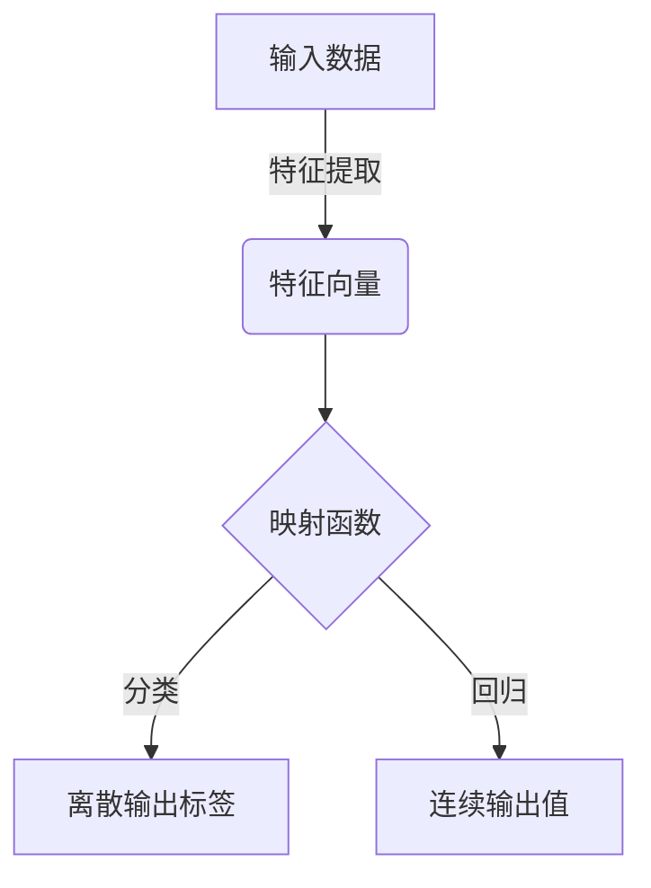
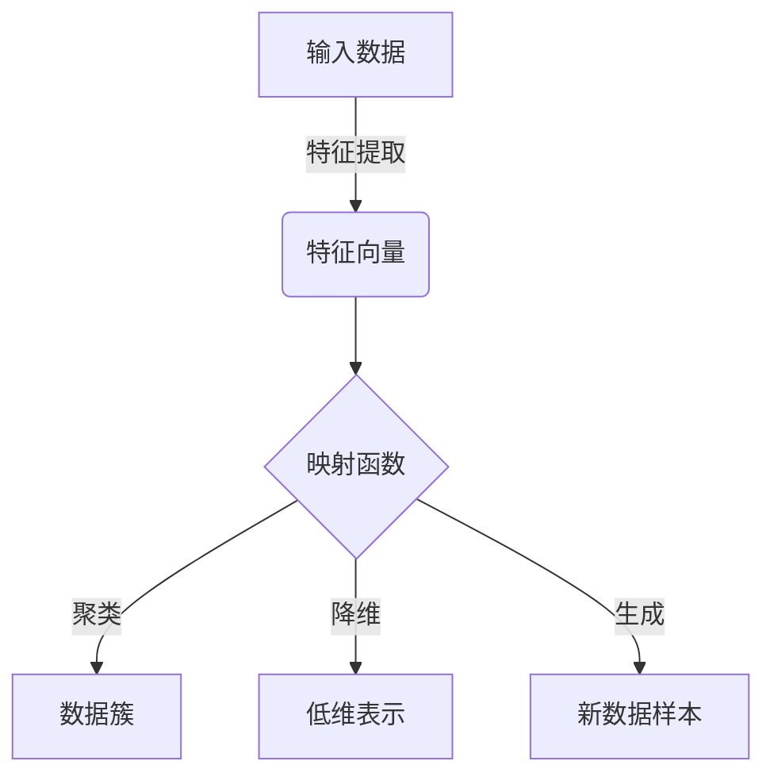
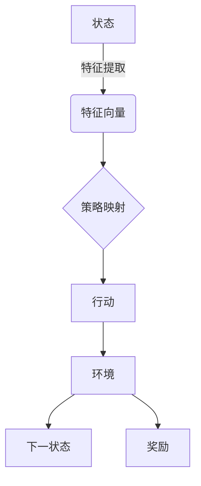

# 一切皆是映射：理解AI中的输入与输出关系

## 1.背景介绍

在人工智能(AI)的世界中,我们经常会听到"映射"这个概念。无论是监督学习、无监督学习还是强化学习,都可以被视为一种将输入映射到输出的过程。理解这种输入与输出之间的映射关系,对于掌握AI的本质至关重要。

### 1.1 什么是映射?

在数学中,映射(mapping)是一种将一个集合中的元素与另一个集合中的元素相关联的函数。在AI中,我们将输入数据(如图像、文本或其他特征)视为来自一个集合,而将期望的输出(如分类标签、回归值或行为)视为来自另一个集合。AI算法的目标就是学习一个映射函数,将输入映射到正确的输出。

### 1.2 AI中的映射挑战

尽管映射的概念看似简单,但在实践中存在许多挑战:

- **高维输入空间**: 现实世界的数据通常具有高维度,如图像中的像素或自然语言处理中的词向量,这增加了学习映射函数的复杂性。
- **复杂映射函数**: 输入与输出之间的映射关系可能是高度非线性和复杂的,需要强大的模型来捕捉这种复杂性。
- **噪声和不确定性**: 真实数据通常包含噪声和不确定性,这可能会干扰映射函数的学习。
- **数据不平衡**: 在某些情况下,输入空间中的数据分布可能是不平衡的,这会影响模型的性能。

## 2.核心概念与联系

### 2.1 监督学习

在监督学习中,我们拥有一组标记的训练数据,其中每个输入实例都与一个期望的输出相关联。目标是学习一个映射函数,将新的输入实例映射到正确的输出。这种映射可以是分类(将输入映射到离散标签)或回归(将输入映射到连续值)。



### 2.2 无监督学习

在无监督学习中,我们只有输入数据,没有相应的标签或目标输出。目标是从数据中发现内在模式或结构,将输入映射到一个新的表示空间。这种映射可以用于聚类、降维或生成新的数据样本。



### 2.3 强化学习

在强化学习中,智能体(agent)与环境(environment)进行交互。智能体根据当前状态选择一个行动,环境则根据该行动转移到下一个状态,并返回一个奖励信号。目标是学习一个策略(policy),将状态映射到行动,以最大化预期的累积奖励。



无论是监督学习、无监督学习还是强化学习,它们都可以被视为一种将输入映射到输出的过程。理解这种映射关系对于设计和优化AI算法至关重要。

## 3.核心算法原理具体操作步骤

尽管不同的AI任务和算法可能有所不同,但大多数映射过程都遵循以下基本步骤:

### 3.1 数据预处理

在开始学习映射函数之前,通常需要对输入数据进行预处理。这可能包括标准化、特征缩放、数据清洗和增强等步骤,以确保数据具有适当的格式和质量。

### 3.2 特征提取

许多AI算法无法直接处理原始输入数据,需要将其转换为更有意义的特征向量表示。这可以通过手工特征工程或自动特征学习(如深度学习中的卷积层和嵌入层)来实现。

### 3.3 模型选择和训练

根据任务的性质,选择合适的模型架构和学习算法。常见的模型包括线性模型、决策树、支持向量机、神经网络等。然后,使用训练数据来优化模型参数,使其能够很好地捕获输入与输出之间的映射关系。

### 3.4 评估和调整

在训练过程中,通常会使用验证集或交叉验证来评估模型的性能。根据评估结果,可能需要调整模型超参数、特征工程或训练策略,以提高模型的泛化能力。

### 3.5 预测和决策

一旦模型被训练好,就可以将其应用于新的输入数据,生成相应的输出预测或决策。在某些情况下,还需要考虑不确定性、可解释性和公平性等因素。

### 3.6 持续改进

随着新数据的不断涌入和新需求的出现,映射模型可能需要进行持续的更新和改进。这可能涉及重新训练、迁移学习或在线学习等技术。

## 4.数学模型和公式详细讲解举例说明

在AI中,许多映射函数都可以用数学模型和公式来表示。以下是一些常见的例子:

### 4.1 线性回归

线性回归是一种简单但有效的映射模型,它将输入特征向量$\mathbf{x}$映射到一个连续的输出值$y$,通过以下公式:

$$y = \mathbf{w}^\top \mathbf{x} + b$$

其中$\mathbf{w}$是权重向量,$b$是偏置项。在训练过程中,我们需要学习$\mathbf{w}$和$b$的最优值,使得预测值$y$与真实值之间的误差最小化。

### 4.2 逻辑回归

逻辑回归是一种广泛应用于分类任务的映射模型。它将输入特征向量$\mathbf{x}$映射到一个介于0和1之间的概率值$p$,表示输入实例属于正类的可能性:

$$p = \sigma(\mathbf{w}^\top \mathbf{x} + b)$$

其中$\sigma$是sigmoid函数,将线性组合$\mathbf{w}^\top \mathbf{x} + b$映射到(0,1)范围内。通过设置一个阈值,我们可以将概率值转换为二元分类输出。

### 4.3 神经网络

神经网络是一种强大的非线性映射模型,它由多个层次的神经元组成。每个神经元执行一个简单的加权求和操作,并通过非线性激活函数(如ReLU或sigmoid)进行变换:

$$y = \phi(\mathbf{w}^\top \mathbf{x} + b)$$

其中$\phi$是激活函数,$\mathbf{w}$是权重向量,$b$是偏置项。通过堆叠多个这样的层,神经网络可以学习复杂的映射关系,并在各种任务上取得出色的性能。

### 4.4 核方法

在某些情况下,输入与输出之间的映射关系可能无法用简单的线性或非线性函数很好地捕捉。核方法(如支持向量机)通过将输入数据映射到一个高维特征空间,使得原本线性不可分的问题在新的特征空间中变得线性可分。

$$f(\mathbf{x}) = \mathbf{w}^\top \phi(\mathbf{x}) + b$$

其中$\phi$是一个非线性映射函数,将输入$\mathbf{x}$映射到高维特征空间。通过选择合适的核函数$K(\mathbf{x}, \mathbf{x}')=\phi(\mathbf{x})^\top \phi(\mathbf{x}')$,我们可以在原始输入空间中计算内积,而无需显式计算高维映射。

这些只是AI中映射函数的一小部分例子。根据具体任务和数据的特点,我们可以选择或设计不同的模型架构和优化算法,以学习更加精确和有效的映射关系。

## 5.项目实践:代码实例和详细解释说明

为了更好地理解AI中的映射概念,让我们通过一个简单的线性回归示例来实践一下。我们将使用Python和scikit-learn库来构建、训练和评估一个线性回归模型。

### 5.1 准备数据

首先,我们需要准备一些示例数据。在这个例子中,我们将使用一个简单的线性函数$y = 2x + 3$来生成一些带有噪声的数据点。

```python
import numpy as np

# 生成输入数据
X = np.random.rand(100, 1) * 10  # 100个介于0到10之间的随机数

# 生成目标输出
y = 2 * X + 3 + np.random.randn(100, 1)  # 添加一些噪声
```

### 5.2 构建模型

接下来,我们将从scikit-learn库中导入线性回归模型,并创建一个实例。

```python
from sklearn.linear_model import LinearRegression

# 创建线性回归模型实例
model = LinearRegression()
```

### 5.3 训练模型

现在,我们可以使用训练数据来拟合模型,学习将输入$X$映射到输出$y$的最佳参数。

```python
# 训练模型
model.fit(X, y)
```

在训练过程中,线性回归模型将使用最小二乘法来找到最佳拟合的直线,将输入$X$映射到输出$y$。

### 5.4 评估模型

为了评估模型的性能,我们可以在训练数据上进行预测,并计算预测值与真实值之间的均方根误差(RMSE)。

```python
# 在训练数据上进行预测
y_pred = model.predict(X)

# 计算RMSE
from sklearn.metrics import mean_squared_error
rmse = np.sqrt(mean_squared_error(y, y_pred))
print(f"RMSE: {rmse:.2f}")
```

### 5.5 可视化结果

最后,我们可以将训练数据、真实值和预测值可视化,直观地观察映射关系。

```python
import matplotlib.pyplot as plt

# 绘制数据点和拟合直线
plt.scatter(X, y, color='blue', label='Data')
plt.plot(X, y_pred, color='red', label='Linear Regression')
plt.xlabel('Input')
plt.ylabel('Output')
plt.title('Linear Regression Example')
plt.legend()
plt.show()
```

通过这个简单的示例,我们可以看到如何使用Python和scikit-learn库来构建、训练和评估一个线性回归模型,将输入数据映射到输出值。当然,对于更复杂的任务和数据,我们可能需要使用更高级的模型和技术,但基本思路是相似的。

## 6.实际应用场景

映射在AI的各个领域都有广泛的应用,以下是一些典型的场景:

### 6.1 计算机视觉

在计算机视觉任务中,我们需要将图像像素映射到相应的类别标签(如物体识别)或像素级别的输出(如语义分割)。深度卷积神经网络已经在这些任务中取得了巨大的成功,能够有效地捕捉图像中的视觉特征并将其映射到所需的输出。

### 6.2 自然语言处理

在自然语言处理(NLP)领域,我们需要将文本序列(如单词或字符)映射到语义表示、情感标签或其他任务相关的输出。transformer模型(如BERT和GPT)已经成为NLP任务中的关键技术,它们能够有效地捕捉文本中的上下文信息,并将其映射到所需的输出。

### 6.3 推荐系统

推荐系统的目标是将用户的历史行为和偏好映射到他们可能感兴趣的项目(如电影、音乐或产品)。这种映射通常涉及协同过滤技术和embedding技术,以捕捉用户和项目之间的潜在关系。

### 6.4 机器人控制

在机器人控制领域,我们需要将传感器数据(如视觉、雷达或惯性测量单元)映射到机器人的运动命令或轨迹规划。这种映射通常涉及强化学习和控制理论,以确保机器人能够安全有效地完成任务。

### 6.5 金融预测

在金融领域,我们需要将