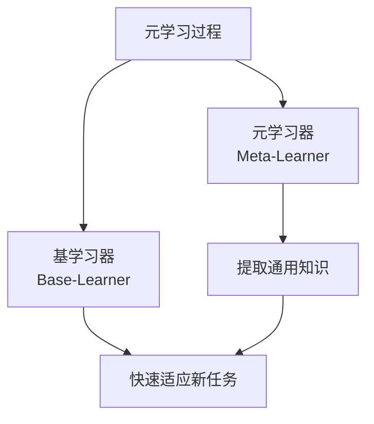
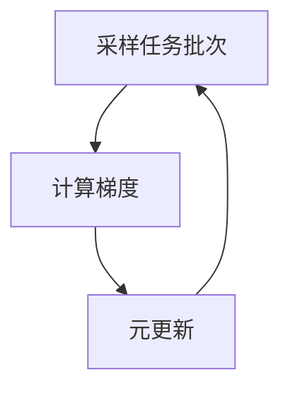
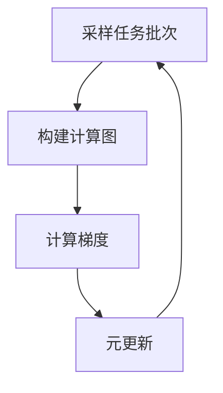

# 一切皆是映射：用元学习攻克驾驶行为的预测挑战

## 1. 背景介绍

### 1.1 自动驾驶的挑战

自动驾驶是当今人工智能领域最具挑战性的任务之一。它要求智能系统能够实时感知复杂的环境,并根据感知信息做出合理的决策和行为控制。其中,预测其他交通参与者(如行人、骑车人、其他车辆等)的行为是自动驾驶系统的关键组成部分。准确预测他们的运动轨迹对于避免潜在碰撞、保证行车安全至关重要。

### 1.2 行为预测的困难

然而,准确预测交通参与者的行为并非易事。这些行为往往受到多种因素的影响,包括:

- **环境因素**:道路状况、天气、交通信号等
- **交互影响**:其他参与者的行为会影响目标对象的决策
- **长期依赖**:行为预测需要考虑较长时间段内的历史轨迹信息
- **多模态性**:在给定历史信息的情况下,未来可能存在多种合理的运动轨迹

传统的基于规则或物理模型的方法很难有效捕捉如此复杂的行为模式。因此,研究人员开始探索使用深度学习等数据驱动方法来解决这一挑战。

### 1.3 数据驱动方法的局限性

尽管深度学习取得了一些进展,但仍然面临一些重大挑战:

- **数据量有限**:获取大规模高质量的真实数据集代价高昂
- **领域差异**:在不同城市、国家的数据集上训练的模型往往难以泛化
- **长期依赖建模**:大多数模型只考虑了较短的历史轨迹信息
- **多模态性建模**:现有模型往往只预测单一的未来轨迹,无法有效捕捉多种可能性

为了解决这些挑战,研究人员开始探索元学习(Meta-Learning)在行为预测任务中的应用,以提高模型的泛化能力和多模态预测能力。

## 2. 核心概念与联系

### 2.1 元学习概述

元学习(Meta-Learning)是机器学习中的一个新兴领域,旨在使学习系统能够从过去的经验中积累知识,并将这些知识应用于新的学习任务中,从而提高学习效率和泛化能力。

元学习算法通常由两个关键组成部分:

1. **元学习器(Meta-Learner)**: 一个学习模型,负责从一系列任务中提取出通用的知识。
2. **基学习器(Base-Learner)**: 一个可以快速适应新任务的学习模型,利用元学习器提取的知识进行快速学习。

在元学习过程中,元学习器和基学习器通过交替优化的方式相互促进,共同提高整体的学习能力。

### 2.2 元学习在行为预测中的应用

在行为预测任务中,我们可以将每个场景(如不同的城市、天气、交通状况等)视为一个独立的任务。元学习的目标是从这些任务中学习通用的知识,使得模型能够快速适应新的场景,提高预测的准确性和泛化能力。

具体来说,元学习可以帮助模型解决以下挑战:

- **数据量有限**: 通过在多个相关任务上学习,模型可以更有效地利用有限的数据,提高数据效率。
- **领域差异**: 元学习可以帮助模型提取出通用的行为模式,从而更好地泛化到新的领域。
- **长期依赖建模**: 一些元学习算法能够更好地捕捉长期的时序依赖关系。
- **多模态性建模**: 通过条件计算,元学习可以为给定的历史信息生成多种合理的未来轨迹。

因此,将元学习引入行为预测任务有望显著提高模型的性能和泛化能力。

## 3. 核心算法原理具体操作步骤

### 3.1 基于模型的元学习算法

基于模型的元学习算法旨在学习一个高效的模型初始化策略,使得在新任务上通过少量数据微调,就能快速获得良好的性能。这类算法的核心思想是在多个不同但相关的任务上训练,使模型能够提取出通用的知识,并将其编码到初始参数中。

一种典型的基于模型的元学习算法是模型无关的元学习(Model-Agnostic Meta-Learning, MAML)。MAML的工作流程如下:

1. **采样任务批次**: 从任务分布 $p(\mathcal{T})$ 中采样一个任务批次 $\mathcal{T}_i$。
2. **计算梯度**: 对于每个任务 $\mathcal{T}_i$,将其进一步划分为支持集 $\mathcal{D}_i^{tr}$ 和查询集 $\mathcal{D}_i^{val}$。在支持集上进行一或多步梯度更新,得到任务特定的模型参数 $\phi_i$:

   $$\phi_i = \phi - \alpha \nabla_\phi \mathcal{L}_{\mathcal{T}_i}(\phi, \mathcal{D}_i^{tr})$$

   其中 $\alpha$ 是学习率, $\mathcal{L}_{\mathcal{T}_i}$ 是任务 $\mathcal{T}_i$ 的损失函数。

3. **元更新**: 使用查询集 $\mathcal{D}_i^{val}$ 计算每个任务的损失,并across tasks取平均,得到元损失函数 $\mathcal{L}_{\text{meta}}$。使用元损失函数对模型初始参数 $\phi$ 进行更新:

   $$\phi \leftarrow \phi - \beta \nabla_\phi \mathcal{L}_{\text{meta}}(\phi)$$

   其中 $\beta$ 是元学习率。

通过上述过程,MAML能够找到一个良好的模型初始化点,使得在新任务上通过少量数据微调,就能快速获得良好的性能。

### 3.2 基于指标的元学习算法

基于指标的元学习算法旨在直接学习一个能够快速适应新任务的学习策略,而不是学习模型初始化。这类算法通常建模在一系列任务上的学习过程,并将其形式化为一个优化问题,目标是找到一个能够最小化各个任务损失函数的最优学习策略。

一种典型的基于指标的元学习算法是优化作为模型的层级程序(Optimization as a Model-Based Meta-Learning)。该算法将学习过程建模为一个计算图,其中包含了模型参数、优化器状态以及损失函数等元素。在训练过程中,该计算图将端到端地进行优化,以找到一个能够快速适应新任务的最优学习策略。

具体来说,该算法的工作流程如下:

1. **采样任务批次**: 从任务分布 $p(\mathcal{T})$ 中采样一个任务批次 $\mathcal{T}_i$。
2. **构建计算图**: 对于每个任务 $\mathcal{T}_i$,将其划分为支持集 $\mathcal{D}_i^{tr}$ 和查询集 $\mathcal{D}_i^{val}$。构建一个计算图,包含模型参数 $\phi$、优化器状态 $s$、支持集损失 $\mathcal{L}_{\mathcal{T}_i}(\phi, \mathcal{D}_i^{tr})$ 和查询集损失 $\mathcal{L}_{\mathcal{T}_i}(\phi', \mathcal{D}_i^{val})$。
3. **计算梯度**: 在支持集上进行一或多步梯度更新,得到任务特定的模型参数 $\phi'$:

   $$\phi', s' = \text{Optimizer}(\phi, s, \nabla_\phi \mathcal{L}_{\mathcal{T}_i}(\phi, \mathcal{D}_i^{tr}))$$

4. **元更新**: 使用查询集损失 $\mathcal{L}_{\mathcal{T}_i}(\phi', \mathcal{D}_i^{val})$ 计算元损失函数 $\mathcal{L}_{\text{meta}}$,并对优化器参数 $\theta$ 进行更新:

   $$\theta \leftarrow \theta - \beta \nabla_\theta \mathcal{L}_{\text{meta}}(\theta)$$

通过上述过程,该算法能够找到一个能够快速适应新任务的优化策略,从而提高模型的学习效率和泛化能力。

## 4. 数学模型和公式详细讲解举例说明

在行为预测任务中,我们需要根据目标对象的历史轨迹数据 $X = \{x_1, x_2, \dots, x_T\}$ 来预测其未来的运动轨迹 $Y = \{y_1, y_2, \dots, y_{T'}\}$,其中 $T$ 和 $T'$ 分别表示历史和未来的时间步长。

### 4.1 问题形式化

我们可以将行为预测问题形式化为一个条件概率模型:

$$P(Y|X, C) = \prod_{t=1}^{T'} P(y_t|x_1, \dots, x_T, y_1, \dots, y_{t-1}, C)$$

其中 $C$ 表示场景的上下文信息,如道路结构、交通规则等。该模型旨在捕捉目标对象未来运动与其历史轨迹和场景上下文之间的条件依赖关系。

为了解决多模态性问题,我们可以进一步将上式重写为:

$$P(Y|X, C) = \sum_{z} P(Y|X, C, z)P(z|X, C)$$

其中 $z$ 表示潜在的运动模式或意图,模型需要同时预测未来轨迹 $Y$ 和潜在模式 $z$ 的联合概率分布。

### 4.2 基于递归的建模方式

一种常见的建模方式是使用递归神经网络(Recurrent Neural Network, RNN)对历史轨迹进行编码,并将编码后的隐状态作为条件,预测未来轨迹。具体来说,我们可以定义一个编码器 $f_\text{enc}$ 和一个解码器 $f_\text{dec}$:

$$
h_t = f_\text{enc}(x_t, h_{t-1}), \quad t = 1, \dots, T \\
y_t = f_\text{dec}(h_T, y_{t-1}, C), \quad t = 1, \dots, T'
$$

其中 $h_t$ 表示时刻 $t$ 的隐状态,编码器 $f_\text{enc}$ 递归地处理历史轨迹数据,得到最终的编码 $h_T$。解码器 $f_\text{dec}$ 则根据编码 $h_T$、上一时刻的预测结果 $y_{t-1}$ 和场景上下文 $C$,递归地生成未来轨迹。

对于多模态预测,我们可以在解码器中引入潜在变量 $z$,使得:

$$y_t = f_\text{dec}(h_T, y_{t-1}, z, C)$$

在训练阶段,我们需要最大化 $P(Y|X, C)$ 的对数似然,即最小化负对数似然损失:

$$\mathcal{L}(X, Y, C) = -\log P(Y|X, C)$$

### 4.3 基于注意力的建模方式

另一种常见的建模方式是使用注意力机制(Attention Mechanism)直接对历史轨迹进行建模,而不是使用递归编码器。具体来说,我们可以定义一个注意力模块 $f_\text{att}$,用于计算每个时刻的注意力权重:

$$
\alpha_t = f_\text{att}(x_t, y_{t-1}, C), \quad t = 1, \dots, T \\
c_t = \sum_{i=1}^T \alpha_{t,i} x_i
$$

其中 $\alpha_t$ 是时刻 $t$ 的注意力权重向量,表示模型对历史轨迹中不同时刻的关注程度。 $c_t$ 