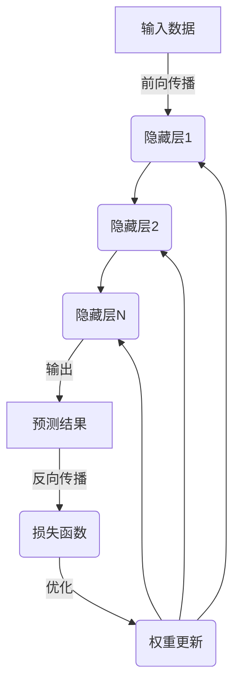
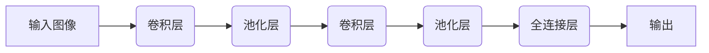
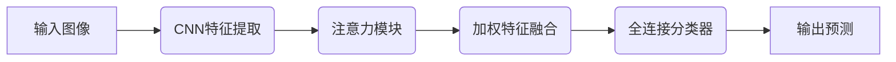
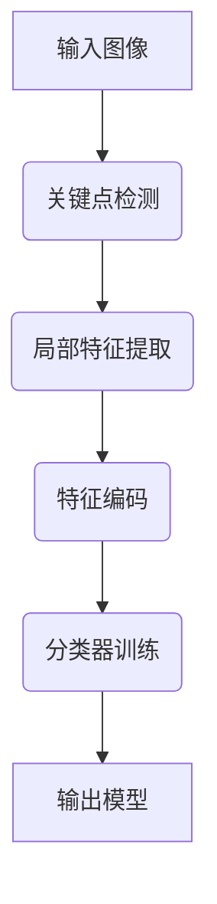
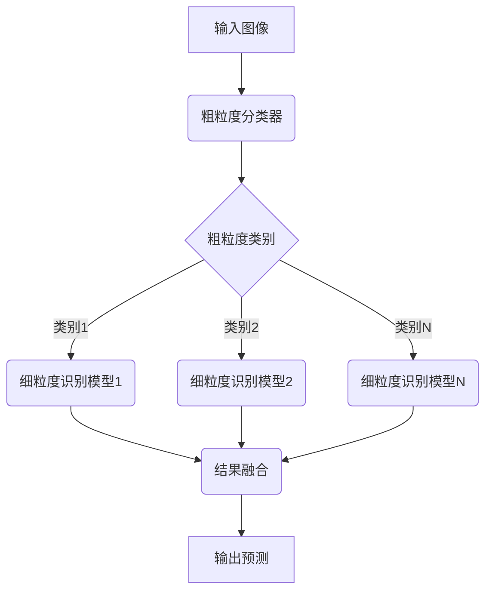

# 一切皆是映射：细粒度图像识别与深度神经网络

## 1.背景介绍

### 1.1 图像识别的重要性

在当今的数字时代,图像数据无处不在。从社交媒体上的照片和视频,到医疗影像、卫星遥感等专业领域,图像数据都扮演着越来越重要的角色。能够准确高效地识别和理解图像内容,对于各种应用场景都具有重大意义。

### 1.2 传统图像识别方法的局限性  

早期的图像识别方法主要依赖于手工设计的特征提取算法和机器学习模型,如SIFT、HOG等经典算法。这些方法需要大量的领域知识和人工参与,且往往只能识别较为简单的目标。面对复杂的真实场景,它们的性能和泛化能力都显得捉襟见肘。

### 1.3 深度学习在图像识别中的突破

近年来,以卷积神经网络(CNN)为代表的深度学习方法在图像识别领域取得了革命性的突破。这些模型能够自动从大量数据中学习出多层次的特征表示,极大提高了识别的准确性和鲁棒性。尤其是在细粒度图像识别任务中,深度神经网络展现出了独特的优势。

### 1.4 细粒度图像识别的挑战

细粒度图像识别旨在对同一大类目标(如鸟类、汽车等)进行细分,准确识别出其种类和细节特征。这对模型的判别能力提出了极高的要求,需要捕捉图像中微小的视觉差异。同时,细粒度数据的标注也是一个巨大的挑战。

## 2.核心概念与联系

### 2.1 深度神经网络

深度神经网络是一种由多个隐藏层组成的人工神经网络,能够自动从原始数据中学习出多层次的特征表示。常见的深度网络包括卷积神经网络(CNN)、递归神经网络(RNN)和生成对抗网络(GAN)等。

### 2.2 卷积神经网络

卷积神经网络(CNN)是一种专门用于处理网格状数据(如图像)的深度网络结构。它由卷积层、池化层和全连接层等组成,能够有效捕获图像的局部模式和空间信息。

### 2.3 注意力机制

注意力机制是深度学习中一种重要的技术,它允许模型在处理输入数据时,动态地分配注意力权重,关注重要的区域和特征。在细粒度图像识别中,注意力机制可以帮助模型聚焦于判别种类的关键部位。

### 2.4 微调与迁移学习

由于细粒度数据的标注成本很高,微调与迁移学习在这一领域扮演着重要角色。研究人员通常在大规模数据集(如ImageNet)上预训练一个通用的CNN模型,然后在细粒度数据上进行微调,借助已学习的通用特征来加速训练。

### 2.5 细粒度图像识别的评测指标

常用的细粒度图像识别评测指标包括:
- 准确率(Accuracy):正确预测的样本数占总样本数的比例
- 平均准确率(Mean Accuracy):计算每个类别的准确率,再取平均
- mAP(mean Average Precision):基于精确率-召回率曲线计算的综合指标

## 3.核心算法原理具体操作步骤  

### 3.1 基于注意力机制的细粒度图像识别

注意力机制在细粒度图像识别中发挥着关键作用,能够帮助模型聚焦于判别种类的关键部位。下面介绍一种典型的基于注意力机制的细粒度图像识别算法流程:

1. **特征提取**:使用预训练的CNN模型(如VGG、ResNet等)对输入图像进行特征提取,得到特征图张量。
2. **注意力机制**:将特征图张量输入到注意力模块中,计算每个空间位置的注意力权重。常用的注意力模块包括:
   - 基于通道的注意力(Channel Attention)
   - 基于空间的注意力(Spatial Attention)
   - 混合注意力(Mixed Attention)
3. **加权特征融合**:将注意力权重与原始特征图相乘,得到加权后的特征表示,突出了重要的区域和特征。
4. **分类器**:将加权特征输入到全连接层分类器中,得到最终的类别预测结果。

### 3.2 基于局部特征的细粒度图像识别

另一种常见的细粒度图像识别方法是,先定位图像中的关键部位,再提取这些局部区域的特征用于分类。算法流程如下:

1. **关键点检测**:使用现有的关键点检测算法(如SIFT、Harris等)在图像中检测出一系列关键点。
2. **局部特征提取**:在每个关键点周围的局部区域提取特征描述符,如SIFT描述符、HOG描述符等。
3. **特征编码**:将所有局部特征描述符编码成一个固定长度的全局特征向量,常用的编码方法有向量量化编码(VQ)、VLAD编码、Fisher向量编码等。
4. **分类器训练**:将编码后的全局特征向量输入到分类器(如SVM、随机森林等)中进行训练,得到最终的分类模型。

### 3.3 基于细粒度识别的两阶段方法

上述两种方法都是一阶段的端到端模型。还有一种常见的两阶段方法,先对图像进行粗粒度分类,然后在细分类别内进行细粒度识别。算法流程如下:

1. **粗粒度分类**:使用通用的CNN模型(如VGG、ResNet等)对输入图像进行粗粒度分类,如将图像分为"鸟类"、"汽车"等大类。
2. **细粒度识别**:针对每个粗粒度类别,训练一个专门的细粒度识别模型(可以使用上述注意力机制或局部特征方法),对该类别内的细分种类进行识别。
3. **结果融合**:将粗粒度分类结果与细粒度识别结果相结合,得到最终的细粒度预测结果。

这种两阶段方法的优点是,可以将细粒度识别任务分解为多个相对简单的子任务,提高整体性能。但缺点是计算开销较大,并且粗粒度分类的错误会传递到细粒度识别阶段。

## 4.数学模型和公式详细讲解举例说明

细粒度图像识别算法中涉及到多种数学模型和公式,下面将对其中几个核心部分进行详细讲解。

### 4.1 卷积神经网络

卷积神经网络(CNN)是细粒度图像识别中最常用的深度学习模型。它的核心思想是使用卷积操作来提取图像的局部模式和空间信息。

卷积层的基本运算单元是卷积核,它是一个小的权重矩阵,在输入特征图上滑动计算,得到下一层的特征图。数学上,卷积操作可以表示为:

$$
y_{ij} = \sum_{m}\sum_{n}x_{m+i,n+j}w_{mn} + b
$$

其中 $x$ 是输入特征图, $w$ 是卷积核的权重, $b$ 是偏置项, $y$ 是输出特征图。

池化层则用于下采样特征图,减小数据量并提取局部的最大值或平均值等统计量,增强模型的平移不变性。最大池化的公式为:

$$
y_{ij} = \max_{(m,n) \in R_{ij}}x_{mn}
$$

其中 $R_{ij}$ 表示池化窗口的区域。

通过多个卷积层和池化层的堆叠,CNN可以自动学习出多层次的特征表示,捕捉图像中的局部模式、边缘、纹理等视觉信息。

### 4.2 注意力机制

注意力机制是细粒度图像识别中另一个关键技术,它赋予模型"注意力"能力,使其能够聚焦于输入数据的重要区域。

以通道注意力(Channel Attention)为例,其公式如下:

$$
\begin{aligned}
&\mathbf{v}_c = \mathrm{Pool}(\mathbf{F}_c) \\
&\mathbf{a}_c = \sigma(\mathbf{W}_v\mathrm{ReLU}(\mathbf{W}_u\mathbf{v}_c)) \\
&\mathbf{F}'_c = \mathbf{F}_c \odot \mathbf{a}_c
\end{aligned}
$$

其中 $\mathbf{F}_c$ 是输入特征图的第 $c$ 个通道, $\mathrm{Pool}(\cdot)$ 是全局池化操作(如平均池化或最大池化), $\mathbf{W}_u$ 和 $\mathbf{W}_v$ 是可学习的权重矩阵, $\sigma$ 是 Sigmoid 激活函数, $\odot$ 表示元素乘积。

该公式首先对每个通道进行全局池化,得到一个向量 $\mathbf{v}_c$,代表该通道的全局响应。然后通过一个小的全连接网络,将这个向量映射为一个标量 $\mathbf{a}_c$,作为该通道的注意力权重。最后,将原始特征图的每个通道与对应的注意力权重相乘,得到加权后的特征表示 $\mathbf{F}'_c$。

通过这种方式,注意力机制能够自动学习到每个通道的重要性权重,突出重要的特征通道,抑制不相关的特征,从而提高模型的判别能力。

### 4.3 局部特征编码

在基于局部特征的细粒度识别算法中,需要将大量的局部特征描述符编码成一个固定长度的全局特征向量。下面以经典的 VLAD(Vector of Locally Aggregated Descriptors) 编码为例进行说明。

假设有 $N$ 个 $D$ 维的局部特征描述符 $\{\mathbf{x}_1, \mathbf{x}_2, \ldots, \mathbf{x}_N\}$,以及 $K$ 个聚类中心 $\{\mathbf{c}_1, \mathbf{c}_2, \ldots, \mathbf{c}_K\}$,VLAD 编码的公式为:

$$
\mathbf{v}_k = \sum_{i=1}^N e_k(\mathbf{x}_i)(\mathbf{x}_i - \mathbf{c}_k)
$$

其中 $e_k(\mathbf{x}_i)$ 是指示函数,当 $\mathbf{x}_i$ 的最近聚类中心是 $\mathbf{c}_k$ 时为 1,否则为 0。

VLAD 编码的思想是,对于每个聚类中心,计算该中心附近所有局部特征与中心的残差向量之和,作为该中心的编码部分。最终,将所有聚类中心的编码部分拼接,就得到了长度为 $KD$ 的 