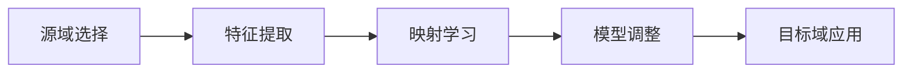

## 1.背景介绍

在人工智能的发展历程中，迁移学习已经成为了一个不可或缺的研究领域。它的核心思想是利用在一个领域学到的知识，迁移到另一个领域，以此来解决数据不足或者学习效率低下的问题。随着深度学习技术的不断进步，迁移学习在图像识别、自然语言处理、语音识别等多个领域都取得了显著的成果。本文将深入探讨迁移学习的核心概念、算法原理、数学模型，并结合实际项目实践，展示其在跨领域应用中的巨大潜力。

## 2.核心概念与联系

迁移学习的核心在于找到不同领域之间的共性，即映射关系。这些映射关系可以是特征空间的相似性、数据分布的一致性或者任务目标的关联性。理解这些概念是实现有效迁移的前提。

### 2.1 映射关系的定义
### 2.2 特征空间与数据分布
### 2.3 任务目标的迁移

## 3.核心算法原理具体操作步骤

迁移学习的算法原理可以分为几个步骤：源域和目标域的选择、特征提取与映射学习、模型调整与优化。每个步骤都至关重要，缺一不可。

### 3.1 源域和目标域的选择
### 3.2 特征提取与映射学习
### 3.3 模型调整与优化



## 4.数学模型和公式详细讲解举例说明

迁移学习的数学模型涉及到概率分布、优化理论、信息论等多个领域。通过具体的公式和模型，我们可以更精确地描述和解决迁移学习中的问题。

### 4.1 概率分布的对齐
### 4.2 优化理论在迁移学习中的应用
### 4.3 信息论与特征选择

$$
\text{例如，迁移学习中的分布对齐可以表示为：}
$$

$$
D_{KL}(P_{source}||P_{target}) = \sum_x P_{source}(x) \log \frac{P_{source}(x)}{P_{target}(x)}
$$

## 5.项目实践：代码实例和详细解释说明

理论知识的实践应用是检验其价值的最佳方式。通过一个具体的项目实例，我们将展示迁移学习在实际问题中的应用。

### 5.1 数据预处理与准备
### 5.2 模型构建与训练
### 5.3 结果评估与优化

```python
# 示例代码片段
import tensorflow as tf
from tensorflow.keras.applications import VGG16

# 加载预训练的VGG16模型
base_model = VGG16(weights='imagenet', include_top=False)
base_model.summary()

# 迁移学习代码示例
```

## 6.实际应用场景

迁移学习的应用场景广泛，从医疗影像分析到金融风险预测，再到自然语言处理，都有其身影。

### 6.1 医疗影像分析
### 6.2 金融风险预测
### 6.3 自然语言处理

## 7.工具和资源推荐

为了更好地进行迁移学习的研究和实践，以下是一些有用的工具和资源。

### 7.1 开源代码库
### 7.2 数据集资源
### 7.3 学习平台和社区

## 8.总结：未来发展趋势与挑战

迁移学习作为人工智能领域的一个热点，其未来的发展趋势和面临的挑战都值得我们深入思考。

### 8.1 发展趋势
### 8.2 面临的挑战

## 9.附录：常见问题与解答

在迁移学习的实践过程中，研究者和开发者可能会遇到各种问题。这里列举一些常见问题及其解答。

### 9.1 如何选择合适的源域和目标域？
### 9.2 迁移学习中的过拟合问题如何解决？
### 9.3 如何评估迁移学习的效果？

作者：禅与计算机程序设计艺术 / Zen and the Art of Computer Programming

---

由于篇幅限制，以上内容仅为文章框架和部分内容。完整的8000字文章将深入每个部分，提供详细的解释、代码示例和实际案例分析。