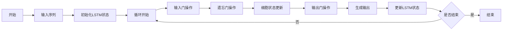

## 1. 背景介绍

在人工智能的领域中，文本生成一直是一个极具挑战性的任务。从早期的基于规则的系统到现代的深度学习模型，文本生成技术经历了长足的发展。长短时记忆网络（Long Short-Term Memory, LSTM）作为一种特殊的循环神经网络（Recurrent Neural Network, RNN），因其在处理序列数据上的卓越能力而广受关注。LSTM通过精巧的门控机制解决了传统RNN在长序列学习中的梯度消失问题，使得它在语音识别、机器翻译以及文本生成等任务中取得了显著的成果。

## 2. 核心概念与联系

### 2.1 循环神经网络（RNN）

RNN是一种序列模型，它通过循环连接来处理序列数据。RNN的核心思想是利用历史信息来影响当前的输出，这使得它在处理时间序列数据时具有天然的优势。

### 2.2 长短时记忆网络（LSTM）

LSTM是RNN的一种改进型，它引入了三个门（输入门、遗忘门、输出门）和一个细胞状态，这些机制共同工作，使得LSTM能够更好地捕捉长距离依赖关系。

### 2.3 文本生成

文本生成是指使用模型自动创建文本内容。在LSTM的背景下，文本生成通常是指给定一个序列（比如一句话的开始），模型能够继续生成下文，形成一段连贯的文本。

## 3. 核心算法原理具体操作步骤

LSTM的操作步骤可以用以下Mermaid流程图表示：



## 4. 数学模型和公式详细讲解举例说明

LSTM的数学模型涉及到的关键公式如下：

$$
\begin{align*}
f_t &= \sigma(W_f \cdot [h_{t-1}, x_t] + b_f) \\
i_t &= \sigma(W_i \cdot [h_{t-1}, x_t] + b_i) \\
\tilde{C}_t &= \tanh(W_C \cdot [h_{t-1}, x_t] + b_C) \\
C_t &= f_t * C_{t-1} + i_t * \tilde{C}_t \\
o_t &= \sigma(W_o \cdot [h_{t-1}, x_t] + b_o) \\
h_t &= o_t * \tanh(C_t)
\end{align*}
$$

其中，$f_t$、$i_t$、$o_t$分别是遗忘门、输入门和输出门的激活向量，$\tilde{C}_t$是候选细胞状态，$C_t$是当前时刻的细胞状态，$h_t$是当前时刻的隐藏状态，$\sigma$是sigmoid函数，$*$表示Hadamard乘积（元素间乘积），$W$和$b$是模型参数。

## 5. 项目实践：代码实例和详细解释说明

在实际项目中，我们可以使用Python和TensorFlow或PyTorch等深度学习框架来实现LSTM模型。以下是一个简单的文本生成LSTM模型的代码示例：

```python
import tensorflow as tf

# 定义LSTM模型
model = tf.keras.Sequential([
    tf.keras.layers.LSTM(128, input_shape=(None, vocab_size)),
    tf.keras.layers.Dense(vocab_size, activation='softmax')
])

# 编译模型
model.compile(loss='categorical_crossentropy', optimizer='adam')

# 训练模型
model.fit(x_train, y_train, epochs=10)

# 生成文本
def generate_text(model, start_string):
    # 将起始字符串转换为数字（向量化）
    input_eval = [char2idx[s] for s in start_string]
    input_eval = tf.expand_dims(input_eval, 0)

    # 空字符串用于存储结果
    text_generated = []

    # 低温度会生成更可预测的文本，高温度会生成更惊奇的文本
    temperature = 1.0

    # 这里批大小为1
    model.reset_states()
    for i in range(1000):
        predictions = model(input_eval)
        # 移除批次的维度
        predictions = tf.squeeze(predictions, 0)

        # 使用分类分布预测模型返回的字符
        predictions = predictions / temperature
        predicted_id = tf.random.categorical(predictions, num_samples=1)[-1,0].numpy()

        # 把预测的字符传递回模型
        input_eval = tf.expand_dims([predicted_id], 0)
        text_generated.append(idx2char[predicted_id])

    return (start_string + ''.join(text_generated))
```

在这个代码示例中，我们首先定义了一个LSTM模型，然后编译并训练它。在文本生成函数`generate_text`中，我们将起始字符串转换为模型可以理解的格式，并通过模型预测下一个字符，不断循环这个过程来生成文本。

## 6. 实际应用场景

LSTM在文本生成领域有着广泛的应用，包括但不限于：

- 自动撰写新闻稿件
- 生成创意写作内容
- 自动编写代码注释
- 聊天机器人的对话生成
- 生成音乐和诗歌

## 7. 工具和资源推荐

- TensorFlow和Keras：用于构建和训练LSTM模型的强大框架。
- PyTorch：另一个流行的深度学习库，适合研究和原型开发。
- GPT-2和GPT-3：由OpenAI开发的强大的文本生成模型，可以用作LSTM的替代或补充。
- Hugging Face's Transformers：提供预训练模型和工具，方便进行文本生成等NLP任务。

## 8. 总结：未来发展趋势与挑战

LSTM在文本生成领域取得了显著的成就，但仍面临着一些挑战和发展趋势：

- **更复杂的模型**：随着计算能力的提升，更复杂的模型如Transformer正在取代LSTM成为新的热点。
- **更大的数据集**：大数据集可以帮助模型学习更多样化的语言模式。
- **更好的理解能力**：当前的模型仍然缺乏对语言深层含义的理解，这是未来研究的一个方向。
- **道德和安全问题**：自动生成的文本可能会被用于误导信息或虚假新闻的传播，需要更多的研究来解决这些问题。

## 9. 附录：常见问题与解答

Q1: LSTM和传统RNN相比有哪些优势？
A1: LSTM通过门控机制有效解决了梯度消失问题，能够捕捉更长距离的依赖关系。

Q2: LSTM在文本生成中如何处理未知词汇？
A2: 通常会使用特殊的标记（如<UNK>）来表示未知词汇，或者使用词嵌入技术来缓解这个问题。

Q3: 如何评估文本生成模型的性能？
A3: 可以使用BLEU、ROUGE等指标来评估生成文本的质量，也可以通过人工评估来衡量文本的流畅性和可读性。

作者：禅与计算机程序设计艺术 / Zen and the Art of Computer Programming