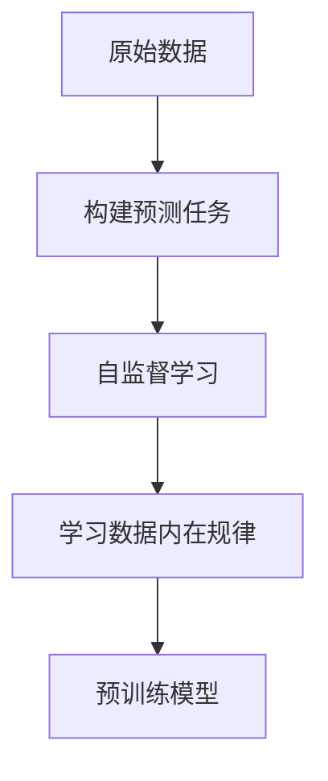
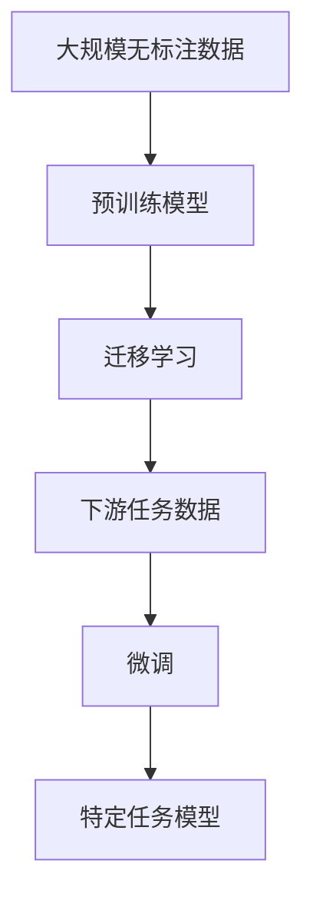
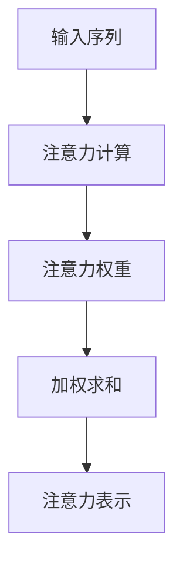
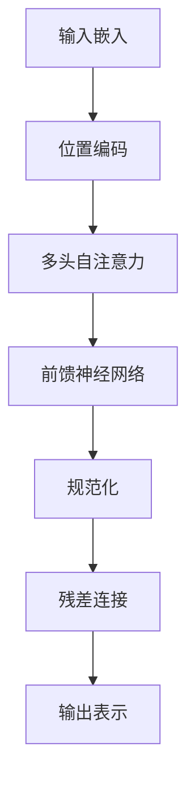
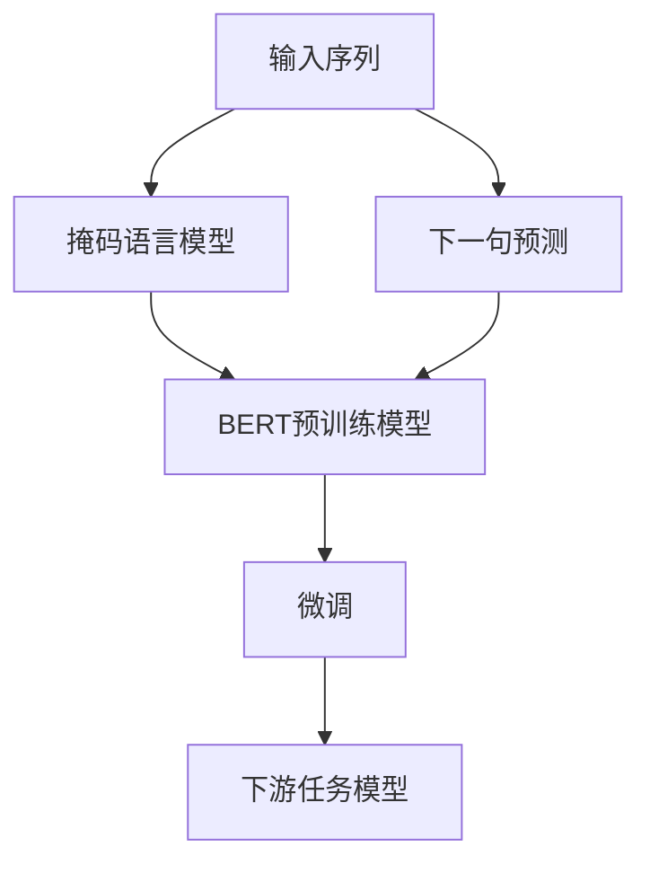
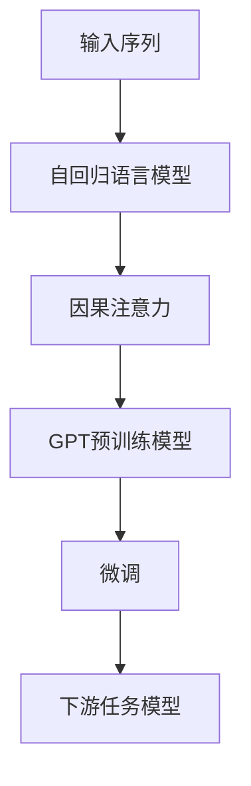

# 一切皆是映射：预训练模型如何改变深度学习领域

## 1. 背景介绍

### 1.1 深度学习的发展历程

深度学习作为机器学习的一个分支,近年来取得了令人瞩目的成就。从最初的人工神经网络,到现在的各种复杂模型,深度学习已经渗透到计算机视觉、自然语言处理、推荐系统等诸多领域。然而,训练一个深度神经网络需要大量的数据和计算资源,这使得深度学习的发展遇到了瓶颈。

### 1.2 预训练模型的兴起

为了解决上述问题,预训练模型(Pre-trained Model)应运而生。预训练模型的核心思想是:在大规模无标注数据上预先训练一个通用的模型,然后将这个模型转移到下游任务中进行微调(fine-tuning),从而减少训练数据和计算资源的需求。这种思路极大地提高了模型的泛化能力和效率。

### 1.3 预训练模型在深度学习中的影响

预训练模型的出现彻底改变了深度学习的范式。传统的从头开始训练模型的方式逐渐被预训练和微调所取代。预训练模型不仅在自然语言处理领域取得了巨大成功,在计算机视觉、语音识别等领域也展现出了强大的能力。可以说,预训练模型是深度学习发展的一个里程碑,它为解决复杂任务提供了一种全新的思路。

## 2. 核心概念与联系

### 2.1 自监督学习(Self-Supervised Learning)

预训练模型的核心思想源于自监督学习。自监督学习是一种无需人工标注的学习方式,它通过构建预测任务,利用数据本身的信息进行训练。例如,对于自然语言处理任务,可以将句子中的某些词遮蔽,然后让模型去预测这些被遮蔽的词。通过这种方式,模型可以捕捉到语言的内在规律和语义信息。



### 2.2 迁移学习(Transfer Learning)

预训练模型的另一个核心概念是迁移学习。迁移学习指的是将在一个领域学习到的知识应用到另一个领域。在预训练模型中,我们首先在大规模无标注数据上训练一个通用模型,然后将这个模型迁移到下游任务中进行微调。由于预训练模型已经学习到了一些通用的知识,因此只需要少量的标注数据就可以完成下游任务的训练。



### 2.3 注意力机制(Attention Mechanism)

注意力机制是预训练模型中一个非常重要的概念。传统的序列模型(如RNN)存在长期依赖问题,难以捕捉长距离依赖关系。注意力机制通过计算输入序列中不同位置元素之间的相关性,自动学习到哪些位置更重要,从而更好地建模长距离依赖。自注意力(Self-Attention)是注意力机制的一种变体,它允许每个位置的元素与其他所有位置的元素进行交互,大大提高了模型的表达能力。



## 3. 核心算法原理具体操作步骤

### 3.1 Transformer模型

Transformer是预训练模型中最著名的一种架构,它完全基于注意力机制,不再使用RNN或CNN。Transformer的核心组件是多头自注意力(Multi-Head Self-Attention)和前馈神经网络(Feed-Forward Neural Network)。

1. **输入嵌入(Input Embeddings)**: 将输入序列(如文本)转换为嵌入向量表示。
2. **位置编码(Positional Encoding)**: 因为Transformer没有递归结构,所以需要添加位置信息。
3. **多头自注意力(Multi-Head Self-Attention)**: 计算每个位置与其他所有位置的注意力权重,并进行加权求和,得到注意力表示。
4. **前馈神经网络(Feed-Forward Neural Network)**: 对注意力表示进行非线性变换,提取更高级的特征。
5. **规范化(Normalization)**: 对每一层的输出进行归一化,以加速训练。
6. **残差连接(Residual Connection)**: 将输入和输出相加,以缓解梯度消失问题。



### 3.2 BERT模型

BERT(Bidirectional Encoder Representations from Transformers)是一种基于Transformer的预训练语言模型,它通过掩码语言模型(Masked Language Model)和下一句预测(Next Sentence Prediction)两个任务进行预训练。

1. **掩码语言模型(Masked Language Model)**: 随机遮蔽输入序列中的一些词,然后让模型预测这些被遮蔽的词。
2. **下一句预测(Next Sentence Prediction)**: 判断两个句子是否相邻,以捕捉句子之间的关系。
3. **微调(Fine-tuning)**: 在下游任务上进行微调,如文本分类、问答系统等。



### 3.3 GPT模型

GPT(Generative Pre-trained Transformer)是另一种基于Transformer的预训练语言模型,它采用了自回归语言模型(Autoregressive Language Model)的预训练方式。

1. **自回归语言模型(Autoregressive Language Model)**: 给定前面的词,预测下一个词。
2. **因果注意力(Causal Attention)**: 只允许每个位置的词关注之前的词,而不能关注之后的词。
3. **微调(Fine-tuning)**: 在下游任务上进行微调,如文本生成、机器翻译等。



## 4. 数学模型和公式详细讲解举例说明

### 4.1 自注意力机制(Self-Attention)

自注意力机制是Transformer模型的核心组件。给定一个输入序列$X = (x_1, x_2, \dots, x_n)$,自注意力机制计算每个位置$i$与其他所有位置$j$的注意力权重$\alpha_{ij}$,然后进行加权求和,得到位置$i$的注意力表示$y_i$。数学表达式如下:

$$y_i = \sum_{j=1}^n \alpha_{ij}(x_j W^V)$$

其中,$W^V$是一个可学习的值向量(Value Vector)。注意力权重$\alpha_{ij}$的计算方式如下:

$$\alpha_{ij} = \frac{e^{s_{ij}}}{\sum_{k=1}^n e^{s_{ik}}}$$

$$s_{ij} = (x_i W^Q)(x_j W^K)^T$$

$W^Q$和$W^K$分别是查询向量(Query Vector)和键向量(Key Vector)的可学习参数。通过这种方式,模型可以自动学习到哪些位置更重要,从而更好地捕捉长距离依赖关系。

### 4.2 多头自注意力(Multi-Head Self-Attention)

多头自注意力是对单头自注意力的扩展,它允许模型从不同的子空间捕捉不同的依赖关系。具体做法是将查询向量$Q$、键向量$K$和值向量$V$分别线性投影到$h$个子空间,然后在每个子空间中计算自注意力,最后将所有子空间的注意力表示拼接起来。数学表达式如下:

$$\text{MultiHead}(Q, K, V) = \text{Concat}(head_1, \dots, head_h)W^O$$

$$\text{where } head_i = \text{Attention}(QW_i^Q, KW_i^K, VW_i^V)$$

$W_i^Q$、$W_i^K$、$W_i^V$和$W^O$都是可学习的线性投影参数。通过多头自注意力,模型可以从不同的子空间捕捉不同的依赖关系,提高了表达能力。

### 4.3 掩码语言模型(Masked Language Model)

BERT模型采用了掩码语言模型作为预训练任务之一。具体做法是随机将输入序列中的一些词替换为特殊的[MASK]标记,然后让模型预测这些被遮蔽的词。数学表达式如下:

$$\mathcal{L}_{\text{MLM}} = -\sum_{i=1}^n \log P(x_i | x_{\\mask})$$

其中,$x_{\\mask}$表示输入序列中被遮蔽的位置,$x_i$表示该位置的真实词。目标是最大化被遮蔽词的条件概率$P(x_i | x_{\\mask})$,也就是最小化掩码语言模型损失$\mathcal{L}_{\text{MLM}}$。通过这种方式,BERT可以学习到双向的语言表示,捕捉到上下文的语义信息。

## 5. 项目实践:代码实例和详细解释说明

以下是使用PyTorch实现Transformer模型的简化版本代码,并对关键部分进行了详细注释说明。

```python
import torch
import torch.nn as nn
import math

# 位置编码
class PositionalEncoding(nn.Module):
    def __init__(self, d_model, max_len=5000):
        super(PositionalEncoding, self).__init__()
        pe = torch.zeros(max_len, d_model)
        position = torch.arange(0, max_len, dtype=torch.float).unsqueeze(1)
        div_term = torch.exp(torch.arange(0, d_model, 2).float() * (-math.log(10000.0) / d_model))
        pe[:, 0::2] = torch.sin(position * div_term)
        pe[:, 1::2] = torch.cos(position * div_term)
        pe = pe.unsqueeze(0)
        self.register_buffer('pe', pe)

    def forward(self, x):
        return x + self.pe[:, :x.size(1)]

# 注意力机制
class Attention(nn.Module):
    def __init__(self, d_model):
        super(Attention, self).__init__()
        self.q_linear = nn.Linear(d_model, d_model)
        self.v_linear = nn.Linear(d_model, d_model)
        self.k_linear = nn.Linear(d_model, d_model)
        self.d_k = d_model

    def forward(self, q, k, v, mask=None):
        k = self.k_linear(k)
        q = self.q_linear(q)
        v = self.v_linear(v)

        weights = torch.matmul(q, k.transpose(1, 2)) / math.sqrt(self.d_k)
        if mask is not None:
            weights = weights.masked_fill(mask == 0, -1e9)
        norm_weights = torch.softmax(weights, dim=-1)
        output = torch.matmul(norm_weights, v)
        return output

# 多头自注意力
class MultiHeadAttention(nn.Module):
    def __init__(self, d_model, n_heads):
        super(MultiHeadAttention, self).__init__()
        self.n_heads = n_heads
        self.attention = Attention(d_model)
        self.w_q = nn.Linear(d_model, d_model)
        self.w_k = nn.Linear(d_model, d_model)
        self.w_v = nn.Linear(d_model, d_model)
        self.w_concat = nn.Linear(d_model, d_model)

    def forward(self, q, k, v, mask=None):
        q, k, v = self.w_q(q), self.w_k(k), self.w_v(v)
        q, k, v = (
            self.split_into_heads(x, self.n_heads)
            for x in (q, k, v)
        )

        out = self.attention(q, k, v, mask=mask)
        out = self.concat_heads(out)
        return self.w_concat(out)

    def split_into_heads(self