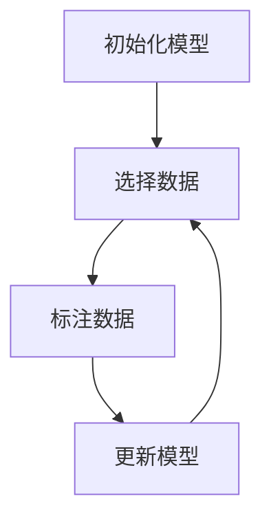

# 主动学习原理与代码实战案例讲解

## 1.背景介绍

在机器学习领域，数据是驱动模型性能的关键因素。然而，获取和标注大量高质量的数据往往是昂贵且耗时的。主动学习（Active Learning）作为一种有效的策略，旨在通过智能选择最有价值的数据进行标注，从而在减少标注成本的同时提升模型性能。主动学习的核心思想是让模型主动选择那些对其学习最有帮助的数据点进行标注，而不是被动地接受所有数据。

## 2.核心概念与联系

### 2.1 主动学习的定义

主动学习是一种机器学习方法，模型可以主动选择最有信息量的数据点进行标注，以提高学习效率和模型性能。其主要目标是通过最少的数据标注获得最优的模型性能。

### 2.2 主动学习与被动学习的区别

被动学习中，模型接受所有可用的标注数据进行训练，而主动学习则通过选择性地标注数据来优化学习过程。主动学习的优势在于可以显著减少标注成本，同时保持甚至提升模型性能。

### 2.3 主动学习的基本流程

主动学习的基本流程包括以下几个步骤：

1. 初始化：使用少量标注数据训练初始模型。
2. 选择数据：根据某种策略选择最有价值的未标注数据点。
3. 标注数据：对选择的数据点进行标注。
4. 更新模型：使用新标注的数据点重新训练模型。
5. 重复上述步骤，直到达到预期的性能或标注预算耗尽。

以下是主动学习流程的Mermaid图示：



## 3.核心算法原理具体操作步骤

### 3.1 不确定性采样

不确定性采样是主动学习中最常用的策略之一。其基本思想是选择模型最不确定的数据点进行标注。常见的不确定性度量方法包括：

- 最大熵：选择熵值最大的样本。
- 最小置信度：选择模型预测置信度最低的样本。
- 最小边际：选择预测概率分布中前两名概率差值最小的样本。

### 3.2 查询-合并策略

查询-合并策略（Query by Committee, QBC）通过多个模型（委员会）对未标注数据进行预测，选择委员会意见分歧最大的样本进行标注。其核心思想是通过多样性来提高模型的泛化能力。

### 3.3 核心集采样

核心集采样（Core-set Sampling）通过选择能够代表整个数据分布的样本进行标注。其目标是通过少量样本覆盖数据空间的多样性，从而提高模型的泛化能力。

## 4.数学模型和公式详细讲解举例说明

### 4.1 不确定性采样的数学模型

假设模型的预测概率分布为 $P(y|x)$，其中 $x$ 是输入数据，$y$ 是输出标签。不确定性采样的最大熵方法选择熵值最大的样本：

$$
H(x) = - \sum_{y} P(y|x) \log P(y|x)
$$

### 4.2 查询-合并策略的数学模型

查询-合并策略通过多个模型的预测结果计算样本的不确定性。假设有 $M$ 个模型，$P_m(y|x)$ 表示第 $m$ 个模型的预测概率分布。样本的不确定性可以通过以下公式计算：

$$
U(x) = \frac{1}{M} \sum_{m=1}^{M} H_m(x)
$$

其中，$H_m(x)$ 是第 $m$ 个模型的熵值。

### 4.3 核心集采样的数学模型

核心集采样通过选择能够覆盖数据空间的样本。假设数据空间为 $X$，核心集为 $C$，则核心集采样的目标是最小化以下目标函数：

$$
\min_{C \subset X} \sum_{x \in X} \min_{c \in C} d(x, c)
$$

其中，$d(x, c)$ 表示数据点 $x$ 和核心集点 $c$ 之间的距离。

## 5.项目实践：代码实例和详细解释说明

### 5.1 数据准备

首先，我们需要准备一个数据集。这里以经典的MNIST手写数字数据集为例。

```python
from sklearn.datasets import fetch_openml
import numpy as np

# 加载MNIST数据集
mnist = fetch_openml('mnist_784', version=1)
X, y = mnist.data, mnist.target

# 将数据集分为训练集和测试集
X_train, X_test = X[:60000], X[60000:]
y_train, y_test = y[:60000], y[60000:]
```

### 5.2 初始化模型

我们使用一个简单的逻辑回归模型作为初始模型。

```python
from sklearn.linear_model import LogisticRegression
from sklearn.metrics import accuracy_score

# 初始化模型
model = LogisticRegression(max_iter=1000)
initial_indices = np.random.choice(len(X_train), size=100, replace=False)
X_initial, y_initial = X_train[initial_indices], y_train[initial_indices]

# 训练初始模型
model.fit(X_initial, y_initial)
initial_accuracy = accuracy_score(y_test, model.predict(X_test))
print(f'Initial accuracy: {initial_accuracy:.4f}')
```

### 5.3 不确定性采样

接下来，我们实现不确定性采样策略，选择模型最不确定的样本进行标注。

```python
def uncertainty_sampling(model, X_pool, n_samples):
    # 计算预测概率
    probs = model.predict_proba(X_pool)
    # 计算熵值
    entropy = -np.sum(probs * np.log(probs + 1e-10), axis=1)
    # 选择熵值最大的样本
    query_indices = np.argsort(entropy)[-n_samples:]
    return query_indices

# 选择样本进行标注
n_samples = 100
query_indices = uncertainty_sampling(model, X_train, n_samples)
X_query, y_query = X_train[query_indices], y_train[query_indices]

# 更新模型
X_train_new = np.concatenate([X_initial, X_query])
y_train_new = np.concatenate([y_initial, y_query])
model.fit(X_train_new, y_train_new)
new_accuracy = accuracy_score(y_test, model.predict(X_test))
print(f'New accuracy after active learning: {new_accuracy:.4f}')
```

## 6.实际应用场景

### 6.1 医疗诊断

在医疗诊断中，标注数据通常需要专业医生的参与，成本高昂。主动学习可以通过选择最有诊断价值的病例进行标注，减少医生的工作量，提高诊断模型的性能。

### 6.2 自动驾驶

自动驾驶系统需要大量标注数据来训练模型。主动学习可以通过选择最具挑战性的驾驶场景进行标注，提高自动驾驶系统的安全性和可靠性。

### 6.3 自然语言处理

在自然语言处理任务中，标注数据的获取和标注成本较高。主动学习可以通过选择最具信息量的文本进行标注，提高模型的性能和泛化能力。

## 7.工具和资源推荐

### 7.1 工具

- **modAL**：一个Python库，专门用于实现主动学习算法，提供了多种主动学习策略和接口。
- **scikit-learn**：一个广泛使用的机器学习库，提供了丰富的机器学习算法和工具，可以与主动学习库结合使用。

### 7.2 资源

- **《Active Learning》**：一本全面介绍主动学习理论和应用的书籍，适合深入学习主动学习的读者。
- **Kaggle**：一个数据科学竞赛平台，提供了丰富的数据集和竞赛，可以用于主动学习的实践和验证。

## 8.总结：未来发展趋势与挑战

主动学习作为一种有效的机器学习策略，已经在多个领域展现出其优势。未来，随着数据量的不断增加和标注成本的不断上升，主动学习将会在更多实际应用中得到广泛应用。然而，主动学习也面临一些挑战，如如何选择最优的采样策略、如何处理高维数据和复杂模型等。解决这些挑战将是未来研究的重点方向。

## 9.附录：常见问题与解答

### 9.1 主动学习适用于哪些场景？

主动学习适用于标注成本高、数据量大且模型性能对标注数据敏感的场景，如医疗诊断、自动驾驶和自然语言处理等。

### 9.2 如何选择合适的主动学习策略？

选择合适的主动学习策略需要根据具体应用场景和数据特点进行评估。常见的策略包括不确定性采样、查询-合并策略和核心集采样等。

### 9.3 主动学习的效果如何评估？

主动学习的效果可以通过模型在测试集上的性能进行评估，如准确率、精确率、召回率等。同时，还可以通过标注成本和模型训练时间等指标进行综合评估。

---

作者：禅与计算机程序设计艺术 / Zen and the Art of Computer Programming