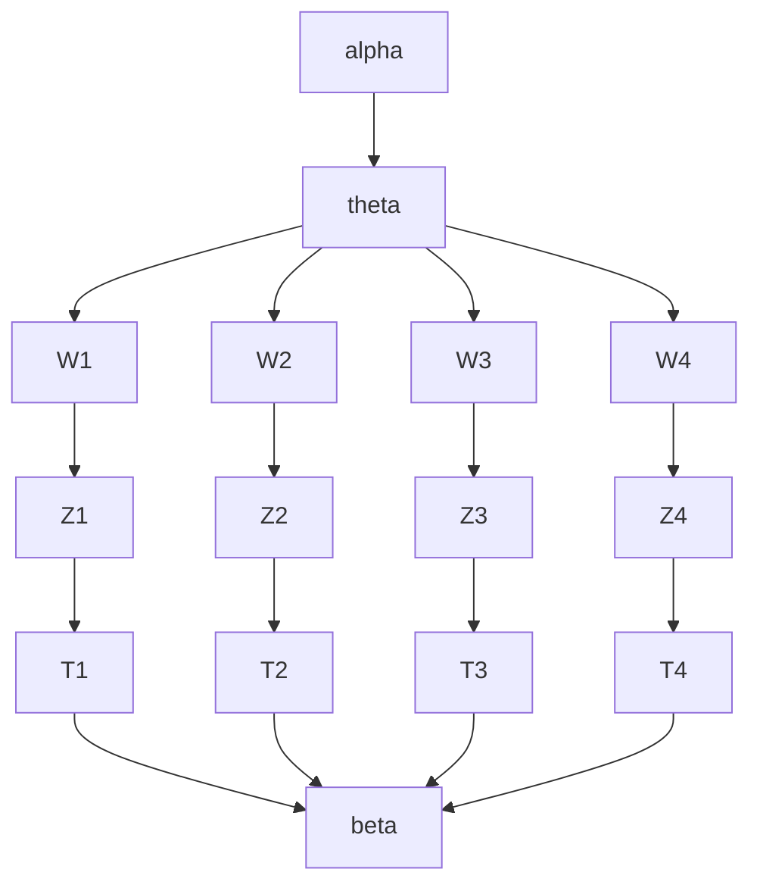

## 1.背景介绍

在信息爆炸的时代，如何从大量的文本数据中提取有用的信息成为了一个重要的问题。主题模型是一种文本挖掘技术，可以从大量文本数据中自动地发现潜在的主题，并将文本数据分配到这些主题中。主题模型已经被广泛应用于文本分类、信息检索、情感分析等领域。

## 2.核心概念与联系

主题模型是一种概率模型，它假设每个文档都由多个主题组成，每个主题又由多个单词组成。主题模型的核心概念包括文档、主题和单词。文档是指一段文本，主题是指文档中的潜在主题，单词是指文档中的词语。

主题模型的核心思想是，每个文档都由多个主题组成，每个主题又由多个单词组成。主题模型通过统计每个单词在每个主题中出现的概率，以及每个文档中每个主题的概率，来推断每个文档中的主题分布。主题模型可以用来发现文本数据中的潜在主题，从而实现文本分类、信息检索、情感分析等任务。

## 3.核心算法原理具体操作步骤

主题模型的核心算法是概率主题模型（Probabilistic Topic Model），其中最著名的是潜在狄利克雷分配模型（Latent Dirichlet Allocation，简称LDA）。LDA是一种无监督学习算法，它假设每个文档都由多个主题组成，每个主题又由多个单词组成。LDA的核心思想是，每个文档都由多个主题组成，每个主题又由多个单词组成。LDA通过统计每个单词在每个主题中出现的概率，以及每个文档中每个主题的概率，来推断每个文档中的主题分布。

LDA的具体操作步骤如下：

1. 初始化参数：设定主题数目K，以及每个主题中单词的分布。
2. 随机分配主题：对于每个文档中的每个单词，随机分配一个主题。
3. 统计每个主题中单词的出现次数：对于每个主题，统计其中每个单词出现的次数。
4. 统计每个文档中主题的出现次数：对于每个文档，统计其中每个主题出现的次数。
5. 更新主题分布：根据统计结果，更新每个主题中单词的分布。
6. 更新文档主题分布：根据统计结果，更新每个文档中主题的分布。
7. 重复步骤2-6，直到收敛。

## 4.数学模型和公式详细讲解举例说明

LDA的数学模型可以用图模型来表示。图模型是一种用图形表示概率分布的方法，其中节点表示随机变量，边表示变量之间的依赖关系。LDA的图模型如下所示：



其中，W表示单词，Z表示主题，T表示主题中的单词分布，beta表示主题中单词的分布，alpha表示文档中主题的分布，theta表示文档中主题的分布。

LDA的数学模型可以用以下公式表示：

$$
p(w_{i,j}|z_{i,j}=k,\beta)p(z_{i,j}=k|\theta_i)
$$

其中，$w_{i,j}$表示文档$i$中的第$j$个单词，$z_{i,j}$表示文档$i$中的第$j$个单词的主题，$k$表示主题的编号，$\beta$表示主题中单词的分布，$\theta_i$表示文档$i$中主题的分布。

## 5.项目实践：代码实例和详细解释说明

以下是使用Python实现LDA的代码示例：

```python
import numpy as np
import lda

# 加载数据
X = np.loadtxt('data.txt', dtype=int)

# 初始化LDA模型
model = lda.LDA(n_topics=10, n_iter=1000, random_state=1)

# 训练LDA模型
model.fit(X)

# 输出主题-单词分布
topic_word = model.topic_word_
print(topic_word)

# 输出文档-主题分布
doc_topic = model.doc_topic_
print(doc_topic)
```

以上代码中，我们使用了lda库来实现LDA模型。首先，我们加载了数据，然后初始化了LDA模型，设置了主题数目为10，迭代次数为1000。接着，我们训练了LDA模型，并输出了主题-单词分布和文档-主题分布。

## 6.实际应用场景

主题模型已经被广泛应用于文本分类、信息检索、情感分析等领域。以下是主题模型的一些实际应用场景：

1. 新闻分类：主题模型可以用来对新闻进行分类，从而实现自动化的新闻分类。
2. 社交媒体分析：主题模型可以用来对社交媒体上的文本进行分析，从而了解用户的兴趣和需求。
3. 产品评论分析：主题模型可以用来对产品评论进行分析，从而了解用户对产品的评价和需求。
4. 情感分析：主题模型可以用来对文本进行情感分析，从而了解用户的情感倾向和态度。

## 7.工具和资源推荐

以下是一些主题模型的工具和资源推荐：

1. lda库：一个用于实现LDA模型的Python库。
2. MALLET：一个用于实现LDA模型的Java库。
3. Gensim：一个用于实现LDA模型的Python库。
4. LDAvis：一个用于可视化LDA模型的Python库。
5. UCI Machine Learning Repository：一个包含大量机器学习数据集的资源库。

## 8.总结：未来发展趋势与挑战

主题模型是一种重要的文本挖掘技术，已经被广泛应用于文本分类、信息检索、情感分析等领域。未来，随着大数据和人工智能技术的发展，主题模型将会得到更广泛的应用。同时，主题模型也面临着一些挑战，例如如何处理多语言文本、如何处理长文本等问题。

## 9.附录：常见问题与解答

Q: 主题模型可以用来做什么？

A: 主题模型可以用来发现文本数据中的潜在主题，从而实现文本分类、信息检索、情感分析等任务。

Q: LDA是什么？

A: LDA是一种无监督学习算法，它假设每个文档都由多个主题组成，每个主题又由多个单词组成。

Q: 如何实现LDA模型？

A: 可以使用Python的lda库、Java的MALLET库、Python的Gensim库等工具来实现LDA模型。

Q: 主题模型面临哪些挑战？

A: 主题模型面临着一些挑战，例如如何处理多语言文本、如何处理长文本等问题。

作者：禅与计算机程序设计艺术 / Zen and the Art of Computer Programming