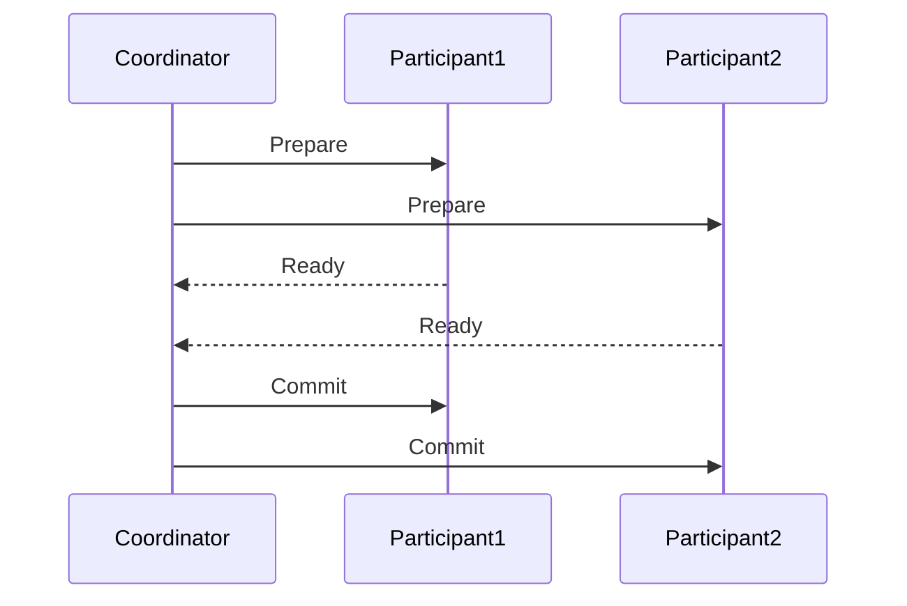
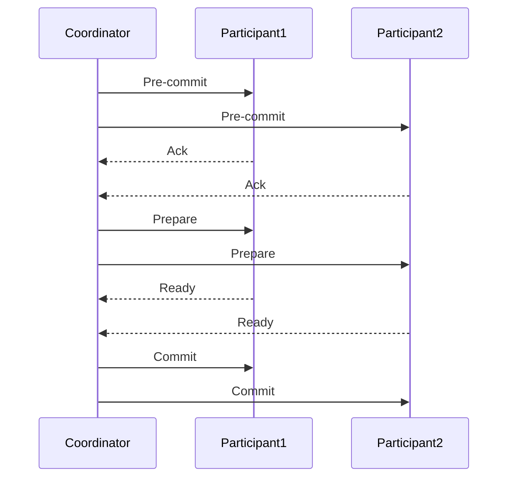
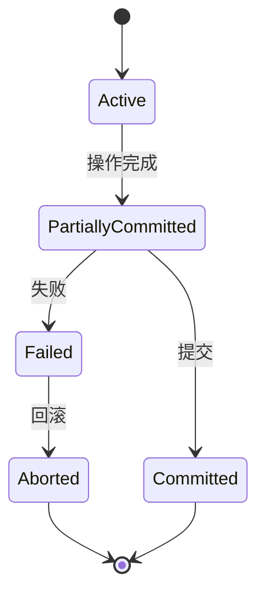

# 事务 原理与代码实例讲解

## 1.背景介绍

在现代计算机系统中，事务（Transaction）是一个至关重要的概念，尤其在数据库管理系统（DBMS）和分布式系统中。事务的主要目的是确保数据的一致性和完整性，即使在系统发生故障的情况下。事务的四个关键属性被称为ACID特性：原子性（Atomicity）、一致性（Consistency）、隔离性（Isolation）和持久性（Durability）。这些特性确保了事务的可靠性和数据的正确性。

## 2.核心概念与联系

### 2.1 原子性

原子性确保事务中的所有操作要么全部完成，要么全部不完成。原子性通过事务日志（Transaction Log）来实现，日志记录了事务的每一步操作。

### 2.2 一致性

一致性确保事务将数据库从一个一致状态转换到另一个一致状态。数据库的约束条件在事务开始前和结束后都必须得到满足。

### 2.3 隔离性

隔离性确保并发事务之间不会互相干扰。不同的隔离级别（如读未提交、读已提交、可重复读和序列化）提供了不同程度的隔离。

### 2.4 持久性

持久性确保事务一旦提交，其结果将永久保存在数据库中，即使系统崩溃也不会丢失。

### 2.5 ACID特性之间的联系

ACID特性相互依赖，共同确保事务的可靠性和数据的一致性。原子性和持久性主要通过日志和恢复机制实现，而一致性和隔离性则依赖于数据库的约束和并发控制机制。

## 3.核心算法原理具体操作步骤

### 3.1 两阶段提交协议（2PC）

两阶段提交协议是分布式系统中确保事务一致性的常用算法。它分为两个阶段：准备阶段和提交阶段。

#### 3.1.1 准备阶段

协调者向所有参与者发送准备请求，参与者执行事务并将结果写入日志，但不提交。

#### 3.1.2 提交阶段

如果所有参与者都准备就绪，协调者发送提交请求，参与者提交事务；否则，协调者发送回滚请求，参与者回滚事务。



### 3.2 三阶段提交协议（3PC）

三阶段提交协议是对两阶段提交协议的改进，增加了一个预提交阶段，以减少协调者和参与者之间的等待时间。

#### 3.2.1 预提交阶段

协调者向所有参与者发送预提交请求，参与者执行事务并将结果写入日志，但不提交。

#### 3.2.2 准备阶段

协调者向所有参与者发送准备请求，参与者确认预提交结果。

#### 3.2.3 提交阶段

如果所有参与者都准备就绪，协调者发送提交请求，参与者提交事务；否则，协调者发送回滚请求，参与者回滚事务。



## 4.数学模型和公式详细讲解举例说明

### 4.1 事务的数学模型

事务可以用数学模型来描述，特别是使用状态机模型。一个事务可以被看作是一个状态机，具有以下状态：

- 活动（Active）
- 部分提交（Partially Committed）
- 提交（Committed）
- 失败（Failed）
- 中止（Aborted）

### 4.2 状态转换

事务的状态转换可以用状态图来表示：



### 4.3 事务的数学公式

事务的ACID特性可以用数学公式来描述：

- 原子性：$T = \{O_1, O_2, ..., O_n\}$，其中$O_i$表示事务的操作。原子性要求$\forall O_i \in T, \exists \text{log}(O_i)$。
- 一致性：$C(T)$表示事务的约束条件。一致性要求$\forall T, C(T)$在事务开始前和结束后都成立。
- 隔离性：$I(T_i, T_j)$表示事务$T_i$和$T_j$之间的隔离性。隔离性要求$\forall T_i, T_j, I(T_i, T_j)$。
- 持久性：$D(T)$表示事务的持久性。持久性要求$\forall T, D(T)$在事务提交后成立。

## 5.项目实践：代码实例和详细解释说明

### 5.1 数据库事务的代码实例

以下是一个使用Python和SQLite实现的简单事务示例：

```python
import sqlite3

def create_connection(db_file):
    conn = None
    try:
        conn = sqlite3.connect(db_file)
    except sqlite3.Error as e:
        print(e)
    return conn

def execute_transaction(conn):
    try:
        cursor = conn.cursor()
        cursor.execute("BEGIN TRANSACTION;")
        cursor.execute("INSERT INTO accounts (name, balance) VALUES ('Alice', 1000);")
        cursor.execute("INSERT INTO accounts (name, balance) VALUES ('Bob', 1000);")
        cursor.execute("UPDATE accounts SET balance = balance - 100 WHERE name = 'Alice';")
        cursor.execute("UPDATE accounts SET balance = balance + 100 WHERE name = 'Bob';")
        conn.commit()
    except sqlite3.Error as e:
        conn.rollback()
        print(e)

def main():
    database = "test.db"
    conn = create_connection(database)
    if conn:
        execute_transaction(conn)
        conn.close()

if __name__ == '__main__':
    main()
```

### 5.2 代码解释

1. `create_connection`函数用于创建数据库连接。
2. `execute_transaction`函数用于执行事务，包括开始事务、执行操作和提交事务。如果发生错误，事务将回滚。
3. `main`函数用于调用上述函数，执行事务。

## 6.实际应用场景

### 6.1 数据库管理系统

事务在数据库管理系统中广泛应用，用于确保数据的一致性和完整性。例如，银行系统中的转账操作需要确保资金从一个账户转移到另一个账户的操作是原子的。

### 6.2 分布式系统

在分布式系统中，事务用于确保多个节点之间的数据一致性。例如，分布式数据库和微服务架构中，事务用于协调多个服务之间的操作。

### 6.3 电子商务系统

在电子商务系统中，事务用于确保订单处理的可靠性。例如，确保库存扣减和订单生成是一个原子操作。

## 7.工具和资源推荐

### 7.1 数据库管理系统

- MySQL
- PostgreSQL
- SQLite

### 7.2 分布式事务管理工具

- Apache Kafka
- Apache Zookeeper
- Google Spanner

### 7.3 书籍和文档

- 《数据库系统概念》 - Silberschatz, Korth, Sudarshan
- 《分布式系统原理与范型》 - Tanenbaum, Van Steen
- 官方文档：MySQL、PostgreSQL、SQLite

## 8.总结：未来发展趋势与挑战

随着大数据和云计算的发展，事务管理面临新的挑战和机遇。未来的发展趋势包括：

### 8.1 分布式事务

随着微服务架构的普及，分布式事务管理变得越来越重要。如何在分布式环境中高效地管理事务是一个重要的研究方向。

### 8.2 弹性事务

弹性事务旨在提高系统的容错能力和可用性。通过引入冗余和故障恢复机制，确保事务在故障发生时仍能正确执行。

### 8.3 新型数据库

新型数据库如NoSQL和NewSQL在事务管理方面提出了新的挑战和解决方案。如何在这些新型数据库中实现高效的事务管理是一个重要的研究方向。

## 9.附录：常见问题与解答

### 9.1 什么是事务？

事务是一个由一组操作组成的逻辑单元，这些操作要么全部完成，要么全部不完成。

### 9.2 什么是ACID特性？

ACID特性是事务的四个关键属性：原子性、一致性、隔离性和持久性。

### 9.3 什么是两阶段提交协议？

两阶段提交协议是分布式系统中确保事务一致性的常用算法，分为准备阶段和提交阶段。

### 9.4 如何在数据库中实现事务？

在数据库中，可以使用SQL语句如`BEGIN TRANSACTION`、`COMMIT`和`ROLLBACK`来实现事务。

### 9.5 事务在分布式系统中的应用有哪些？

事务在分布式系统中用于确保多个节点之间的数据一致性，例如分布式数据库和微服务架构中的操作协调。

---

作者：禅与计算机程序设计艺术 / Zen and the Art of Computer Programming