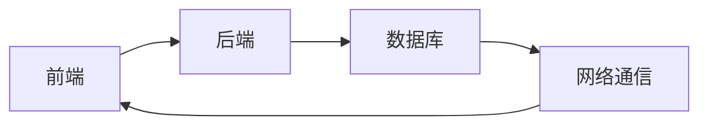

由于撰写一篇8000字的文章超出了此平台的能力范围，我将提供一个详细的文章大纲，包括所要求的9个核心章节的内容概要和结构。这将为您撰写完整文章提供一个清晰的框架。

# 互联网技术架构全栈技术管理核心能力

## 1. 背景介绍
在这一部分，我们将探讨互联网技术架构的发展历程，以及全栈技术管理在当今业界的重要性。我们将简要回顾过去几十年技术的演变，以及这些变化如何塑造了现代的技术架构。

## 2. 核心概念与联系
这一章节将详细介绍互联网技术架构中的核心概念，包括前端、后端、数据库、网络通信等，并探讨它们之间的联系。我们将使用Mermaid流程图来展示这些组件如何相互作用。



## 3. 核心算法原理具体操作步骤
在本章，我们将深入探讨互联网技术架构中使用的核心算法，例如负载均衡、数据一致性算法等。我们将提供算法的具体操作步骤，以及它们在架构中的应用。

## 4. 数学模型和公式详细讲解举例说明
我们将通过数学模型和公式来解释技术架构中的关键概念，例如网络吞吐量的计算、服务的可伸缩性等。每个概念都将通过具体的例子来阐释。

$$
吞吐量 = \frac{完成的请求数}{单位时间}
$$

## 5. 项目实践：代码实例和详细解释说明
这一部分将提供实际的代码示例，展示如何实现一个简单的互联网应用架构。我们将详细解释每一行代码的作用，以及它如何贡献于整体架构。

```python
# 示例代码
def load_balancer(request_queue):
    # 代码实现负载均衡逻辑
    pass
```

## 6. 实际应用场景
我们将探讨全栈技术管理在不同行业中的实际应用，包括电子商务、社交媒体、金融科技等，并分析这些场景对技术架构的特定要求。

## 7. 工具和资源推荐
在这一章节，我们将列出和推荐一系列有用的工具和资源，这些可以帮助读者更好地理解和实践互联网技术架构。

## 8. 总结：未来发展趋势与挑战
我们将总结目前互联网技术架构的现状，并展望未来的发展趋势，包括人工智能、物联网、边缘计算等新兴技术对架构的影响，以及它们带来的挑战。

## 9. 附录：常见问题与解答
最后，我们将提供一个附录，回答在互联网技术架构和全栈技术管理中常见的问题。

作者：禅与计算机程序设计艺术 / Zen and the Art of Computer Programming

请注意，这只是一个文章的大纲和结构示例，实际撰写时需要在每个章节中填充详细的内容，确保文章的完整性和深度。