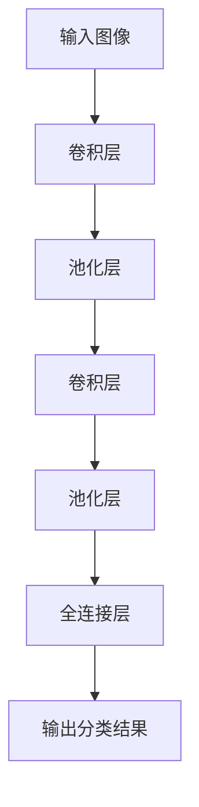
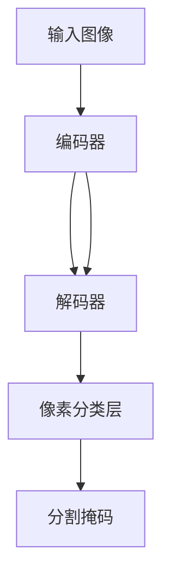

# 人工智能与人工智能：计算机视觉与机器学习的融合

## 1.背景介绍

### 1.1 人工智能的兴起

人工智能(Artificial Intelligence, AI)是当代科技发展的核心领域之一,近年来受到了前所未有的关注和投入。人工智能旨在使机器能够模拟人类的认知功能,如学习、推理、感知、规划和问题解决等。随着算力的飞速提升和海量数据的积累,人工智能技术在多个领域取得了突破性进展,展现出巨大的应用潜力。

### 1.2 计算机视觉与机器学习

计算机视觉(Computer Vision)是人工智能的一个重要分支,致力于赋予机器以视觉能力,使其能够获取、处理、分析和理解数字图像或视频中包含的信息。机器学习(Machine Learning)则是人工智能的核心驱动力,通过对大量数据的学习,机器可以自主获取知识、发现模式并做出决策。

计算机视觉和机器学习的融合,催生了诸多创新应用,如目标检测、图像分类、人脸识别、自动驾驶等,为人工智能的发展注入了新的动力。

## 2.核心概念与联系

### 2.1 计算机视觉核心概念

1. **数字图像处理**:对图像进行预处理,如降噪、增强对比度等,以提高图像质量。

2. **特征提取**:从图像中提取出具有代表性的特征,如边缘、角点、纹理等,为后续任务做准备。

3. **目标检测**:在图像中定位感兴趣的目标物体,并给出其位置和边界框。

4. **图像分类**:根据图像的内容对其进行分类,如识别图像中的物体、场景等。

5. **语义分割**:对图像中的每个像素点进行分类,标注出不同目标物体的精确位置和形状。

### 2.2 机器学习核心概念

1. **监督学习**:通过学习大量标注过的训练数据,建立输入与输出之间的映射关系。

2. **无监督学习**:仅从输入数据中自主发现潜在的模式和规律,无需人工标注。

3. **强化学习**:通过与环境的交互,不断尝试并根据反馈调整策略,以达到最优化目标。

4. **深度学习**:以人工神经网络为基础,通过对数据的建模,自动学习特征表示。

5. **迁移学习**:将在一个领域学习到的知识迁移到另一个相关领域,加速新任务的学习过程。

### 2.3 计算机视觉与机器学习的融合

计算机视觉任务通常被建模为机器学习问题,利用机器学习算法从大量图像数据中学习视觉模型。反过来,机器学习也可以从视觉数据中获取有价值的知识。两者相辅相成,推动着人工智能技术的飞速发展。

## 3.核心算法原理具体操作步骤

### 3.1 卷积神经网络

卷积神经网络(Convolutional Neural Network, CNN)是深度学习在计算机视觉领域的核心算法,广泛应用于图像分类、目标检测等任务。CNN的基本结构包括卷积层、池化层和全连接层。

1. **卷积层**:通过滑动卷积核在输入图像上进行卷积操作,提取出局部特征。

2. **池化层**:对卷积层的输出进行下采样,减少数据量并实现平移不变性。

3. **全连接层**:将前面层的特征映射到最终的分类空间,得到分类结果。

CNN的训练过程采用反向传播算法,通过不断调整网络权重,使网络在训练集上的损失函数值最小化。



### 3.2 目标检测算法

目标检测旨在定位图像中感兴趣的目标物体。主流算法包括基于区域的卷积神经网络(R-CNN)系列算法、单阶段算法(YOLO、SSD)等。

以YOLO算法为例,其核心思想是将目标检测问题建模为回归问题,直接在输入图像上预测边界框和类别概率。算法流程如下:

1. 将输入图像划分为 S×S 个网格。
2. 对每个网格预测 B 个边界框及其置信度,以及 C 个类别概率。
3. 通过非极大值抑制(NMS)处理,去除重复的边界框。
4. 根据置信度和类别概率过滤出最终的检测结果。

YOLO算法快速高效,但存在小目标检测精度较低的缺陷。后续版本通过特征金字塔网络(FPN)和其他改进策略不断提高性能。

### 3.3 图像分割算法

语义分割是将图像中的每个像素点分配到某个预定义的类别,常用于自动驾驶、医疗影像分析等领域。主流算法包括基于编码器-解码器结构的全卷积网络(FCN)、U-Net、Mask R-CNN等。

以U-Net为例,其核心架构为对称的编码器-解码器结构,编码器逐层捕获图像的上下文信息,解码器则逐层恢复空间分辨率。具体步骤如下:

1. **编码器**:通过卷积和池化操作逐层提取图像特征,获取语义信息。
2. **解码器**:通过上采样和卷积操作逐层恢复特征图的空间分辨率。
3. **跳跃连接**:将编码器的特征图与解码器对应层的特征图进行拼接,融合语义和位置信息。
4. **像素分类层**:对最终的特征图进行像素级别的分类,生成分割掩码。

U-Net的创新之处在于引入了跳跃连接,有效整合了不同层次的特征信息,提高了分割精度。



## 4.数学模型和公式详细讲解举例说明

### 4.1 卷积运算

卷积运算是CNN中的核心操作,用于提取图像的局部特征。给定输入特征图 $X$ 和卷积核 $K$,卷积运算可以表示为:

$$
Y_{i,j} = \sum_{m}\sum_{n}X_{m,n}K_{i-m,j-n}
$$

其中 $Y$ 为输出特征图, $i,j$ 为输出特征图的坐标, $m,n$ 为卷积核的坐标。卷积核在输入特征图上滑动,在每个位置进行点乘和操作,得到输出特征图上对应位置的值。

卷积运算具有平移等变性,可以有效捕获图像的局部模式。通过设计不同的卷积核,可以提取出不同的特征,如边缘、纹理等。

### 4.2 非极大值抑制

非极大值抑制(Non-Maximum Suppression, NMS)是目标检测算法中常用的后处理步骤,用于消除重复的边界框。

给定一组边界框及其置信度分数,NMS算法的步骤如下:

1. 按置信度分数从高到低排序所有边界框。
2. 选取置信度最高的边界框 $B_1$,将其加入输出列表。
3. 计算其余边界框与 $B_1$ 的重叠面积比 $\text{IoU}(B_i, B_1)$。
4. 移除所有与 $B_1$ 的 $\text{IoU}$ 大于阈值的边界框。
5. 重复步骤2-4,直到所有边界框被处理完毕。

其中,重叠面积比 $\text{IoU}$ 的计算公式为:

$$
\text{IoU}(B_1, B_2) = \frac{\text{Area}(B_1 \cap B_2)}{\text{Area}(B_1 \cup B_2)}
$$

NMS算法可以有效消除冗余的边界框,提高目标检测的精确度。

### 4.3 损失函数

在深度学习模型的训练过程中,损失函数(Loss Function)用于衡量模型预测值与真实值之间的差异。通过最小化损失函数,可以不断调整模型参数,提高模型的预测精度。

以图像分类任务为例,常用的损失函数是交叉熵损失(Cross-Entropy Loss),定义如下:

$$
\mathcal{L}(y, \hat{y}) = -\sum_{c=1}^{C}y_c\log(\hat{y}_c)
$$

其中 $y$ 为真实标签的一热编码向量, $\hat{y}$ 为模型预测的概率分布, $C$ 为类别数。交叉熵损失可以衡量预测概率分布与真实分布之间的差异,值越小表示模型预测越准确。

在目标检测和图像分割等其他任务中,损失函数的形式会有所不同,但核心思想是最小化模型预测值与真实值之间的误差。

## 5.项目实践:代码实例和详细解释说明

### 5.1 使用PyTorch实现卷积神经网络

以MNIST手写数字识别为例,我们使用PyTorch构建一个简单的卷积神经网络模型:

```python
import torch.nn as nn

class CNN(nn.Module):
    def __init__(self):
        super(CNN, self).__init__()
        self.conv1 = nn.Conv2d(1, 32, kernel_size=3, padding=1)
        self.pool = nn.MaxPool2d(2, 2)
        self.conv2 = nn.Conv2d(32, 64, kernel_size=3, padding=1)
        self.fc1 = nn.Linear(64 * 7 * 7, 128)
        self.fc2 = nn.Linear(128, 10)

    def forward(self, x):
        x = self.pool(nn.functional.relu(self.conv1(x)))
        x = self.pool(nn.functional.relu(self.conv2(x)))
        x = x.view(-1, 64 * 7 * 7)
        x = nn.functional.relu(self.fc1(x))
        x = self.fc2(x)
        return x
```

1. 构建卷积层 `nn.Conv2d`，第一个参数为输入通道数，第二个参数为输出通道数，`kernel_size` 为卷积核大小。
2. 构建最大池化层 `nn.MaxPool2d`，用于下采样特征图。
3. 构建全连接层 `nn.Linear`，将特征图展平后输入全连接层。
4. 在 `forward` 函数中定义网络的前向传播过程。

训练过程中，我们使用交叉熵损失函数和随机梯度下降优化器，对网络参数进行更新。

### 5.2 使用TensorFlow实现目标检测

以YOLO算法为例，我们使用TensorFlow构建一个简单的目标检测模型:

```python
import tensorflow as tf

class YOLOv1(tf.keras.Model):
    def __init__(self, num_classes):
        super(YOLOv1, self).__init__()
        self.conv_layers = [
            # 卷积层
            ...
        ]
        self.fc_layers = [
            # 全连接层
            ...
        ]

    def call(self, inputs):
        x = inputs
        for conv in self.conv_layers:
            x = conv(x)
        x = tf.reshape(x, (-1, tf.shape(x)[1] * tf.shape(x)[2] * tf.shape(x)[3]))
        for fc in self.fc_layers:
            x = fc(x)
        return x

# 构建模型
model = YOLOv1(num_classes=20)

# 定义损失函数和优化器
loss_fn = ...
optimizer = tf.keras.optimizers.Adam()

# 训练模型
for epoch in range(num_epochs):
    for images, labels in dataset:
        with tf.GradientTape() as tape:
            predictions = model(images)
            loss = loss_fn(labels, predictions)
        gradients = tape.gradient(loss, model.trainable_variables)
        optimizer.apply_gradients(zip(gradients, model.trainable_variables))
```

1. 定义卷积层和全连接层，组成YOLO网络的主体结构。
2. 在 `call` 函数中定义网络的前向传播过程，包括卷积层、特征图展平和全连接层。
3. 构建模型实例，定义损失函数和优化器。
4. 使用 `tf.GradientTape` 计算梯度，并通过优化器更新网络参数。

在实际应用中，