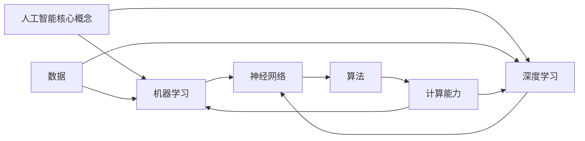

# 人工智能原理与代码实例讲解

## 1.背景介绍

人工智能(Artificial Intelligence, AI)是当代科技发展的前沿领域,旨在创建出能够模拟人类智能行为的智能机器系统。近年来,AI技术在众多领域取得了长足进步,例如计算机视觉、自然语言处理、机器学习等,极大推动了社会的智能化进程。

### 1.1 人工智能的发展历程

人工智能的概念可以追溯到20世纪40年代,当时一些科学家提出了"智能机器"的设想。1956年,约翰·麦卡锡在达特茅斯学院举办的一个会议上首次提出"人工智能"这一术语,标志着AI正式成为一个研究领域。

人工智能的发展大致可以分为四个阶段:

1. 启蒙时期(1950s-1960s):专家系统、博弈等领域取得初步进展。
2. 知识理解时期(1970s-1980s):发展逻辑推理、知识表示等技术。
3. 机器学习时期(1990s-2000s):神经网络、支持向量机等算法兴起。
4. 深度学习时期(2010s-至今):深度神经网络技术取得突破性进展。

### 1.2 人工智能的重要分支

人工智能是一个庞大的领域,包含多个重要分支:

- **机器学习(Machine Learning)**:从数据中自动分析获得规律,并对新数据进行预测。
- **深度学习(Deep Learning)**:基于深层神经网络模型的一种机器学习方法。
- **计算机视觉(Computer Vision)**:赋予机器对图像和视频数据的理解能力。
- **自然语言处理(Natural Language Processing)**:实现人机语言交互和语义理解。
- **机器人技术(Robotics)**:设计能够感知环境、规划行为和控制运动的智能机器人系统。
- **专家系统(Expert Systems)**:模拟人类专家的推理过程解决复杂问题。

## 2.核心概念与联系

人工智能涉及多个关键概念,这些概念之间存在紧密联系,共同构建了AI的理论基础和技术体系。

### 2.1 机器学习

机器学习是数据驱动的人工智能方法,它利用算法从数据中自动捕捉规律,并对新数据进行预测或决策。机器学习算法可分为监督学习、非监督学习和强化学习等类型。

### 2.2 深度学习

深度学习是机器学习的一个子领域,它基于对生物神经网络的模拟,通过构建深层神经网络模型来自动从数据中提取特征并进行学习。深度学习在计算机视觉、自然语言处理等领域表现出色。

### 2.3 神经网络

神经网络是深度学习的核心模型,由大量互连的神经元组成,能够对输入数据进行非线性变换,从而实现复杂的映射和模式识别功能。常见的神经网络包括前馈神经网络、卷积神经网络和递归神经网络等。

### 2.4 数据

数据是机器学习和深度学习的基础,算法需要从大量数据中学习模式和规律。高质量的数据对于训练出高性能的AI模型至关重要。数据的采集、清洗和预处理是AI项目的关键环节。

### 2.5 算法

算法是人工智能系统的核心,决定了模型的学习能力和性能表现。不同的算法适用于不同的任务和数据类型,如梯度下降、支持向量机、决策树等。算法的选择和优化对AI系统的效果有重大影响。

### 2.6 计算能力

训练复杂的深度神经网络需要强大的计算能力,包括CPU、GPU和专用AI加速器等硬件资源。计算能力的提升推动了AI算法和模型的发展,同时也对硬件设计提出了新的挑战。

## 3.核心算法原理具体操作步骤

机器学习和深度学习算法的原理和操作步骤是人工智能领域的核心内容。本节将以监督学习和深度神经网络为例,详细介绍它们的工作原理和实现过程。

### 3.1 监督学习算法

监督学习算法是机器学习中最常见的一类,它从标注好的训练数据中学习出一个映射函数,然后对新的输入数据进行预测或分类。监督学习算法的一般步骤如下:

1. **数据准备**:收集并清洗训练数据,将其分为输入特征(X)和目标变量(y)。
2. **数据预处理**:对数据进行归一化、编码等预处理,使其符合算法的输入要求。
3. **数据分割**:将数据划分为训练集、验证集和测试集,用于模型训练、调参和评估。
4. **选择算法**:根据任务类型(回归或分类)和数据特点选择合适的算法,如线性回归、逻辑回归、决策树等。
5. **训练模型**:使用训练集数据训练算法模型,优化模型参数以最小化损失函数。
6. **模型评估**:在验证集或测试集上评估模型的性能指标,如准确率、精确率、召回率等。
7. **模型调优**:根据评估结果,通过调整超参数、特征工程等方式优化模型性能。
8. **模型部署**:将训练好的模型部署到实际应用系统中,对新的输入数据进行预测或决策。

以线性回归为例,其算法步骤如下:

1. 初始化模型参数(权重w和偏置b)为随机值。
2. 计算预测值和真实值之间的均方差损失函数。
3. 使用梯度下降法更新模型参数,最小化损失函数。
4. 重复步骤2和3,直到模型收敛或达到最大迭代次数。

### 3.2 深度神经网络算法

深度神经网络是深度学习的核心算法,它通过构建多层非线性变换单元(神经元)来自动从数据中提取特征并进行学习。深度神经网络算法的一般步骤如下:

1. **定义网络架构**:确定神经网络的层数、每层神经元数量、激活函数等超参数。
2. **初始化参数**:为每个神经元的权重和偏置赋予初始值,通常使用小的随机值。
3. **前向传播**:输入数据通过网络层层传递,每个神经元对输入进行加权求和并应用激活函数。
4. **计算损失**:比较网络输出和真实标签,计算损失函数(如交叉熵损失)的值。
5. **反向传播**:利用链式法则,计算每个权重参数相对于损失函数的梯度。
6. **更新参数**:使用优化算法(如梯度下降)根据梯度值更新网络参数。
7. **重复训练**:重复步骤3到6,直到模型收敛或达到最大迭代次数。

以卷积神经网络(CNN)为例,其核心操作包括卷积层和池化层:

- **卷积层**:使用多个滤波器(卷积核)在输入数据(如图像)上滑动,提取局部特征。
- **池化层**:对卷积层的输出进行下采样,减小数据尺寸并提取主要特征。

通过多个卷积层和池化层的组合,CNN能够自动从原始数据中学习出多层次的特征表示,并在最后几层全连接层中进行分类或回归任务。

## 4.数学模型和公式详细讲解举例说明

人工智能算法背后存在着丰富的数学模型和公式,这些理论基础为算法的设计和优化提供了支撑。本节将介绍一些核心的数学模型和公式,并结合具体例子进行详细说明。

### 4.1 线性代数

线性代数是机器学习和深度学习中不可或缺的数学工具,它为算法提供了矩阵和向量的表示和运算方式。

- **标量**:一个单独的数值,用斜体小写字母表示,如$a$。
- **向量**:一个一维数组,用粗体小写字母表示,如$\boldsymbol{x}$。
- **矩阵**:一个二维数组,用粗体大写字母表示,如$\boldsymbol{W}$。

矩阵和向量的运算是机器学习和深度学习中的基本操作,例如:

- 矩阵乘法:$\boldsymbol{Y} = \boldsymbol{XW}$
- 向量点积:$s = \boldsymbol{x}^\top \boldsymbol{y}$
- 向量范数:$\|\boldsymbol{x}\|_p = \left(\sum_{i=1}^{n} |x_i|^p\right)^{1/p}$

在深度神经网络中,权重矩阵$\boldsymbol{W}$和偏置向量$\boldsymbol{b}$是网络的可学习参数,通过优化算法不断更新这些参数,使得网络输出逼近真实标签。

### 4.2 概率论与统计

概率论和统计学为机器学习算法提供了理论基础,用于描述和处理数据中的不确定性和随机性。

- **概率分布**:描述随机变量取值的概率模型,如高斯分布、伯努利分布等。
- **最大似然估计**:通过最大化观测数据的似然函数,估计概率分布的参数。
- **贝叶斯公式**:$$P(A|B) = \frac{P(B|A)P(A)}{P(B)}$$
- **期望**:$$\mathbb{E}[X] = \sum_x x P(x)$$
- **方差**:$$\mathrm{Var}(X) = \mathbb{E}[(X - \mathbb{E}[X])^2]$$

在机器学习中,概率模型常用于生成式模型(如高斯混合模型)和贝叶斯方法。在深度学习中,概率论为正则化技术(如Dropout)和模型集成(如Bagging和Boosting)提供了理论支持。

### 4.3 优化理论

优化理论为训练机器学习和深度学习模型提供了数学工具,目标是找到能够最小化损失函数(或最大化目标函数)的模型参数。

- **梯度下降**:$$\boldsymbol{w}_{t+1} = \boldsymbol{w}_t - \eta \nabla_{\boldsymbol{w}} J(\boldsymbol{w}_t)$$
- **动量法**:$$\boldsymbol{v}_{t+1} = \gamma \boldsymbol{v}_t + \eta \nabla_{\boldsymbol{w}} J(\boldsymbol{w}_t)$$
$$\boldsymbol{w}_{t+1} = \boldsymbol{w}_t - \boldsymbol{v}_{t+1}$$
- **RMSProp**:$$E[\boldsymbol{g}^2]_{t+1} = 0.9 E[\boldsymbol{g}^2]_t + 0.1 \boldsymbol{g}_t^2$$
$$\boldsymbol{w}_{t+1} = \boldsymbol{w}_t - \frac{\eta}{\sqrt{E[\boldsymbol{g}^2]_{t+1} + \epsilon}} \boldsymbol{g}_t$$
- **Adam**:结合动量法和RMSProp的优化算法。

其中,$\boldsymbol{w}$为模型参数,$J$为损失函数,$\eta$为学习率,$\gamma$为动量因子,$\boldsymbol{g}$为梯度,$\epsilon$为平滑项。

以线性回归为例,我们可以使用梯度下降法来优化模型参数$\boldsymbol{w}$和$b$:

$$J(\boldsymbol{w}, b) = \frac{1}{2m} \sum_{i=1}^m (f_{\boldsymbol{w},b}(\boldsymbol{x}^{(i)}) - y^{(i)})^2$$
$$\boldsymbol{w} := \boldsymbol{w} - \eta \frac{1}{m} \sum_{i=1}^m (f_{\boldsymbol{w},b}(\boldsymbol{x}^{(i)}) - y^{(i)}) \boldsymbol{x}^{(i)}$$
$$b := b - \eta \frac{1}{m} \sum_{i=1}^m (f_{\boldsymbol{w},b