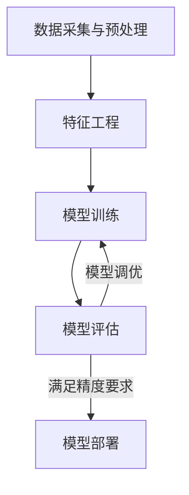
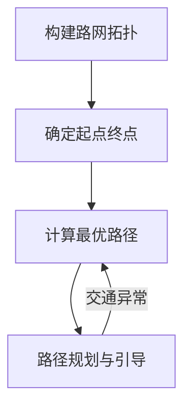

# 人工智能在交通运输领域的创新

## 1.背景介绍

### 1.1 交通运输行业面临的挑战

随着城市化进程的加快和汽车保有量的不断增长,交通拥堵、安全隐患和环境污染等问题日益严峻。传统的交通运输系统已经无法满足现代社会对高效、智能、绿色出行的需求。因此,迫切需要创新性的解决方案来应对这些挑战。

### 1.2 人工智能的兴起

人工智能(AI)技术在过去几年取得了长足进步,尤其是在机器学习、深度学习、计算机视觉和自然语言处理等领域。这些技术为交通运输行业带来了前所未有的创新机遇,有望从根本上改变交通系统的运作方式。

## 2.核心概念与联系

### 2.1 智能交通系统(ITS)

智能交通系统(Intelligent Transportation Systems, ITS)是指利用现代信息技术,对整个交通运输系统进行实时、准确、高效的监测、控制和管理,从而实现交通运输系统的智能化。ITS将人工智能、物联网、大数据等先进技术与交通运输系统深度融合,旨在提高交通运输效率、确保行车安全、减少环境污染。

### 2.2 人工智能在ITS中的应用

人工智能在智能交通系统中发挥着越来越重要的作用,主要包括以下几个方面:

1. **交通流量预测与路径规划**: 利用机器学习算法和历史交通数据,可以准确预测未来交通流量,并规划出最优路径,从而缓解交通拥堵。

2. **智能驾驶**: 自动驾驶汽车依赖于计算机视觉、决策控制等人工智能技术,可以极大提高行车安全性,减少交通事故。

3. **智能交通信号控制**: 通过深度学习等技术,可以实时优化交通信号时间,提高路网通行效率。

4. **智能停车管理**: 利用图像识别等技术,可以实现停车位的自动检测和引导,缓解停车难题。

5. **智能物流与调度**: 运用优化算法和大数据分析,可以优化车辆调度,提高物流运输效率。

### 2.3 人工智能与5G、物联网、大数据的融合

人工智能在交通运输领域的创新离不开5G、物联网、大数据等新兴技术的支撑。5G网络提供了高速、低延迟的数据传输能力;物联网技术使交通基础设施与车载设备实现互联互通;而大数据分析则为交通决策提供了数据支持。人工智能与这些技术的深度融合,将加速智能交通系统的发展。

## 3.核心算法原理具体操作步骤  

### 3.1 交通流量预测算法

准确预测未来的交通流量对于缓解拥堵至关重要。常用的交通流量预测算法包括时间序列模型、机器学习模型和深度学习模型等。

#### 3.1.1 时间序列模型

时间序列模型利用历史交通数据,结合时间规律(如工作日/节假日、早晚高峰等),对未来交通流量进行预测。常用的时间序列模型有自回归移动平均模型(ARIMA)、季节分解模型等。

#### 3.1.2 机器学习模型

机器学习模型将交通流量预测视为一个回归或分类问题,利用历史交通数据和其他影响因素(如天气、事件等)训练模型,再对未来交通流量进行预测。常用的机器学习模型有支持向量回归(SVR)、随机森林回归等。

#### 3.1.3 深度学习模型

深度学习模型具有强大的特征提取和非线性拟合能力,在交通流量预测领域表现出色。常用的深度学习模型包括卷积神经网络(CNN)、长短期记忆网络(LSTM)等。这些模型不仅可以利用历史交通数据,还可以融合其他数据源(如遥感图像、社交媒体数据等),提高预测精度。

无论采用何种模型,交通流量预测的一般步骤如下:

1. **数据采集与预处理**: 收集所需的历史交通数据、天气数据、事件数据等,并对缺失值、异常值等进行处理。

2. **特征工程**: 从原始数据中提取对交通流量预测有影响的特征,如时间特征、天气特征、位置特征等。

3. **模型训练**: 使用训练数据集训练所选模型,通过调整超参数等方式优化模型性能。

4. **模型评估**: 在测试数据集上评估模型的预测精度,常用的评估指标有均方根误差(RMSE)、平均绝对百分比误差(MAPE)等。

5. **模型调优**: 根据评估结果对模型进行进一步调优,提高预测精度。

6. **模型部署**: 将训练好的模型部署到实际系统中,为交通管理决策提供支持。

### 3.2 路径规划算法

基于交通流量预测,可以进一步规划出最优路径,从而指导车辆有效规避拥堵路段。常用的路径规划算法有:

#### 3.2.1 Dijkstra算法

Dijkstra算法是一种经典的最短路径算法,可以求解出从起点到其他所有点的最短路径。算法原理是从起点出发,按照代价从小到大的顺序逐步扩展,直到找到终点。

#### 3.2.2 A*算法  

A*算法在Dijkstra算法的基础上,引入了启发式函数(Heuristic Function),估计当前节点到终点的代价。通过估价函数的引导,A*算法可以更快地找到最优路径,但需要事先知道终点位置。

#### 3.2.3 蚁群算法

蚁群算法模拟了蚂蚁觅食行为,通过释放和感知信息素的方式,逐步找到最优路径。这种算法适合动态路网环境,可以实时调整路径规划方案。

无论采用何种算法,路径规划的一般步骤如下:

1. **构建路网拓扑**: 将实际道路网络抽象为加权图模型,节点表示路口或关键点,边表示道路段,权重可以是距离、预计行驶时间等。

2. **确定起点和终点**: 根据出发地和目的地在路网中确定起点和终点节点。

3. **计算最优路径**: 根据所选算法在路网拓扑中计算起点到终点的最优路径。

4. **路径规划与引导**: 将计算出的最优路径呈现在电子导航系统或车载设备上,为驾驶员提供行车引导。

5. **实时路径调整**: 在遇到交通阻塞或其他异常情况时,能够实时重新计算最优路径,动态调整行车路线。

### 3.3 其他算法

除了交通流量预测和路径规划算法外,智能交通系统中还广泛应用了其他人工智能算法,例如:

- **交通视频识别算法**: 利用计算机视觉和深度学习技术,可以从交通监控视频中检测和跟踪车辆、行人等目标,用于交通监控、事故预警等。

- **智能交通信号控制算法**: 基于深度强化学习等技术,可以根据实时交通流量自主调整信号灯时长,优化路网通行效率。

- **智能停车管理算法**: 运用目标检测、空间分析等算法,可以实现停车位自动检测、车位引导等智能化管理。

- **智能调度算法**: 将车辆调度建模为组合优化问题,利用启发式算法、约束规划等技术求解最优调度方案。

这些算法的具体原理和实现细节就不再赘述,有兴趣的读者可以查阅相关专业文献。

## 4.数学模型和公式详细讲解举例说明

在交通运输领域的人工智能算法中,通常需要建立数学模型对实际问题进行抽象描述,并使用相应的数学工具加以求解。下面以交通流量预测为例,介绍一些常用的数学模型和公式。

### 4.1 时间序列模型

时间序列模型将交通流量视为一个随时间变化的序列,利用历史数据对未来进行预测。常用的时间序列模型有自回归移动平均模型(ARIMA)。

ARIMA模型由三部分组成:自回归(AR)部分、移动平均(MA)部分和差分(I)部分。其中AR部分描述了序列与自身滞后值之间的关系,MA部分描述了序列与随机扰动之间的关系,I部分则通过差分运算消除序列的非平稳性。

ARIMA(p,d,q)模型的一般形式为:

$$
\begin{aligned}
y_t' &= c + \phi_1 y_{t-1}' + \phi_2 y_{t-2}' + ... + \phi_p y_{t-p}' \\
     &\quad + \theta_1 \epsilon_{t-1} + \theta_2 \epsilon_{t-2} + ... + \theta_q \epsilon_{t-q} + \epsilon_t
\end{aligned}
$$

其中:
- $y_t'$ 表示时间 $t$ 时刻的差分序列值
- $\phi_i$ 表示第 $i$ 个自回归系数
- $\theta_j$ 表示第 $j$ 个移动平均系数
- $\epsilon_t$ 表示时间 $t$ 时刻的随机扰动项

通过估计模型参数 $\phi_i$、$\theta_j$ 和 $c$,就可以对未来的交通流量进行预测。

### 4.2 机器学习模型

机器学习模型将交通流量预测建模为一个回归或分类问题。以支持向量回归(SVR)为例,其基本思想是在高维特征空间中构造一个最大边界的超平面,使得大部分样本距离超平面的距离在某个阈值范围内。

对于线性可分的情况,SVR模型可以表示为:

$$
\begin{aligned}
\min\limits_{\omega,b,\xi,\xi^*} &\quad \frac{1}{2}\|\omega\|^2 + C\sum\limits_{i=1}^n (\xi_i + \xi_i^*) \\
\text{s.t.} &\quad y_i - \omega^T\phi(x_i) - b \leq \epsilon + \xi_i \\
           &\quad \omega^T\phi(x_i) + b - y_i \leq \epsilon + \xi_i^* \\
           &\quad \xi_i, \xi_i^* \geq 0, \quad i=1,2,...,n
\end{aligned}
$$

其中:
- $x_i$ 表示第 $i$ 个样本的输入特征向量
- $y_i$ 表示第 $i$ 个样本的目标值
- $\omega$ 和 $b$ 分别表示超平面的法向量和位移
- $\phi(x)$ 表示将输入特征映射到高维空间的非线性函数
- $\xi_i$、$\xi_i^*$ 表示松弛变量,用于处理样本落在边界以外的情况
- $C$ 表示惩罚系数,控制模型的复杂度和误差容忍程度
- $\epsilon$ 表示可接受的误差范围

通过求解上述优化问题,可以得到最优的 $\omega$ 和 $b$,从而构造出回归函数 $f(x) = \omega^T\phi(x) + b$,用于预测新样本的交通流量值。

### 4.3 深度学习模型

深度学习模型通过构建多层神经网络,自动从数据中提取特征,对复杂的非线性映射关系进行建模。以长短期记忆网络(LSTM)为例,它是一种常用于时间序列预测的递归神经网络。

LSTM网络的核心是记忆单元(Memory Cell),它由遗忘门(Forget Gate)、输入门(Input Gate)和输出门(Output Gate)组成。遗忘门决定了从前一时刻传递到当前时刻的信息量,输入门决定了当前时刻