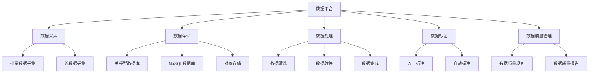
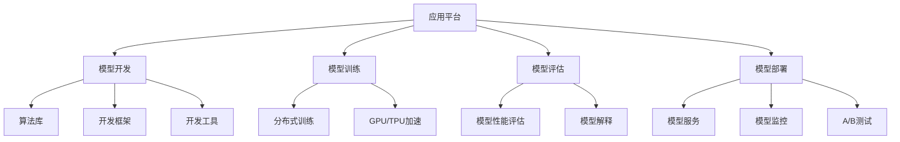
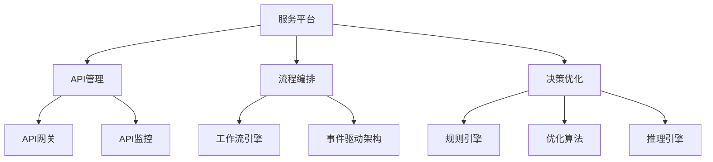

# 人工智能系统集成:数据平台、应用平台、服务平台等

## 1.背景介绍

随着人工智能(AI)技术的快速发展,越来越多的企业和组织开始将AI集成到他们的系统和流程中。然而,要真正发挥AI的潜力并实现其全面应用,需要构建一个完整的AI系统,将数据平台、应用平台和服务平台等多个组件无缝集成。本文将探讨AI系统集成的关键概念、核心技术以及实施路径,为读者提供全面的指导。

### 1.1 人工智能系统集成的重要性

人工智能系统集成可以带来诸多好处:

- **提高效率**:通过自动化流程和优化决策,可以显著提高组织的运营效率。
- **改善客户体验**:利用AI技术(如自然语言处理和计算机视觉)可以为客户提供更加个性化和智能化的服务。
- **发现新的见解**:AI算法可以从海量数据中发现隐藏的模式和关联,为企业决策提供有价值的见解。
- **创造新的商业模式**:AI技术可以催生全新的产品、服务和商业模式,为企业带来新的收入来源。

### 1.2 人工智能系统集成的挑战

尽管前景光明,但构建一个完整的AI系统并非易事,需要克服以下主要挑战:

- **数据质量**:AI算法的性能很大程度上取决于训练数据的质量和数量,获取高质量的数据是一个巨大的挑战。
- **算力需求**:训练复杂的AI模型需要大量的计算资源,这对硬件和基础设施提出了很高的要求。
- **系统集成**:将不同的AI组件(如数据平台、模型服务等)集成到一个统一的系统中是一项艰巨的工程。
- **模型管理**:随着AI模型数量的增加,如何高效地管理、版本控制和部署这些模型也变得越来越重要。

## 2.核心概念与联系

构建一个完整的AI系统需要多个关键组件的紧密集成,包括数据平台、应用平台、服务平台等。下面我们将介绍这些核心概念及它们之间的关系。

### 2.1 数据平台

数据平台是AI系统的基础,负责数据的采集、存储、处理、标注和质量管理等任务。高质量的训练数据对于构建精确的AI模型至关重要。

- **数据采集**:从各种来源(如传感器、日志、第三方API等)收集原始数据,可以是批量数据或流数据。
- **数据存储**:将采集到的数据持久化存储,可以使用关系型数据库、NoSQL数据库或对象存储等。
- **数据处理**:对原始数据进行清洗、转换和集成,以满足后续的分析和建模需求。
- **数据标注**:为训练数据添加标签,可以通过人工标注或自动标注的方式。
- **数据质量管理**:制定数据质量规则,持续监控和报告数据质量,确保输入AI模型的数据质量。

### 2.2 应用平台

应用平台提供了开发、训练、评估和部署AI模型所需的一切工具和基础设施。

- **模型开发**:利用算法库、开发框架和工具来构建AI模型。
- **模型训练**:在CPU/GPU/TPU等硬件加速资源上,使用分布式训练技术训练AI模型。
- **模型评估**:评估模型的性能指标,并通过可解释性技术分析模型内部机理。
- **模型部署**:将训练好的模型部署为可伸缩的模型服务,并进行持续监控和A/B测试。

### 2.3 服务平台

服务平台负责将AI能力通过API、流程和决策系统暴露给最终用户或其他应用程序。

- **API管理**:提供统一的API网关来发布、管理和监控AI服务的API端点。
- **流程编排**:使用工作流引擎和事件驱动架构来编排跨AI服务的复杂业务流程。
- **决策优化**:利用规则引擎、优化算法和推理引擎为业务决策提供AI驱动的建议和自动化。

### 2.4 系统集成

上述三个平台相互依赖、环环相扣,需要通过有效的系统集成来实现无缝协作:

- 数据平台为应用平台提供高质量的训练数据
- 应用平台将训练好的AI模型部署到服务平台
- 服务平台将AI能力暴露给最终用户或上层应用

此外,每个平台内部也需要对各个组件进行紧密集成,实现数据、模型和服务的无缝流动。系统集成是构建完整AI系统的关键。

## 3.核心算法原理具体操作步骤

AI系统集成涉及多种算法和技术,本节将重点介绍其中的核心算法原理和具体操作步骤。

### 3.1 数据处理算法

#### 3.1.1 数据清洗

数据清洗是将原始数据转换为可用于分析的高质量数据的过程。常用的数据清洗技术包括:

1. **缺失值处理**:填充缺失值或删除含有缺失值的记录。
2. **异常值处理**:识别并修正或删除异常值。
3. **数据规范化**:将数据转换为标准格式或单位。
4. **数据解重复**:合并重复的记录。
5. **数据验证**:根据业务规则验证数据的准确性和完整性。

#### 3.1.2 数据转换

数据转换是将数据从一种格式转换为另一种格式的过程,以满足下游系统或应用程序的需求。常见的数据转换技术包括:

1. **结构化转换**:将非结构化数据(如文本、图像等)转换为结构化格式(如CSV、JSON等)。
2. **编码转换**:在不同的编码方案(如UTF-8、ASCII等)之间转换数据。
3. **数据类型转换**:将数据从一种数据类型转换为另一种数据类型。
4. **数据聚合**:根据特定的维度对数据进行汇总和聚合。
5. **数据透视**:重新排列数据的维度和层次结构。

#### 3.1.3 数据集成

数据集成是将来自多个异构数据源的数据合并到一个统一的数据存储中的过程。常用的数据集成技术包括:

1. **ETL(Extract, Transform, Load)**:从源系统提取数据、转换数据格式,然后加载到目标系统。
2. **ELT(Extract, Load, Transform)**:先从源系统提取数据并加载到目标系统,然后再进行转换。
3. **数据虚拟化**:在不进行物理数据移动的情况下,提供统一的数据视图。
4. **数据复制**:在不同的系统之间复制和同步数据。
5. **主数据管理(MDM)**:管理和维护企业内部的主数据(如客户、产品等)。

### 3.2 机器学习算法

机器学习算法是AI系统的核心,用于从数据中学习模式并进行预测或决策。常见的机器学习算法包括:

#### 3.2.1 监督学习算法

1. **线性回归**:用于预测连续值输出的算法。
2. **逻辑回归**:用于预测二元分类输出的算法。
3. **决策树**:构建决策树模型进行分类或回归。
4. **支持向量机(SVM)**:基于核技巧将数据映射到高维空间进行分类。
5. **随机森林**:构建多个决策树,并通过集成的方式提高预测性能。
6. **梯度提升树(GBDT)**:基于决策树的集成算法,通过梯度下降优化损失函数。

#### 3.2.2 无监督学习算法

1. **K-Means聚类**:基于距离度量将数据划分为K个簇。
2. **层次聚类**:构建层次化的聚类树状结构。
3. **主成分分析(PCA)**:通过正交变换将高维数据投影到低维空间。
4. **关联规则挖掘**:发现数据集中的频繁项集和关联规则。
5. **异常检测**:识别与大多数数据显著不同的异常值或模式。

#### 3.2.3 深度学习算法

1. **前馈神经网络**:由多个全连接层组成的基础神经网络。
2. **卷积神经网络(CNN)**:在计算机视觉领域表现出色的网络结构。
3. **循环神经网络(RNN)**:擅长处理序列数据(如文本、语音等)。
4. **长短期记忆网络(LSTM)**:改进的RNN,能更好地捕获长期依赖关系。
5. **生成对抗网络(GAN)**:由生成器和判别器组成,用于生成式建模。
6. **注意力机制**:赋予神经网络选择性关注输入数据的不同部分的能力。

#### 3.2.4 强化学习算法

1. **Q-Learning**:基于Q值迭代更新的强化学习算法。
2. **策略梯度**:直接优化策略函数的强化学习算法。
3. **蒙特卡罗树搜索**:结合蒙特卡罗方法和树搜索的算法。
4. **深度Q网络(DQN)**:将Q-Learning与深度神经网络相结合。
5. **近端策略优化(PPO)**:基于策略梯度的高效强化学习算法。

### 3.3 模型评估算法

为了确保AI模型的性能和可解释性,需要进行全面的模型评估。常用的模型评估算法包括:

#### 3.3.1 性能评估算法

1. **准确率**:正确预测的比例。
2. **精确率和召回率**:分别衡量正例预测的准确性和覆盖面。
3. **F1分数**:精确率和召回率的调和平均值。
4. **ROC曲线和AUC**:描绘真正例率和假正例率之间的权衡。
5. **对数损失**:衡量预测概率与实际标签之间的差异。

#### 3.3.2 可解释性算法

1. **LIME**:通过局部线性逼近来解释任何机器学习模型的预测。
2. **SHAP**:基于游戏理论计算每个特征对模型预测的贡献。
3. **层次聚类**:构建层次化的聚类树状结构。
4. **主成分分析(PCA)**:通过正交变换将高维数据投影到低维空间。
5. **异常检测**:识别与大多数数据显著不同的异常值或模式。

## 4.数学模型和公式详细讲解举例说明

AI算法通常基于数学模型和公式,本节将详细讲解其中的一些核心模型和公式。

### 4.1 线性回归

线性回归是一种常见的监督学习算法,